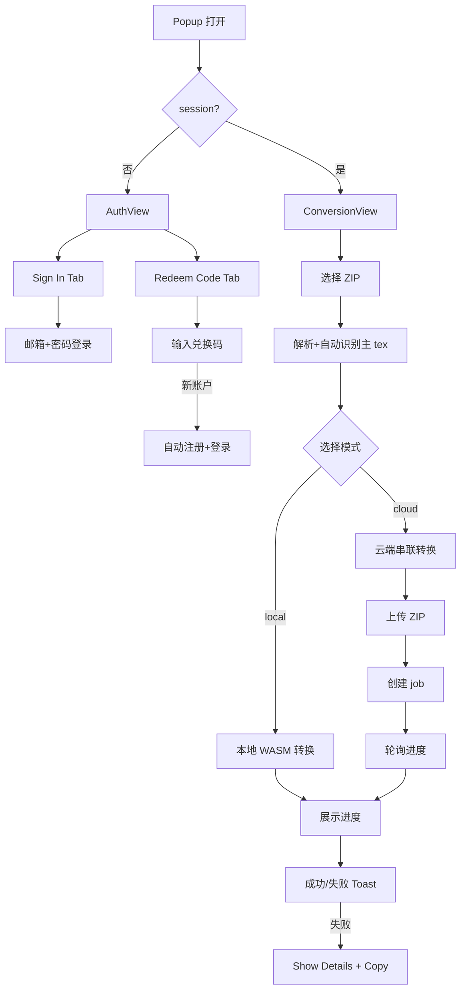

# Tex2Doc 插件商业化改造计划

## 目标

1. **兑换码快捷登录**：未登录用户输入兑换码时自动创建账户并登录
2. **修复云端转换**：在 popup 端串联 upload → createConversion → polling 链路
3. **商业化 UI 重构**：popup / sidepanel / options 三套界面按 `commercial-ui-design` 技能全面重构

---

## 1. 兑换码快捷登录（需求 1）

### 后端契约现状
`[apps/browser-extension/src/api/api-client.ts](apps/browser-extension/src/api/api-client.ts)` 中 `redeemCode` 返回 `RedeemCodeResult`，无凭证字段。

### 实施步骤

**1.1 扩展后端契约类型**（`[apps/browser-extension/src/shared/types.ts](apps/browser-extension/src/shared/types.ts)`）
- `RedeemCodeResult` 新增可选字段：`access_token?: string`、`refresh_token?: string`、`user?: UserProfile`、`is_new_account?: boolean`

**1.2 兑换码带登录态的后台消息**（`[apps/browser-extension/src/entrypoints/background.ts](apps/browser-extension/src/entrypoints/background.ts)`）
- 新增消息类型 `REDEEM_CODE_AND_LOGIN`（常量加在 `[apps/browser-extension/src/shared/constants.ts](apps/browser-extension/src/shared/constants.ts)`）
- `handleRedeemCode` 改造：调用 `client.redeemCode`，若返回 access_token/refresh_token/user 则调用 `saveSession`，并 `notifyUI('SESSION_UPDATED', { signedIn: true })`
- 若 redeem 时未登录且 is_new_account=true，自动建立会话

**1.3 popup 一键兑换入口**（在重构后的 PopupApp 中，详见第 3 节）
- 未登录状态下，主界面显示 "Sign in / Redeem code" 双按钮
- 兑换码弹窗带 "Create account automatically" 提示文案

---

## 2. 云端转换修复（需求 2）

### 根因
`[apps/browser-extension/src/entrypoints/popup/PopupApp.tsx](apps/browser-extension/src/entrypoints/popup/PopupApp.tsx)` 中 `mode === 'cloud'` 分支直接发 `START_CONVERSION`，但 `START_CONVERSION` 期望后端有 `uploadId`，而 zip 文件从未上传到 `/uploads`。详见 `[apps/browser-extension/src/entrypoints/background.ts](apps/browser-extension/src/entrypoints/background.ts)` 的 `handleStartConversion`。

### 实施步骤

**2.1 popup 端串联链路**（`[apps/browser-extension/src/entrypoints/popup/PopupApp.tsx](apps/browser-extension/src/entrypoints/popup/PopupApp.tsx)`）
- `mode === 'cloud'` 分支改造为：
  1. `uploadProjectZip(client, zipBytes, selectedFile.name, onProgress)` → 得到 `uploadId`
  2. `createConversion(client, { upload_id: uploadId, main_tex: mainTex, profile, quality })` → 得到 `jobId`
  3. 启动进度轮询（使用现有 `createAndPollConversion` 模式或新增 polling message）
- 通过 `convertAndPollViaMessages()` 工具函数与 background 通信，避免在 popup 持有 ApiClient 长连接

**2.2 background 端新增云端完整流程消息**（`[apps/browser-extension/src/entrypoints/background.ts](apps/browser-extension/src/entrypoints/background.ts)`）
- 新增消息类型 `CLOUD_CONVERT_AND_POLL`（在 `[constants.ts](apps/browser-extension/src/shared/constants.ts)` 中）
- handler 接收 `{ zipBytes, fileName, mainTex, profile, quality }`
- 内部串联：upload → createConversion → 复用现有 `startCloudConversion` 逻辑（带 status/progress 通知）
- 通过 `notifyUI('JOB_UPDATED', ...)` 推送进度给 popup

**2.3 i18n 文案**（`[apps/browser-extension/src/ui/i18n/index.ts](apps/browser-extension/src/ui/i18n/index.ts)`）
- 新增 `cloud.uploadProgress`、`cloud.creatingJob`、`cloud.polling`、`cloud.success` 等键值（中英文双份）

---

## 3. 商业化 UI 重构（需求 3）

按 `[.claude/skills/commercial-ui-design/SKILL.md](.claude/skills/commercial-ui-design/SKILL.md)` 的 9 步工作流：审计 → 设计令牌 → 复用组件 → i18n 化 → 页面重构 → 多场景验证。

### 3.1 审计现状（不改动，仅盘点）

| 界面 | 文件 | 问题 |
|---|---|---|
| popup | `[apps/browser-extension/src/entrypoints/popup/PopupApp.tsx](apps/browser-extension/src/entrypoints/popup/PopupApp.tsx)` | 登录/未登录状态耦合；硬编码英文文案；无空状态/加载状态 |
| sidepanel | `[apps/browser-extension/src/entrypoints/sidepanel/SidePanelApp.tsx](apps/browser-extension/src/entrypoints/sidepanel/SidePanelApp.tsx)` | 全英文硬编码；i18n hook 已引入但未充分使用；loading/empty state 缺失 |
| options | `[apps/browser-extension/src/entrypoints/options/OptionsApp.tsx](apps/browser-extension/src/entrypoints/options/OptionsApp.tsx)` | 配置项散乱；缺乏分组；无操作反馈 |

### 3.2 设计令牌扩展

`[apps/browser-extension/src/ui/tokens.ts](apps/browser-extension/src/ui/tokens.ts)` 已存在，补强：
- **状态色**：`colors.success`、`colors.warning`、`colors.danger` 现有，补 `colors.info`
- **字号 / 字重**：现有充分
- **暗色模式**：补 `darkMode` 复合令牌（surface、border、text 等）
- **侧边栏尺寸**：补 `sidepanel.width`、`options.width`

### 3.3 i18n 资源补全

`[apps/browser-extension/src/ui/i18n/index.ts](apps/browser-extension/src/ui/i18n/index.ts)` 增补：
- `auth.signInOrRedeem`、`auth.signInDescription`、`auth.redeemDescription`、`auth.redeemAutoRegister`
- `cloud.uploading`、`cloud.creating`、`cloud.polling`、`cloud.completed`
- `empty.noJobs.title`、`empty.noJobs.description`、`empty.noPlans.title`
- `loading.preparingConversion`
- `error.copyLogs`（与之前 Show Details / Copy 一致）
- zh-CN 全量同步

### 3.4 重用组件清单（已存在）

来自 `[apps/browser-extension/src/ui/components/index.ts](apps/browser-extension/src/ui/components/index.ts)`：
- Button / Badge / Card / Input / Select / Progress / Toast / Modal / Tabs / Textarea / Switch / Avatar / Tooltip / Dropdown / ErrorBoundary

无需新建基础组件，重点在**装配**与**状态机**。

### 3.5 PopupApp 重构

`[apps/browser-extension/src/entrypoints/popup/PopupApp.tsx](apps/browser-extension/src/entrypoints/popup/PopupApp.tsx)` 目标结构：

状态机：
- `auth`（未登录）：`idle | redeem-pending | login-pending | redeem-success`
- `conversion`：`idle | uploading | creating | converting | success | error`

视觉：
- SaaS toolbar 风格顶部（Logo + 用户菜单 + 语言切换）
- 主区域用 Card 卡片分块（File / Main tex / Mode / Profile / Quality / Action）
- 错误详情折叠面板保留并升级（design tokens 化）

### 3.6 SidePanelApp 重构

`[apps/browser-extension/src/entrypoints/sidepanel/SidePanelApp.tsx](apps/browser-extension/src/entrypoints/sidepanel/SidePanelApp.tsx)` 目标：
- 顶部 toolbar：用户头像 + 套餐 + 余额 + 语言切换
- 侧边导航（Tabs 已存在但需调整样式）
- 四大面板：
  - **Jobs**：空状态插画 + Recent Jobs 列表
  - **Billing**：Plans 卡片网格 + Redeem Code 入口
  - **Feedback**：空状态 + 提交按钮 + 历史列表
  - **Account**：账户信息 + 套餐详情 + Sign Out
- 全部文案走 `useI18n().t()`

### 3.7 OptionsApp 重构

`[apps/browser-extension/src/entrypoints/options/OptionsApp.tsx](apps/browser-extension/src/entrypoints/options/OptionsApp.tsx)` 目标：
- 顶部 toolbar
- 左侧 / 顶部 Tab 导航：General / Conversion Defaults / Domain Permissions / About
- General：API base URL、Language、Theme
- Conversion Defaults：Default mode / Default profile / Default quality / WASM file size limit
- Domain Permissions：列表 + 移除按钮 + 空状态
- About：版本号、链接、签名信息

### 3.8 多场景验证清单

| 场景 | popup | sidepanel | options |
|---|---|---|---|
| light / dark / system | ✓ | ✓ | ✓ |
| 中英文长文本 | ✓ | ✓ | ✓ |
| 登录 / 未登录 | ✓ | ✓ | - |
| 加载 / 空 / 错误 / 禁用 | ✓ | ✓ | ✓ |
| 权限拒绝（无 storage） | ✓ | ✓ | ✓ |
| ZIP 解析：0/1/多个 tex | ✓ | - | - |
| 云端失败显示详情 | ✓ | - | - |

---

## 涉及文件清单

### 后端 / 业务逻辑
- `[apps/browser-extension/src/shared/types.ts](apps/browser-extension/src/shared/types.ts)` - 扩展 `RedeemCodeResult`
- `[apps/browser-extension/src/shared/constants.ts](apps/browser-extension/src/shared/constants.ts)` - 新增消息类型
- `[apps/browser-extension/src/entrypoints/background.ts](apps/browser-extension/src/entrypoints/background.ts)` - 新增 `REDEEM_CODE_AND_LOGIN`、`CLOUD_CONVERT_AND_POLL` handler

### UI / i18n
- `[apps/browser-extension/src/ui/i18n/index.ts](apps/browser-extension/src/ui/i18n/index.ts)` - 补全 zh-CN / en-US 文案
- `[apps/browser-extension/src/ui/tokens.ts](apps/browser-extension/src/ui/tokens.ts)` - 补强暗色 / sidepanel / options 令牌

### 三套页面
- `[apps/browser-extension/src/entrypoints/popup/PopupApp.tsx](apps/browser-extension/src/entrypoints/popup/PopupApp.tsx)` - 全面重构
- `[apps/browser-extension/src/entrypoints/sidepanel/SidePanelApp.tsx](apps/browser-extension/src/entrypoints/sidepanel/SidePanelApp.tsx)` - 全面重构
- `[apps/browser-extension/src/entrypoints/options/OptionsApp.tsx](apps/browser-extension/src/entrypoints/options/OptionsApp.tsx)` - 全面重构

---

## 验证步骤

1. `cd apps/browser-extension && npm run build:chrome`
2. 加载 `apps/browser-extension/.output/chrome-mv3` 到 Chrome
3. 场景验证：
   - 未登录 → 输入兑换码 → 自动建立会话
   - 登录后选 cloud mode → 选 ZIP → 点 Convert → 进度更新 → 下载成功
   - popup / sidepanel / options 三套界面 light/dark、中英文切换
   - 各页面空 / 加载 / 错误 / 禁用态

---

## 不在本次范围内

- 后端 API 改动（如 `RedeemCodeResult` 需要后端配合返回凭证；本计划假设后端可在 minor 改动后提供这些字段，否则 popup 端走「先创建匿名账户再 redeem」回退方案）
- 视觉资产（logo、插画）制作
- service-worker 消息协议升级（沿用现有 chrome.runtime.sendMessage）
- E2E 测试脚本（仅手工 + e2e_wasm_convert.mjs 既有链路）