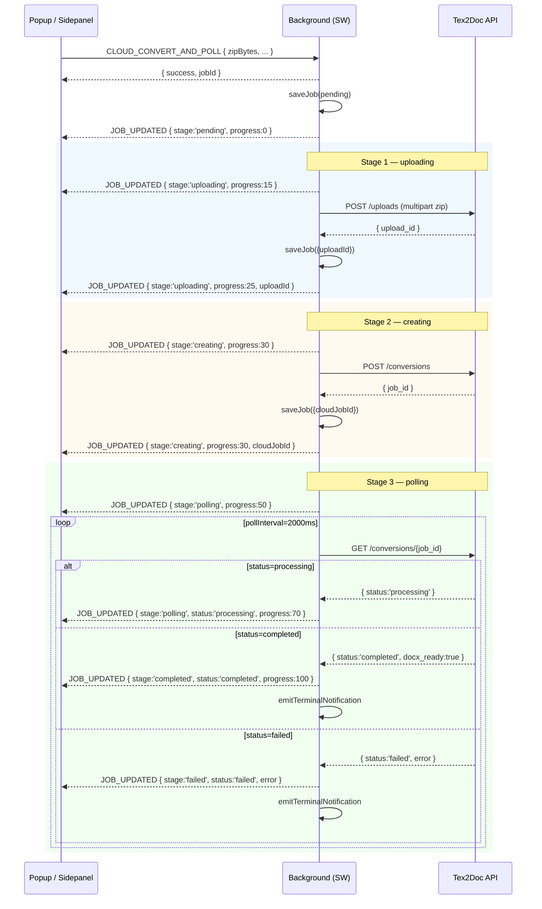

# Tex2Doc Browser Extension — Messaging Protocol

> 适用版本：当前 `dev0625` 分支；维护者：`apps/browser-extension/src/entrypoints/background.ts`
>
> 本文件定义 popup / sidepanel / content script ↔ service worker ↔ API 后端三者之间的消息契约。**所有跨边界通信都通过本协议完成**，任何扩展点改动必须先在本文件登记再改代码。

---

## 1. 总览

| 维度 | 协议 |
|---|---|
| 传输层 | `chrome.runtime.sendMessage` / `browser.runtime.sendMessage` |
| 消息格式 | `{ type: string, ...payload }`；`type` 取自 `shared/constants.ts::MESSAGE_TYPES` |
| 单向通知（SW → UI） | 失败时静默 drop（popup 未打开时 `sendMessage` reject）；UI 重新订阅即可补齐 |
| 错误传递 | handler `throw` → 走 `browser.runtime.lastError`；UI 也直接 `try/catch` |
| 鉴权 | 几乎所有云端路径都要 `getAccessToken()`，未登录抛 `AuthError('NOT_AUTHENTICATED')` |

补充约定：
- **fire-and-forget 模式**：`CLOUD_CONVERT_AND_POLL` 与 `START_WASM_CONVERSION` 返回 `{ success, jobId }` 后，背景跑完 upload/createConversion/polling 等阶段，期间通过 `JOB_UPDATED` 推送进度。
- **popup 重新打开补齐**：UI 在 `useEffect` 里调用 `FETCH_JOBS` + 监听 `JOB_UPDATED`；SW 重启后通过 `onStartup` / `onInstalled` 调 `restorePollingJobs` 续跑。
- **空本地 jobId 行为**：所有 `JOB_UPDATED` 必须带 `jobId`；UI 收到后按 `currentJobId` 过滤。

---

## 2. 消息类型清单（来自 `shared/constants.ts::MESSAGE_TYPES`）

### 2.1 UI → Background

| `type` | 用途 | 入参 | 返回 / 副作用 |
|---|---|---|---|
| `LOGIN` | 邮箱+密码登录 | `{ email, password }` | `{ success, session? }`；同步广播 `SESSION_UPDATED` |
| `REGISTER` | 创建账户 | `{ email, password, display_name? }` | `{ success, session? }`；广播 `SESSION_UPDATED` |
| `LOGOUT` | 注销 | `{}` | `{ success }`；广播 `SESSION_UPDATED{signedIn:false}` |
| `REFRESH_SESSION` | 续签 access token | `{}` | `{ success, session }` |
| `FETCH_USAGE` | 拉取配额 | `{}` | `{ success, usage }`；广播 `SESSION_UPDATED{usage}` |
| `START_CONVERSION` | 旧云端转换（**@deprecated**，见 §7） | `{ uploadId, mainTex, profile, quality }` | `{ success, jobId }` |
| `START_WASM_CONVERSION` | 本地 WASM 转换 | `{ zipBytes:number[], fileName, mainTex }` | `{ success, jobId, docxBytes?, trace? }`（e2e 钩子） |
| `CANCEL_CONVERSION` | 取消 | `{ jobId }` | `{ success }` |
| `FETCH_JOBS` | 拉任务列表 | `{}` | `{ success, jobs: JobRecord[] }` |
| `FETCH_JOB_STATUS` | 单任务状态 | `{ jobId }` | `{ success, job: JobRecord }` |
| `DOWNLOAD_DOCX` | 触发下载 | `{ jobId }` | `{ success }`；写入本地文件 |
| `FETCH_PLANS` | 套餐列表 | `{}` | `{ success, plans }` |
| `CREATE_CHECKOUT` | 结账 | `{ planId }` | `{ success, url }` |
| `CREATE_PORTAL` | 账单门户 | `{}` | `{ success, url }` |
| `REDEEM_CODE` | 兑换码（旧） | `{ code }` | `{ success, result }`；仅更新配额 |
| `REDEEM_CODE_AND_LOGIN` | 兑换码 + 自动登录 | `{ code }` | `{ success, signedIn, isNewAccount, error? }` |
| `CLOUD_CONVERT_AND_POLL` | 云端串联（upload→create→poll） | `{ zipBytes, fileName, mainTex, profile, quality }` | `{ success, jobId }`；随后多次 `JOB_UPDATED` |
| `FETCH_CONVERSIONS` | 云端历史 | `{ limit?, offset? }` | `{ success, jobs: ConversionJob[] }` |
| `FETCH_FEEDBACK` | 反馈历史 | `{}` | `{ success, threads }` |
| `CREATE_FEEDBACK` | 提反馈 | `{ title, feedback_type, content, conversion_job_id? }` | `{ success, thread_id }` |
| `GET_SETTINGS` | 读设置 | `{}` | `{ success, settings }` |
| `UPDATE_SETTINGS` | 写设置 | `{ settings: Partial<ExtensionSettings> }` | `{ success, settings }` |

### 2.2 Background → UI（单向通知）

| `type` | 触发场景 | payload |
|---|---|---|
| `SESSION_UPDATED` | 登录 / 退出 / 配额刷新 / 兑换 | `{ signedIn?, user?, usage?, isNewAccount?, redeemRequiresLogin?, error? }` |
| `JOB_UPDATED` | 云端 / 本地 / 恢复阶段任何 job 状态变化 | `{ jobId, status, progress, stage?, cloudJobId?, uploadId?, error?, resumed? }`（见 §3） |
| `NOTIFICATION` | 重要提示（保留接口） | `{ title, message }` |
| `ERROR` | 全局错误兜底 | `{ message, stack? }` |

---

## 3. `JOB_UPDATED` 五阶段时序图



| Stage | 起始 progress | 终止 progress | 关键字段 |
|---|---|---|---|
| `pending` | 0 | 0 | `jobId` |
| `uploading` | 15 | 25 | `uploadId`（在 create 后落库） |
| `creating` | 30 | 30 | `cloudJobId` |
| `polling` | 50 | 70（completed 跳 100） | `cloudJobId`, `status` |
| `completed` | 100 | 100 | `docxReady=true` |
| `failed` | 0（继承） | — | `error`, `errorCode` |

> 注：每个 stage 的 `progress` 是**最低保证值**。`uploading` 阶段实际进度可被 `uploadProjectZip` 的 `onProgress` 回调覆盖（当前实现为批量上报，可按未来需求细化）。

---

## 4. `JOB_UPDATED` 字段表

| 字段 | 类型 | 含义 |
|---|---|---|
| `jobId` | `string`（UUID） | 本地 job ID；始终等于 `JobRecord.id` |
| `status` | `'pending' \| 'processing' \| 'completed' \| 'failed' \| 'expired'` | 对外暴露的终态/中间态 |
| `stage` | `'pending' \| 'uploading' \| 'creating' \| 'polling' \| 'completed' \| 'failed'` | 当前阶段（驱动 UI 进度文案） |
| `progress` | `number` 0–100 | 进度百分比；UI 直接绑定到 `Progress` 组件 |
| `cloudJobId` | `string \| undefined` | 服务端 job ID；用于 `DOWNLOAD_DOCX` 与续轮询 |
| `uploadId` | `string \| undefined` | 上传凭证；SW 重启时已持久化，重启后可直接跳到 `polling` |
| `error` | `string \| undefined` | 失败原因；UI 用来显示文案 |
| `errorCode` | `string \| undefined` | 机器可读错误码；如 `JOB_NOT_FOUND_AFTER_RESTART`、`REDEEM_REQUIRES_LOGIN` |
| `resumed` | `boolean \| undefined` | SW 重启后通过 `resumeCloudPipeline` 续跑时为 `true` |

### 4.1 示例 Payload

**初始 pending：**
```json
{ "type": "JOB_UPDATED", "jobId": "f1e2...", "status": "pending", "stage": "pending", "progress": 0 }
```

**uploading 完成：**
```json
{
  "type": "JOB_UPDATED",
  "jobId": "f1e2...",
  "status": "processing",
  "stage": "uploading",
  "progress": 25,
  "uploadId": "upl_abc123"
}
```

**creating 完成 → polling：**
```json
{
  "type": "JOB_UPDATED",
  "jobId": "f1e2...",
  "status": "processing",
  "stage": "polling",
  "progress": 50,
  "cloudJobId": "job_xyz789"
}
```

**completed：**
```json
{
  "type": "JOB_UPDATED",
  "jobId": "f1e2...",
  "status": "completed",
  "stage": "completed",
  "progress": 100,
  "cloudJobId": "job_xyz789"
}
```

**failed（中途）：**
```json
{
  "type": "JOB_UPDATED",
  "jobId": "f1e2...",
  "status": "failed",
  "stage": "failed",
  "progress": 0,
  "error": "Network error: 502 Bad Gateway",
  "errorCode": "UPSTREAM_502"
}
```

**resumed（SW 重启后）：**
```json
{
  "type": "JOB_UPDATED",
  "jobId": "f1e2...",
  "status": "processing",
  "stage": "polling",
  "progress": 50,
  "cloudJobId": "job_xyz789",
  "resumed": true
}
```

---

## 5. SW 重启恢复语义

| 持久化字段 | 写入位置 | 重启后可用？ |
|---|---|---|
| `JobRecord`（含 `cloudJobId` / `uploadId` / `stage`） | IndexedDB `jobs` store | ✅ |
| 原始 zip 字节 | 不持久化（避免 MB 级写盘） | ❌ |
| `activeCloudJobs: Map<localId, cloudId>` | 内存 | ❌（由 `getPendingCloudJobs` 重建） |
| 用户会话 | `storage.local` | ✅ |

**恢复策略**（见 `background.ts::resumeCloudPipeline`）：

| 原 stage | 恢复动作 |
|---|---|
| `polling` + 有 `cloudJobId` | 直接 `pollCloudConversion` 续轮询 |
| `creating` + 有 `cloudJobId` | 同上（create 已成功） |
| `uploading` / `pending` | 标记 `failed`，`errorCode='JOB_NOT_FOUND_AFTER_RESTART'`，提示用户重试 |
| 任何 stage 但无 access token | 标记 `failed`，提示登录 |

**UI 重新订阅**：popup / sidepanel 在 `useEffect` 里：
1. 调 `FETCH_JOBS` 拉全量
2. 监听 `JOB_UPDATED`；通过 `currentJobId` 过滤
3. SW 恢复后第一次 `JOB_UPDATED` 会被漏（popup 关闭期间），UI 端再调 `FETCH_JOB_STATUS` 补齐一次

---

## 6. e2e 钩子（仅用于自动化测试）

`background.ts::main()` 在 `globalThis` 上挂载：

```ts
globalThis.__tex2docConvertZip = handleStartWasmConversion;
globalThis.__tex2docDownloads = { downloadBytes };
```

调用方式（Playwright `serviceWorker.evaluate`）：
```js
await sw.evaluate(async (zipBytes, fileName, mainTex) => {
  return await globalThis.__tex2docConvertZip({
    zipBytes: Array.from(zipBytes),
    fileName,
    mainTex,
    _e2eReturnBytes: true,
  });
}, zipBuffer, 'demo.zip', 'main.tex');
```

约定：
- `_e2eReturnBytes: true` → 返回 `{ docxBytes: number[], docxFilename, trace }`，由 e2e 脚本在 Node 端写盘
- 不带该字段 → 走 `downloadBytes` 落本地

---

## 7. `@deprecated` 协议（计划于下下个大版本移除）

| 消息 | 替代者 | 备注 |
|---|---|---|
| `START_CONVERSION` | `CLOUD_CONVERT_AND_POLL` | 仅保留 `content/arxiv.content.ts` / `content/overleaf.content.ts` 调用方；后续 P2-5 改造 content script 一并迁移 |

迁移后移除 `MESSAGE_TYPES.START_CONVERSION` 和 `handleStartConversion`，释放一个常量槽位。

---

## 8. Source Semantics (v1.4+)

自 v1.4 起，`zipBytes` 字段允许为**客户端打包的内存 ZIP**，不仅限于用户上传的 `.zip` 文件。发起方（popup）负责：

1. **来源选择**：用户可在 popup 选择 ZIP 文件（`<input type="file" accept=".zip">`）或本地文件夹（`<input webkitdirectory multiple>`）
2. **编译产物过滤**：若为文件夹，自动排除 `node_modules` / `.git` / `.aux` / `.log` / `.synctex.gz` / `.pdf` 等编译产物，详见 `src/conversion/folder-types.ts::shouldExclude`
3. **内存打包**：用 fflate 将文件夹打包为标准 PKZip 流（level=0，STORE 模式），客户端实时推送读取/打包进度
4. **透传**：`zipBytes` 以 `number[]` 形式透传给 `START_WASM_CONVERSION` 或 `CLOUD_CONVERT_AND_POLL`，后台与 WASM 引擎**不感知原始来源**

`fileName` 建议格式：
- ZIP 模式：原文件名，如 `thesis.zip`
- 文件夹模式：`<folder-basename>.zip`，如 `thesis.zip`

后台 handler 与 WASM 引擎对此语义**零改动**，接收到的仍是标准 ZIP 字节流。

---

## 8. 扩展检查清单（修改协议时必做）

- [ ] 同步更新本文件（§2 清单 + §4 字段表）
- [ ] 同步更新 `shared/constants.ts::MESSAGE_TYPES`（若新增 type）
- [ ] 同步更新 `shared/types.ts::JobRecord` / `ConversionJob`（若字段增减）
- [ ] 同步更新 popup / sidepanel / content script 监听逻辑
- [ ] 跑 `npm run build:chrome` 确保零 TS 错误
- [ ] 跑 `scripts/e2e_wasm_convert.mjs` 与（新增的）`scripts/e2e_cloud_convert.mjs` 双链路回归

---

## 9. 关联文档

- 风险登记表：`docs-zh/extension/Tex2Doc-浏览器插件商业化改造开发进展报告-20260628.md` 附录 C
- Story 进度：报告 §9（P0-2 / P1-6 / P2-5）
- API 契约：`apps/rust-service/README.md` 与 `crates/api-contracts/`