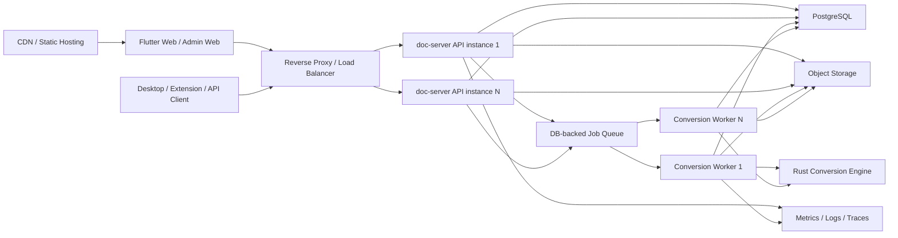

# Rust API 服务商业化扩展技术改进优化方案

## 1. 背景与结论

`apps/rust-service` 当前已经具备商业 API 的完整雏形：Rust/Axum HTTP 服务、PostgreSQL 持久化、上传与转换任务、后台 worker、文件存储、用户认证、管理后台、反馈、兑换码、发布管理和自动化研发接口。

从技术选型看，Rust 服务端本身不是商业化扩展瓶颈。该项目的核心转换能力在 Rust crates 中，API 服务使用 Rust 可以直接调用 `doc-core`、`doc-compiler-engine`、`doc-quality`，避免跨语言进程调用和数据复制。真正需要改造的是当前实现中的并发策略、资源隔离、存储形态、限流保护、监控与部署体系。

当前状态适合：

- 内测演示。
- 邀请制 Beta。
- 小规模商业试运行。

不建议直接用于：

- 大规模公开推广。
- 多渠道广告投放。
- 高并发批量转换。
- 多实例弹性扩容。

本方案目标是将 Rust API 服务从“单机预览服务”升级为“可观测、可扩容、可限流、可灰度的商业化服务”。

## 2. 当前瓶颈评估

| 维度 | 当前实现 | 商业化风险 |
| --- | --- | --- |
| HTTP 并发 | Axum + Tokio，可承载并发请求 | 框架能力不是主要瓶颈 |
| 数据库连接池 | `max_connections(10)` 固定值 | 用户端、管理端和 worker 共享连接，流量升高会排队 |
| 转换 worker | 单 worker loop 串行 `process_job(...).await` | 核心转换吞吐低，任务容易排队 |
| worker 通知队列 | `mpsc::channel(32)` 固定值 | 突发提交时可能形成提交背压或失败 |
| 上传处理 | `to_bytes(body, MAX_BODY)` 全量读入内存 | 多个 50 MiB 上传并发时内存压力明显 |
| 上传限制 | 单 ZIP 50 MiB，解压 200 MiB，文件数 2000 | 有基础保护，但缺少用户级限流 |
| 文件存储 | 本地 `sessions` 目录 | 多实例部署时文件不可共享 |
| 状态恢复 | 15 分钟 stale job 回收，最多 3 次 | 有基础恢复，但任务超时不可配置 |
| 限流熔断 | 未见全局/IP/用户级限流 | 推广流量或恶意请求可能拖垮服务 |
| 监控指标 | 主要依赖日志 | 缺少容量判断与自动告警依据 |
| 静态托管 | 同一 Axum 服务托管 `/`、`/app`、`/admin` | 高流量静态资源可能与 API 抢资源 |

## 3. 商业化容量目标

建议按三个阶段定义容量目标，避免一次性过度设计。

### 3.1 Beta 阶段

目标：

- 支持 100 到 500 名邀请用户。
- 支持低频云端转换。
- 单机部署可运行。
- 出现排队时用户可感知进度。

建议指标：

| 指标 | 目标 |
| --- | --- |
| API P95 延迟 | 小于 500 ms，转换下载除外 |
| 登录/查询吞吐 | 100 RPS 级别 |
| 转换并发 | 2 到 4 个任务 |
| 队列等待时间 | P95 小于 5 分钟 |
| 单机可用性 | 99% 试运行目标 |

### 3.2 付费试运行阶段

目标：

- 支持 1000 到 5000 名注册用户。
- 支持明确的付费额度和排队机制。
- 支持服务重启后的任务恢复。
- 支持监控告警和基础扩容。

建议指标：

| 指标 | 目标 |
| --- | --- |
| API P95 延迟 | 小于 300 ms，转换下载除外 |
| 登录/查询吞吐 | 300 RPS 级别 |
| 转换并发 | 4 到 16 个任务，按机器规格配置 |
| 任务失败率 | 小于 2% |
| 任务可恢复率 | 大于 99% |

### 3.3 正式推广阶段

目标：

- API 与 worker 可独立横向扩容。
- 静态资源由 CDN 或独立 Web 服务承载。
- 文件存储迁移到对象存储或共享存储。
- 具备限流、熔断、队列告警、容量看板。

建议指标：

| 指标 | 目标 |
| --- | --- |
| API 服务 | 多实例无状态化 |
| Worker 服务 | 按队列深度水平扩容 |
| 文件存储 | S3/MinIO/云对象存储 |
| 数据库 | 独立 PostgreSQL，连接池和慢查询监控 |
| 可用性 | 99.5% 到 99.9%，视商业承诺而定 |

## 4. 总体架构改造方向

推荐目标架构：



核心原则：

- API 层尽量无状态。
- 转换 worker 与 API 进程可拆可合，先单进程多 worker，后独立 worker 部署。
- 文件存储不绑定单机。
- 并发数、连接池、限制值全部配置化。
- 对用户、IP、任务队列建立保护边界。

## 5. 优先级 P0：上线前必须改造项

### 5.1 worker 并发配置化

问题：

当前 `worker_loop` 每次 claim 一个 job，并等待 `process_job` 完成后才处理下一个任务。即使 `execute_conversion` 使用了 `spawn_blocking`，外层 worker 仍是串行吞吐。

改造目标：

- 增加 `DOC_SERVER_WORKERS`，默认开发环境为 `1`，生产环境建议 `min(cpu_cores / 2, 8)` 起步。
- 同一进程可启动多个 worker loop。
- 每个 worker 使用独立 `worker_id`。
- 保留 `FOR UPDATE SKIP LOCKED`，避免多个 worker 抢同一任务。

建议实现：

```text
DOC_SERVER_WORKERS=4
DOC_SERVER_QUEUE_CAPACITY=256
DOC_SERVER_CONVERSION_TIMEOUT_SECS=900
```

验收标准：

- 同时提交 8 个转换任务时，至少 4 个任务进入处理中。
- 没有重复处理同一 job。
- 服务重启后 stale job 可重新入队。

### 5.2 数据库连接池配置化

问题：

当前 sqlx pool 固定 `max_connections(10)`。商业化时 API handler、worker、管理端查询会争抢连接。

改造目标：

- 增加环境变量：

```text
DATABASE_MAX_CONNECTIONS=50
DATABASE_MIN_CONNECTIONS=5
DATABASE_ACQUIRE_TIMEOUT_SECS=5
```

建议策略：

- 单机 Beta：20 到 30。
- API 多实例：每实例 10 到 30，结合 PostgreSQL 总连接数控制。
- Worker 独立部署：worker pool 单独配置，避免拖慢 API 查询。

验收标准：

- 压测期间 pool acquire timeout 低于 0.1%。
- 数据库连接数不超过 PostgreSQL 安全阈值。

### 5.3 上传流式落盘

问题：

当前上传接口会使用 `to_bytes(body, MAX_BODY)` 将请求体完整读入内存。50 MiB 上传并发多时会造成内存峰值过高。

改造目标：

- 使用 Axum multipart streaming 或 `BodyStream` 分块写入临时文件。
- 计算 SHA-256 时边读边算。
- ZIP 校验可以对临时文件进行流式或文件游标读取。
- 校验通过后转存到 FileStorage/ObjectStorage。

建议新增限制：

```text
MAX_CONCURRENT_UPLOADS=16
UPLOAD_TEMP_DIR=var/uploads/tmp
UPLOAD_READ_CHUNK_BYTES=1048576
```

验收标准：

- 20 个 50 MiB 上传并发时进程内存不随请求体线性增长。
- 中断上传可清理临时文件。
- ZIP 校验失败不会留下永久文件。

### 5.4 用户级与 IP 级限流

问题：

当前缺少限流。公开推广时，注册、登录、上传、转换创建接口都可能被刷。

改造目标：

- 增加 IP 级限流。
- 增加用户级限流。
- 对转换创建增加额度和并发保护。
- 对管理端接口增加更严格频率控制。

建议规则：

| 接口 | 限制建议 |
| --- | --- |
| 登录/注册 | 每 IP 每分钟 20 次 |
| 上传 | 每用户同时 2 个，每小时 30 个 |
| 创建转换 | 免费/预览用户同时 1 个，付费用户按套餐 |
| 下载 | 每用户每分钟 60 次 |
| 管理接口 | 每管理员每分钟 120 次 |

实现选型：

- 单机阶段：内存令牌桶。
- 多实例阶段：Redis/Dragonfly 令牌桶。
- 最低成本阶段：PostgreSQL 计数窗口，但不建议长期使用。

验收标准：

- 超限返回 `429 Too Many Requests`。
- 响应包含可读错误码和重试建议。

## 6. 优先级 P1：付费试运行推荐改造项

### 6.1 文件存储抽象与对象存储

问题：

当前 `FileStorage` 使用本地目录，无法天然支持多实例。

改造目标：

- 定义 `ArtifactStorage` trait。
- 保留 `LocalFileStorage`。
- 新增 `S3Storage` 或 `MinioStorage`。
- 数据库只保存 object key、bucket、size、sha256、content_type。

建议环境变量：

```text
ARTIFACT_STORAGE=local
ARTIFACT_LOCAL_ROOT=sessions
S3_ENDPOINT=https://s3.example.com
S3_BUCKET=tex2doc-artifacts
S3_REGION=auto
S3_ACCESS_KEY_ID=...
S3_SECRET_ACCESS_KEY=...
```

迁移策略：

1. 新任务写对象存储。
2. 旧任务仍从本地读取。
3. 后台脚本迁移历史 artifact。
4. 下载接口兼容两种 storage key。

### 6.2 API 与 worker 进程拆分

问题：

API 和转换 worker 在同一进程内，转换资源峰值会影响普通 API。

改造目标：

- `doc-server api` 只跑 HTTP API。
- `doc-server worker` 只跑转换 worker。
- 开发环境仍允许 `doc-server all`。

建议命令：

```text
doc-server api
doc-server worker
doc-server all
```

拆分收益：

- API 可按 HTTP 流量扩容。
- Worker 可按队列深度扩容。
- 转换崩溃或高内存不直接拖垮 API。

### 6.3 任务队列能力增强

当前数据库队列已经使用 `FOR UPDATE SKIP LOCKED`，这是一个不错的基础。商业化建议补齐：

- 任务优先级：付费用户优先。
- 任务租约：`locked_until` 替代固定 15 分钟 stale 判断。
- 任务取消：用户可取消 queued job。
- 任务重试策略：区分可重试和不可重试错误。
- 队列位置估算：返回当前用户任务前方排队数。
- 幂等键唯一约束：避免并发重复创建。

建议新增字段：

```text
priority
locked_until
cancelled_at
queue_rank_snapshot
estimated_started_at
estimated_completed_at
```

### 6.4 转换资源隔离

问题：

转换属于 CPU、内存、磁盘 IO 混合负载。并发过高会影响系统稳定性。

改造目标：

- 为转换任务增加 semaphore。
- 按文件大小和套餐动态控制并发。
- 对单任务设置超时。
- 对转换临时目录设置配额和清理。

建议配置：

```text
MAX_CONCURRENT_CONVERSIONS=4
MAX_CONVERSION_SECS=900
CONVERSION_TEMP_ROOT=var/conversions/tmp
CONVERSION_TEMP_RETENTION_HOURS=24
```

### 6.5 静态资源从 API 服务剥离

问题：

当前 API 服务同时托管 Flutter Web 和静态资源。大流量访问时，静态资源请求会和 API 请求共享进程资源。

改造目标：

- 生产环境将静态资源放到 CDN、对象存储静态站点或独立 Nginx。
- `doc-server` 保留静态托管能力作为开发和单机预览模式。

建议：

- `/assets`、Flutter Web 构建产物走 CDN。
- `/v1`、`/admin/v1` 走 API 服务。
- HTML 内 API base URL 保持同域 `/v1/`，由反向代理转发。

## 7. 优先级 P2：正式推广增强项

### 7.1 可观测性

必须补齐的指标：

| 指标 | 说明 |
| --- | --- |
| `http_requests_total` | 按 method/path/status 统计 |
| `http_request_duration_seconds` | API 延迟分布 |
| `db_pool_connections` | DB pool 当前连接数 |
| `db_pool_acquire_duration_seconds` | 获取连接耗时 |
| `conversion_jobs_total` | 按状态和错误码统计 |
| `conversion_job_duration_seconds` | 转换耗时 |
| `conversion_queue_depth` | queued job 数量 |
| `conversion_active_workers` | 当前活跃 worker |
| `upload_bytes_total` | 上传流量 |
| `artifact_storage_errors_total` | 存储错误 |

建议技术：

- `metrics` + `metrics-exporter-prometheus`。
- 或 OpenTelemetry + Prometheus/Grafana。
- 结构化日志使用 JSON 输出。

### 7.2 告警规则

建议告警：

| 告警 | 条件 |
| --- | --- |
| API 高错误率 | 5xx 超过 2%，持续 5 分钟 |
| DB pool 饱和 | acquire P95 超过 1 秒 |
| 队列积压 | queued job 超过 worker 数 20 倍 |
| 转换失败率高 | failed job 超过 5%，持续 15 分钟 |
| 磁盘空间不足 | 可用空间低于 20% |
| 对象存储失败 | artifact error 持续出现 |
| worker 心跳异常 | worker 5 分钟无心跳 |

### 7.3 商业配额体系

建议将套餐能力抽象为：

- 每月云转换次数。
- 同时转换数。
- 单文件大小上限。
- 队列优先级。
- 保留历史结果天数。
- 可下载次数或下载有效期。

示例：

| 套餐 | 同时转换 | 单 ZIP | 优先级 | 结果保留 |
| --- | --- | --- | --- | --- |
| preview | 1 | 50 MiB | low | 7 天 |
| pro | 2 | 100 MiB | normal | 30 天 |
| team | 5 | 200 MiB | high | 90 天 |

### 7.4 安全加固

建议：

- 密码哈希从 SHA-256 升级为 Argon2id。
- access token 增加明确过期和撤销机制。
- refresh token 轮换保留异常检测。
- 管理端增加 MFA 或至少二次确认。
- CORS 从 `Any` 改为生产白名单。
- 增加审计日志：管理员操作、兑换码导出、手动订单、发布回滚。
- 上传内容增加 MIME、扩展名和 magic bytes 检查。

## 8. 配置化改造清单

建议将以下硬编码或隐含配置变为环境变量。

| 配置 | 默认值 | 说明 |
| --- | --- | --- |
| `DOC_SERVER_MODE` | `all` | `api`、`worker`、`all` |
| `DOC_SERVER_ADDR` | `127.0.0.1:2624` | API 监听地址 |
| `DOC_SERVER_WORKERS` | `1` | 当前进程 worker 数 |
| `DOC_SERVER_QUEUE_CAPACITY` | `32` | worker 通知队列容量 |
| `DATABASE_MAX_CONNECTIONS` | `10` | DB 最大连接 |
| `DATABASE_MIN_CONNECTIONS` | `0` | DB 最小连接 |
| `MAX_BODY_BYTES` | `52428800` | 请求体最大值 |
| `MAX_UPLOAD_ZIP_BYTES` | `52428800` | 上传 ZIP 最大值 |
| `MAX_UPLOAD_UNCOMPRESSED_BYTES` | `209715200` | 解压后最大值 |
| `MAX_UPLOAD_FILE_COUNT` | `2000` | ZIP 内文件数量 |
| `MAX_CONCURRENT_UPLOADS` | `16` | 上传并发 |
| `MAX_CONCURRENT_CONVERSIONS` | `4` | 转换并发 |
| `MAX_CONVERSION_SECS` | `900` | 单任务超时 |
| `ARTIFACT_STORAGE` | `local` | `local`、`s3`、`minio` |
| `ARTIFACT_LOCAL_ROOT` | `sessions` | 本地 artifact 根目录 |
| `CORS_ALLOWED_ORIGINS` | 空 | 生产环境白名单 |

## 9. 数据库优化建议

### 9.1 索引检查

需要确认以下查询路径有索引：

- `app_users.email`
- `app_access_tokens.token_hash`
- `auth_refresh_tokens.token_hash`
- `uploads.id`
- `conversion_jobs.user_id`
- `conversion_jobs.status, next_run_at, created_at`
- `conversion_jobs.idempotency_key`
- `usage_ledger.user_id, source`
- `redeem_codes.code_hash`
- `feedback_threads.user_id`
- `automation_requests.status`

### 9.2 慢查询治理

建议开启：

- PostgreSQL `pg_stat_statements`。
- 慢查询日志。
- 对管理端列表增加分页、过滤索引。

### 9.3 连接池与实例数预算

示例预算：

```text
PostgreSQL max_connections = 200
预留管理连接 = 20
API 实例数 = 4，每实例 20 连接，共 80
Worker 实例数 = 4，每实例 15 连接，共 60
剩余缓冲 = 40
```

## 10. 压测方案

### 10.1 API 基础压测

压测接口：

- `GET /api/v1/health`
- `POST /v1/auth/login`
- `GET /v1/usage`
- `GET /v1/conversions`

指标：

- RPS。
- P50/P95/P99 延迟。
- 4xx/5xx 比例。
- DB pool acquire 耗时。

### 10.2 上传压测

场景：

- 1 MiB、10 MiB、50 MiB ZIP。
- 5、20、50 并发上传。

观察：

- RSS 内存峰值。
- 临时文件清理。
- ZIP 校验耗时。
- 请求失败率。

### 10.3 转换压测

场景：

- 10、50、100 个任务批量提交。
- worker 并发分别为 1、2、4、8。
- 文件复杂度分为小、中、大。

观察：

- 队列等待时间。
- 单任务转换耗时。
- CPU、内存、磁盘 IO。
- 失败率。
- stale job 恢复情况。

### 10.4 全链路压测

链路：

```text
注册/登录 -> 上传 ZIP -> 创建转换 -> 轮询状态 -> 下载 DOCX -> 查询报告
```

验收目标：

- API 5xx 小于 1%。
- 转换任务不丢失。
- 重启服务后 queued/processing 任务可恢复。
- 下载结果与数据库记录一致。

## 11. 分阶段实施计划

### 阶段 A：Beta 稳定化，1 到 2 周

任务：

- worker 并发配置化。
- DB pool 配置化。
- worker queue capacity 配置化。
- 转换超时配置化。
- 增加队列深度查询和日志。
- 增加基本限流。
- 增加压测脚本。

验收：

- 单机 4 worker 稳定处理并发转换。
- 50 个转换任务批量提交不丢任务。
- 上传和转换错误有明确错误码。

### 阶段 B：付费试运行，2 到 4 周

任务：

- 上传流式落盘。
- 本地存储抽象为 `ArtifactStorage`。
- 支持 MinIO/S3。
- API 和 worker 拆分启动模式。
- 引入 Prometheus metrics。
- 增加用户级转换并发配额。
- 管理端增加队列看板。

验收：

- API 实例和 worker 实例可独立部署。
- 多实例下载不会因本地文件缺失失败。
- 队列积压和失败率可观测。

### 阶段 C：正式推广，4 到 8 周

任务：

- CDN/独立静态站点。
- Redis 分布式限流。
- 完整监控告警。
- 套餐差异化队列优先级。
- 密码哈希升级。
- 管理端 MFA 或敏感操作二次确认。
- 数据库迁移流程规范化。

验收：

- 支持水平扩容。
- 有容量看板和告警。
- 具备灰度发布和回滚手段。
- 完成商业化压测报告。

## 12. 风险与取舍

| 风险 | 说明 | 建议 |
| --- | --- | --- |
| worker 并发过高 | 转换任务可能耗 CPU 和内存 | 先从 2 到 4 开始，按压测调优 |
| DB pool 过大 | 多实例会压垮 PostgreSQL | 做总连接预算 |
| 对象存储引入复杂度 | 下载、权限、迁移都要处理 | 先抽象 trait，再接 MinIO |
| 上传流式改造影响接口 | multipart 解析逻辑会变化 | 保持字段兼容，补集成测试 |
| 限流误伤用户 | 规则过严会影响体验 | 管理端可配置套餐限额 |
| API/worker 拆分增加部署复杂度 | 需要进程管理和监控 | 保留 `all` 模式用于开发 |

## 13. 推荐最终形态

商业化正式版建议形态：

- Rust/Axum API 服务继续作为核心后端。
- API 进程无状态化，支持多实例。
- Worker 进程独立部署，按队列深度扩缩容。
- PostgreSQL 承载业务数据和任务队列初版。
- 对象存储承载上传和结果文件。
- Redis 承载分布式限流和短期状态。
- CDN 承载 Flutter Web 和静态资源。
- Prometheus/Grafana/日志系统提供可观测性。

## 14. 结论

当前 Rust API 服务的技术方向是正确的，但实现仍偏预览和单机部署。商业化扩展的关键不是换成 Node.js，而是完成并发、队列、存储、限流、监控和部署形态的工程化升级。

最优先的四件事：

1. 转换 worker 并发配置化。
2. 数据库连接池配置化。
3. 上传流式落盘。
4. 文件存储抽象并支持对象存储。

完成这些后，Tex2Doc 的 Rust API 服务即可从邀请制 Beta 平滑演进到小规模付费试运行，再进一步支持正式商业推广。
