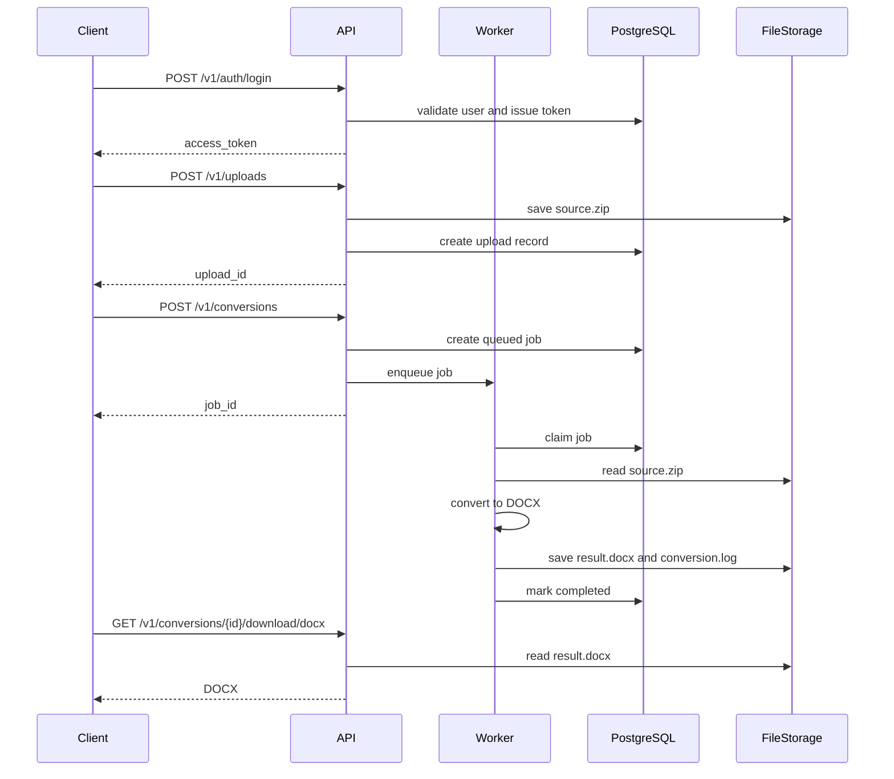

# Tex2Doc API 使用手册

## 1. 快速开始

启动服务：

```powershell
cargo run -p doc-server
```

确认服务可用：

```powershell
Invoke-RestMethod http://127.0.0.1:2624/api/v1/health
```

默认用户端 API base URL：

```text
http://127.0.0.1:2624/v1/
```

管理端 API base URL：

```text
http://127.0.0.1:2624/admin/v1/
```

## 2. Flutter 客户端接入

`flutter_app` 使用 `CommercialApiClient`：

```dart
final client = CommercialApiClient('http://127.0.0.1:2624/v1/');
final auth = await client.login(
  email: 'demo@example.com',
  password: 'secret',
);
final usage = await client.usage(auth.accessToken);
```

默认行为：

- 桌面端默认连接 `http://127.0.0.1:2624/v1/`。
- Web 端如果从 `https://example.com/app` 打开，默认连接 `https://example.com/v1/`。

## 3. 注册、登录、查询用户

注册：

```powershell
$register = @{
  email = "demo@example.com"
  password = "secret"
  display_name = "Demo"
} | ConvertTo-Json

$auth = Invoke-RestMethod `
  -Method Post `
  -Uri http://127.0.0.1:2624/v1/auth/register `
  -ContentType "application/json" `
  -Body $register
```

登录：

```powershell
$login = @{
  email = "demo@example.com"
  password = "secret"
} | ConvertTo-Json

$auth = Invoke-RestMethod `
  -Method Post `
  -Uri http://127.0.0.1:2624/v1/auth/login `
  -ContentType "application/json" `
  -Body $login
```

保存 token：

```powershell
$token = $auth.access_token
```

查询当前用户：

```powershell
Invoke-RestMethod `
  -Uri http://127.0.0.1:2624/v1/me `
  -Headers @{ Authorization = "Bearer $token" }
```

## 4. 查询用量和套餐

查询用量：

```powershell
Invoke-RestMethod `
  -Uri http://127.0.0.1:2624/v1/usage `
  -Headers @{ Authorization = "Bearer $token" }
```

查询套餐：

```powershell
Invoke-RestMethod http://127.0.0.1:2624/v1/plans
```

## 5. 上传项目 ZIP

使用 PowerShell 上传 multipart：

```powershell
$zipPath = "D:\work\Tex2Doc\examples\paper3\upload.zip"

$upload = Invoke-RestMethod `
  -Method Post `
  -Uri http://127.0.0.1:2624/v1/uploads `
  -Headers @{ Authorization = "Bearer $token" } `
  -Form @{ file = Get-Item $zipPath }
```

返回中包含：

```json
{
  "upload_id": "...",
  "file_name": "upload.zip",
  "bytes": 12345,
  "created_at": "..."
}
```

## 6. 创建转换任务

```powershell
$conversionBody = @{
  upload_id = $upload.upload_id
  main_tex = "main-jos.tex"
  profile = "auto"
  quality = "standard"
  engine = "semantic-engine"
  idempotency_key = "demo-001"
} | ConvertTo-Json

$job = Invoke-RestMethod `
  -Method Post `
  -Uri http://127.0.0.1:2624/v1/conversions `
  -Headers @{ Authorization = "Bearer $token" } `
  -ContentType "application/json" `
  -Body $conversionBody
```

常见状态：

- `queued`
- `normalizing`
- `detecting`
- `analyzing`
- `compiling`
- `rendering`
- `verifying`
- `completed`
- `failed`
- `expired`

## 7. 查询和下载转换结果

查询任务：

```powershell
Invoke-RestMethod `
  -Uri "http://127.0.0.1:2624/v1/conversions/$($job.job_id)" `
  -Headers @{ Authorization = "Bearer $token" }
```

下载 DOCX：

```powershell
Invoke-WebRequest `
  -Uri "http://127.0.0.1:2624/v1/conversions/$($job.job_id)/download/docx" `
  -Headers @{ Authorization = "Bearer $token" } `
  -OutFile "result.docx"
```

下载转换报告：

```powershell
Invoke-RestMethod `
  -Uri "http://127.0.0.1:2624/v1/conversions/$($job.job_id)/report" `
  -Headers @{ Authorization = "Bearer $token" }
```

下载质量报告：

```powershell
Invoke-RestMethod `
  -Uri "http://127.0.0.1:2624/v1/conversions/$($job.job_id)/quality-report" `
  -Headers @{ Authorization = "Bearer $token" }
```

下载原始 ZIP 和日志：

```powershell
Invoke-WebRequest `
  -Uri "http://127.0.0.1:2624/v1/conversions/$($job.job_id)/download/zip" `
  -Headers @{ Authorization = "Bearer $token" } `
  -OutFile "source.zip"

Invoke-WebRequest `
  -Uri "http://127.0.0.1:2624/v1/conversions/$($job.job_id)/download/log" `
  -Headers @{ Authorization = "Bearer $token" } `
  -OutFile "conversion.log"
```

## 8. 同步转换接口

旧链路或烟测可直接调用：

```powershell
$zipPath = "D:\work\Tex2Doc\examples\paper3\upload.zip"

Invoke-WebRequest `
  -Method Post `
  -Uri http://127.0.0.1:2624/api/v1/convert `
  -Form @{
    file = Get-Item $zipPath
    main_tex = "main-jos.tex"
  } `
  -OutFile "sync-result.docx"
```

该接口同步返回 DOCX，较适合测试；正式商业链路建议使用上传和异步转换接口。

## 9. 创建反馈

创建反馈线程：

```powershell
$feedback = @{
  conversion_job_id = $job.job_id
  title = "转换结果异常"
  feedback_type = "issue"
  content = "请协助检查转换日志。"
  priority = "normal"
} | ConvertTo-Json

$thread = Invoke-RestMethod `
  -Method Post `
  -Uri http://127.0.0.1:2624/v1/feedback/threads `
  -Headers @{ Authorization = "Bearer $token" } `
  -ContentType "application/json" `
  -Body $feedback
```

追加消息：

```powershell
$message = @{ content = "补充：Word 打开时提示格式异常。" } | ConvertTo-Json

Invoke-RestMethod `
  -Method Post `
  -Uri "http://127.0.0.1:2624/v1/feedback/threads/$($thread.thread_id)/messages" `
  -Headers @{ Authorization = "Bearer $token" } `
  -ContentType "application/json" `
  -Body $message
```

## 10. 管理端登录与查询

先设置管理员引导变量并启动服务：

```powershell
$env:TEX2DOC_BOOTSTRAP_ADMIN_EMAIL="admin@example.com"
$env:TEX2DOC_BOOTSTRAP_ADMIN_PASSWORD="change-me"
cargo run -p doc-server
```

登录：

```powershell
$adminLogin = @{
  email = "admin@example.com"
  password = "change-me"
} | ConvertTo-Json

$adminAuth = Invoke-RestMethod `
  -Method Post `
  -Uri http://127.0.0.1:2624/v1/auth/login `
  -ContentType "application/json" `
  -Body $adminLogin

$adminToken = $adminAuth.access_token
```

管理看板：

```powershell
Invoke-RestMethod `
  -Uri http://127.0.0.1:2624/admin/v1/dashboard `
  -Headers @{ Authorization = "Bearer $adminToken" }
```

用户列表：

```powershell
Invoke-RestMethod `
  -Uri http://127.0.0.1:2624/admin/v1/users `
  -Headers @{ Authorization = "Bearer $adminToken" }
```

## 11. 管理兑换码

创建兑换码批次：

```powershell
$batchBody = @{
  package_id = "count_10"
  quantity = 20
  channel = "preview"
  note = "preview test batch"
  auto_provision = $false
} | ConvertTo-Json

$batch = Invoke-RestMethod `
  -Method Post `
  -Uri http://127.0.0.1:2624/admin/v1/redeem-code-batches `
  -Headers @{ Authorization = "Bearer $adminToken" } `
  -ContentType "application/json" `
  -Body $batchBody
```

导出 Excel：

```powershell
Invoke-WebRequest `
  -Uri "http://127.0.0.1:2624/admin/v1/redeem-code-batches/$($batch.batch_id)/export.xlsx" `
  -Headers @{ Authorization = "Bearer $adminToken" } `
  -OutFile "redeem-codes.xlsx"
```

用户兑换：

```powershell
$redeemBody = @{ code = "T2D-XXXX-XXXX-XXXX-XX" } | ConvertTo-Json

Invoke-RestMethod `
  -Method Post `
  -Uri http://127.0.0.1:2624/v1/redeem-codes/redeem `
  -Headers @{ Authorization = "Bearer $token" } `
  -ContentType "application/json" `
  -Body $redeemBody
```

## 12. 常见错误处理

| 状态 | 可能原因 | 处理 |
| --- | --- | --- |
| 400 | 请求字段缺失、ZIP 非法、邮箱格式错误 | 检查请求体和上传文件 |
| 401 | token 缺失、过期、无效 | 重新登录或刷新 token |
| 403 | 非管理员访问管理接口 | 使用管理员账号登录 |
| 404 | 任务、上传、反馈或文件不存在 | 检查 id 和资源归属 |
| 409 | 用户已存在或幂等冲突 | 使用登录接口或更换邮箱 |
| 413 | 请求体过大 | 压缩项目或调整服务端限制 |
| 500 | 数据库、转换引擎、文件存储异常 | 查看服务日志 |

## 13. 推荐客户端流程



