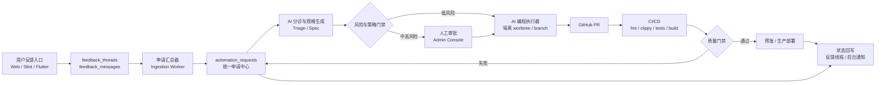

# Tex2Doc 用户反馈到 AI 编程与 CICD 全链路自动化方案

版本：v1.0
日期：2026-06-26
适用范围：用户问题/需求申请、后端集中汇总、AI 自动实现、CI/CD 校验发布、状态回写闭环

## 1. 背景与目标

Tex2Doc 当前已经具备用户反馈线程、后台反馈管理、反馈导出、发布管理和 GitHub Actions 自动构建部署基础。下一阶段目标是把“用户问题申请反馈”变成可追踪、可分派、可自动实现、可验证发布的工程闭环。

目标链路如下：

1. 用户在 Web/桌面端提交问题或需求。
2. 后端自动汇总、去重、分类、关联转换任务和运行日志。
3. AI 对申请做结构化分析，生成问题复现、需求规格、影响范围和测试计划。
4. 符合自动化策略的申请进入 AI 编程执行器，自动创建分支、实现代码、补充测试和文档。
5. CI/CD 自动执行格式检查、静态分析、单元/集成测试、构建、预发布和生产发布。
6. 后端把处理进度、PR、CI 结果、上线版本和最终结论回写到原反馈线程。

非目标：

- 不让 AI 直接写入 `main` 或直接操作生产环境。
- 不绕过人工审批处理高风险、账务、权限、安全、数据迁移和生产发布事项。
- 不把用户提交内容直接作为可执行指令传给编程代理。

## 2. 现有基础盘点

### 2.1 用户反馈与后台管理

现有能力：

- `apps/rust-service/src/feedback_service.rs` 提供 `FeedbackStore`，支持创建线程、追加消息、后台回复、后台更新、用户列表和后台列表。
- `apps/rust-service/src/routes.rs` 已暴露：
  - `POST /v1/feedback/threads`
  - `GET /v1/feedback/threads`
  - `GET /v1/feedback/threads/:id`
  - `POST /v1/feedback/threads/:id/messages`
  - `GET /admin/v1/feedback/threads`
  - `GET /admin/v1/feedback/threads/export.xlsx`
  - `PATCH /admin/v1/feedback/threads/:id`
  - `POST /admin/v1/feedback/threads/:id/messages`
- `docs-zh/money/003_feedback_and_session_storage.sql` 已定义 `feedback_threads`、`feedback_messages`，并增强 `conversion_jobs` 存储转换日志、产物 key 和 `report_json`。
- `apps/rust-service/src/excel_export.rs` 已能导出反馈列表。
- `flutter_app/lib/commercial_api.dart`、`crates/commercial-api-client/src/feedback.rs` 和 `apps/slint-user/src/cloud_account.rs` 已有反馈客户端调用基础。

可复用点：

- 反馈线程可作为自动化申请的源头。
- `conversion_job_id` 可关联用户转换任务、日志、报告和失败上下文。
- 后台反馈列表可扩展为“申请处理控制台”。
- 后台回复能力可复用为自动状态回写通道。

### 2.2 当前 CI/CD 基础

现有 GitHub Actions：

- `.github/workflows/ci.yml`
  - push/PR 到 `main` 触发。
  - Ubuntu/Windows Rust 检查。
  - `cargo fmt --all -- --check`
  - `cargo clippy --workspace --all-targets -- -D warnings`
  - Flutter `flutter analyze`
- `.github/workflows/deploy-production.yml`
  - push 到 `main` 或手动触发。
  - 构建 `doc-server` 和 Flutter home/user/admin 三个 Web 入口。
  - 上传生产包到腾讯云，通过 symlink 切换版本，重启服务并健康检查。
- `.github/workflows/release-packages.yml`
  - tag `v*` 或手动触发。
  - 构建 Windows/Linux 原生包和 Web 静态包。

需要补足：

- 自动化申请和 AI 编程任务的状态模型。
- 后端到 GitHub Actions 的事件触发。
- GitHub webhook 回写 CI/PR 状态。
- AI 生成改动的沙箱、权限、分支和审批策略。
- 更完整的测试、预发、灰度、回滚和审计门禁。

## 3. 总体架构



建议把系统拆成四个边界：

1. 申请中心：负责收集、去重、分类、状态机和审计。
2. AI 分诊中心：负责把自然语言反馈转成结构化工程任务。
3. AI 编程执行器：负责在隔离环境中创建分支、改代码、跑验证、开 PR。
4. CICD 回写中心：负责接收 GitHub webhook、更新状态、触发部署和回滚。

## 4. 统一申请状态机

| 状态 | 含义 | 进入动作 | 退出条件 |
| --- | --- | --- | --- |
| `submitted` | 用户反馈已提交 | 写入反馈线程 | 汇总器发现并创建申请 |
| `aggregated` | 已进入统一申请中心 | 关联用户、任务、日志、附件 | 去重和分类完成 |
| `triaged` | AI 已生成结构化规格 | 输出摘要、复现、验收标准、风险 | 策略判定完成 |
| `needs_human` | 需要人工审批 | 发送后台待办 | 审批通过或拒绝 |
| `approved` | 可以进入实现 | 锁定需求版本 | 创建 AI 编程任务 |
| `coding` | AI 正在实现 | 创建分支和 worktree | 提交分支或失败 |
| `pr_open` | PR 已创建 | 写回 PR URL | CI 开始 |
| `ci_running` | CI 执行中 | 接收 check suite 事件 | CI 成功或失败 |
| `ci_failed` | CI 失败 | 回写失败原因 | AI 修复、人工处理或关闭 |
| `ready_for_merge` | 质量门禁通过 | 标记可合并 | 合并或撤回 |
| `staging_deployed` | 已部署预发 | 执行冒烟测试 | 生产审批 |
| `production_deployed` | 已上线 | 记录版本和部署信息 | 用户确认或自动关闭 |
| `closed` | 完成关闭 | 回写反馈线程 | 归档 |
| `rejected` | 拒绝自动化处理 | 记录原因 | 人工回复用户 |

关键原则：

- 状态推进必须幂等，重复 webhook 或重复调度不能产生重复 PR、重复部署或重复回复。
- 每次状态变化都写入事件表，便于审计、回滚和客服追踪。
- 用户可见状态和内部状态分离，避免暴露分支名、日志路径、内部错误堆栈等敏感信息。

## 5. 数据库设计

建议新增一组自动化申请表，作为 `feedback_threads` 的上层编排模型。

### 5.1 `automation_requests`

核心字段建议：

```sql
CREATE TABLE automation_requests (
    id UUID PRIMARY KEY DEFAULT gen_random_uuid(),
    source_type TEXT NOT NULL CHECK (source_type IN ('feedback', 'github_issue', 'admin_manual', 'system')),
    source_id TEXT NOT NULL,
    feedback_thread_id UUID REFERENCES feedback_threads(id) ON DELETE SET NULL,
    conversion_job_id UUID REFERENCES conversion_jobs(id) ON DELETE SET NULL,
    title TEXT NOT NULL,
    request_type TEXT NOT NULL CHECK (request_type IN ('bug', 'requirement', 'ops', 'docs', 'test', 'unknown')),
    status TEXT NOT NULL DEFAULT 'submitted',
    priority TEXT NOT NULL DEFAULT 'normal',
    severity TEXT NOT NULL DEFAULT 'medium',
    risk_level TEXT NOT NULL DEFAULT 'unknown',
    dedupe_key TEXT,
    ai_summary TEXT,
    ai_spec JSONB NOT NULL DEFAULT '{}'::jsonb,
    acceptance_criteria JSONB NOT NULL DEFAULT '[]'::jsonb,
    affected_areas JSONB NOT NULL DEFAULT '[]'::jsonb,
    branch_name TEXT,
    pr_url TEXT,
    ci_run_url TEXT,
    deploy_environment TEXT,
    deployed_version TEXT,
    assigned_to TEXT,
    approved_by TEXT,
    approved_at TIMESTAMPTZ,
    closed_at TIMESTAMPTZ,
    created_at TIMESTAMPTZ NOT NULL DEFAULT now(),
    updated_at TIMESTAMPTZ NOT NULL DEFAULT now()
);

CREATE UNIQUE INDEX idx_automation_requests_source
    ON automation_requests(source_type, source_id);

CREATE INDEX idx_automation_requests_status_priority
    ON automation_requests(status, priority, created_at DESC);

CREATE INDEX idx_automation_requests_feedback_thread
    ON automation_requests(feedback_thread_id)
    WHERE feedback_thread_id IS NOT NULL;
```

### 5.2 `automation_request_events`

用于完整审计和回写：

```sql
CREATE TABLE automation_request_events (
    id UUID PRIMARY KEY DEFAULT gen_random_uuid(),
    request_id UUID NOT NULL REFERENCES automation_requests(id) ON DELETE CASCADE,
    event_type TEXT NOT NULL,
    from_status TEXT,
    to_status TEXT,
    actor_type TEXT NOT NULL CHECK (actor_type IN ('user', 'admin', 'ai', 'system', 'github')),
    actor_id TEXT,
    message TEXT,
    payload JSONB NOT NULL DEFAULT '{}'::jsonb,
    created_at TIMESTAMPTZ NOT NULL DEFAULT now()
);

CREATE INDEX idx_automation_request_events_request
    ON automation_request_events(request_id, created_at ASC);
```

### 5.3 `automation_runs`

记录 AI 分诊和编程执行：

```sql
CREATE TABLE automation_runs (
    id UUID PRIMARY KEY DEFAULT gen_random_uuid(),
    request_id UUID NOT NULL REFERENCES automation_requests(id) ON DELETE CASCADE,
    run_type TEXT NOT NULL CHECK (run_type IN ('triage', 'planning', 'coding', 'fix_ci', 'deploy')),
    status TEXT NOT NULL CHECK (status IN ('queued', 'running', 'succeeded', 'failed', 'cancelled')),
    runner_id TEXT,
    model_name TEXT,
    input_digest TEXT,
    output_digest TEXT,
    log_key TEXT,
    started_at TIMESTAMPTZ,
    finished_at TIMESTAMPTZ,
    created_at TIMESTAMPTZ NOT NULL DEFAULT now()
);
```

### 5.4 `automation_artifacts`

存放规格、补丁、日志、测试报告、截图等：

```sql
CREATE TABLE automation_artifacts (
    id UUID PRIMARY KEY DEFAULT gen_random_uuid(),
    request_id UUID NOT NULL REFERENCES automation_requests(id) ON DELETE CASCADE,
    run_id UUID REFERENCES automation_runs(id) ON DELETE SET NULL,
    artifact_type TEXT NOT NULL,
    storage_key TEXT,
    external_url TEXT,
    metadata JSONB NOT NULL DEFAULT '{}'::jsonb,
    created_at TIMESTAMPTZ NOT NULL DEFAULT now()
);
```

## 6. 后端服务设计

建议新增 Rust 服务模块：

| 模块 | 责任 |
| --- | --- |
| `automation_store.rs` | 申请、事件、运行记录和 artifact 的数据库读写 |
| `automation_service.rs` | 状态机、去重、策略判定、回写反馈线程 |
| `automation_worker.rs` | 定时扫描反馈线程、锁定申请、推进状态 |
| `ai_triage_service.rs` | 调用 AI 生成结构化规格和风险判断 |
| `ai_coding_service.rs` | 触发 AI 编程 runner，创建任务包 |
| `github_service.rs` | 创建 issue/branch/PR、触发 repository_dispatch、查询 checks |
| `cicd_webhook.rs` | 接收 GitHub webhook，更新 PR/CI/部署状态 |

建议新增 API：

| API | 说明 |
| --- | --- |
| `GET /admin/v1/automation/requests` | 后台申请列表，按状态、类型、风险、来源过滤 |
| `GET /admin/v1/automation/requests/:id` | 申请详情，含事件、AI 规格、PR、CI、部署状态 |
| `POST /admin/v1/automation/requests/:id/triage` | 手动触发或重跑 AI 分诊 |
| `POST /admin/v1/automation/requests/:id/approve` | 人工批准进入 AI 编程 |
| `POST /admin/v1/automation/requests/:id/reject` | 拒绝自动处理并回写原因 |
| `POST /admin/v1/automation/requests/:id/implement` | 手动触发 AI 编程 |
| `POST /admin/v1/automation/requests/:id/retry` | 根据失败阶段重试 |
| `GET /v1/feedback/threads/:id/automation-status` | 用户侧查询申请处理状态 |
| `POST /admin/v1/github/webhooks` | GitHub webhook 回调入口 |

后台汇总器逻辑：

1. 扫描 `feedback_threads` 中 `status in ('open', 'in_progress')` 且未存在 `automation_requests` 的线程。
2. 读取最近消息、关联的 `conversion_job_id`、`report_json`、日志 key 和附件 metadata。
3. 生成 `dedupe_key`，建议使用规范化标题、错误码、转换阶段、模板类型、堆栈摘要和用户描述 hash。
4. 如果命中已有活跃申请，关联到同一个申请并追加事件。
5. 如果未命中，创建 `automation_requests`，写入 `aggregated` 事件。
6. 对新申请异步触发 AI 分诊。

并发与幂等：

- worker 使用 `FOR UPDATE SKIP LOCKED` 锁定待处理申请。
- 外部 webhook 使用 GitHub delivery id 去重。
- 触发 AI 编程前检查 `branch_name`、`pr_url` 是否已存在。
- 每个状态迁移使用条件更新：`WHERE id = $1 AND status = $expected_status`。

## 7. AI 分诊与规格生成

AI 分诊输入应是经过净化的任务包，不能直接把用户内容当系统指令。

输入包建议：

```json
{
  "request_id": "uuid",
  "source": {
    "type": "feedback",
    "thread_id": "uuid",
    "user_visible_title": "用户标题"
  },
  "messages": [
    {
      "sender_type": "user",
      "content": "用户原始反馈，按非可信输入处理",
      "created_at": "..."
    }
  ],
  "conversion_context": {
    "conversion_job_id": "uuid",
    "status": "failed",
    "report_json": {},
    "log_excerpt": "已脱敏的日志片段"
  },
  "repo_context": {
    "known_modules": ["rust-service", "compiler-engine", "flutter_app"],
    "ci_commands": ["cargo fmt", "cargo clippy", "flutter analyze"]
  }
}
```

AI 输出必须是结构化 JSON：

```json
{
  "request_type": "bug",
  "severity": "high",
  "risk_level": "medium",
  "summary": "简要说明问题",
  "reproduction_steps": ["步骤 1", "步骤 2"],
  "expected_behavior": "期望行为",
  "actual_behavior": "实际行为",
  "affected_areas": ["apps/rust-service", "crates/compiler-engine"],
  "acceptance_criteria": ["验收标准 1", "验收标准 2"],
  "implementation_plan": ["实现步骤 1", "实现步骤 2"],
  "test_plan": ["测试项 1", "测试项 2"],
  "needs_human_reason": null
}
```

自动化策略建议：

| 风险 | 自动化动作 |
| --- | --- |
| 低风险 | 自动生成 PR，等待 CI，通过后后台提示可合并 |
| 中风险 | 自动生成规格，需后台审批后进入 AI 编程 |
| 高风险 | 只生成分析报告和建议，不自动改代码 |
| 关键风险 | 强制人工处理，AI 仅做资料整理 |

高风险条件：

- 涉及支付、兑换码、账户余额、权限、登录、token、生产部署脚本。
- 涉及数据库破坏性迁移、数据回填、隐私数据导出。
- 影响多个核心模块或 GitNexus impact 返回 HIGH/CRITICAL。
- CI/CD、发布、回滚、安全相关改动。

## 8. AI 编程执行器设计

AI 编程执行器建议运行在隔离的 self-hosted runner 或专用容器中，不能持有生产密钥。

执行流程：

1. 从后端拉取 `automation_requests` 的任务包。
2. 创建分支：`codex/request-{short_id}-{slug}`。
3. 创建干净 worktree，安装依赖，读取项目约束。
4. 使用 GitNexus 查询相关流程和符号。
5. 修改任何函数、类、方法前必须执行 `impact({target, direction: "upstream"})`。
6. 若 impact 为 HIGH/CRITICAL，停止自动编辑，回写 `needs_human`。
7. 实现代码、测试和必要文档。
8. 执行格式化、静态检查、测试和构建。
9. 提交前执行 `detect_changes()`，确认影响范围符合申请。
10. 推送分支并创建 PR。
11. 把 PR URL、变更摘要、测试结果写回后端。

建议任务包包含：

```json
{
  "request_id": "uuid",
  "branch_name": "codex/request-1234-fix-feedback-export",
  "title": "修复反馈导出筛选条件未生效",
  "summary": "结构化问题摘要",
  "acceptance_criteria": [],
  "implementation_plan": [],
  "test_plan": [],
  "risk_policy": {
    "max_auto_risk": "medium",
    "require_human_for": ["payment", "auth", "deployment", "schema_destructive"]
  },
  "required_checks": [
    "cargo fmt --all -- --check",
    "cargo clippy --workspace --all-targets -- -D warnings",
    "flutter analyze"
  ]
}
```

PR 模板建议自动生成：

- 来源申请和反馈线程。
- 用户问题摘要。
- AI 分诊结论。
- GitNexus impact 摘要。
- 代码变更摘要。
- 测试结果。
- 风险和回滚方案。

## 9. CICD 改造方案

### 9.1 保留并增强现有 CI

保留 `.github/workflows/ci.yml`，建议增强：

- 增加 `cargo test --workspace`，至少对非慢测默认执行。
- 增加 `cargo test -p doc-server` 或服务端 API 集成测试。
- 增加 Flutter `flutter test`。
- 增加 migration SQL lint 或最小 PostgreSQL 容器 smoke test。
- 上传测试报告和覆盖率摘要。

### 9.2 新增自动化申请触发 workflow

建议新增 `.github/workflows/automation-request.yml`：

```yaml
name: Automation Request

on:
  repository_dispatch:
    types: [tex2doc-automation-request]
  workflow_dispatch:
    inputs:
      request_id:
        description: Tex2Doc automation request id
        required: true

permissions:
  contents: write
  pull-requests: write
  checks: read

jobs:
  ai-implementation:
    runs-on: [self-hosted, tex2doc-ai-runner]
    steps:
      - uses: actions/checkout@v5
        with:
          fetch-depth: 0
      - name: Run AI implementation
        run: tex2doc-ai-runner implement "$REQUEST_ID"
        env:
          REQUEST_ID: ${{ github.event.client_payload.request_id || inputs.request_id }}
```

注意：真正调用 AI 编程的 runner 必须部署在受控环境，GitHub-hosted runner 不适合持有 AI 服务凭据和后端写回 token。

### 9.3 PR 校验门禁

PR 必须满足：

- CI 全绿。
- AI 生成的 `detect_changes` 报告存在。
- 中高风险申请必须有人工审批记录。
- 数据库迁移必须有回滚说明。
- 生产部署相关改动必须有运维审批。

建议通过 GitHub branch protection 强制：

- 至少一个维护者 review。
- `Rust · ubuntu-latest`、`Rust · windows-latest`、`Flutter web/client checks` 必须通过。
- 禁止 AI runner 直接 bypass branch protection。

### 9.4 预发与生产发布

建议发布链路：

1. PR 合并到 `main` 后自动运行 `deploy-production.yml` 当前流程。
2. 在生产前增加 `staging` 环境：
   - 构建同一份 artifact。
   - 部署到预发服务器。
   - 执行 `/api/v1/health`、用户登录、反馈列表、转换队列、静态资源访问等 smoke test。
3. 生产环境继续使用 GitHub environment approval。
4. 发布成功后回写 `automation_requests.deployed_version` 和反馈线程。

如果短期不引入预发服务器，至少在生产部署前增加 artifact smoke test：

- 检查 server binary 可启动。
- 检查 Flutter home/user/admin 三个静态入口存在。
- 检查 tar 包结构。
- 在临时端口启动 `doc-server` 并访问健康检查。

## 10. GitHub webhook 回写

需要接收：

- `pull_request`：PR opened、synchronize、closed、merged。
- `check_suite` 或 `workflow_run`：CI queued、in_progress、completed。
- `deployment_status`：预发/生产部署状态。

回写动作：

- PR opened：`status = 'pr_open'`，写入 `pr_url`。
- CI started：`status = 'ci_running'`，写入 `ci_run_url`。
- CI failed：`status = 'ci_failed'`，追加失败摘要，必要时触发 AI 修复。
- CI succeeded：`status = 'ready_for_merge'`。
- merged：等待部署或进入 `staging_deployed`。
- production success：`status = 'production_deployed'`，后台自动回复用户。

Webhook 安全：

- 校验 `X-Hub-Signature-256`。
- 存储并去重 `X-GitHub-Delivery`。
- 只接受来自目标仓库的事件。
- 对外部 URL、commit message 和 PR body 做长度限制与 HTML 转义。

## 11. 后台控制台设计

建议在现有 admin Flutter 页面中新增“自动化申请”入口。

列表字段：

- 申请编号、标题、来源、类型、优先级、风险、状态、创建时间。
- 关联用户、关联反馈线程、关联转换任务。
- PR、CI、部署环境。

详情页：

- 用户原始反馈和消息线程。
- AI 摘要、复现步骤、验收标准、实现计划、测试计划。
- 事件时间线。
- GitNexus impact 摘要。
- PR diff 链接、CI 日志链接、部署记录。
- 操作按钮：批准、拒绝、重跑分诊、触发实现、重试 CI 修复、关闭。

用户侧状态展示：

- 已收到
- 正在分析
- 已进入开发
- 正在验证
- 已发布
- 需要人工处理
- 已关闭

不要向普通用户展示内部错误堆栈、AI prompt、runner 日志、分支权限和生产部署细节。

## 12. 安全与合规门禁

必须执行：

- 用户输入一律视为不可信内容，不能提升为系统指令。
- 日志和附件进入 AI 前脱敏：token、邮箱、手机号、订单号、路径中的用户名等。
- AI runner 不持有生产 SSH key、数据库密码、支付密钥。
- 自动化分支只允许 push 到 `codex/request-*`。
- 高风险模块需要人工审批。
- 所有状态变化、审批、AI 输出、PR、部署都写审计事件。

建议增加：

- 每日自动化申请数量上限和单用户频率限制。
- AI token 成本预算。
- 异常失败熔断：连续失败 N 次后暂停自动实现，只保留分诊。
- 生成代码的许可与第三方依赖审查。

## 13. 分阶段实施计划

### P0：方案固化与基础模型

周期：1-2 天

交付：

- 新增自动化申请表设计和迁移。
- 新增 `automation_store` 基础 CRUD。
- 后台能看到从反馈线程生成的申请。
- 申请事件表可记录状态变化。

验收：

- 用户提交反馈后，后台可看到对应自动化申请。
- 重复扫描不会产生重复申请。
- 申请可关联原反馈线程和转换任务。

### P1：自动汇总与 AI 分诊

周期：3-5 天

交付：

- `automation_worker` 自动扫描反馈。
- AI 分诊输出结构化 JSON。
- 去重、优先级、风险等级和验收标准自动生成。
- 后台可批准或拒绝自动实现。

验收：

- 至少 20 条历史反馈可自动分类。
- 低风险/中风险/高风险策略判定可解释。
- 分诊结果可回写反馈线程，用户可见处理状态。

### P2：AI 编程执行器与 PR 自动生成

周期：5-8 天

交付：

- self-hosted AI runner。
- 自动创建 `codex/request-*` 分支。
- 自动执行 GitNexus query、impact、detect_changes。
- 自动提交代码、测试和 PR。
- PR body 包含申请上下文、影响范围和验证结果。

验收：

- 选取低风险文档/测试/小修复申请，能自动生成 PR。
- CI 失败可自动回写原因。
- HIGH/CRITICAL impact 会停止自动编辑并转人工。

### P3：CI/CD 回写与预发门禁

周期：5-7 天

交付：

- GitHub webhook 回写 PR/CI 状态。
- 增强 CI 测试矩阵。
- 增加预发部署或 artifact smoke test。
- 后台展示 PR、CI、部署时间线。

验收：

- PR opened、CI running、CI failed、CI passed、merged、deployed 状态准确回写。
- 部署失败能保留现场并提示回滚建议。
- 生产发布仍需 GitHub environment approval。

### P4：闭环运营与自动优化

周期：持续迭代

交付：

- 用户确认/满意度反馈。
- 自动化处理统计报表。
- 失败原因归因。
- 申请聚类和产品路线图建议。

验收：

- 自动化申请平均分诊时间小于 5 分钟。
- 低风险申请 PR 自动生成成功率大于 70%。
- CI 一次通过率持续提升。
- 用户反馈闭环率可量化。

## 14. 测试方案

后端测试：

- 申请创建幂等测试。
- 状态机条件更新测试。
- GitHub webhook 签名校验测试。
- AI 分诊 JSON schema 校验测试。
- 反馈线程回写测试。
- 去重 key 命中和不命中测试。

集成测试：

- 用户创建反馈 -> 自动生成申请 -> AI 分诊 -> 后台审批。
- 申请触发 repository_dispatch -> runner 创建 PR。
- GitHub webhook -> 后端状态更新。
- CI 失败 -> 申请进入 `ci_failed` 并追加事件。

CI 测试建议：

- `cargo fmt --all -- --check`
- `cargo clippy --workspace --all-targets -- -D warnings`
- `cargo test --workspace`
- `flutter analyze`
- `flutter test`
- 服务端 API smoke test。

## 15. 监控指标

业务指标：

- 新增申请数、自动分诊数、自动 PR 数、自动关闭数。
- 平均首次响应时间。
- 平均从反馈到 PR 时间。
- 平均从 PR 到上线时间。
- 用户确认率和重开率。

质量指标：

- AI 分诊成功率。
- PR CI 一次通过率。
- AI 修复 CI 成功率。
- 自动化申请人工介入率。
- 回滚次数。

系统指标：

- worker 队列积压。
- AI runner 并发数和失败率。
- webhook 延迟和失败率。
- AI token 成本。

## 16. 风险与缓解

| 风险 | 表现 | 缓解 |
| --- | --- | --- |
| AI 错误理解用户需求 | PR 方向错误 | 结构化规格、人工审批、验收标准前置 |
| Prompt injection | 用户反馈诱导 AI 泄密或执行危险操作 | 用户内容隔离为非可信输入，runner 无生产密钥 |
| 影响范围过大 | 小问题改动核心链路 | GitNexus impact 门禁，HIGH/CRITICAL 转人工 |
| CI 不稳定 | 自动化反复失败 | 失败熔断、重试上限、失败归因 |
| 数据泄漏 | 日志或附件包含敏感信息 | 脱敏、最小化上下文、artifact 权限控制 |
| 生产事故 | 自动部署引入回归 | 预发、健康检查、environment approval、快速回滚 |
| 成本失控 | 申请量过大或重复实现 | 去重、预算、限流、人工批量关闭 |

## 17. 首批开发任务清单

建议按以下顺序落地：

1. 新增 `docs-zh/money/004_automation_requests.sql` 或正式 migration。
2. 新增 `apps/rust-service/src/automation_store.rs`。
3. 新增 `apps/rust-service/src/automation_service.rs`。
4. 在 `routes.rs` 增加 admin automation API。
5. 增加 worker：从 `feedback_threads` 汇总到 `automation_requests`。
6. 增加 AI 分诊接口和 JSON schema 校验。
7. 在 admin Flutter 端新增“自动化申请”列表和详情页。
8. 新增 GitHub repository_dispatch 触发服务。
9. 新增 `.github/workflows/automation-request.yml`。
10. 部署 self-hosted AI runner。
11. 接入 GitHub webhook 状态回写。
12. 增强 CI 测试和预发 smoke test。
13. 接入反馈线程自动回复。
14. 建立监控报表和失败熔断策略。

## 18. 推荐里程碑

| 里程碑 | 完成标志 |
| --- | --- |
| M1 统一申请中心 | 后台可看到所有用户反馈生成的自动化申请 |
| M2 AI 分诊可用 | 申请能自动生成结构化规格和风险等级 |
| M3 自动 PR | 低风险申请能自动生成 PR 并跑 CI |
| M4 CI/CD 闭环 | PR/CI/部署状态能回写后台和反馈线程 |
| M5 生产可控自动化 | 低风险申请半自动上线，高风险申请稳定转人工 |

## 19. 结论

Tex2Doc 已有反馈线程、后台管理、导出和 CI/CD 基础，适合在现有服务上增加“统一申请中心 + AI 分诊 + AI 编程 runner + CICD 回写”的编排层。建议先以低风险申请为试点，优先自动化文档、测试、UI 小修复和明确 bug；涉及支付、权限、数据库、发布的申请只做 AI 分析和人工辅助。

该方案的关键不是让 AI 绕过工程流程，而是让 AI 进入工程流程：每个申请有来源、有规格、有影响分析、有 PR、有 CI、有部署记录、有用户回写，最终形成可审计、可回滚、可持续优化的自动化处理链路。
