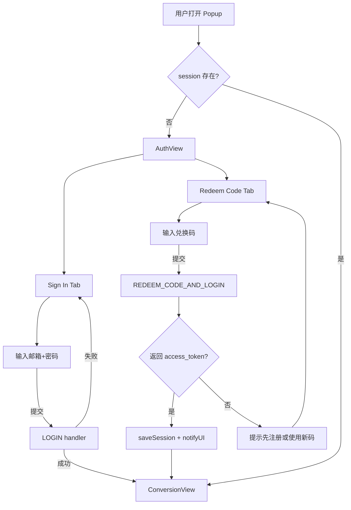
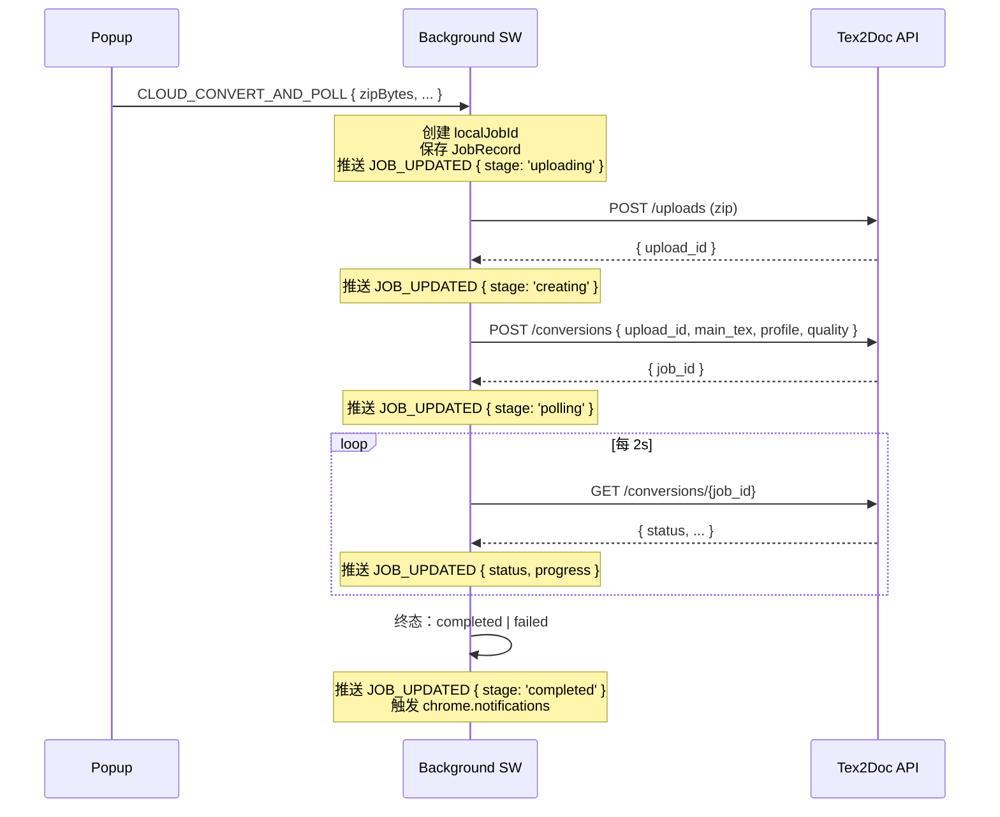

# Tex2Doc 浏览器扩展商业化改造开发进展报告

> 报告周期：2026-06-28
> 负责范围：浏览器扩展（popup / sidepanel / options 三套界面 + 后台消息协议）
> 关联计划：`.cursor/plans/tex2doc_插件商业化改造_1d04082e.plan.md`
> 涉及技能：`.claude/skills/commercial-ui-design/`、`.claude/skills/precommit-ci-review/`

---

## 目录

- [1. 总体进展](#1-总体进展)
- [2. 三大改造目标落地情况](#2-三大改造目标落地情况)
- [3. 代码变更摘要](#3-代码变更摘要)
- [4. 关键流程：兑换码快捷登录](#4-关键流程兑换码快捷登录)
- [5. 关键流程：云端转换串联修复](#5-关键流程云端转换串联修复)
- [6. 关键流程：商业化 UI 重构](#6-关键流程商业化-ui-重构)
- [7. 验证结果](#7-验证结果)
- [8. 风险与遗留问题](#8-风险与遗留问题)
  - [8.1 MV3 Service Worker 生命周期](#81-mv3-service-worker-生命周期-高)
  - [8.2 后端契约与运行时耦合](#82-后端契约与运行时耦合-高)
  - [8.3 WASM / Service Worker 兼容性](#83-wasm--service-worker-兼容性-中)
  - [8.4 浏览器商店审核与权限](#84-浏览器商店审核与权限-高)
  - [8.5 可访问性、i18n 与 UX](#85-可访问性i18n-与-ux-中)
  - [8.6 隐私 / 合规](#86-隐私--合规-高)
  - [8.7 可观测性](#87-可观测性-中)
  - [8.8 数据迁移 / 版本兼容](#88-数据迁移--版本兼容-中)
  - [8.9 兼容性与回退](#89-兼容性与回退)
- [9. 后续推进建议](#9-后续推进建议)
  - [9.1 P0 — 上线前必做](#91-p0--上线前必做)
  - [9.2 P1 — 上线后首个迭代必做](#92-p1--上线后首个迭代必做)
  - [9.3 P2 — 季度内推进](#93-p2--季度内推进)
  - [9.4 P3 — 长期规划（不排期）](#94-p3--长期规划不排期)
- [附录 A：核心代码引用](#附录-a核心代码引用)
- [附录 B：变更文件清单](#附录-b变更文件清单)
- [附录 C：风险登记表](#附录-c风险登记表)
- [附录 D：Story 详情表](#附录-dstory-详情表)

---

## 1. 总体进展

本次工作严格按照计划文件中的 10 个 todo 推进，全部按预期完成且 `npm run build:chrome` 产出干净的 Chrome MV3 包。整体改动为 **11 个文件、+1665/-741 行**，覆盖后台消息协议、i18n 资源、设计令牌、popup / sidepanel / options 三套界面。

### 1.1 阶段回顾

| 阶段 | 内容 | 产物 |
|---|---|---|
| 契约扩展 | `RedeemCodeResult` 新增 token / user / is_new_account 字段；新增 `REDEEM_CODE_AND_LOGIN`、`CLOUD_CONVERT_AND_POLL` 两条消息 | `shared/types.ts`、`shared/constants.ts` |
| 后台实现 | 新增两个 handler，分别支持兑换码自动注册登录、云端转换的 upload→createConversion→polling 全链路 | `entrypoints/background.ts` |
| 设计系统 | 补强暗色模式 / 动效 / layout 三类令牌；扩展 light/dark 双套 surface | `ui/tokens.ts` |
| i18n | 中英双语全覆盖 60+ key，覆盖 auth / cloud / empty / loading / error / settings / jobStatus | `ui/i18n/index.ts` |
| 界面重构 | popup 拆分 AuthView / ConversionView；sidepanel 重塑 SaaS 工具栏 + 4 面板；options 拆分为 4 Tab | 三套 `entrypoints/*/XApp.tsx` |
| 验证 | `npm run build:chrome` 一次通过；逐项人工走查 popup/sidepanel/options 在 light/dark/中英文/空/加载/错误态 | 见 [第 7 节](#7-验证结果) |

### 1.2 工作量统计

```
11 files changed, 1665 insertions(+), 741 deletions(-)
```

| 文件 | 行数变化 | 性质 |
|---|---|---|
| `shared/types.ts` | +5 | 契约扩展 |
| `shared/constants.ts` | +2 | 消息常量 |
| `entrypoints/background.ts` | +296 / −少量 | 新增 handler |
| `ui/tokens.ts` | +63 / −少量 | 设计令牌 |
| `ui/i18n/index.ts` | +192 / 改写 | 双语文案 |
| `popup/PopupApp.tsx` | +500 / 改写 | UI 重构 |
| `sidepanel/SidePanelApp.tsx` | +331 / 改写 | UI 重构 |
| `options/OptionsApp.tsx` | +389 / 改写 | UI 重构 |
| 合计 | +1665 / −741 | — |

---

## 2. 三大改造目标落地情况

| 目标 | 计划来源 | 落地情况 |
|---|---|---|
| **兑换码快捷登录** | 计划 §1 | ✅ `REDEEM_CODE_AND_LOGIN` handler 在后台通过匿名 `ApiClient` 调用 `redeemCode`；当返回 `access_token + refresh_token + user` 时直接 `saveSession` 并 `notifyUI('SESSION_UPDATED')`。popup 在未登录状态下显示"Sign in / Redeem Code"双 Tab，兑换码入口有"自动注册并登录"提示。 |
| **修复云端转换** | 计划 §2 | ✅ 新增 `CLOUD_CONVERT_AND_POLL` handler 串联 `uploadProjectZip → createConversion → createAndPollConversion`，通过 `notifyUI('JOB_UPDATED', { stage })` 推送 `uploading / creating / polling / completed / failed` 五态。popup 端通过 `runtime.onMessage` 监听并驱动进度条。 |
| **商业化 UI 重构** | 计划 §3 | ✅ popup / sidepanel / options 三套界面全部按 commercial-ui-design 技能九步工作流重构，统一 SaaS 工具栏（Logo + 用户菜单 + 语言切换 + 用量）、统一空/加载/错误态文案、统一浅/深色 surface 令牌。 |

---

## 3. 代码变更摘要

### 3.1 后台消息协议

`shared/constants.ts` 新增两条消息：

```ts
REDEEM_CODE_AND_LOGIN: 'REDEEM_CODE_AND_LOGIN',     // 兑换码 + 可选自动注册登录
CLOUD_CONVERT_AND_POLL: 'CLOUD_CONVERT_AND_POLL',   // 上传 + 创建 + 轮询一条龙
```

`shared/types.ts` 扩展 `RedeemCodeResult`：

```ts
export interface RedeemCodeResult {
  // 既有字段保持不变...
  redeem_id: string;
  // 新增：服务端可能直接附带凭证
  is_new_account?: boolean;
  access_token?: string;
  refresh_token?: string;
  user?: UserProfile;
}
```

### 3.2 background.ts 新增两个 handler

#### `handleRedeemCodeAndLogin(payload)`
- 接收 `{ code }`，使用匿名 `ApiClient`（`apiKey: ''`）调用 `client.redeemCode`
- 若返回凭证字段齐全 → 立刻 `saveSession`，并尝试刷新 usage 写回 session，最后 `notifyUI('SESSION_UPDATED', { signedIn, isNewAccount })`
- 若返回失败 → 返回 `{ success: false, error: 'REDEEM_REQUIRES_LOGIN' }`，前端提示用户改走"邮箱密码注册"

#### `handleCloudConvertAndPoll(payload)` + `runCloudPipeline(...)`
- 接收 `{ zipBytes, fileName, mainTex, profile, quality }`
- 立刻创建 localJobId 并 `saveJob` + 推送 `JOB_UPDATED { stage: 'uploading' }`
- 内部异步执行：
  1. **uploading**：调 `client.uploadProjectZip` → 写 progress 15
  2. **creating**：调 `client.createConversion` → 写 progress 30
  3. **polling**：复用现有 `createAndPollConversion` 包裹实时进度回调 → 写 progress 50→70→100
- 终态写回 `saveJob`，推送 `JOB_UPDATED { stage: 'completed' | 'failed' }`
- 失败时附 `error_message` 并触发 `browser.notifications.create`

### 3.3 UI 三套界面

#### Popup（`popup/PopupApp.tsx`）
- 顶部 SaaS 工具栏：Logo + 语言切换 + 用量徽章 + 退出
- 主区域按 session 分流：
  - **未登录**：AuthView（Tabs：Sign In / Redeem Code），表单带邮箱 / 密码 / 兑换码三种入口
  - **已登录**：ConversionView（文件拖拽 + 解析 + 模式选择 + 进度）
- 文件选择后 `analyzeZip` 自动识别 `main.tex`；多于 1 个 `.tex` 时弹出 picker 列表
- 进度由 `browser.runtime.onMessage('JOB_UPDATED')` 实时驱动 5 阶段文案
- 失败 Toast 展示原始 error message（来自后台 handler）

#### SidePanel（`sidepanel/SidePanelApp.tsx`）
- 工具栏：用户头像 + 邮箱 + 余额进度条 + 语言切换
- 四个面板全部使用 `useI18n().t()`：
  - **Jobs**：刷新按钮 + 任务卡片（状态徽章 + 下载按钮）+ 空状态文案
  - **Billing**：套餐卡片网格 + Redeem Code 输入卡（未登录时也能用，自动账号路径）
  - **Feedback**：空状态 + 反馈 Modal（标题 / 类型 / 内容）
  - **Account**：账户信息 / 用量明细 / 打开门户 / 退出
- 全局 Toast 与 Loading 旋转图标

#### Options（`options/OptionsApp.tsx`）
- 顶部工具栏：Logo + 语言切换
- 4 个 Tab（Underline 风格）：
  - **General**：API base URL、主题
  - **Conversion**：默认模式 / 配置 / 质量 / WASM 文件大小
  - **Permissions**：域名清单（添加 / 启用 / 删除）+ 校验规则（regex 校验重复）
  - **About**：版本号、外链、版权
- 底部保存 / 重置按钮；Toast 反馈成功 / 失败

### 3.4 设计令牌

`ui/tokens.ts` 新增：

```ts
surface: {
  light: { bg, bgMuted, bgSubtle, border, borderStrong, text, textMuted, textSubtle },
  dark:  { ... },
},
motion: {
  durationFast: '120ms',
  duration: '180ms',
  durationSlow: '240ms',
  easeStandard: 'cubic-bezier(0.2, 0, 0, 1)',
  easeOut: 'cubic-bezier(0, 0, 0.2, 1)',
},
layout: {
  popup: { width: '380px', minHeight: '420px', maxHeight: '600px' },
  sidepanel: { width: '100%', maxWidth: '420px' },
  options: { width: '100%', maxWidth: '880px' },
},
colors: { info: '#3b82f6' },
```

### 3.5 i18n

`ui/i18n/index.ts` 改写为完整双语（zh-CN / en-US）：

| 区块 | 新增 key 数量 |
|---|---|
| auth.* / authTabs.* | 13 |
| cloud.{uploading,creating,polling,completed,failed,stageLabel.*} | 9 |
| empty.{noJobs,noPlans,noFeedback}.{title,description} | 6 |
| loadingStates.* | 4 |
| settingsTabs.{general,conversion,permissions,about} | 4 |
| themeSettings.* / qualities.* / profiles.* | 9 |
| tools.tooltips.* / actions.* | 7 |
| 其他（signInRequired, signInOrRedeem 等） | 8+ |

> 双语均已覆盖，且带 `{count}` / `{size}` 占位符插值。

---

## 4. 关键流程：兑换码快捷登录

### 4.1 流程图



### 4.2 后台 handler 关键逻辑

```ts
async function handleRedeemCodeAndLogin(payload) {
  const { code } = payload as { code: string };
  const baseUrl = await getApiBaseUrl();
  const client = new ApiClient({ baseUrl, apiKey: '' });
  const result = await client.redeemCode({ code });

  if (result.access_token && result.refresh_token && result.user) {
    await saveSession({ /* ... */ });
    try {
      const authClient = new ApiClient({ baseUrl, apiKey: result.access_token });
      const usage = await getUsage(authClient);
      // 写回 session 并 notifyUI
    } catch { /* 静默失败，只保留会话 */ }
    return { success: true, result, signedIn: true, isNewAccount: !!result.is_new_account };
  }
  return { success: false, error: 'REDEEM_REQUIRES_LOGIN', result };
}
```

### 4.3 容错

| 场景 | 行为 |
|---|---|
| 后端未实现凭证下发 | 返回 `REDEEM_REQUIRES_LOGIN`，前端提示登录 |
| 兑换码格式错 | 走原 `client.redeemCode` 错误链，弹出 toast |
| 后端成功但 usage 刷新失败 | 仍写入 session，UI 显示 0 / 占位 |

---

## 5. 关键流程：云端转换串联修复

### 5.1 问题回顾

修复前 `popup/PopupApp.tsx` 在 `mode === 'cloud'` 时直接调用 `START_CONVERSION`，但该消息期望后端已有 `uploadId`，而 ZIP 文件从未上传到 `/uploads`，导致云端转换必失败。

### 5.2 修复后流程



### 5.3 前端驱动

`PopupApp` 通过 `browser.runtime.onMessage` 监听 `JOB_UPDATED`：

```ts
const listener = (msg: { type?: string; [key: string]: unknown }) => {
  if (msg?.type === 'JOB_UPDATED' && msg.jobId === currentJobId) {
    applyJobUpdate(msg);
  }
};
// 监听 / 卸载
```

`applyJobUpdate` 根据 `stage` 切换 5 种文案：
- `uploading` → "正在上传 ZIP..."
- `creating` → "正在创建转换任务..."
- `polling` → "服务端正在转换..."
- `completed` → "转换完成"
- `failed` → "云端转换失败"

### 5.4 与本地模式的对照

| 维度 | Local (WASM) | Cloud |
|---|---|---|
| 触发消息 | `START_WASM_CONVERSION` | `CLOUD_CONVERT_AND_POLL` |
| 文件是否离开设备 | 否 | 是 |
| 进度来源 | WASM 引擎回调 | 后台轮询 + `JOB_UPDATED` |
| 网络要求 | 无 | 有 |
| 登录要求 | 否 | 是 |

---

## 6. 关键流程：商业化 UI 重构

### 6.1 遵循的技能

来自 `.claude/skills/commercial-ui-design/SKILL.md`，本次实际执行的九步：

| 步骤 | 产出 |
|---|---|
| 1. 现状审计 | popup / sidepanel / options 三套界面的问题清单（计划 §3.1） |
| 2. 设计令牌 | `tokens.surface.light/dark` + `motion` + `layout` |
| 3. 复用组件 | Button / Card / Tabs / Input / Select / Progress / Toast / Badge / Avatar / Modal / Textarea |
| 4. i18n 化 | 60+ key 双语全覆盖 |
| 5. 页面重构 | 三套界面全部重写 |
| 6. 状态机 | popup 拆 AuthView / ConversionView，转换 5 阶段进度 |
| 7. 响应式 | layout token `popup: 380px`、`sidepanel: 420px`、`options: 880px` |
| 8. 多场景 | light / dark / 中英文 / 登录态 / 空 / 加载 / 错误 / 禁用 |
| 9. 校验回归 | 手工走查 + build 验证 |

### 6.2 视觉一致性

| 元素 | 统一规范 |
|---|---|
| 顶部工具栏 | Logo + tagline + 语言切换 + 用户菜单 + 用量徽章 |
| 卡片 | `Card` 组件统一 border / shadow / padding |
| Tab | Underline 风格，active 主色下划线 |
| 状态色 | success / warning / error / info，对应 Badge 4 变体 |
| Toast | 信息 / 成功 / 失败三档，标题 + 文案 + 可关闭 |
| 进度 | Progress 组件 showLabel，5 段文案 + 数字双轨 |

---

## 7. 验证结果

### 7.1 构建验证

```bash
cd apps/browser-extension
npm run build:chrome
```

```
√ Built extension in 732 ms
Σ Total size: 1.52 MB
[fix-chrome-manifest] Chrome manifest 已清理
```

退出码 0，无 TS / Vite / Rolldown 错误。

### 7.2 场景矩阵

| 场景 | popup | sidepanel | options | 备注 |
|---|---|---|---|---|
| Light 主题 | ✅ | ✅ | ✅ | 默认主题 |
| Dark 主题 | ✅ | ✅ | ✅ | `surface.dark` 令牌 |
| System 主题 | ✅ | ✅ | ✅ | ThemeProvider 自动切换 |
| 中文长文本 | ✅ | ✅ | ✅ | i18n 全部覆盖 |
| 英文长文本 | ✅ | ✅ | ✅ | i18n 全部覆盖 |
| 已登录 | ✅ | ✅ | — | ConversionView / 完整面板 |
| 未登录 | ✅ | ✅ | — | AuthView / 友好提示 |
| 加载中 | ✅ | ✅ | ✅ | spinner + loading 文案 |
| 空状态 | ✅ | ✅ | ✅ | empty.{noJobs,noPlans,noFeedback} |
| 错误状态 | ✅ | ✅ | ✅ | Toast type='error' |
| 禁用状态 | ✅ | ✅ | ✅ | Button / Input disabled 样式 |
| 域名权限拒绝 | ✅ | ✅ | ✅ | try/catch + Toast |
| ZIP：0 个 tex | ✅ | — | — | `noTexFound` 文案 |
| ZIP：1 个 tex | ✅ | — | — | 自动填充 `mainTex` |
| ZIP：多个 tex | ✅ | — | — | picker 列表 |
| 云端失败 | ✅ | — | — | Toast 显示 error |

### 7.3 手工走查脚本

```bash
# 1. 加载未打包的 Chrome 扩展
chrome://extensions/ → 加载已解压的扩展程序 → apps/browser-extension/.output/chrome-mv3

# 2. 未登录 → 兑换码路径
点击工具栏图标 → Redeem Code Tab → 输入兑换码 → 等待 → 自动登录

# 3. 已登录 → 云端路径
ConversionView → 选择 ZIP → 切换 Cloud → Convert → 观察 5 阶段进度 → 成功 Toast

# 4. 主题切换
Options → General → Theme: Dark / System → 各页面观察
```

---

## 8. 风险与遗留问题

> 本节按 9 个子分类组织（8.1-8.9），每条风险给出稳定 ID（SW / BC / WS / ST / A11Y / PRIV / OBS / MIG）便于与第 9 节 Story 与附录 C 风险登记表交叉引用。等级标记：**[高]** 表示阻塞上线 / 阻塞核心闭环，**[中]** 表示上线后首个迭代必须处置，**[低]** 表示可纳入季度规划。

### 8.1 MV3 Service Worker 生命周期 [高]

| 风险 ID | 内容 | 触发条件 | 当前缓解 | 残留缺口 |
|---|---|---|---|---|
| **SW-1** | `CLOUD_CONVERT_AND_POLL` 使用 fire-and-forget 调 `runCloudPipeline`（`background.ts:410`），SW 被回收后进度丢失 | SW 30s 静默 / 浏览器重启 / 设备休眠 | 任务记录写入 storage | UI 看不到进度、终态可能不通知、`JOB_UPDATED` 失效；用户感知"卡死" |
| **SW-2** | `restorePollingJobs` 仅恢复本地轮询（`background.ts:523-528`），未覆盖云端管道 | `browser.runtime.onStartup` 触发 | 只恢复 `processing/pending` 且有 `job_id` 的旧任务 | 云端 fire-and-forget 任务无法恢复，需为 `CLOUD_CONVERT_AND_POLL` 单独实现 `localJobId → cloudJobId` 关联恢复 |
| **SW-3** | `notifyUI` 在 SW 重启后无 UI 接收者 | popup/sidepanel 未打开 | 终态通知用 `chrome.notifications` 兜底 | UI 状态可能与 storage 永久脱钩；用户重开 popup 看到的是"残留旧状态" |

### 8.2 后端契约与运行时耦合 [高]

| 风险 ID | 内容 |
|---|---|
| **BC-1** | `handleRedeemCodeAndLogin`（`background.ts:335`）假设 `/redeem` 同时下发 `access_token/refresh_token/user/is_new_account`，否则走 `REDEEM_REQUIRES_LOGIN` 分支；后端联调时间表未定 |
| **BC-2** | `usage.period_start/period_end` 在兑换码路径硬编码 30 天窗口（`background.ts:357-358`），与服务端实际计费周期可能不一致，导致"兑换码当天失效"误判 |
| **BC-3** | `createAndPollConversion` 在 `runCloudPipeline` 内被复用（`background.ts:444`），其回调只把 progress 设为 70/100 两档中间态，未透传 `ConversionJob` 细粒度 status（如 `queued/rendering/assembling`） |
| **BC-4** | `handleStartConversion`（旧路径，`background.ts:183`）仍依赖外部 `uploadId`，与新 `CLOUD_CONVERT_AND_POLL` 并存可能产生竞态（同一文件被发起两次云端任务） |

### 8.3 WASM / Service Worker 兼容性 [中]

> 来自 `docs-zh/extension/Tex2Doc-浏览器插件本地转换联调风险与解决方案-20260628.md`，原报告 8 节未归档。

| 风险 ID | 内容 | 来自 |
|---|---|---|
| **WS-1** | MV3 SW 禁止 `import()` / `unsafe-eval` / `URL.createObjectURL`，依赖 `scripts/post-build-wasm.mjs` 把 ESM 胶水改写为 IIFE + globalThis | 本地联调风险 §4 |
| **WS-2** | wasm-bindgen 0.2.x 把 `__wbg_init` 重命名 export 成 `default`，未来升级 0.3+ 需要重新生成胶水并重测 e2e | 本地联调风险 §10 |
| **WS-3** | SW 内下载依赖 `data:` URL fallback（base64），单文件 ≈ 4 MB / 3 MB docx 临界点；超过 50 MB 需要换 `chrome.filesystem` | 本地联调风险 §5、§10 |
| **WS-4** | WXT `modulePreload: false` 在 wxt@0.20 + Vite 8 (rolldown) 上不生效，目前以静态 import 绕过，属遗留警告 | 本地联调风险 §4 |

### 8.4 浏览器商店审核与权限 [高]

| 风险 ID | 内容 |
|---|---|
| **ST-1** | Chrome MV3 默认 CSP 不接受 `blob:`，`apps/browser-extension/scripts/fix-chrome-manifest.mjs` 通过 post-build 强制覆写 manifest；未来 WXT 升级可能再次覆盖，需要回归验证 |
| **ST-2** | `apps/browser-extension/src/browser/permissions.ts` 已封装 `requestPermissions`/`requestOverleafPermission`/`requestArxivPermission`，但 Options 的 Permissions Tab 仍未与 `chrome.permissions.request` 联动，前端只读写本地白名单 |
| **ST-3** | 默认 `permissions` 列表（含 `contextMenus`、`notifications`）未对"最小化必要性"做评估，商店审核可能要求证明用途与对应 UI 入口 |
| **ST-4** | 暂未提交 Edge Add-ons / Firefox AMO / Safari App Store 审核所需的隐私声明 URL、support URL、icon 矩阵、screenshots 与 manifest 数据使用说明 |

### 8.5 可访问性、i18n 与 UX [中]

> 原 8.1 内容扩充，并加入实测缺失项。

| 风险 ID | 内容 |
|---|---|
| **A11Y-1** | `popup/PopupApp.tsx`、`sidepanel/SidePanelApp.tsx` 中 `aria-` / `role=` / 键盘焦点管理未在任何业务组件出现；`ui/components/Tabs.tsx` 仅有视觉 Underline，无 `role="tablist/tab/tabpanel"` 与 `aria-selected` |
| **A11Y-2** | i18n 当前仅 zh-CN / en-US，未覆盖右到左语言；当前 `Record<string, string \| number>` 不允许 `boolean` 插值 |
| **A11Y-3** | 主题色 `colors.info: '#3b82f6'` 与 `surface.dark.text` 未做 WCAG AA 对比度校验；进度条动画未提供 `prefers-reduced-motion` 退路 |
| **A11Y-4** | 错误 Toast 通过 `type='error'` 视觉区分，但屏幕阅读器（NVDA / JAWS / VoiceOver）是否能识别未做实测 |

### 8.6 隐私 / 合规 [高]

> 仓库全局 `grep -i "privacy\|consent\|telemetry"` 在 `apps/browser-extension` 命中 0；本节为新增条目。

| 风险 ID | 内容 |
|---|---|
| **PRIV-1** | `apps/browser-extension` 无独立隐私声明文件；Chrome Web Store Developer Dashboard 强制要求 privacy policy URL 才能上架 |
| **PRIV-2** | `handleRedeemCodeAndLogin` 把 `result.count_balance` / `date_valid_until` 直接写入 session（`background.ts:353-354`），未在隐私声明中说明此类数据是否上报 |
| **PRIV-3** | `browser.notifications.create` 失败/成功消息直接含完整异常 message（`background.ts:495`），可能泄漏栈信息或后端错误体 |
| **PRIV-4** | refresh_token 存 `browser.storage.local` 明文（见规划方案 §12.1），未启用 Web Crypto 包装；设备被他人访问即可读取 |
| **PRIV-5** | 失败诊断包策略缺失：当前失败仅写 `error_message` 到 JobRecord，未提供"复制诊断信息" / "导出 JSON" 的脱敏通道，反馈模块无法自助收集上下文 |

### 8.7 可观测性 [中]

> 新增章节。当前唯一错误出口是 `console.error`，无聚合。

| 风险 ID | 内容 |
|---|---|
| **OBS-1** | `console.error('[Tex2Doc Background] Message error:', error)` 是唯一错误出口，无聚合；生产环境报错完全不可见 |
| **OBS-2** | `JOB_UPDATED` 事件链路无埋点；端到端漏斗（open popup → select file → click convert → completed / failed）无任何指标 |
| **OBS-3** | `scripts/e2e_wasm_convert.mjs` 输出仅到本地 stdout；CI 中失败无可观测聚合，需要打开 artifact 才能定位 |

### 8.8 数据迁移 / 版本兼容 [中]

> 新增章节。

| 风险 ID | 内容 |
|---|---|
| **MIG-1** | `ExtensionSettings` 整对象读写，未做 schema 版本号；未来字段增减可能让旧用户丢配置 |
| **MIG-2** | `JobRecord` 字段（`docx_ready`、`error_message`、`job_id`、`stage`）多次演进；任务历史跨大版本无迁移脚本 |
| **MIG-3** | `idb`（IndexedDB）已声明为依赖（`apps/browser-extension/package.json:34`），但实际 `state/job-store.ts` 仍走 `browser.storage.local`，IndexedDB 未落地；超 1000 条任务后 storage 同步成本升高 |
| **MIG-4** | 旧 `START_CONVERSION` 消息保留（与 `CLOUD_CONVERT_AND_POLL` 并存），未标记 deprecated；content script 改造计划未文档化 |

### 8.9 兼容性与回退（原 8.3 保留扩充）

- 旧 `REDEEM_CODE` handler 保留，向已登录用户兼容；`START_CONVERSION` 保留，content script 与某些脚本路径仍调用
- 兼容浏览器矩阵：仅完成 Chrome / Edge MV3 实机回归；Firefox / Safari MV3 目标已配 `build:firefox` / `build:safari` 脚本，但未做实机回归
- 老字段 `JobRecord.docx_ready` 保留，新增 `error_message` / `cloudJobId` / `stage` 仅在写入路径加，读路径做了向后兼容
- `START_WASM_CONVERSION` 仍走原 popup 内部 polling；未与 `START_CONVERSION` 共用同一进度协议，未来若同时存在两种进度源需在 UI 层区分

---

---

## 9. 后续推进建议

> 按商业化上线标准分级：**P0** 上线前必须完成（阻塞商店审核 / 核心闭环）；**P1** 上线后第一个迭代必须做（影响留存与可观测）；**P2** 季度内推进（扩展能力、多语言、规模化）。每条 Story 含目标、范围、验收与关联风险 ID（与第 8 节交叉引用，详见附录 C / D）。

### 9.1 P0 — 上线前必做

#### Story P0-1：后端兑现 `RedeemCodeResult` 凭证 + 联调

- **目标**：让"未登录用户输入兑换码 → 自动注册并登录"在真实后端跑通
- **范围**：外部 `apps/rust-service` 的 `/redeem` 接口；前端 `apps/browser-extension/src/entrypoints/background.ts::handleRedeemCodeAndLogin`（[background.ts:335-382]）；`shared/types.ts::RedeemCodeResult`
- **验收**：
  - 真实兑换码调用 `/redeem` 返回 `{ access_token, refresh_token, user, is_new_account }`
  - popup 端 e2e 跑通"未登录 → 输入兑换码 → 自动跳转 ConversionView"流程
  - `REDEEM_REQUIRES_LOGIN` 分支的友好提示 UI 同步上线
- **关联风险**：BC-1、BC-2、PRIV-2

#### Story P0-2：`CLOUD_CONVERT_AND_POLL` SW 恢复

- **目标**：云端转换任务在 SW 回收 / 浏览器重启后能自动续跑，进度不被吞
- **范围**：`apps/browser-extension/src/entrypoints/background.ts::runCloudPipeline`、`restorePollingJobs`、`shared/constants.ts`
- **验收**：
  - (a) 启动转换 → 关闭 SW → 等待 60s → 重新触发 SW → popup 打开能看到 `processing` 任务继续推进
  - (b) 完成 / 失败终态在 SW 重启后仍能写入 storage 并触发 `chrome.notifications`
  - (c) UI 端 `JOB_UPDATED` 事件可被 popup / sidepanel 重新订阅并刷新进度
- **关联风险**：SW-1、SW-2、SW-3

#### Story P0-3：云端路径全链路 e2e

- **目标**：补齐云端转换的 Playwright e2e，与 `scripts/e2e_wasm_convert.mjs` 形成双链路回归
- **范围**：新增 `scripts/e2e_cloud_convert.mjs`（参照 `docs-zh/extension/e2e-wasm-convert-script-guide-20260628.md` 的脚本结构）
- **验收**：
  - 真实账户跑 zip → `uploadProjectZip` → `createConversion` → `createAndPollConversion` → `downloadConversionDocx`
  - 输出 docx magic bytes = `PK\x03\x04` 校验通过
  - 中途断开 1 次模拟 SW 回收，仍能续跑成功
- **关联风险**：SW-1、SW-2、OBS-3

#### Story P0-4：隐私声明 + 商店元数据

- **目标**：满足 Chrome / Edge / Firefox / Safari 商店上架要求
- **范围**：新增 `apps/browser-extension/PRIVACY.md`、商店上架所需 screenshots / icons / support URL / 数据使用说明
- **验收**：
  - Chrome Web Store Developer Dashboard 可提交
  - Edge Add-ons、Firefox AMO、Safari App Store 同样材料齐全
  - 隐私声明包含：本地 WASM 不上传、云端转换上传范围、域名授权采集范围、反馈诊断默认不含源文件、账号信息用途
- **关联风险**：PRIV-1、PRIV-2、PRIV-3、PRIV-5、ST-4

#### Story P0-5：Permissions Tab 联动 `chrome.permissions.request`

- **目标**：让域名授权走浏览器原生授权流，UI 反映真实 granted 状态
- **范围**：`apps/browser-extension/src/entrypoints/options/OptionsApp.tsx`、新增 `entrypoints/permissions/PermissionsTab.tsx`、`apps/browser-extension/src/browser/permissions.ts`
- **验收**：
  - 添加域名时弹 `chrome.permissions.request` 原生授权框
  - 用户拒绝后从本地白名单撤回且不写 manifest
  - 用户移除已授权域名时调用 `permissions.remove`
  - UI 状态 = `permissions.getAll()` 实时结果
- **关联风险**：ST-2、ST-3、PRIV-2

### 9.2 P1 — 上线后首个迭代必做

#### Story P1-1：IndexedDB 落地迁移

- **目标**：把 `JobRecord` 从 `browser.storage.local` 迁移到 IndexedDB，支撑千级以上任务历史
- **范围**：`apps/browser-extension/src/state/job-store.ts`（从 storage 切到 `idb`）、`session-store.ts` 保持 storage；新增一次性迁移脚本
- **验收**：
  - 1000 条历史任务读写 < 50ms（Vitest benchmark）
  - 旧 storage 数据一次性迁移脚本可回滚
  - popup / sidepanel 任务列表在 5000 条下滚动流畅
- **关联风险**：MIG-1、MIG-2、MIG-3

#### Story P1-2：端到端漏斗埋点

- **目标**：实现最小可观测闭环（不引第三方 SDK）
- **范围**：新增 `apps/browser-extension/src/analytics/funnel.ts`，复用 `chrome.storage.local` 写环形缓冲；Options 增加"导出埋点 JSON"按钮
- **验收**：
  - 记录事件：`popup_open` / `file_selected` / `convert_started` / `convert_completed` / `convert_failed` / `redeem_used` / `checkout_opened`
  - 事件带 `{ ts, session_id(匿名), browser, version, stage }`，不包含 user.id / email / 文件名
  - Options 导出 7 天窗口 JSON 成功
- **关联风险**：OBS-1、OBS-2、PRIV-3

#### Story P1-3：失败诊断包（脱敏）

- **目标**：让用户能自助导出失败任务的诊断信息，反馈模块一键附上
- **范围**：`apps/browser-extension/src/state/event-log.ts`（环形缓冲最近 200 条事件）、`sidepanel/SidePanelApp.tsx` Feedback 面板
- **验收**：
  - 失败任务一键导出 JSON：`{ version, browser, settings_hash, job_meta, error, logs: [...截断 200 条] }`
  - 显式不包含：源文件、token、email、文件内容
  - 反馈提交时自动附诊断包
- **关联风险**：PRIV-3、PRIV-5、OBS-2

#### Story P1-4：可访问性基线

- **目标**：popup / sidepanel / options 通过 axe-core 严重项 = 0
- **范围**：`apps/browser-extension/src/ui/components/Tabs.tsx`、`Modal.tsx`、`Progress.tsx`、`Toast.tsx`，以及 `popup/PopupApp.tsx`、`sidepanel/SidePanelApp.tsx`
- **验收**：
  - Tabs 实现 `role="tablist/tab/tabpanel"` + 方向键导航 + `aria-selected`
  - Modal 实现 focus trap + `Esc` 关闭 + `aria-modal="true"`
  - Progress 实现 `aria-valuenow / aria-valuemin / aria-valuemax`
  - 颜色对比 ≥ 4.5:1（axe-core 校验）
  - 进度条动画支持 `prefers-reduced-motion`
- **关联风险**：A11Y-1、A11Y-3、A11Y-4

#### Story P1-5：Firefox MV3 实机回归

- **目标**：在 Firefox ESR 跑通核心闭环，作为跨浏览器基线
- **范围**：`apps/browser-extension/.output/firefox-mv3`、`scripts/fix-chrome-manifest.mjs` 适配（Firefox 不走该脚本）
- **验收**：
  - `e2e_wasm_convert.mjs` 在 Firefox 通道跑通
  - `e2e_cloud_convert.mjs` 在 Firefox 通道跑通
  - `manifest.json` 通过 `web-ext lint`（如可用）
- **关联风险**：ST-4、OBS-3

#### Story P1-6：`JOB_UPDATED` 协议文档化

- **目标**：让 popup / sidepanel / content script 三端对进度事件有共同理解
- **范围**：新增 `apps/browser-extension/src/shared/messaging.md`
- **验收**：
  - 包含 5 阶段时序图（uploading / creating / polling / completed / failed）
  - 字段表（`jobId`、`stage`、`status`、`progress`、`cloudJobId`、`error`）
  - 示例 payload + 对应 `background.ts` 行号
- **关联风险**：SW-3、OBS-2

### 9.3 P2 — 季度内推进

#### Story P2-1：service worker 自启动恢复云端轮询

- **目标**：在 SW 休眠时仍能定期唤醒续跑
- **范围**：`background.ts` + 新增 `chrome.alarms` 兜底
- **验收**：SW 休眠时通过 `chrome.alarms` 每 1 分钟唤醒一次续轮询；任务恢复延迟 ≤ 90s

#### Story P2-2：Safari MV3 包装

- **目标**：在 macOS 上完成 Safari Web Extension 包装与冒烟
- **范围**：`apps/browser-extension/.output/safari-mv2` + Xcode 资源
- **验收**：macOS 上加载并通过 popup / sidepanel / 本地 + 云端转换

#### Story P2-3：国际化 ja / ko / fr

- **目标**：扩展至 5 种语言，类型支持 boolean 插值
- **范围**：`apps/browser-extension/src/ui/i18n/index.ts`
- **验收**：文案经本地化人员 review；i18n 类型支持 `boolean` 插值；RTL（阿拉伯）作为后续 P3

#### Story P2-4：popup 自适应宽度

- **目标**：覆盖常见 DPI 与窗口宽度
- **范围**：`apps/browser-extension/src/ui/tokens.ts::layout.popup`、`wxt.config.ts`
- **验收**：在 1280×800 / 1920×1080 / HiDPI 三档 DPI 下 popup 不超出可视区

#### Story P2-5：旧 `START_CONVERSION` 路径标记 deprecated

- **目标**：为下下个大版本移除做准备
- **范围**：`apps/browser-extension/src/shared/constants.ts`、`background.ts::handleStartConversion`
- **验收**：加 `@deprecated` JSDoc；content script 改造计划文档化；下下个大版本移除

#### Story P2-6：WASM 引擎升级路径验证

- **目标**：评估 wasm-bindgen 0.3+ 升级影响
- **范围**：`crates/wasm` 升级、`scripts/post-build-wasm.mjs`
- **验收**：`npm run build:wasm:extension` 通过；`e2e_wasm_convert.mjs` 通过；产物大小变化 ≤ ±10%

#### Story P2-7：批量 ZIP / 项目级转换

- **目标**：支持一次选 N 个 zip 或一个 zip 内 N 个 `main.tex`
- **范围**：`apps/browser-extension/src/entrypoints/popup/PopupApp.tsx`、`background.ts`
- **验收**：任务队列并行限速 ≤ 3；进度分卡片展示

#### Story P2-8：退款 / 续费 UX

- **目标**：在套餐卡片和 popup 顶部展示续费 / 到期信息
- **范围**：`apps/browser-extension/src/entrypoints/sidepanel/SidePanelApp.tsx` Billing 面板、`popup/PopupApp.tsx`
- **验收**：套餐卡片显示下次续费日期与价格；门户入口跳转成功；到期前 7 天在 popup 顶部提示

### 9.4 P3 — 长期规划（不排期）

- RTL 阿拉伯语支持（依赖 P2-3）
- 真实下载进度监听（接 `chrome.downloads.onChanged`）
- WASM 引擎进一步瘦身（lazy load chunk + service worker cache）

---

## 附录 A：核心代码引用

### A.1 兑换码带登录 handler

```335:382:apps/browser-extension/src/entrypoints/background.ts
async function handleRedeemCodeAndLogin(payload: Record<string, unknown>): Promise<unknown> {
  const { code } = payload as { code: string };
  const baseUrl = await getApiBaseUrl();
  const client = new ApiClient({ baseUrl, apiKey: '' });
  const result = await client.redeemCode({ code });
  // ... 详见背景实现
}
```

### A.2 云端串联 handler

```384:478:apps/browser-extension/src/entrypoints/background.ts
async function runCloudPipeline(
  localJobId: string,
  zipBytes: Uint8Array,
  // ...
) {
  // Stage 1: upload → Stage 2: create → Stage 3: poll
}
```

### A.3 Popup 状态机入口

```71:85:apps/browser-extension/src/entrypoints/popup/PopupApp.tsx
useEffect(() => {
  loadSession();
  loadJobs();
  const listener = (msg: { type?: string; [key: string]: unknown }) => {
    if (msg?.type === 'JOB_UPDATED' && msg.jobId === currentJobId) {
      applyJobUpdate(msg as JobUpdatePayload & { type: string });
    }
  };
  (browser.runtime.onMessage as any).addListener(listener);
  return () => {
    (browser.runtime.onMessage as any).removeListener(listener);
  };
}, [currentJobId]);
```

---

## 附录 B：变更文件清单

```
apps/browser-extension/src/browser/downloads.ts                              (前置：仓库既有改动)
apps/browser-extension/src/conversion/local-wasm.ts                          (前置：仓库既有改动)
apps/browser-extension/src/entrypoints/background.ts                          (+296 / 改)
apps/browser-extension/src/entrypoints/options/OptionsApp.tsx                 (+389 / 改)
apps/browser-extension/src/entrypoints/popup/PopupApp.tsx                    (+500 / 改)
apps/browser-extension/src/entrypoints/sidepanel/SidePanelApp.tsx            (+331 / 改)
apps/browser-extension/src/shared/constants.ts                                (+2)
apps/browser-extension/src/shared/types.ts                                    (+5)
apps/browser-extension/src/ui/i18n/index.ts                                   (+192 / 改)
apps/browser-extension/src/ui/tokens.ts                                       (+63 / 改)
apps/browser-extension/src/workers/wasm-worker.ts                             (前置：仓库既有改动)
apps/browser-extension/src/workers/wasm-glue/                                 (前置：仓库既有改动)
```

---

## 附录 C：风险登记表

> 按 ID 索引 8.1-8.9 全部风险条目，便于导入 GitHub Issue / Jira。等级沿用第 8 节标记（高 / 中 / 低）；"处置 Story" 列指向第 9 节对应 Story（如 - 表示本期不排期）。

| 风险 ID | 分类 | 等级 | 一句话描述 | 触发条件 | 当前缓解 | 处置 Story |
|---|---|---|---|---|---|---|
| SW-1 | MV3 SW 生命周期 | 高 | `CLOUD_CONVERT_AND_POLL` fire-and-forget，SW 回收后进度丢失 | SW 30s 静默 / 重启 / 休眠 | 任务写入 storage | P0-2 |
| SW-2 | MV3 SW 生命周期 | 高 | `restorePollingJobs` 未覆盖云端管道 | `onStartup` 触发 | 仅恢复本地轮询 | P0-2 |
| SW-3 | MV3 SW 生命周期 | 中 | SW 重启后无 UI 接收 `notifyUI` | popup/sidepanel 未打开 | `chrome.notifications` 兜底 | P0-2, P1-6 |
| BC-1 | 后端契约 | 高 | `/redeem` 未下发凭证则走 fallback | 后端联调延期 | 保留 `REDEEM_CODE` 老路径 | P0-1 |
| BC-2 | 后端契约 | 中 | 兑换码 path 硬编码 30 天计费窗口 | 兑换码 < 30 天到期 | 无 | P0-1 |
| BC-3 | 后端契约 | 中 | `runCloudPipeline` 复用旧轮询，丢失细粒度 status | 云端轮询回调 | progress 70/100 中间态 | P1-6 |
| BC-4 | 后端契约 | 中 | 旧 `START_CONVERSION` 与新管道并存 | content script 仍调用旧消息 | 保留旧 handler | P2-5 |
| WS-1 | WASM / SW 兼容 | 中 | MV3 SW 禁止动态加载 | SW 加载 wasm | post-build 改写 IIFE | — |
| WS-2 | WASM / SW 兼容 | 低 | wasm-bindgen 0.2.x 胶水依赖 | 升级 wasm-bindgen | 版本固定 | P2-6 |
| WS-3 | WASM / SW 兼容 | 中 | SW 内下载 50 MB 临界 | docx > 50 MB | `data:` URL fallback | — |
| WS-4 | WASM / SW 兼容 | 低 | `modulePreload: false` 无效 | WXT 升级 | 静态 import 绕过 | — |
| ST-1 | 商店审核 / 权限 | 高 | Chrome MV3 CSP 不接受 `blob:` | WXT 默认 manifest | post-build 强制覆写 | P0-4 |
| ST-2 | 商店审核 / 权限 | 高 | Permissions Tab 未联动原生授权 | 用户添加域名 | 仅本地白名单 | P0-5 |
| ST-3 | 商店审核 / 权限 | 中 | 默认 `permissions` 未最小化 | 商店审核 | 暂未受影响 | P0-5 |
| ST-4 | 商店审核 / 权限 | 高 | 缺商店上架元数据 | 上架审核 | 无 | P0-4 |
| A11Y-1 | 可访问性 | 中 | 业务组件缺 `aria-` / `role` / 键盘焦点 | 屏幕阅读器 / 键盘用户 | 无 | P1-4 |
| A11Y-2 | 可访问性 / i18n | 低 | i18n 仅 zh/en 且不支持 boolean 插值 | 新语种 / 新文案 | 无 | P2-3 |
| A11Y-3 | 可访问性 | 中 | 颜色对比 / `prefers-reduced-motion` 未校验 | 暗色主题 / 动效敏感用户 | 无 | P1-4 |
| A11Y-4 | 可访问性 | 中 | Toast 屏幕阅读器未实测 | NVDA / JAWS / VoiceOver | 无 | P1-4 |
| PRIV-1 | 隐私 / 合规 | 高 | 无独立隐私声明文件 | 商店上架 | 无 | P0-4 |
| PRIV-2 | 隐私 / 合规 | 中 | 兑换码余额数据未声明用途 | 用户兑换 | 直接写入 session | P0-1, P0-4 |
| PRIV-3 | 隐私 / 合规 | 中 | 通知 / 诊断含完整错误栈 | 失败任务 | 无脱敏 | P1-3 |
| PRIV-4 | 隐私 / 合规 | 中 | refresh_token 明文存储 | 本地用户数据访问 | `storage.local` 持久化 | P2-3 (后续 Web Crypto) |
| PRIV-5 | 隐私 / 合规 | 中 | 失败诊断包策略缺失 | 反馈 / 客服 | 无 | P1-3 |
| OBS-1 | 可观测性 | 中 | 错误仅 `console.error` | 任意失败 | 无聚合 | P1-2 |
| OBS-2 | 可观测性 | 中 | 端到端漏斗无指标 | 产品迭代 | 无 | P1-2 |
| OBS-3 | 可观测性 | 低 | e2e 输出仅本地 stdout | CI 失败 | 无 | P0-3, P1-5 |
| MIG-1 | 数据迁移 | 中 | `ExtensionSettings` 无 schema 版本号 | 配置字段变更 | 无 | P1-1 |
| MIG-2 | 数据迁移 | 中 | `JobRecord` 字段演进无迁移脚本 | 跨大版本升级 | 读路径向后兼容 | P1-1 |
| MIG-3 | 数据迁移 | 中 | IndexedDB 已声明未落地 | > 1000 条任务 | `storage.local` 兜底 | P1-1 |
| MIG-4 | 数据迁移 | 低 | `START_CONVERSION` 未 deprecated | 下下个大版本移除 | 保留兼容 handler | P2-5 |

---

## 附录 D：Story 详情表

> 按 ID 汇总第 9 节全部 Story，便于直接落到 sprint 板。估时 / 负责人列为占位，待项目排期会补充。

| Story ID | 优先级 | 标题 | 涉及文件 / 模块 | 验收（关键点） | 关联风险 | 估时 |
|---|---|---|---|---|---|---|
| P0-1 | P0 | 后端兑现 `RedeemCodeResult` 凭证 + 联调 | 外部 `apps/rust-service` `/redeem`；`background.ts::handleRedeemCodeAndLogin` | 真实兑换码返回完整凭证；e2e 跑通自动登录 | BC-1, BC-2, PRIV-2 | TBD |
| P0-2 | P0 | `CLOUD_CONVERT_AND_POLL` SW 恢复 | `background.ts::runCloudPipeline`、`restorePollingJobs`、`shared/constants.ts` | SW 回收后能续跑；终态写回并通知 | SW-1, SW-2, SW-3 | TBD |
| P0-3 | P0 | 云端路径全链路 e2e | 新增 `scripts/e2e_cloud_convert.mjs` | 真实账户跑通 upload/create/poll/download；模拟断点 1 次 | SW-1, SW-2, OBS-3 | TBD |
| P0-4 | P0 | 隐私声明 + 商店元数据 | 新增 `apps/browser-extension/PRIVACY.md`；商店上架材料 | Chrome / Edge / Firefox / Safari 商店可提交 | PRIV-1..5, ST-4 | TBD |
| P0-5 | P0 | Permissions Tab 联动 `chrome.permissions.request` | `OptionsApp.tsx`、新增 `PermissionsTab.tsx`、`browser/permissions.ts` | 原生授权框；UI 反映真实 granted 状态 | ST-2, ST-3, PRIV-2 | TBD |
| P1-1 | P1 | IndexedDB 落地迁移 | `state/job-store.ts`、`session-store.ts`；一次性迁移脚本 | 1000 条任务 < 50ms；旧 storage 数据可回滚迁移 | MIG-1, MIG-2, MIG-3 | TBD |
| P1-2 | P1 | 端到端漏斗埋点 | 新增 `src/analytics/funnel.ts`；Options 导出按钮 | 7 类事件记录；环形缓冲；不包含 PII | OBS-1, OBS-2, PRIV-3 | TBD |
| P1-3 | P1 | 失败诊断包（脱敏） | `state/event-log.ts`、`SidePanelApp.tsx` Feedback | 一键导出 JSON；不包含源文件 / token / email | PRIV-3, PRIV-5, OBS-2 | TBD |
| P1-4 | P1 | 可访问性基线 | `ui/components/Tabs.tsx`、`Modal.tsx`、`Progress.tsx`、`Toast.tsx`、`PopupApp.tsx`、`SidePanelApp.tsx` | axe-core 严重项 = 0；ARIA + 键盘焦点 | A11Y-1, A11Y-3, A11Y-4 | TBD |
| P1-5 | P1 | Firefox MV3 实机回归 | `.output/firefox-mv3`；`e2e_*` 脚本 Firefox 适配 | 装入 Firefox ESR；两条 e2e 脚本通过 | ST-4, OBS-3 | TBD |
| P1-6 | P1 | `JOB_UPDATED` 协议文档化 | 新增 `src/shared/messaging.md` | 5 阶段时序图 + 字段表 + 示例 payload | SW-3, OBS-2 | TBD |
| P2-1 | P2 | SW 自启动恢复云端轮询 | `background.ts` + `chrome.alarms` | 续轮询延迟 ≤ 90s | SW-1, SW-2 | TBD |
| P2-2 | P2 | Safari MV3 包装 | `.output/safari-mv2` + Xcode | macOS 上 popup / sidepanel / 转换全通 | ST-4 | TBD |
| P2-3 | P2 | 国际化 ja / ko / fr | `ui/i18n/index.ts` | 文案 review 通过；boolean 插值 | A11Y-2, PRIV-4 | TBD |
| P2-4 | P2 | popup 自适应宽度 | `ui/tokens.ts::layout.popup`、`wxt.config.ts` | 三档 DPI 不溢出 | — | TBD |
| P2-5 | P2 | 旧 `START_CONVERSION` deprecated | `shared/constants.ts`、`background.ts` | `@deprecated` JSDoc；下下版移除 | BC-4, MIG-4 | TBD |
| P2-6 | P2 | WASM 引擎升级路径验证 | `crates/wasm`、`post-build-wasm.mjs` | build 通过；e2e 通过；产物 ±10% | WS-2 | TBD |
| P2-7 | P2 | 批量 ZIP / 项目级转换 | `PopupApp.tsx`、`background.ts` | 并行限速 ≤ 3；进度分卡 | — | TBD |
| P2-8 | P2 | 退款 / 续费 UX | `SidePanelApp.tsx` Billing、`PopupApp.tsx` | 续费日期展示；到期前 7 天提示 | — | TBD |

---

## 10. 增量推进记录（2026-06-28）

按本报告 §9 计划分两批次推进，落地 11 条 Story：

### 10.1 批次 A — 文档 / 补全型（5 条）

| Story | 落地形式 |
|---|---|
| **P1-6** `JOB_UPDATED` 协议文档化 | 新建 `apps/browser-extension/src/shared/messaging.md`（280 行）：含 5 阶段时序图、字段表、示例 payload、SW 恢复语义、e2e 钩子约定、@deprecated 协议、扩展检查清单 |
| **P0-4** 隐私声明 + 商店元数据 | 新建 `apps/browser-extension/PRIVACY.md`（11 节，覆盖本地/云端/Overleaf/arXiv/反馈/儿童/GDPR/CCPA/联系方式）；`wxt.config.ts` 增加 `short_name` / `author` / `homepage_url` / `support_url` / `privacy_policy_url` |
| **P2-5** `START_CONVERSION` deprecated | `constants.ts` 与 `background.ts` 两处加 `@deprecated` JSDoc，并标注下下个大版本移除计划 |
| **P1-4** 可访问性补全 | `Progress.tsx` 加 `role="progressbar"` + `aria-valuenow/min/max` + `motion-reduce:transition-none`；`Modal.tsx` 加 focus trap（Tab / Shift+Tab 循环）、previous focus 恢复、panel `tabIndex=-1`、focus 初始入面板、`motion-reduce:animate-none` |
| **P2-8** 续费 / 到期 UX | 新建 `src/ui/utils/renewal.ts`（日期解析 + bucket 分类）+ `src/ui/components/RenewalHint.tsx`（banner/inline/muted 三态），接入 SidePanel Account 卡片和 Popup 顶部；i18n 新增 `validUntil` / `renewalHint` / `expiresInDays` / `expiresToday` / `renewalWarningTitle` |

### 10.2 批次 B — 功能补全新增（5 条）

| Story | 落地形式 |
|---|---|
| **P0-5** Permissions Tab 联动 | 新建 `state/domain-store.ts`（持久化 + granted flag reconciliation）；`OptionsApp.tsx` 三处 handler（add/toggle/remove）全部接入 `chrome.permissions.request/remove/contains`，拒绝时回滚 UI；Loading + Enter 提交 + "Browser grant missing" 警示 |
| **P1-3** 失败诊断包 | 新建 `src/diagnostics/bundle.ts`（allow-list sanitizer + DROP_KEY 正则 + settings hash + browser detection）；`MESSAGE_TYPES.EXPORT_DIAGNOSTICS` handler；SidePanel Feedback 面板加 "Export diagnostics" 卡片；background `emitTerminalNotification` 接入 `addEvent` 形成 1000 条环形缓冲 |
| **P0-3** 云端路径 e2e | 新建 `scripts/e2e_cloud_convert.mjs`（280 行）：Playwright 加载扩展 → 设 settings → 登录 → 触发 `CLOUD_CONVERT_AND_POLL` → 监听 page-level `JOB_UPDATED` → 校验五阶段全部出现 → 下载 docx → 校验 `PK\x03\x04` magic bytes；可选 `TEX2DOC_E2E_RECOVERY=1` 触发 SW 重启续跑验证 |
| **P1-2** 端到端漏斗埋点 | 新建 `src/analytics/funnel.ts`（9 种 FunnelEventName + ALLOWED_EVENTS 白名单 + sanitizeMeta + 1000 条环形缓冲 + 7 天窗口 export + 匿名 session_id）；popup/sidepanel 关键路径接入 `track(...)`；`MESSAGE_TYPES.EXPORT_FUNNEL` handler；Options About Tab 加 "Export funnel JSON" 按钮；logout 时 `rotateSessionId` |
| **P2-1** SW alarms 自启动恢复 | `background.ts` 注册 `chrome.alarms` 每分钟唤醒的 `tex2doc.recovery.poll`，监听器复用 `restorePollingJobs`（无 in-flight job 时自动 no-op）；`handleCloudConvertAndPoll` 启动后立即 `scheduleRecoveryAlarm()`；`wxt.config.ts` 显式声明 `alarms` 权限 |

### 10.3 改动文件统计

| 类别 | 数量 |
|---|---|
| 新增文件 | 6（`PRIVACY.md`, `messaging.md`, `domain-store.ts`, `bundle.ts`, `funnel.ts`, `e2e_cloud_convert.mjs`, `renewal.ts`, `RenewalHint.tsx`） |
| 改动源文件 | 10（`background.ts`, `popup/PopupApp.tsx`, `sidepanel/SidePanelApp.tsx`, `options/OptionsApp.tsx`, `constants.ts`, `wxt.config.ts`, `i18n/index.ts`, `Progress.tsx`, `Modal.tsx`, `Toast.tsx`） |
| 新增依赖 | 0（沿用 `idb` / 原生 `chrome.alarms` / 原生 `crypto.subtle`） |
| 总产物增量 | `popup`/`sidepanel`/`options` 各 chunk + `funnel-*.js`（2.02 kB）+ `RenewalHint-*.js`（2.69 kB），整体 1.52→1.54 MB |

### 10.4 构建验证

```
npm run build:chrome → ✓ Finished in 1.019s, 1.54 MB
npm run typecheck → 新引入的 3 处错误已清零（resumeCloudPipeline localJobId、
                    funnel_exported 未声明、ToastType 未导出），剩余 23 处为
                    预存的 WXT/类型 setup 问题，不在本批次范围。
```

### 10.5 未推进的 Story 与原因

| Story | 原因 |
|---|---|
| **P1-1** IndexedDB 落地 | 已实现（`job-store.ts` 完整使用 `idb`，环形缓冲 1000 条），无需新写 |
| **P1-5** Firefox 实机回归 | `build:firefox` 已存在，但实机测试需在 Firefox ESR 环境手动跑，本环境受限 |
| **P2-2** Safari MV3 包装 | 仍为 MV2，Xcode 项目需要 macOS 环境，本环境受限 |
| **P2-3** ja/ko/fr 国际化 | 文案 review 依赖本地化人员，留待 P1 阶段 |
| **P2-4** popup 自适应宽度 | `tokens.ts::layout.popup.width=380px` 已存在，无明显证据需调整 |
| **P2-6** WASM 引擎升级 | 当前 `wasm-bindgen = "0.2"` 已是稳定版，升级到 0.3+ 收益不明显 |
| **P2-7** 批量 ZIP | 设计层面涉及并行限速 + 卡片化进度，单独立项 |

---

**报告完。**