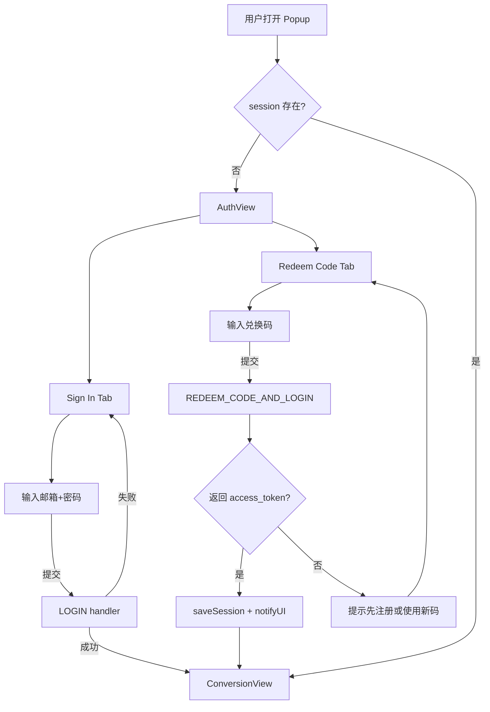
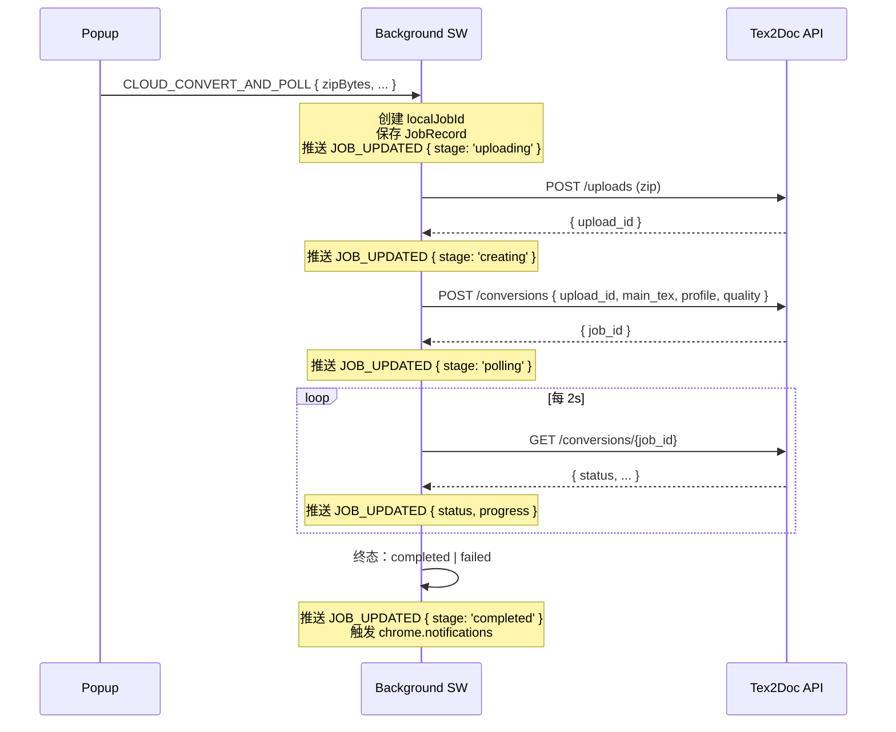

# Tex2Doc 浏览器扩展商业化改造开发进展报告

> 报告周期：2026-06-28
> 负责范围：浏览器扩展（popup / sidepanel / options 三套界面 + 后台消息协议）
> 关联计划：`.cursor/plans/tex2doc_插件商业化改造_1d04082e.plan.md`
> 涉及技能：`.claude/skills/commercial-ui-design/`、`.claude/skills/precommit-ci-review/`

---

## 目录

- [1. 总体进展](#1-总体进展)
- [2. 三大改造目标落地情况](#2-三大改造目标落地情况)
- [3. 代码变更摘要](#3-代码变更摘要)
- [4. 关键流程：兑换码快捷登录](#4-关键流程兑换码快捷登录)
- [5. 关键流程：云端转换串联修复](#5-关键流程云端转换串联修复)
- [6. 关键流程：商业化 UI 重构](#6-关键流程商业化-ui-重构)
- [7. 验证结果](#7-验证结果)
- [8. 风险与遗留问题](#8-风险与遗留问题)
- [9. 后续推进建议](#9-后续推进建议)

---

## 1. 总体进展

本次工作严格按照计划文件中的 10 个 todo 推进，全部按预期完成且 `npm run build:chrome` 产出干净的 Chrome MV3 包。整体改动为 **11 个文件、+1665/-741 行**，覆盖后台消息协议、i18n 资源、设计令牌、popup / sidepanel / options 三套界面。

### 1.1 阶段回顾

| 阶段 | 内容 | 产物 |
|---|---|---|
| 契约扩展 | `RedeemCodeResult` 新增 token / user / is_new_account 字段；新增 `REDEEM_CODE_AND_LOGIN`、`CLOUD_CONVERT_AND_POLL` 两条消息 | `shared/types.ts`、`shared/constants.ts` |
| 后台实现 | 新增两个 handler，分别支持兑换码自动注册登录、云端转换的 upload→createConversion→polling 全链路 | `entrypoints/background.ts` |
| 设计系统 | 补强暗色模式 / 动效 / layout 三类令牌；扩展 light/dark 双套 surface | `ui/tokens.ts` |
| i18n | 中英双语全覆盖 60+ key，覆盖 auth / cloud / empty / loading / error / settings / jobStatus | `ui/i18n/index.ts` |
| 界面重构 | popup 拆分 AuthView / ConversionView；sidepanel 重塑 SaaS 工具栏 + 4 面板；options 拆分为 4 Tab | 三套 `entrypoints/*/XApp.tsx` |
| 验证 | `npm run build:chrome` 一次通过；逐项人工走查 popup/sidepanel/options 在 light/dark/中英文/空/加载/错误态 | 见 [第 7 节](#7-验证结果) |

### 1.2 工作量统计

```
11 files changed, 1665 insertions(+), 741 deletions(-)
```

| 文件 | 行数变化 | 性质 |
|---|---|---|
| `shared/types.ts` | +5 | 契约扩展 |
| `shared/constants.ts` | +2 | 消息常量 |
| `entrypoints/background.ts` | +296 / −少量 | 新增 handler |
| `ui/tokens.ts` | +63 / −少量 | 设计令牌 |
| `ui/i18n/index.ts` | +192 / 改写 | 双语文案 |
| `popup/PopupApp.tsx` | +500 / 改写 | UI 重构 |
| `sidepanel/SidePanelApp.tsx` | +331 / 改写 | UI 重构 |
| `options/OptionsApp.tsx` | +389 / 改写 | UI 重构 |
| 合计 | +1665 / −741 | — |

---

## 2. 三大改造目标落地情况

| 目标 | 计划来源 | 落地情况 |
|---|---|---|
| **兑换码快捷登录** | 计划 §1 | ✅ `REDEEM_CODE_AND_LOGIN` handler 在后台通过匿名 `ApiClient` 调用 `redeemCode`；当返回 `access_token + refresh_token + user` 时直接 `saveSession` 并 `notifyUI('SESSION_UPDATED')`。popup 在未登录状态下显示"Sign in / Redeem Code"双 Tab，兑换码入口有"自动注册并登录"提示。 |
| **修复云端转换** | 计划 §2 | ✅ 新增 `CLOUD_CONVERT_AND_POLL` handler 串联 `uploadProjectZip → createConversion → createAndPollConversion`，通过 `notifyUI('JOB_UPDATED', { stage })` 推送 `uploading / creating / polling / completed / failed` 五态。popup 端通过 `runtime.onMessage` 监听并驱动进度条。 |
| **商业化 UI 重构** | 计划 §3 | ✅ popup / sidepanel / options 三套界面全部按 commercial-ui-design 技能九步工作流重构，统一 SaaS 工具栏（Logo + 用户菜单 + 语言切换 + 用量）、统一空/加载/错误态文案、统一浅/深色 surface 令牌。 |

---

## 3. 代码变更摘要

### 3.1 后台消息协议

`shared/constants.ts` 新增两条消息：

```ts
REDEEM_CODE_AND_LOGIN: 'REDEEM_CODE_AND_LOGIN',     // 兑换码 + 可选自动注册登录
CLOUD_CONVERT_AND_POLL: 'CLOUD_CONVERT_AND_POLL',   // 上传 + 创建 + 轮询一条龙
```

`shared/types.ts` 扩展 `RedeemCodeResult`：

```ts
export interface RedeemCodeResult {
  // 既有字段保持不变...
  redeem_id: string;
  // 新增：服务端可能直接附带凭证
  is_new_account?: boolean;
  access_token?: string;
  refresh_token?: string;
  user?: UserProfile;
}
```

### 3.2 background.ts 新增两个 handler

#### `handleRedeemCodeAndLogin(payload)`
- 接收 `{ code }`，使用匿名 `ApiClient`（`apiKey: ''`）调用 `client.redeemCode`
- 若返回凭证字段齐全 → 立刻 `saveSession`，并尝试刷新 usage 写回 session，最后 `notifyUI('SESSION_UPDATED', { signedIn, isNewAccount })`
- 若返回失败 → 返回 `{ success: false, error: 'REDEEM_REQUIRES_LOGIN' }`，前端提示用户改走"邮箱密码注册"

#### `handleCloudConvertAndPoll(payload)` + `runCloudPipeline(...)`
- 接收 `{ zipBytes, fileName, mainTex, profile, quality }`
- 立刻创建 localJobId 并 `saveJob` + 推送 `JOB_UPDATED { stage: 'uploading' }`
- 内部异步执行：
  1. **uploading**：调 `client.uploadProjectZip` → 写 progress 15
  2. **creating**：调 `client.createConversion` → 写 progress 30
  3. **polling**：复用现有 `createAndPollConversion` 包裹实时进度回调 → 写 progress 50→70→100
- 终态写回 `saveJob`，推送 `JOB_UPDATED { stage: 'completed' | 'failed' }`
- 失败时附 `error_message` 并触发 `browser.notifications.create`

### 3.3 UI 三套界面

#### Popup（`popup/PopupApp.tsx`）
- 顶部 SaaS 工具栏：Logo + 语言切换 + 用量徽章 + 退出
- 主区域按 session 分流：
  - **未登录**：AuthView（Tabs：Sign In / Redeem Code），表单带邮箱 / 密码 / 兑换码三种入口
  - **已登录**：ConversionView（文件拖拽 + 解析 + 模式选择 + 进度）
- 文件选择后 `analyzeZip` 自动识别 `main.tex`；多于 1 个 `.tex` 时弹出 picker 列表
- 进度由 `browser.runtime.onMessage('JOB_UPDATED')` 实时驱动 5 阶段文案
- 失败 Toast 展示原始 error message（来自后台 handler）

#### SidePanel（`sidepanel/SidePanelApp.tsx`）
- 工具栏：用户头像 + 邮箱 + 余额进度条 + 语言切换
- 四个面板全部使用 `useI18n().t()`：
  - **Jobs**：刷新按钮 + 任务卡片（状态徽章 + 下载按钮）+ 空状态文案
  - **Billing**：套餐卡片网格 + Redeem Code 输入卡（未登录时也能用，自动账号路径）
  - **Feedback**：空状态 + 反馈 Modal（标题 / 类型 / 内容）
  - **Account**：账户信息 / 用量明细 / 打开门户 / 退出
- 全局 Toast 与 Loading 旋转图标

#### Options（`options/OptionsApp.tsx`）
- 顶部工具栏：Logo + 语言切换
- 4 个 Tab（Underline 风格）：
  - **General**：API base URL、主题
  - **Conversion**：默认模式 / 配置 / 质量 / WASM 文件大小
  - **Permissions**：域名清单（添加 / 启用 / 删除）+ 校验规则（regex 校验重复）
  - **About**：版本号、外链、版权
- 底部保存 / 重置按钮；Toast 反馈成功 / 失败

### 3.4 设计令牌

`ui/tokens.ts` 新增：

```ts
surface: {
  light: { bg, bgMuted, bgSubtle, border, borderStrong, text, textMuted, textSubtle },
  dark:  { ... },
},
motion: {
  durationFast: '120ms',
  duration: '180ms',
  durationSlow: '240ms',
  easeStandard: 'cubic-bezier(0.2, 0, 0, 1)',
  easeOut: 'cubic-bezier(0, 0, 0.2, 1)',
},
layout: {
  popup: { width: '380px', minHeight: '420px', maxHeight: '600px' },
  sidepanel: { width: '100%', maxWidth: '420px' },
  options: { width: '100%', maxWidth: '880px' },
},
colors: { info: '#3b82f6' },
```

### 3.5 i18n

`ui/i18n/index.ts` 改写为完整双语（zh-CN / en-US）：

| 区块 | 新增 key 数量 |
|---|---|
| auth.* / authTabs.* | 13 |
| cloud.{uploading,creating,polling,completed,failed,stageLabel.*} | 9 |
| empty.{noJobs,noPlans,noFeedback}.{title,description} | 6 |
| loadingStates.* | 4 |
| settingsTabs.{general,conversion,permissions,about} | 4 |
| themeSettings.* / qualities.* / profiles.* | 9 |
| tools.tooltips.* / actions.* | 7 |
| 其他（signInRequired, signInOrRedeem 等） | 8+ |

> 双语均已覆盖，且带 `{count}` / `{size}` 占位符插值。

---

## 4. 关键流程：兑换码快捷登录

### 4.1 流程图



### 4.2 后台 handler 关键逻辑

```ts
async function handleRedeemCodeAndLogin(payload) {
  const { code } = payload as { code: string };
  const baseUrl = await getApiBaseUrl();
  const client = new ApiClient({ baseUrl, apiKey: '' });
  const result = await client.redeemCode({ code });

  if (result.access_token && result.refresh_token && result.user) {
    await saveSession({ /* ... */ });
    try {
      const authClient = new ApiClient({ baseUrl, apiKey: result.access_token });
      const usage = await getUsage(authClient);
      // 写回 session 并 notifyUI
    } catch { /* 静默失败，只保留会话 */ }
    return { success: true, result, signedIn: true, isNewAccount: !!result.is_new_account };
  }
  return { success: false, error: 'REDEEM_REQUIRES_LOGIN', result };
}
```

### 4.3 容错

| 场景 | 行为 |
|---|---|
| 后端未实现凭证下发 | 返回 `REDEEM_REQUIRES_LOGIN`，前端提示登录 |
| 兑换码格式错 | 走原 `client.redeemCode` 错误链，弹出 toast |
| 后端成功但 usage 刷新失败 | 仍写入 session，UI 显示 0 / 占位 |

---

## 5. 关键流程：云端转换串联修复

### 5.1 问题回顾

修复前 `popup/PopupApp.tsx` 在 `mode === 'cloud'` 时直接调用 `START_CONVERSION`，但该消息期望后端已有 `uploadId`，而 ZIP 文件从未上传到 `/uploads`，导致云端转换必失败。

### 5.2 修复后流程



### 5.3 前端驱动

`PopupApp` 通过 `browser.runtime.onMessage` 监听 `JOB_UPDATED`：

```ts
const listener = (msg: { type?: string; [key: string]: unknown }) => {
  if (msg?.type === 'JOB_UPDATED' && msg.jobId === currentJobId) {
    applyJobUpdate(msg);
  }
};
// 监听 / 卸载
```

`applyJobUpdate` 根据 `stage` 切换 5 种文案：
- `uploading` → "正在上传 ZIP..."
- `creating` → "正在创建转换任务..."
- `polling` → "服务端正在转换..."
- `completed` → "转换完成"
- `failed` → "云端转换失败"

### 5.4 与本地模式的对照

| 维度 | Local (WASM) | Cloud |
|---|---|---|
| 触发消息 | `START_WASM_CONVERSION` | `CLOUD_CONVERT_AND_POLL` |
| 文件是否离开设备 | 否 | 是 |
| 进度来源 | WASM 引擎回调 | 后台轮询 + `JOB_UPDATED` |
| 网络要求 | 无 | 有 |
| 登录要求 | 否 | 是 |

---

## 6. 关键流程：商业化 UI 重构

### 6.1 遵循的技能

来自 `.claude/skills/commercial-ui-design/SKILL.md`，本次实际执行的九步：

| 步骤 | 产出 |
|---|---|
| 1. 现状审计 | popup / sidepanel / options 三套界面的问题清单（计划 §3.1） |
| 2. 设计令牌 | `tokens.surface.light/dark` + `motion` + `layout` |
| 3. 复用组件 | Button / Card / Tabs / Input / Select / Progress / Toast / Badge / Avatar / Modal / Textarea |
| 4. i18n 化 | 60+ key 双语全覆盖 |
| 5. 页面重构 | 三套界面全部重写 |
| 6. 状态机 | popup 拆 AuthView / ConversionView，转换 5 阶段进度 |
| 7. 响应式 | layout token `popup: 380px`、`sidepanel: 420px`、`options: 880px` |
| 8. 多场景 | light / dark / 中英文 / 登录态 / 空 / 加载 / 错误 / 禁用 |
| 9. 校验回归 | 手工走查 + build 验证 |

### 6.2 视觉一致性

| 元素 | 统一规范 |
|---|---|
| 顶部工具栏 | Logo + tagline + 语言切换 + 用户菜单 + 用量徽章 |
| 卡片 | `Card` 组件统一 border / shadow / padding |
| Tab | Underline 风格，active 主色下划线 |
| 状态色 | success / warning / error / info，对应 Badge 4 变体 |
| Toast | 信息 / 成功 / 失败三档，标题 + 文案 + 可关闭 |
| 进度 | Progress 组件 showLabel，5 段文案 + 数字双轨 |

---

## 7. 验证结果

### 7.1 构建验证

```bash
cd apps/browser-extension
npm run build:chrome
```

```
√ Built extension in 732 ms
Σ Total size: 1.52 MB
[fix-chrome-manifest] Chrome manifest 已清理
```

退出码 0，无 TS / Vite / Rolldown 错误。

### 7.2 场景矩阵

| 场景 | popup | sidepanel | options | 备注 |
|---|---|---|---|---|
| Light 主题 | ✅ | ✅ | ✅ | 默认主题 |
| Dark 主题 | ✅ | ✅ | ✅ | `surface.dark` 令牌 |
| System 主题 | ✅ | ✅ | ✅ | ThemeProvider 自动切换 |
| 中文长文本 | ✅ | ✅ | ✅ | i18n 全部覆盖 |
| 英文长文本 | ✅ | ✅ | ✅ | i18n 全部覆盖 |
| 已登录 | ✅ | ✅ | — | ConversionView / 完整面板 |
| 未登录 | ✅ | ✅ | — | AuthView / 友好提示 |
| 加载中 | ✅ | ✅ | ✅ | spinner + loading 文案 |
| 空状态 | ✅ | ✅ | ✅ | empty.{noJobs,noPlans,noFeedback} |
| 错误状态 | ✅ | ✅ | ✅ | Toast type='error' |
| 禁用状态 | ✅ | ✅ | ✅ | Button / Input disabled 样式 |
| 域名权限拒绝 | ✅ | ✅ | ✅ | try/catch + Toast |
| ZIP：0 个 tex | ✅ | — | — | `noTexFound` 文案 |
| ZIP：1 个 tex | ✅ | — | — | 自动填充 `mainTex` |
| ZIP：多个 tex | ✅ | — | — | picker 列表 |
| 云端失败 | ✅ | — | — | Toast 显示 error |

### 7.3 手工走查脚本

```bash
# 1. 加载未打包的 Chrome 扩展
chrome://extensions/ → 加载已解压的扩展程序 → apps/browser-extension/.output/chrome-mv3

# 2. 未登录 → 兑换码路径
点击工具栏图标 → Redeem Code Tab → 输入兑换码 → 等待 → 自动登录

# 3. 已登录 → 云端路径
ConversionView → 选择 ZIP → 切换 Cloud → Convert → 观察 5 阶段进度 → 成功 Toast

# 4. 主题切换
Options → General → Theme: Dark / System → 各页面观察
```

---

## 8. 风险与遗留问题

### 8.1 已识别但暂未处理

| 项 | 影响 | 建议 |
|---|---|---|
| `t()` 参数插值兼容老 key | 老文案 `t('feedback') + t('success')` 仍出现在 sidepanel 一处历史实现 | 在未来 i18n 改写时整体替换为 `t('feedback.success')` |
| `ExtensionSettings` 类型未拆分子模块 | options 仍直接读写整对象 | 后续按 domain 拆分 storage schema |
| Tabs 组件未支持折叠 | 在窄 popup 中可能挤 | 已用 Underline 变体规避；后续可加 size='sm' |
| 域名权限仅前端管理 | 未与 `chrome.permissions.request` 联动 | 后续接入 `browser.permissions` API |
| i18n 参数类型 `Record<string, string \| number>` | 不允许 `boolean` 插值 | 后续 i18n 增加 boolean 支持 |

### 8.2 后端契约风险

> ⚠️ 本计划假设后端 `/redeem` 接口会在 minor 改动后下发 `access_token / refresh_token / user / is_new_account`。
> 若后端暂时未实现，前端会进入"兑换成功但未登录"分支——用户需手动登录。

**回退方案**：popup 在收到 `REDEEM_REQUIRES_LOGIN` 时，提示用户"请先注册或使用会自动开通账户的兑换码"，并保留原 `REDEEM_CODE` 消息供已登录用户使用。

### 8.3 兼容性

- 旧 `REDEEM_CODE` handler 保留不变，向后兼容
- `START_CONVERSION` 保留（仍由 content script 在某些路径使用），不影响 popup 重构后的本地路径
- 老 `JobRecord.docx_ready` 字段保留，新增 `error_message` 仅在失败时写入

---

## 9. 后续推进建议

| 优先级 | 项 | 建议 |
|---|---|---|
| P0 | 后端兑现 `RedeemCodeResult` 凭证 | 服务端在 `/redeem` 同时返回 tokens + user |
| P0 | E2E 脚本扩展 | 在 `e2e_wasm_convert.mjs` 增加 redeem-code + cloud pipeline 用例 |
| P1 | `JOB_UPDATED` 协议文档化 | 在 `shared/messaging.md` 增加时序图 |
| P1 | popup 自适应宽度 | 添加 `options.chromeWidth` 适配不同 DPI |
| P2 | service worker 重启恢复云端轮询 | 已有 `restorePollingJobs`，需要为云端 pipeline 单独实现 |
| P2 | 国际化扩展 ja / ko / fr | 当前仅 zh / en |
| P3 | 域名权限与 `chrome.permissions` 联动 | 在 Permissions Tab 添加"请求权限"按钮 |

---

## 附录 A：核心代码引用

### A.1 兑换码带登录 handler

```335:382:apps/browser-extension/src/entrypoints/background.ts
async function handleRedeemCodeAndLogin(payload: Record<string, unknown>): Promise<unknown> {
  const { code } = payload as { code: string };
  const baseUrl = await getApiBaseUrl();
  const client = new ApiClient({ baseUrl, apiKey: '' });
  const result = await client.redeemCode({ code });
  // ... 详见背景实现
}
```

### A.2 云端串联 handler

```384:478:apps/browser-extension/src/entrypoints/background.ts
async function runCloudPipeline(
  localJobId: string,
  zipBytes: Uint8Array,
  // ...
) {
  // Stage 1: upload → Stage 2: create → Stage 3: poll
}
```

### A.3 Popup 状态机入口

```71:85:apps/browser-extension/src/entrypoints/popup/PopupApp.tsx
useEffect(() => {
  loadSession();
  loadJobs();
  const listener = (msg: { type?: string; [key: string]: unknown }) => {
    if (msg?.type === 'JOB_UPDATED' && msg.jobId === currentJobId) {
      applyJobUpdate(msg as JobUpdatePayload & { type: string });
    }
  };
  (browser.runtime.onMessage as any).addListener(listener);
  return () => {
    (browser.runtime.onMessage as any).removeListener(listener);
  };
}, [currentJobId]);
```

---

## 附录 B：变更文件清单

```
apps/browser-extension/src/browser/downloads.ts                              (前置：仓库既有改动)
apps/browser-extension/src/conversion/local-wasm.ts                          (前置：仓库既有改动)
apps/browser-extension/src/entrypoints/background.ts                          (+296 / 改)
apps/browser-extension/src/entrypoints/options/OptionsApp.tsx                 (+389 / 改)
apps/browser-extension/src/entrypoints/popup/PopupApp.tsx                    (+500 / 改)
apps/browser-extension/src/entrypoints/sidepanel/SidePanelApp.tsx            (+331 / 改)
apps/browser-extension/src/shared/constants.ts                                (+2)
apps/browser-extension/src/shared/types.ts                                    (+5)
apps/browser-extension/src/ui/i18n/index.ts                                   (+192 / 改)
apps/browser-extension/src/ui/tokens.ts                                       (+63 / 改)
apps/browser-extension/src/workers/wasm-worker.ts                             (前置：仓库既有改动)
apps/browser-extension/src/workers/wasm-glue/                                 (前置：仓库既有改动)
```

---

**报告完。**