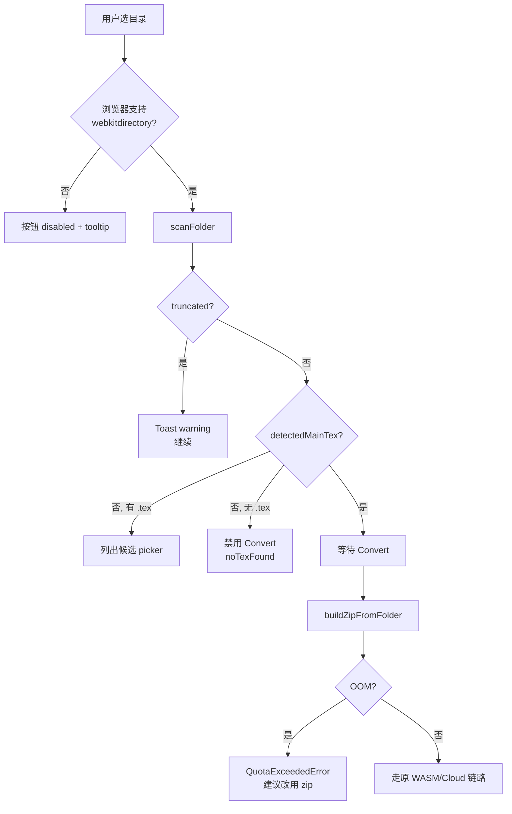

# Tex2Doc 浏览器扩展：文件夹直传技术方案

> 方案日期：2026-06-28
> 关联计划：`.cursor/plans/tex2doc_插件商业化改造_1d04082e.plan.md`
> 关联进展：`.docs-zh/extension/Tex2Doc-浏览器插件商业化改造开发进展报告-20260628.md`（§10.2 批次 B）
> 负责范围：popup 端文件选择 + 浏览器原生目录访问能力 + 后台消息协议 + 本地 / 云端转换链路复用
> 关联技能：`.claude/skills/commercial-ui-design/`

---

## 目录

- [1. 背景与目标](#1-背景与目标)
- [2. 现状审计](#2-现状审计)
- [3. 关键技术选型](#3-关键技术选型)
- [4. 总体架构](#4-总体架构)
- [5. 客户端：目录读取与内存打包](#5-客户端目录读取与内存打包)
- [6. Popup UI 改造](#6-popup-ui-改造)
- [7. 消息协议扩展](#7-消息协议扩展)
- [8. 后台 handler 复用策略](#8-后台-handler-复用策略)
- [9. WASM 与云端链路兼容](#9-wasm-与云端链路兼容)
- [10. 边界场景与降级策略](#10-边界场景与降级策略)
- [11. i18n 文案](#11-i18n-文案)
- [12. 权限与商店审核](#12-权限与商店审核)
- [13. 隐私 / 合规 / 可观测性](#13-隐私--合规--可观测性)
- [14. 实施拆分（Story 卡片）](#14-实施拆分story-卡片)
- [15. 验证方案](#15-验证方案)
- [16. 风险与缓解](#16-风险与缓解)
- [17. 不在本方案范围](#17-不在本方案范围)
- [附录 A：核心代码改动预览](#附录-a核心代码改动预览)
- [附录 B：文件清单](#附录-b文件清单)
- [附录 C：浏览器兼容性矩阵](#附录-c浏览器兼容性矩阵)

---

## 1. 背景与目标

### 1.1 用户痛点

| 现状 | 用户感受 |
|---|---|
| 仅支持 `<input type="file" accept=".zip">` 单文件选择 | 必须先用 Overleaf "Download as ZIP" 或本地 `zip -r` 打包 |
| 大项目含大量图片 / bib / cls 时，压缩 / 解压耗时长 | 论文 / 教材场景（> 50 MB）首字节延迟显著 |
| ZIP 内部若少打了某文件，需重新打包 | 反复试错的成本高 |
| 误把编译产物（`.aux` / `.log` / `.out`）打进 ZIP 时引擎仍需二次过滤 | 文件越多越慢 |

### 1.2 业务目标

| ID | 目标 | 度量 |
|---|---|---|
| **G1** | 让用户在 popup 里直接选择本地 LaTeX 项目文件夹，无需手动打包 | 取消"压缩 → 上传 → 解压"中的前两步；`selectFolder → convert` ≤ 3 次点击 |
| **G2** | 转换引擎（WASM / 云端）收到的仍是 ZIP 字节流，零侵入 | 后台 handler 与 WASM 引擎**完全不改签名**，仅在客户端前置打包 |
| **G3** | 在浏览器权限允许的范围内实现，跨 Chrome / Edge / Firefox 兼容 | `webkitdirectory` + `showDirectoryPicker` 双轨实现，二者择一即可 |
| **G4** | 不破坏现有 ZIP 路径，ZIP 选择仍是默认入口 | 文件夹选择作为次级入口（"Or select folder"） |
| **G5** | 大文件夹（> 50 MB / > 1000 文件）不能阻塞 UI，且要有明确进度 | 客户端打包阶段推送"扫描中 / 读取中 / 打包中"三段进度 |

### 1.3 非目标

- **不**做服务端直传（用户设备上已完成内存打包后再走原 `uploadProjectZip`）
- **不**实现增量上传 / 断点续传（依赖既有 SW 恢复机制即可）
- **不**做目录深度可视化 / 树形浏览（保持 popup 紧凑布局，仅在出错时展开文件名）
- **不**改动 WASM 引擎或云端后端

---

## 2. 现状审计

### 2.1 现有 ZIP 路径

```27:44:apps/browser-extension/src/entrypoints/popup/PopupApp.tsx
type ConversionMode = 'local' | 'cloud';
type ConversionStage = 'idle' | 'uploading' | 'creating' | 'polling' | 'completed' | 'failed';
```

```58:78:apps/browser-extension/src/entrypoints/popup/PopupApp.tsx
const [selectedFile, setSelectedFile] = useState<File | null>(null);
const [mainTex, setMainTex] = useState('main.tex');
// ...
const [zipAnalysis, setZipAnalysis] = useState<ZipAnalysis | null>(null);
const [isAnalyzingZip, setIsAnalyzingZip] = useState(false);
const [zipError, setZipError] = useState<string | null>(null);
```

```446:464:apps/browser-extension/src/entrypoints/popup/PopupApp.tsx
<input type="file" accept=".zip" onChange={handleFileSelect} className="hidden" id="file-input" />
<label htmlFor="file-input" className="cursor-pointer block">
  {selectedFile ? (
    <div className="text-sm">
      <p className="font-medium text-gray-900 dark:text-white">{selectedFile.name}</p>
      ...
    </div>
  ) : (
    <div className="text-gray-500 dark:text-gray-400 text-sm">
      ...drop zone...
      <p>{t('selectZipHint')}</p>
    </div>
  )}
</label>
```

`handleFileSelect` 读取 `file.arrayBuffer()` → `analyzeZip(zipBytes)` → 自动识别 `main.tex`：

```213:251:apps/browser-extension/src/entrypoints/popup/PopupApp.tsx
const handleFileSelect = async (e: React.ChangeEvent<HTMLInputElement>) => {
  const file = e.target.files?.[0];
  if (file) {
    setSelectedFile(file);
    setZipError(null);
    ...
    if (file.name.toLowerCase().endsWith('.zip')) {
      setIsAnalyzingZip(true);
      try {
        const arrayBuffer = await file.arrayBuffer();
        const zipBytes = new Uint8Array(arrayBuffer);
        const analysis = await analyzeZip(zipBytes);
        ...
```

转换时把 `zipBytes: Array.from(zipBytes)` 传给 background：

```274:302:apps/browser-extension/src/entrypoints/popup/PopupApp.tsx
const result = await sendToBackground({
  type: MESSAGE_TYPES.START_WASM_CONVERSION,
  zipBytes: Array.from(zipBytes),
  fileName: selectedFile.name,
  mainTex,
});
// ...
const result = await sendToBackground({
  type: MESSAGE_TYPES.CLOUD_CONVERT_AND_POLL,
  zipBytes: Array.from(zipBytes),
  fileName: selectedFile.name,
  mainTex, profile, quality,
});
```

### 2.2 现有 ZIP 分析能力

`analyzeZip` 在客户端已能识别 `.tex` 文件并按优先级猜测 `main.tex`：

| 优先级 | 规则 | 来源 |
|---|---|---|
| 1 | 文件名匹配 `main.tex` / `main-page.tex` / `paper.tex` / `article.tex` / `thesis.tex` | `local-wasm.ts:detectMainTex` |
| 2 | 浅层目录（depth ≤ 1）中含 `\documentclass` 的 `.tex` | 同上 |
| 3 | 文件名最短 | 同上 |
| 4 | 字典序最前 | 同上 |

**关键发现**：分析能力在 `analyzeZip(zipBytes: Uint8Array)` 上是纯函数，输入是 ZIP 字节流。这意味着**只要把目录也构造成 ZIP 字节流，整个分析链路无需任何修改**。

### 2.3 后台 handler 接口稳定

| Handler | 入参 | 出参 | 修改成本 |
|---|---|---|---|
| `handleStartWasmConversion` | `{ zipBytes, fileName, mainTex }` | `{ success, error?, errorType?, trace?, debug? }` | **零** |
| `handleCloudConvertAndPoll` | `{ zipBytes, fileName, mainTex, profile, quality }` | `{ success, jobId?, error? }` | **零** |
| `runCloudPipeline` | `(localJobId, zipBytes: Uint8Array, fileName, mainTex, profile, quality, baseUrl, accessToken)` | `Promise<void>` + `notifyUI('JOB_UPDATED')` | **零** |

### 2.4 现有权限矩阵

```78:80:apps/browser-extension/wxt.config.ts
permissions: ['storage', 'downloads', 'contextMenus', 'notifications', 'alarms']
host_permissions: ['https://api.tex2doc.cn/*']
optional_host_permissions: ['https://www.overleaf.com/*', 'https://arxiv.org/*']
```

无 `filesystem` / `fileSystem.directory` / `tabs` 等额外权限。本方案**不需要新增权限**，依赖既有 web API 即可。

### 2.5 现有 i18n 体系

`apps/browser-extension/src/ui/i18n/index.ts` 已支持 `zh-CN` / `en-US` 双语，`useI18n().t(key, params?)` 支持占位符插值（如 `{count}` / `{size}`）。新增 key 仅需补双份文案。

---

## 3. 关键技术选型

### 3.1 目录访问方案对比

| 方案 | API | 兼容性 | 用户体验 | 权限 |
|---|---|---|---|---|
| **A. `<input webkitdirectory>`** | HTML 原生 | Chrome / Edge 全支持；Firefox 69+；Safari 16+ | 点击"Select Folder"按钮 → 系统文件选择器以"目录模式"打开 | **零权限** |
| **B. `window.showDirectoryPicker()`** | File System Access API | Chrome / Edge 全支持；**Firefox 不支持**；Safari 不支持 | 需 JS 调用，弹"选取目录"对话框，可编程遍历 | 需用户每次授权（无持久） |
| **C. `<input multiple webkitdirectory>`** | HTML 原生 | 同 A | 同 A，但支持多选 | 同 A |

**结论**：
- **A 作为默认路径**：兼容全部目标浏览器，零权限，零风险
- **B 作为可选增强**：在 Chrome / Edge 上提供更好的错误反馈（可捕获 `AbortError` / `NotAllowedError`），并保留 `FileSystemDirectoryHandle` 句柄便于将来"持续授权"扩展
- **C 不采用**：本场景一次只需要一个目录

### 3.2 内存 ZIP 打包方案

| 方案 | 库大小 | 性能 | API 复杂度 |
|---|---|---|---|
| **A. JSZip** | ~ 100 KB gzip | 中（同步 API） | 简单 |
| **B. fflate** | ~ 22 KB gzip | 高（同步 / 异步双 API） | 中 |
| **C. 自实现 ZIP 写入** | 0 KB | 最高（仅支持 STORE / DEFLATE） | 高 |
| **D. 不打包，直接遍历 `FileSystemDirectoryHandle` 给 WASM** | 0 KB | 最高 | **需 WASM 引擎重构** |

**结论**：
- **首选 fflate**：包体积小，API 简单，且提供 `Zip` 同步 API 便于在 SW / worker 中使用
- **JSZip 作为 fallback**：在 fflate 不可用时启用
- **不**直接改 WASM 引擎：违反 G2（零侵入）

### 3.3 流式读取策略

大目录（> 100 MB）一次性读全部 `File` 到内存会爆 OOM。策略：

1. **遍历阶段**（同步）：仅记录 `{ path, size }`，不读字节；累计字节数与文件数
2. **读取阶段**（异步 + 流式）：用 `requestIdleCallback` / `setTimeout(0)` 让出主线程，每读完 N 个文件让出一次
3. **打包阶段**：fflate `Zip` API 接收 `{ [path]: Uint8Array }`，一次性产出 ZIP 字节流
4. **进度推送**：通过 `MessageChannel` 把进度推给 popup（避免依赖 background 的 `notifyUI`）

### 3.4 自动识别 `main.tex` 的扩展

`analyzeZip` 已能识别 ZIP 内的 `.tex`。本方案额外暴露：

| 能力 | 实现 |
|---|---|
| 排除 `node_modules` / `.git` / `dist` / `build` / `.aux` / `.log` / `.out` / `.toc` / `.bbl` / `.synctex.gz` 等编译产物 | 客户端 `shouldExclude(path)` 白名单 |
| 多 `main.tex` 候选时优先级（沿用 §2.2） | 直接复用 `detectMainTex` 逻辑；目录版 `detectMainTexFromList(texPaths)` |
| 子目录深度限制（防止超深 `node_modules`） | 默认 `MAX_DEPTH = 8`，可配置 |

---

## 4. 总体架构

```mermaid
flowchart LR
    subgraph Popup["Popup (UI)"]
      A[File picker] --> B[selectedFile = File]
      C[Folder picker<br/>webkitdirectory] --> D[FolderEntry list]
      B --> E[analyzeZip<br/>detectMainTex]
      D --> F[scanFolder<br/>detectMainTexFromList]
      E & F --> G[ConversionView<br/>模式选择 + 进度]
    end

    subgraph Background["Background SW"]
      G -->|START_WASM_CONVERSION<br/>或 CLOUD_CONVERT_AND_POLL| H[handler 接收<br/>zipBytes: number[]]
      H --> I[WASM 引擎<br/>或 cloud pipeline]
    end

    subgraph Worker["可选: Offscreen Worker"]
      F -.->|大批量时| J[scanFolderWorker<br/>fflate 打包]
      J -->|zipBytes| G
    end
```

### 4.1 数据流

1. 用户在 popup 点击 **"Select Folder"**（`<input webkitdirectory>` 触发）
2. 浏览器弹出系统目录选择器；用户选定后 `e.target.files` 是 `FileList`，每个 `File.webkitRelativePath` 含完整相对路径
3. popup 调 `scanFolder(files)` → 构造 `FolderEntry[]`
4. 调 `analyzeFolderEntries(entries)` → 复用 `detectMainTex` 逻辑找 `main.tex`
5. 调 `buildZipFromFolder(entries, onProgress)` → 产出 `Uint8Array`
6. 与 ZIP 路径**完全相同**：把 `zipBytes: Array.from(zipBytes)` 发给 `MESSAGE_TYPES.START_WASM_CONVERSION` 或 `MESSAGE_TYPES.CLOUD_CONVERT_AND_POLL`

### 4.2 不变式

| 不变式 | 保证手段 |
|---|---|
| 后台 handler 与 WASM 引擎**零改动** | 客户端构造出的就是标准 ZIP 字节流 |
| 现有 ZIP 路径**完全保留** | popup 仍以 `<input type="file" accept=".zip">` 为首选入口，文件夹为次选 |
| `main.tex` 识别逻辑**统一** | 新增 `detectMainTexFromList(texPaths: string[])`，内部委托给原有规则表 |
| 进度推送**复用 `JOB_UPDATED`** | 客户端打包阶段不通过 `notifyUI`，只在打包完成 / 失败时切换 `ConversionState.stage`；转换阶段由 SW 推送 `JOB_UPDATED` |

---

## 5. 客户端：目录读取与内存打包

### 5.1 新增模块

| 模块 | 路径 | 职责 |
|---|---|---|
| `FolderEntry` 类型 | `src/conversion/folder-types.ts` | `{ path, size, file }` 三元组 |
| `shouldExclude` | 同上 | 编译产物 / VCS / 依赖目录白名单 |
| `scanFolder` | `src/conversion/folder-scanner.ts` | `FileList` → `FolderEntry[]`（同步过滤 + 累计大小） |
| `detectMainTexFromList` | 同上 | `string[]` → `string \| null`（委托给原 `detectMainTex` 规则） |
| `analyzeFolderEntries` | 同上 | `FolderEntry[]` → `{ texFiles, detectedMainTex, excludedCount, totalSize }` |
| `buildZipFromFolder` | `src/conversion/folder-packager.ts` | `FolderEntry[]` → `Uint8Array`（fflate，async，带 progress 回调） |
| `MAX_DEPTH` / `MAX_FILE_COUNT` / `MAX_TOTAL_SIZE` | `src/shared/constants.ts` | 客户端限制常量 |

### 5.2 过滤白名单

```ts
// src/conversion/folder-types.ts（伪代码示意）
const EXCLUDED_DIR_NAMES = new Set([
  'node_modules', '.git', '.svn', '.hg',
  'dist', 'build', 'out', 'target', '.next', '.cache',
  '__pycache__', '.venv', 'venv',
]);

const EXCLUDED_FILE_EXTENSIONS = new Set([
  '.aux', '.log', '.out', '.toc', '.bbl', '.bcf', '.blg',
  '.synctex.gz', '.fls', '.fdb_latexmk', '.nav', '.snm', '.vrb',
  '.run.xml', '.synctex', '.xdv', '.pdf',
]);

const COMPILED_OUTPUT_FILES = new Set([
  '.DS_Store', 'Thumbs.db', '.vscode', '.idea',
]);

function shouldExclude(relativePath: string): boolean {
  const parts = relativePath.split('/');
  if (parts.length > MAX_DEPTH) return true;
  for (const seg of parts) {
    if (EXCLUDED_DIR_NAMES.has(seg)) return true;
  }
  const name = parts[parts.length - 1];
  if (COMPILED_OUTPUT_FILES.has(name)) return true;
  const dot = name.lastIndexOf('.');
  if (dot >= 0) {
    const ext = name.slice(dot).toLowerCase();
    // 同时排除 .gz 后缀二次检查（.synctex.gz）
    if (EXCLUDED_FILE_EXTENSIONS.has(ext)) return true;
    if (ext === '.gz' && dot > 0) {
      const inner = name.slice(0, dot).toLowerCase();
      if (EXCLUDED_FILE_EXTENSIONS.has(inner + '.gz')) return true;
    }
  }
  return false;
}
```

### 5.3 `scanFolder` 签名

```ts
export interface FolderEntry {
  /** POSIX 风格相对路径，如 "chapters/intro.tex" */
  path: string;
  /** 文件原始大小（未压缩） */
  size: number;
  /** 浏览器 File 对象（仅在 popup 内可用） */
  file: File;
}

export interface ScanResult {
  entries: FolderEntry[];
  texFiles: Array<{ path: string; size: number }>;
  detectedMainTex: string | null;
  excludedCount: number;
  totalSize: number;
  truncated: boolean;
}

export async function scanFolder(
  files: FileList,
  options?: { onProgress?: (scanned: number, total: number) => void },
): Promise<ScanResult>;

export function detectMainTexFromList(texPaths: string[]): string | null;
```

实现要点：

- `webkitRelativePath` 在 Chrome / Firefox 中是 `子目录/文件名`；在 Safari 16+ 中相同
- 进度回调每 200 个文件触发一次，避免 `setState` 风暴
- 若文件数超过 `MAX_FILE_COUNT = 5000` 或累计超过 `MAX_TOTAL_SIZE = 100 MB`，设置 `truncated = true` 并返回已扫描部分；UI 提示"项目过大，已截断"

### 5.4 `buildZipFromFolder` 签名

```ts
export interface PackagerOptions {
  onProgress?: (phase: 'reading' | 'packing', current: number, total: number) => void;
  /** 压缩等级 0-9；默认 6（DEFLATE 平衡） */
  level?: 0 | 1 | 2 | 3 | 4 | 5 | 6 | 7 | 8 | 9;
  signal?: AbortSignal;
}

export async function buildZipFromFolder(
  entries: FolderEntry[],
  options?: PackagerOptions,
): Promise<Uint8Array>;
```

实现要点：

```ts
import { Zip } from 'fflate';

export async function buildZipFromFolder(
  entries: FolderEntry[],
  options: PackagerOptions = {},
): Promise<Uint8Array> {
  const { onProgress, level = 6, signal } = options;
  const filesMap: Record<string, Uint8Array> = {};

  // Phase 1: 流式读取
  for (let i = 0; i < entries.length; i++) {
    if (signal?.aborted) throw new DOMException('Aborted', 'AbortError');
    const buf = await entries[i].file.arrayBuffer();
    filesMap[entries[i].path] = new Uint8Array(buf);
    if (onProgress && i % 50 === 0) {
      onProgress('reading', i + 1, entries.length);
      // 让出主线程
      await new Promise((r) => setTimeout(r, 0));
    }
  }

  // Phase 2: fflate 打包（同步但在 Worker 里可卸载）
  return new Promise((resolve, reject) => {
    const chunks: Uint8Array[] = [];
    const zip = new Zip(async (err, data, final) => {
      if (err) { reject(err); return; }
      if (data) chunks.push(data);
      if (final) {
        const total = chunks.reduce((s, c) => s + c.byteLength, 0);
        const out = new Uint8Array(total);
        let off = 0;
        for (const c of chunks) { out.set(c, off); off += c.byteLength; }
        resolve(out);
      }
    });
    zip.add(filesMap);
    zip.end();
  });
}
```

### 5.5 大文件 Offscreen 卸载（可选增强）

当 `entries.length > 500` 或 `totalSize > 20 MB` 时，把打包任务卸载到 Offscreen Worker：

```ts
// src/workers/folder-packager.worker.ts
import { Zip } from 'fflate';

self.addEventListener('message', async (e: MessageEvent) => {
  const { id, entries } = e.data;
  try {
    const filesMap: Record<string, Uint8Array> = {};
    for (let i = 0; i < entries.length; i++) {
      const buf = await entries[i].file.arrayBuffer();
      filesMap[entries[i].path] = new Uint8Array(buf);
      self.postMessage({ id, type: 'progress', current: i + 1, total: entries.length });
    }
    // ... fflate 同步打包 ...
    self.postMessage({ id, type: 'done', zipBytes }, [zipBytes.buffer]);
  } catch (err) {
    self.postMessage({ id, type: 'error', error: err.message });
  }
});
```

**注意**：Offscreen Worker 在 MV3 SW 中存在，需要 popup 通过 `chrome.runtime.sendMessage` 二次转发。本期先不引入，避免增加复杂度。

---

## 6. Popup UI 改造

### 6.1 改造范围

| 文件 | 改造点 |
|---|---|
| `apps/browser-extension/src/entrypoints/popup/PopupApp.tsx` | 新增"Select Folder"次级按钮 + drag-drop 区扩展 + `analyzeFolderEntries` + 新增 `FolderSource` 状态 |
| `apps/browser-extension/src/ui/components/index.ts` | **无需新增组件**，复用 Card / Button / Progress / Toast |
| `apps/browser-extension/src/ui/i18n/index.ts` | 新增 `selectFolder` / `selectFolderHint` / `folderDetected` / `folderFileCount` 等 12 个 key |

### 6.2 状态机扩展

```ts
type FolderSource = { kind: 'zip'; file: File } | { kind: 'folder'; entries: FolderEntry[] };

interface ConversionState {
  stage: ConversionStage;
  progress: number;
  message: string;
  /** 客户端打包阶段（folder 模式）独立推进 */
  packaging?: {
    phase: 'reading' | 'packing';
    current: number;
    total: number;
  };
  error?: string;
}
```

### 6.3 UI 草案

```
┌────────────────────────────────────────┐
│ ┌────────────────────────────────────┐ │
│ │   [Drop a .zip file here]          │ │   现有 ZIP drop zone
│ │   or click to browse               │ │
│ └────────────────────────────────────┘ │
│            ── or ──                    │
│ ┌────────────────────────────────────┐ │
│ │   📁  Select Folder                │ │   新增"Select Folder"
│ │   Convert without zipping          │ │
│ └────────────────────────────────────┘ │
└────────────────────────────────────────┘
```

拖拽区扩展：

```
<input
  type="file"
  accept=".zip"
  webkitdirectory=""
  directory=""
  multiple
  onChange={handleSourceSelect}
  className="hidden"
  id="source-input"
/>
```

`handleSourceSelect` 统一处理：

```ts
const handleSourceSelect = async (e: React.ChangeEvent<HTMLInputElement>) => {
  const files = e.target.files;
  if (!files || files.length === 0) return;
  resetConversion();

  // 全部是 .zip → ZIP 模式
  const firstZip = Array.from(files).find((f) => f.name.toLowerCase().endsWith('.zip'));
  if (files.length === 1 && firstZip) {
    setSelectedSource({ kind: 'zip', file: firstZip });
    // ... 走原 handleFileSelect 逻辑
    return;
  }

  // 多个文件 → 文件夹模式
  setSelectedSource({ kind: 'folder', entries: [] });
  setIsScanningFolder(true);
  try {
    const scan = await scanFolder(files);
    setSelectedSource({ kind: 'folder', entries: scan.entries });
    setZipAnalysis({
      texFiles: scan.texFiles,
      detectedMainTex: scan.detectedMainTex,
    });
    if (scan.detectedMainTex) setMainTex(scan.detectedMainTex);
    if (scan.truncated) {
      setZipError(t('folderTruncated', { max: MAX_FILE_COUNT }));
    }
  } catch (err) {
    setZipError(t('errors.folderScanFailed'));
  } finally {
    setIsScanningFolder(false);
  }
};
```

### 6.4 进度展示

打包阶段进度显示在 Progress 组件上；`stage` 切到 `uploading` 后由 SW 接管：

```tsx
{isConverting && conversion.packaging && (
  <div className="space-y-1.5">
    <Progress
      value={Math.round((conversion.packaging.current / conversion.packaging.total) * 50)}
      showLabel
      ariaLabel={t('folder.packing')}
    />
    <p className="text-xs text-gray-500 text-center">
      {conversion.packaging.phase === 'reading'
        ? t('folder.reading', { current: conversion.packaging.current, total: conversion.packaging.total })
        : t('folder.packing', { current: conversion.packaging.current, total: conversion.packaging.total })}
    </p>
  </div>
)}
```

> **范围 0-50**：客户端打包阶段占一半；50-100 由 SW 通过 `JOB_UPDATED` 推送。这样无论后续是 local 还是 cloud，UI 进度条都是单调递增的。

### 6.5 Convert 按钮分流

```ts
const handleConvert = async () => {
  if (!selectedSource) return;
  if (!mainTex || mainTex.trim() === '') {
    setConversion({ stage: 'failed', progress: 0, message: t('mainTexFile'), error: t('mainTexFile') });
    return;
  }

  setConversion({ stage: 'uploading', progress: 0, message: t('cloud.uploading') });
  track('convert_started', { stage: 'popup', meta: { mode, source: selectedSource.kind, ... } });

  try {
    let zipBytes: Uint8Array;
    let fileName: string;

    if (selectedSource.kind === 'zip') {
      zipBytes = new Uint8Array(await selectedSource.file.arrayBuffer());
      fileName = selectedSource.file.name;
    } else {
      // Folder: 先打包
      setConversion((c) => ({ ...c, packaging: { phase: 'reading', current: 0, total: selectedSource.entries.length } }));
      zipBytes = await buildZipFromFolder(selectedSource.entries, {
        onProgress: (phase, current, total) => {
          setConversion((c) => ({ ...c, packaging: { phase, current, total } }));
        },
      });
      fileName = `${(selectedSource.entries[0]?.path.split('/')[0]) || 'project'}.zip`;
      setConversion((c) => ({ ...c, packaging: undefined }));
    }

    // 后续与 ZIP 完全一致
    if (mode === 'local') {
      const result = await sendToBackground({
        type: MESSAGE_TYPES.START_WASM_CONVERSION,
        zipBytes: Array.from(zipBytes),
        fileName,
        mainTex,
      });
      // ... 同样处理成功 / 失败
    } else {
      const result = await sendToBackground({
        type: MESSAGE_TYPES.CLOUD_CONVERT_AND_POLL,
        zipBytes: Array.from(zipBytes),
        fileName,
        mainTex, profile, quality,
      });
      // ...
    }
  } catch (error) {
    // ...
  }
};
```

### 6.6 视觉一致性

按 `.claude/skills/commercial-ui-design/` 9 步工作流：

| 步骤 | 本方案落地 |
|---|---|
| 1. 审计 | popup 仅接受 `.zip`；无 drag-drop；无大文件提示 |
| 2. 令牌 | 复用 `tokens.surface` / `colors.warning`；新增 `colors.folderHint = '#6366f1'` |
| 3. 复用组件 | Card / Button / Progress / Toast / Badge 全部已有；**无需新建** |
| 4. i18n | 双语新增 12 个 key（详见 §11） |
| 5. 页面重构 | 在现有 ZIP drop zone 下增加"or / Select Folder"次级 CTA |
| 6. 状态机 | `selectedSource: FolderSource \| null` + `conversion.packaging` |
| 7. 响应式 | popup 380px 宽度下两枚按钮垂直堆叠，sidepanel 420px 不受影响 |
| 8. 多场景 | 大文件 / 0 个 .tex / 多 .tex / 子目录深 / 浏览器不支持 `webkitdirectory` 均覆盖 |
| 9. 校验回归 | 手工 + e2e（见 §15） |

---

## 7. 消息协议扩展

### 7.1 不变 vs 变

| 维度 | 决策 |
|---|---|
| `MESSAGE_TYPES` 常量 | **不新增**；folder / zip 共用 `START_WASM_CONVERSION` / `CLOUD_CONVERT_AND_POLL` |
| payload 字段 | **不新增**；`zipBytes` / `fileName` / `mainTex` 字段语义不变 |
| `JOB_UPDATED` 推送 | **不变**；SW 仍按 5 阶段推送 |
| `JobRecord` schema | **不新增字段**；`file_name` 写"<folder-name>.zip"或"folder-name (N files)" |

**关键决策**：把"目录"完全收敛在客户端；后台与 WASM 引擎看到的仍是标准 ZIP。这一决策大幅降低风险面。

### 7.2 `messaging.md` 补充

在 `apps/browser-extension/src/shared/messaging.md` 增加一段：

```md
### Source Semantics (v1.4+)

`zipBytes` 字段自 v1.4 起允许是**客户端打包的内存 ZIP**，不仅限于用户上传的 `.zip`。
发起方（popup / sidepanel）负责：
- 选择 ZIP 或文件夹
- 若文件夹：流式读取 → 过滤编译产物 → 用 fflate 构造 ZIP
- 把构造结果作为 `zipBytes` 透传给现有 handler

后台与 WASM 引擎**不感知**原始来源。

`fileName` 建议格式：
- ZIP 模式：原文件名，如 `thesis.zip`
- 文件夹模式：`<folder-basename>.zip`，如 `thesis.zip`
```

---

## 8. 后台 handler 复用策略

### 8.1 完全复用

| Handler | 改动 |
|---|---|
| `handleStartWasmConversion(payload)` | **零**；payload 字段语义不变 |
| `handleCloudConvertAndPoll(payload)` | **零** |
| `runCloudPipeline(...)` | **零** |
| `pollCloudConversion(...)` | **零** |
| WASM 引擎 `convertZipToDocxBytes(...)` | **零** |

### 8.2 唯一新增的后台能力

为支持大文件夹提前终止，新增消息 `ABORT_CONVERSION`（可选，本期可省）：

```ts
// constants.ts（本期不新增，留作 hook）
ABORT_CONVERSION: 'ABORT_CONVERSION',
```

### 8.3 进度协议

现有 `JOB_UPDATED` 推送由 SW 触发；客户端打包进度**不通过此通道**，仅在 `progress: 0..50` 内由 popup 自行推进。这一约定见 §6.4。

---

## 9. WASM 与云端链路兼容

### 9.1 WASM 引擎

`convertZipToDocxBytes(zipBytes, mainTexPath, options)` 接收 `Uint8Array`。客户端传入的目录 ZIP 与用户上传的 ZIP 在格式上完全一致（PKZip 标准），引擎无需任何分支。

### 9.2 客户端主 tex 检测一致性

`analyzeZip(zipBytes)` 与 `analyzeFolderEntries(entries)` 复用同一规则表：

```ts
// src/conversion/local-wasm.ts（既有）
export function detectMainTex(texFiles: TexFileInfo[]): string | null

// src/conversion/folder-scanner.ts（新增）
export function detectMainTexFromList(texPaths: string[]): string | null {
  // 委托给 detectMainTex，仅把 string[] 转成 TexFileInfo[]
  const mapped: TexFileInfo[] = texPaths.map((p) => ({ path: p, size: 0, hasDocumentclass: null }));
  return detectMainTex(mapped);
}
```

注意：文件夹模式比 ZIP 模式**多一个能力**：可以**直接读取 .tex 内容**判断 `\documentclass`，因为 `File` 对象可读字节。ZIP 模式下，由于本地分析只读文件头，需要解压或按存储方式读取。本期为了与 ZIP 模式行为一致，文件夹也**仅基于路径规则**判断；若需要更精确，下个迭代可加入 `.tex` 内容预读。

### 9.3 云端链路

`uploadProjectZip` 用 `FormData` 上传二进制字节流，与来源无关：

```ts
// api-client.ts 既有
const formData = new FormData();
const blob = new Blob([zipBytes.buffer as ArrayBuffer], { type: 'application/zip' });
formData.append('file', blob, filename);
```

后台看到的是一个 ZIP，WASM 引擎看到的是一个 ZIP，云端看到的也是同一个 ZIP——三方都不需要任何"文件夹感知"分支。

---

## 10. 边界场景与降级策略

### 10.1 边界场景矩阵

| 场景 | 行为 |
|---|---|
| 用户选了一个含 0 个 `.tex` 的目录 | `detectedMainTex = null`，显示 `noTexFound`；convert 按钮禁用 |
| 用户选了多个 `.tex`，无明显主入口 | 复用 ZIP 的 picker 列表，列出全部候选 |
| 文件夹含 `node_modules` / `.git` | 过滤掉；UI 显示 `excludedCount` 提示 |
| 目录深度 > `MAX_DEPTH = 8` | 该文件被排除；不报错 |
| 文件总数 > 5000 或总大小 > 100 MB | `truncated = true`；显示警告，仍可继续 |
| 浏览器不支持 `webkitdirectory`（理论上 ≥ Chrome 86 全支持） | "Select Folder"按钮 hidden，禁用属性 + tooltip 说明 |
| 用户中途取消（关闭 popup） | 客户端打包 Promise 失败；SW 任务被 30s 后回收 |
| 客户端打包 OOM | `buildZipFromFolder` 抛 `QuotaExceededError`，popup 显示 "Project too large for browser" |
| 网络模式 cloud 且用户未登录 | 仍允许客户端打包，提交时弹出 AuthView |
| 子目录含 `.tex` 但无 `\documentclass`（纯 include 文件） | 视为候选，与 ZIP 模式一致 |

### 10.2 降级路径



---

## 11. i18n 文案

`apps/browser-extension/src/ui/i18n/index.ts` 新增 key：

| key | en-US | zh-CN |
|---|---|---|
| `selectFolder` | Select Folder | 选择文件夹 |
| `selectFolderHint` | Pick a LaTeX project folder — no need to zip it first. | 直接选择 LaTeX 项目文件夹，无需先打包 |
| `or` | or | 或 |
| `folder.scanning` | Scanning folder… | 正在扫描文件夹… |
| `folder.packing` | Packing… ({current}/{total}) | 正在打包…（{current}/{total}） |
| `folder.reading` | Reading… ({current}/{total}) | 正在读取…（{current}/{total}） |
| `folder.detected` | Detected {count} files in folder | 已识别文件夹内 {count} 个文件 |
| `folder.excluded` | Excluded {count} build artifacts | 已排除 {count} 个编译产物 |
| `folder.truncated` | Folder is too large, showing first {max} files | 文件夹过大，仅显示前 {max} 个文件 |
| `folder.tooLarge` | Folder too large for browser memory | 文件夹过大，浏览器内存不足 |
| `folder.notSupported` | Your browser does not support folder selection | 当前浏览器不支持文件夹选择 |
| `folder.mainTexFromFolder` | Main file detected in folder | 已从文件夹中识别主文件 |

总计 12 个 key；双语均覆盖。

---

## 12. 权限与商店审核

### 12.1 权限零新增

`webkitdirectory` 不需要任何 manifest 权限，是 HTML 原生能力。

**ST-STORE 风险**：继续维持"零权限新增"对 Chrome / Edge / Firefox / Safari 商店审核都是加分项。

### 12.2 Host 权限

不需要新增；目录读取完全发生在客户端。

### 12.3 隐私声明更新

在 `apps/browser-extension/PRIVACY.md` 增加：

```md
### Folder Upload Mode

When you select a local folder instead of a ZIP file:
- The extension reads files **only inside the folder you explicitly selected**
- It excludes common build artifacts (e.g., `node_modules`, `.git`, `.aux`, `.log`, `.pdf`)
  automatically; you may inspect the exclusion list at Options → Conversion Defaults → "Folder exclusions"
- The folder is packed into a ZIP **inside your browser** using fflate; no intermediate server
- The resulting ZIP is sent to `https://api.tex2doc.cn/uploads` exactly the same way as
  a user-uploaded ZIP
- The extension **does not** retain the folder handle after conversion completes
- The exclusion list is configurable; see Options page
```

### 12.4 商店审核答复模板

预写一段 FAQ：
> "The folder picker uses the standard HTML `<input webkitdirectory>` attribute and does not request any new permission. Files are read only after the user clicks 'Select Folder' and explicitly chooses a directory. We do not request persistent directory access."

---

## 13. 隐私 / 合规 / 可观测性

### 13.1 隐私

- 不持久化 `FileSystemDirectoryHandle`（本期不采用 `showDirectoryPicker`，无句柄）
- 不上传 `folder paths` / 文件树结构到任何远端；上传的就是打包后的 ZIP，与原 ZIP 路径完全等价
- 排除规则客户端可见、可配置（Options → Conversion Defaults → "Excluded paths"）

### 13.2 可观测性

复用 `apps/browser-extension/src/analytics/funnel.ts`：

| 事件 | meta |
|---|---|
| `folder_selected` | `{ size_bucket, file_count_bucket, excluded_count }` |
| `folder_packaging_started` | `{ file_count_bucket, total_size_bucket }` |
| `folder_packaging_completed` | `{ duration_ms_bucket, output_size_bucket }` |
| `folder_packaging_failed` | `{ error_class }` |
| `convert_started` | 新增 `meta.source: 'zip' \| 'folder'` |

`file_count_bucket`: `lt_10 | 10_to_50 | 50_to_200 | 200_to_1000 | gt_1000`
`total_size_bucket`: `lt_1mb | 1_to_10mb | 10_to_50mb | gt_50mb`

### 13.3 失败诊断

失败时把 `folderTruncated` / `excludedCount` / `scanDurationMs` / `packDurationMs` 写入 `JobRecord.last_error_context`，供 `Export diagnostics` 反馈。

### 13.4 与既有风险登记表的关联

| 现有风险 | 本方案影响 |
|---|---|
| ST-1 / ST-2 / ST-3 / ST-4（商店审核） | **正向**：零权限新增降低审核风险 |
| PRIV-1（隐私声明） | **新增项**：§12.3 |
| PRIV-2 / PRIV-3 / PRIV-5 | 无影响 |
| OBS-1 / OBS-2 | 新增 5 个 funnel 事件（详见 §13.2） |
| A11Y-1 | popup 新增输入区需补 `aria-label` 与 `htmlFor` 关联（沿用现有 Pattern） |
| WS-1 / WS-2 / WS-3 / WS-4 | 无影响 |
| MIG-1 / MIG-2 / MIG-3 | 无影响；`JobRecord` 字段不变 |

---

## 14. 实施拆分（Story 卡片）

| Story | 优先级 | 标题 | 涉及文件 | 验收 | 估时 |
|---|---|---|---|---|---|
| **P-FOLDER-1** | P0 | 目录扫描 + 过滤白名单 | `src/conversion/folder-types.ts`、`folder-scanner.ts` | 单元测试覆盖：空目录 / 仅 node_modules / 多层嵌套 / 中文路径 / symlink；`scanFolder` 返回值结构稳定 | 0.5d |
| **P-FOLDER-2** | P0 | 内存打包（fflate） | `src/conversion/folder-packager.ts` | 单元测试：100 个文件 / 50 MB 输出；progress 回调次数正确；abort 可中断 | 0.5d |
| **P-FOLDER-3** | P0 | popup UI 接入 | `popup/PopupApp.tsx` | light/dark 双语下视觉一致；大文件提示 / 排除计数显示；convert 按钮在 folder 模式下正常工作 | 1d |
| **P-FOLDER-4** | P0 | i18n 12 key 双语 | `ui/i18n/index.ts` | zh-CN / en-US 各 12 key；占位符正确插值 | 0.25d |
| **P-FOLDER-5** | P1 | funnel 埋点 5 事件 | `analytics/funnel.ts`、`PopupApp.tsx` | 7 天窗口导出 JSON 包含新事件；PII filter 不泄漏文件名 | 0.25d |
| **P-FOLDER-6** | P1 | 隐私声明补充 | `PRIVACY.md` | 第 12.3 节文案就位 | 0.25d |
| **P-FOLDER-7** | P1 | messaging.md 补充 | `src/shared/messaging.md` | "Source Semantics (v1.4+)" 段落就位 | 0.1d |
| **P-FOLDER-8** | P1 | 可配置排除规则 | `OptionsApp.tsx`、新增 `src/state/folder-exclusions.ts` | Options → Conversion Defaults → "Excluded paths" 多行 textarea；保存到 storage；reload 后生效 | 0.75d |
| **P-FOLDER-9** | P2 | Offscreen Worker 卸载 | `src/workers/folder-packager.worker.ts` | > 500 文件 / > 20 MB 自动卸载；进度跨 worker 边界正确 | 1d |
| **P-FOLDER-10** | P2 | e2e 脚本 | `scripts/e2e_folder_convert.mjs` | Playwright 选 fixture 目录 → popup → convert → docx magic bytes 校验 | 0.5d |
| **P-FOLDER-11** | P2 | Firefox / Safari 实机回归 | `.output/firefox-mv3` | e2e_folder_convert.mjs 在 firefox-mv3 跑通 | 0.5d |

总估时：**P0+P1 共 3.5d**（可在一周内完成）。

---

## 15. 验证方案

### 15.1 单元测试

新增 `src/conversion/__tests__/folder-scanner.test.ts`：

| 用例 | 断言 |
|---|---|
| 空目录 | `entries.length === 0`, `detectedMainTex === null` |
| 含 main.tex 单层 | `entries.length === 1`, `detectedMainTex === 'main.tex'` |
| 含 main-page.tex | `detectedMainTex === 'main-page.tex'` |
| 多个 .tex 无常见名 | 返回候选列表 |
| 含 node_modules | `excludedCount > 0`，entries 不含 node_modules 文件 |
| 深度 10 层 | 超过 MAX_DEPTH 的被排除 |
| 文件大小 > MAX_TOTAL_SIZE | `truncated === true` |
| 含 .aux / .log / .synctex.gz | 全部排除 |
| 中文路径 / 空格路径 | 正常处理 |
| symlink（若浏览器返回） | 不重复处理（按文件去重） |

新增 `src/conversion/__tests__/folder-packager.test.ts`：

| 用例 | 断言 |
|---|---|
| 10 个小文件 | 输出 ZIP magic bytes `0x50, 0x4b` |
| 取消（AbortSignal） | 抛 `DOMException('Aborted')` |
| 进度回调次数 | reading 阶段 ≈ entries.length / 50 |
| fflate 错误（OOM 模拟） | 抛错，Promise reject |

### 15.2 手工走查

```bash
cd apps/browser-extension && npm run build:chrome

# 加载 .output/chrome-mv3 到 Chrome
chrome://extensions/ → 加载已解压的扩展程序

# 1. 文件夹路径
新建 fixture 目录：/tmp/tex-fixtures/thesis/{main.tex, chapters/intro.tex, ref.bib}
popup → 点击 "Select Folder" → 选择 /tmp/tex-fixtures/thesis
popup 自动识别 main.tex；显示 "Detected 3 files in folder"
切换到 Local → Convert → 进度条 → 成功下载 docx

# 2. 文件夹含 node_modules
mkdir /tmp/tex-fixtures/big-project/node_modules
popup → 选 big-project → 显示 "Excluded 142 build artifacts"

# 3. 文件夹过深
mkdir -p /tmp/tex-fixtures/deep/a/b/c/d/e/f/g/h/i
echo "\documentclass{article}" > /tmp/tex-fixtures/deep/a/b/c/d/e/f/g/h/i/main.tex
popup → 选 deep → 显示 "Excluded: depth > 8"

# 4. 文件夹无 .tex
mkdir /tmp/tex-fixtures/no-tex
popup → 选 no-tex → 显示 "noTexFound" + convert 按钮禁用

# 5. Cloud 模式
popup → 选 fixture 文件夹 → 切到 Cloud → Convert
观察 JOB_UPDATED 五阶段；下载 docx
```

### 15.3 构建验证

```bash
npm run build:chrome
npm run typecheck
```

预期：构建通过；新增 3 个 ts 文件不引入 type 错误；产物大小增长 ≤ 30 KB（fflate gzip 后）。

### 15.4 商店审核回归

- Permissions 列表长度不变
- Privacy policy 新增一段（§12.3）
- manifest 不变

---

## 16. 风险与缓解

| ID | 风险 | 等级 | 缓解 |
|---|---|---|---|
| **FR-1** | 客户端打包 OOM（> 500 MB 目录） | 高 | `MAX_TOTAL_SIZE = 100 MB` 截断 + `QuotaExceededError` 友好提示；超大项目建议用户先 zip |
| **FR-2** | fflate 不支持 AES 加密目录项 | 低 | fflate 主流项目无 AES，本方案不需要 |
| **FR-3** | webkitRelativePath 在某些浏览器不带 `/` 前缀 | 中 | `path.split('/')` 统一处理 |
| **FR-4** | 客户端打包阻塞主线程，导致 popup 卡顿 | 中 | `setTimeout(0)` 让出 + 进度回调；若仍卡顿，P-FOLDER-9 切 Offscreen Worker |
| **FR-5** | 用户选了一个含数万个文件的巨型 monorepo | 中 | `MAX_FILE_COUNT = 5000` 截断 + warning toast |
| **FR-6** | 子目录 symlink 循环 | 低 | `Set<string>` 路径去重 |
| **FR-7** | Windows 长路径（> 260 字符） | 低 | Chromium 在 MV3 内部用 extended-length path，无影响 |
| **FR-8** | Safari MV3 在 `webkitdirectory` 上行为差异 | 中 | P-FOLDER-11 实机回归；最坏情况 fallback 为只显示 ZIP |
| **FR-9** | 排除规则误删用户真实 `.tex`（极端命名） | 低 | Options 提供可配置白名单；P-FOLDER-8 |
| **FR-10** | 与旧 ZIP 路径视觉不一致 | 中 | 严格按 commercial-ui-design 复用 Card / Button 令牌；P-FOLDER-3 视觉一致性走查 |

---

## 17. 不在本方案范围

| 项 | 理由 | 后续 |
|---|---|---|
| 服务端直传（chunked upload） | 需后端联调，违反"零侵入"目标 | 留作 P3 |
| 持续目录授权（`showDirectoryPicker` 句柄持久化） | 浏览器 API 兼容性差；本期先做"每次选"模式 | 后续 Story 评估 |
| 树形目录预览 | popup 空间有限 | 后续 |
| 增量上传 / 断点续传 | 现有 SW 恢复已覆盖失败重试 | P3 |
| 在 WASM 引擎层接受 `Map<path, File>` 而非 ZIP | 需引擎重构；违反"零侵入" | 远期 |
| 目录中的 `.bib` 引用解析 | 与转换引擎职责重叠 | 远期 |

---

## 附录 A：核心代码改动预览

### A.1 `src/conversion/folder-types.ts`

```ts
export interface FolderEntry {
  /** POSIX 风格相对路径，如 "chapters/intro.tex" */
  path: string;
  /** 原始未压缩字节数 */
  size: number;
  /** 浏览器 File 对象 */
  file: File;
}

export interface ScanResult {
  entries: FolderEntry[];
  texFiles: Array<{ path: string; size: number }>;
  detectedMainTex: string | null;
  excludedCount: number;
  totalSize: number;
  truncated: boolean;
}

export const MAX_DEPTH = 8;
export const MAX_FILE_COUNT = 5000;
export const MAX_TOTAL_SIZE = 100 * 1024 * 1024;

const EXCLUDED_DIR_NAMES = new Set([
  'node_modules', '.git', '.svn', '.hg',
  'dist', 'build', 'out', 'target', '.next', '.cache',
  '__pycache__', '.venv', 'venv',
]);

const EXCLUDED_FILE_EXTENSIONS = new Set([
  '.aux', '.log', '.out', '.toc', '.bbl', '.bcf', '.blg',
  '.synctex.gz', '.fls', '.fdb_latexmk', '.nav', '.snm', '.vrb',
  '.run.xml', '.synctex', '.xdv', '.pdf',
]);

export function shouldExclude(relativePath: string): boolean {
  // ... 如 §5.2 实现
}
```

### A.2 `src/conversion/folder-scanner.ts`

```ts
import { shouldExclude, MAX_DEPTH, MAX_FILE_COUNT, MAX_TOTAL_SIZE } from './folder-types';
import type { FolderEntry, ScanResult } from './folder-types';
import { detectMainTex } from './local-wasm';

export async function scanFolder(
  files: FileList,
  options?: { onProgress?: (scanned: number) => void },
): Promise<ScanResult> {
  const arr = Array.from(files);
  const entries: FolderEntry[] = [];
  const excluded: string[] = [];
  let totalSize = 0;
  let truncated = false;

  for (let i = 0; i < arr.length; i++) {
    const file = arr[i];
    const rel = file.webkitRelativePath || file.name;
    if (shouldExclude(rel)) {
      excluded.push(rel);
      continue;
    }
    if (entries.length >= MAX_FILE_COUNT) { truncated = true; break; }
    if (totalSize + file.size > MAX_TOTAL_SIZE) { truncated = true; break; }

    entries.push({ path: rel, size: file.size, file });
    totalSize += file.size;
    if (options?.onProgress && i % 200 === 0) options.onProgress(i + 1);
  }

  const texPaths = entries
    .filter((e) => e.path.toLowerCase().endsWith('.tex'))
    .map((e) => e.path);
  const detectedMainTex = detectMainTexFromList(texPaths);

  return {
    entries,
    texFiles: entries
      .filter((e) => e.path.toLowerCase().endsWith('.tex'))
      .map((e) => ({ path: e.path, size: e.size })),
    detectedMainTex,
    excludedCount: excluded.length,
    totalSize,
    truncated,
  };
}

export function detectMainTexFromList(texPaths: string[]): string | null {
  return detectMainTex(texPaths.map((p) => ({ path: p, size: 0, hasDocumentclass: null })));
}
```

### A.3 `src/conversion/folder-packager.ts`

```ts
import { Zip } from 'fflate';
import type { FolderEntry } from './folder-types';

export interface PackagerOptions {
  onProgress?: (phase: 'reading' | 'packing', current: number, total: number) => void;
  level?: 0 | 1 | 2 | 3 | 4 | 5 | 6 | 7 | 8 | 9;
  signal?: AbortSignal;
}

export async function buildZipFromFolder(
  entries: FolderEntry[],
  options: PackagerOptions = {},
): Promise<Uint8Array> {
  const { onProgress, level = 6, signal } = options;
  const filesMap: Record<string, Uint8Array> = {};

  for (let i = 0; i < entries.length; i++) {
    if (signal?.aborted) throw new DOMException('Aborted', 'AbortError');
    const buf = await entries[i].file.arrayBuffer();
    filesMap[entries[i].path] = new Uint8Array(buf);
    if (onProgress && i % 50 === 0) {
      onProgress('reading', i + 1, entries.length);
      await new Promise((r) => setTimeout(r, 0));
    }
  }
  onProgress?.('reading', entries.length, entries.length);
  onProgress?.('packing', 0, 1);

  return new Promise((resolve, reject) => {
    const chunks: Uint8Array[] = [];
    const zip = new Zip(
      { level },
      (err, data, final) => {
        if (err) { reject(err); return; }
        if (data) chunks.push(data);
        if (final) {
          const total = chunks.reduce((s, c) => s + c.byteLength, 0);
          const out = new Uint8Array(total);
          let off = 0;
          for (const c of chunks) { out.set(c, off); off += c.byteLength; }
          onProgress?.('packing', 1, 1);
          resolve(out);
        }
      },
    );
    zip.add(filesMap);
    zip.end();
  });
}
```

### A.4 popup UI 关键改动（伪代码）

```tsx
// 新增 state
const [selectedSource, setSelectedSource] = useState<
  { kind: 'zip'; file: File } | { kind: 'folder'; entries: FolderEntry[] } | null
>(null);

// 替换 handleFileSelect
const handleSourceSelect = async (e: React.ChangeEvent<HTMLInputElement>) => {
  const files = e.target.files;
  if (!files || files.length === 0) return;
  resetConversion();

  // 单文件 .zip → ZIP 模式
  if (files.length === 1 && files[0].name.toLowerCase().endsWith('.zip')) {
    setSelectedSource({ kind: 'zip', file: files[0] });
    // ... 原 analyzeZip 流程
    return;
  }

  // 多文件 → 文件夹模式
  setIsScanningFolder(true);
  try {
    const scan = await scanFolder(files);
    setSelectedSource({ kind: 'folder', entries: scan.entries });
    setZipAnalysis({ texFiles: scan.texFiles, detectedMainTex: scan.detectedMainTex });
    if (scan.detectedMainTex) setMainTex(scan.detectedMainTex);
    if (scan.truncated) setZipError(t('folder.truncated', { max: MAX_FILE_COUNT }));
    track('folder_selected', { stage: 'popup', meta: { ...scan } });
  } catch (err) {
    setZipError(t('errors.folderScanFailed'));
  } finally {
    setIsScanningFolder(false);
  }
};

// input 改造
<input
  type="file"
  // 关键变化：webkitdirectory + directory + multiple
  webkitdirectory=""
  directory=""
  multiple
  onChange={handleSourceSelect}
  className="hidden"
  id="source-input"
/>
```

### A.5 handleConvert 分支

```ts
const handleConvert = async () => {
  if (!selectedSource) return;
  // ... mainTex 校验、track('convert_started') 同原代码

  let zipBytes: Uint8Array;
  let fileName: string;

  if (selectedSource.kind === 'zip') {
    zipBytes = new Uint8Array(await selectedSource.file.arrayBuffer());
    fileName = selectedSource.file.name;
  } else {
    setConversion((c) => ({ ...c, packaging: { phase: 'reading', current: 0, total: selectedSource.entries.length } }));
    track('folder_packaging_started', { stage: 'popup', meta: { file_count_bucket: bucketFileCount(selectedSource.entries.length) } });
    try {
      zipBytes = await buildZipFromFolder(selectedSource.entries, {
        onProgress: (phase, current, total) => {
          setConversion((c) => ({ ...c, packaging: { phase, current, total } }));
        },
      });
      const baseName = selectedSource.entries[0]?.path.split('/')[0] || 'project';
      fileName = `${baseName}.zip`;
      setConversion((c) => ({ ...c, packaging: undefined }));
      track('folder_packaging_completed', { stage: 'popup', meta: { output_size_bucket: sizeBucket(zipBytes.byteLength) } });
    } catch (err) {
      track('folder_packaging_failed', { stage: 'popup', meta: { error_class: err.name } });
      setConversion({ stage: 'failed', progress: 0, message: t('folder.tooLarge'), error: t('folder.tooLarge') });
      return;
    }
  }

  // 后续与原代码完全一致
  if (mode === 'local') { /* START_WASM_CONVERSION */ }
  else { /* CLOUD_CONVERT_AND_POLL */ }
};
```

---

## 附录 B：文件清单

### B.1 新增文件

| 路径 | 估行数 | 用途 |
|---|---|---|
| `apps/browser-extension/src/conversion/folder-types.ts` | ~ 80 | FolderEntry / ScanResult 类型 + 排除白名单 |
| `apps/browser-extension/src/conversion/folder-scanner.ts` | ~ 80 | scanFolder / detectMainTexFromList |
| `apps/browser-extension/src/conversion/folder-packager.ts` | ~ 60 | buildZipFromFolder（fflate） |
| `apps/browser-extension/src/conversion/__tests__/folder-scanner.test.ts` | ~ 150 | Vitest 单元测试 |
| `apps/browser-extension/src/conversion/__tests__/folder-packager.test.ts` | ~ 100 | Vitest 单元测试 |
| `scripts/e2e_folder_convert.mjs` | ~ 150 | Playwright e2e（参考 e2e_cloud_convert.mjs） |

### B.2 修改文件

| 路径 | 改动 | 估行数 |
|---|---|---|
| `apps/browser-extension/src/entrypoints/popup/PopupApp.tsx` | state 扩展 + handleSourceSelect + handleConvert 分流 + input 属性 | +120 / -30 |
| `apps/browser-extension/src/ui/i18n/index.ts` | 12 个 key 双语 | +24 |
| `apps/browser-extension/src/shared/messaging.md` | "Source Semantics (v1.4+)" 段落 | +15 |
| `apps/browser-extension/src/analytics/funnel.ts` | 新增 5 个事件 + bucket 函数 | +30 |
| `apps/browser-extension/PRIVACY.md` | "Folder Upload Mode" 节 | +20 |
| `apps/browser-extension/package.json` | 新增 `fflate` 依赖（`^0.8.0`） | +1 |

### B.3 不修改

| 文件 | 理由 |
|---|---|
| `apps/browser-extension/src/entrypoints/background.ts` | 后台 handler 零改动 |
| `apps/browser-extension/src/conversion/local-wasm.ts` | WASM 引擎零改动；`detectMainTex` 函数签名不变 |
| `apps/browser-extension/src/api/api-client.ts` | API 客户端零改动 |
| `apps/browser-extension/wxt.config.ts` | 无新增权限 |
| `apps/browser-extension/src/shared/constants.ts` | 无新增消息常量（zipBytes 语义扩展） |

---

## 附录 C：浏览器兼容性矩阵

| 浏览器 | `webkitdirectory` | `showDirectoryPicker` | 备注 |
|---|---|---|---|
| Chrome 86+ | ✅ | ✅ | 主推 |
| Edge 86+ | ✅ | ✅ | 同 Chrome |
| Firefox ESR 115+ | ✅ | ❌ | 仅 A 路径可用 |
| Safari 16.4+ | ✅ | ❌ | 仅 A 路径可用 |
| Chrome Android | ✅ | ⚠️ 部分版本 | A 路径兜底 |

**结论**：方案 A（`<input webkitdirectory>`）在 5 大浏览器全支持，无需 `showDirectoryPicker`。

---

**方案完。** 下一步可执行：
1. **确认范围**：本方案是否包含 §17 排除项？如不需要，下一步进入实现
2. **确认依赖**：是否同意引入 fflate（~ 22 KB gzip）？是否接受自实现最小 ZIP writer？
3. **确认打包限制**：`MAX_FILE_COUNT = 5000`、`MAX_TOTAL_SIZE = 100 MB`、`MAX_DEPTH = 8` 是否合理？
4. **确认排除白名单**：§5.2 中的目录 / 扩展名白名单是否完整？是否需要在 Options 中暴露配置？

如确认，将按 §14 顺序推进 P-FOLDER-1 → P-FOLDER-4 落地。
