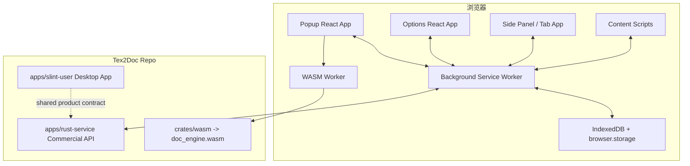
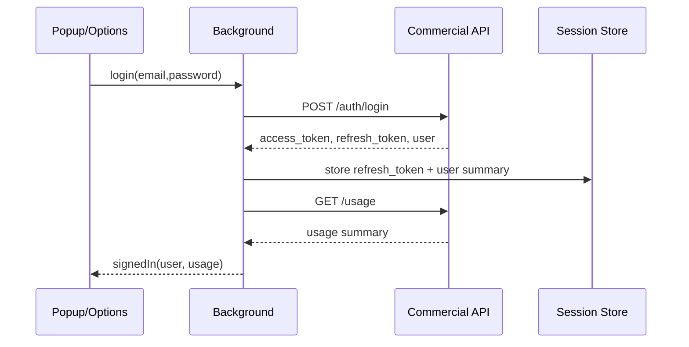

# Tex2Doc 浏览器插件新子项目商业化规划与实现方案

> **版本 / Version**: v2.0  
> **最后更新日期 / Last Updated**: 2026-06-27  
> **核心结论**: `apps/slint-user` 固定作为桌面端应用主体；浏览器插件应新建独立子项目 `apps/browser-extension`，用一套跨浏览器技术框架一次性覆盖 Chrome、Edge、Firefox、Safari，不再沿用根目录 `extension/` 原型作为商业主线。

---

## 一、重新定位

### 1.1 项目边界

| 项目 | 定位 | 处理方式 |
|------|------|----------|
| `apps/slint-user` | 桌面端商业应用主体 | 继续独立演进，承载桌面文件系统、本地转换、桌面更新、原生弹窗等能力 |
| `apps/browser-extension` | 新建浏览器插件商业应用主体 | 从零搭建跨浏览器 WebExtension 工程，复用转换引擎与商业 API，不复用 Slint UI |
| `extension/` | 早期 Chrome MV3 + WASM 原型 | 作为参考和迁移素材，后续可归档为 `legacy-extension/` 或保留只读 |
| `crates/wasm` | 浏览器本地转换引擎桥 | 继续复用，作为插件的本地轻量转换能力 |
| `crates/commercial-api-client` / `apps/rust-service` | 商业 API 契约与服务端 | 插件按 HTTP API 契约重写 TypeScript client，不直接复用 Rust client |

浏览器插件不是 Slint 桌面端的“附属页面”，而是一个新的商业化前端应用。它与桌面端共享产品能力、账号体系、额度体系、转换服务和 WASM 引擎，但不共享 UI 技术栈和桌面绑定代码。

### 1.2 一次性跨浏览器策略

不建议按“先 Chrome、再 Firefox、再 Safari”分批做工程架构。正确做法是：

1. 从第一天就使用跨浏览器 WebExtension 框架。
2. 从第一天就生成 Chrome / Edge / Firefox / Safari 目标产物。
3. 从第一天就建立 browser API 兼容层和 manifest 差异配置。
4. 从第一天就把 Safari 的 Xcode 包装要求纳入目录和 CI 预留。

可以按业务功能排开发优先级，但不能按浏览器拆工程。否则后续会出现 manifest、storage、background、content script、权限模型和测试脚本多套分叉，维护成本会越来越高。

---

## 二、技术框架选型

### 2.1 推荐方案

推荐新子项目采用：

```text
WXT + TypeScript + React + Tailwind CSS + webextension-polyfill + IndexedDB
```

| 技术 | 用途 | 选择理由 |
|------|------|----------|
| WXT | WebExtension 构建框架 | 面向 Chrome、Edge、Firefox、Safari 等多浏览器构建，内置 manifest 生成、entrypoints、dev server、zip 打包 |
| TypeScript | 业务代码 | 商业 API、消息协议、任务状态、浏览器兼容层都需要类型约束 |
| React | popup/options/sidepanel UI | 生态成熟，适合复杂商业工作台；也便于未来复用 Flutter Web/Slint 的产品信息架构 |
| Tailwind CSS | UI 样式 | 插件 UI 小而密，Tailwind 便于做一致设计 token 和响应式面板 |
| webextension-polyfill | 浏览器 API 兼容 | 统一 Promise 风格 `browser.*` API，降低 Chrome/Firefox 差异 |
| IndexedDB | 任务和大对象状态 | 转换任务、报告摘要、错误日志、文件元数据比 `storage.local` 更适合放 IndexedDB |
| `browser.storage.local/sync` | 设置、会话索引 | 存储轻量配置、账号摘要、API URL、主题语言 |

备选：

- Plasmo：上手快，但项目结构和运行时抽象更强，适合营销插件，不如 WXT 适合本项目这种多入口、多任务队列、WASM 和商业 API 深度集成的工程。
- 原生 Vite + 手写 manifest：可控但重复造轮子，多浏览器差异和打包成本高。
- Flutter Web 嵌入扩展：体积和启动成本偏高，不适合 popup/side panel 这种高频轻量入口。

结论：`apps/browser-extension` 使用 WXT 是当前最稳的“一套技术框架解决多浏览器兼容”路线。

### 2.2 官方兼容依据

| 方向 | 依据 |
|------|------|
| Chrome 扩展主线为 Manifest V3 | [Chrome Extensions Manifest V3](https://developer.chrome.com/docs/extensions/develop/migrate/what-is-mv3) |
| Edge 与 Chromium MV3 保持兼容 | [Microsoft Edge Manifest V3](https://learn.microsoft.com/en-us/microsoft-edge/extensions/developer-guide/manifest-v3) |
| Firefox 使用 WebExtensions，MV3 background 存在兼容差异 | [MDN WebExtensions manifest.json](https://developer.mozilla.org/en-US/docs/Mozilla/Add-ons/WebExtensions/manifest.json) |
| Safari 使用 Safari Web Extension 并通过 Apple 体系分发 | [Apple Safari Web Extensions](https://developer.apple.com/documentation/safariservices/safari-web-extensions) |
| WXT 面向多浏览器扩展构建 | [WXT Documentation](https://wxt.dev/) |

---

## 三、新子项目结构

### 3.1 目标目录

```text
apps/browser-extension/
├── package.json
├── tsconfig.json
├── wxt.config.ts
├── tailwind.config.ts
├── postcss.config.js
├── public/
│   ├── icons/
│   │   ├── icon16.png
│   │   ├── icon32.png
│   │   ├── icon48.png
│   │   └── icon128.png
│   ├── wasm/
│   │   ├── doc_engine.js
│   │   └── doc_engine_bg.wasm
│   └── screenshots/
├── src/
│   ├── entrypoints/
│   │   ├── background.ts
│   │   ├── content/
│   │   │   ├── overleaf.content.ts
│   │   │   ├── arxiv.content.ts
│   │   │   └── generic.content.ts
│   │   ├── popup/
│   │   │   ├── index.html
│   │   │   ├── main.tsx
│   │   │   └── PopupApp.tsx
│   │   ├── options/
│   │   │   ├── index.html
│   │   │   ├── main.tsx
│   │   │   └── OptionsApp.tsx
│   │   └── sidepanel/
│   │       ├── index.html
│   │       ├── main.tsx
│   │       └── SidePanelApp.tsx
│   ├── browser/
│   │   ├── compat.ts
│   │   ├── manifest.ts
│   │   ├── permissions.ts
│   │   ├── downloads.ts
│   │   ├── tabs.ts
│   │   └── messaging.ts
│   ├── api/
│   │   ├── api-client.ts
│   │   ├── auth.ts
│   │   ├── usage.ts
│   │   ├── billing.ts
│   │   ├── uploads.ts
│   │   ├── conversions.ts
│   │   ├── feedback.ts
│   │   └── releases.ts
│   ├── conversion/
│   │   ├── local-wasm.ts
│   │   ├── cloud-conversion.ts
│   │   ├── project-zip.ts
│   │   ├── report-parser.ts
│   │   └── quality-summary.ts
│   ├── state/
│   │   ├── app-store.ts
│   │   ├── session-store.ts
│   │   ├── settings-store.ts
│   │   ├── job-store.ts
│   │   ├── quota-store.ts
│   │   └── event-log.ts
│   ├── ui/
│   │   ├── tokens.ts
│   │   ├── i18n/
│   │   ├── components/
│   │   ├── pages/
│   │   └── layouts/
│   ├── shared/
│   │   ├── constants.ts
│   │   ├── errors.ts
│   │   ├── schemas.ts
│   │   └── types.ts
│   └── workers/
│       ├── wasm-worker.ts
│       └── cloud-poll-worker.ts
├── tests/
│   ├── unit/
│   ├── e2e/
│   └── fixtures/
└── README.md
```

### 3.2 与根目录 `extension/` 的关系

根目录 `extension/` 中可迁移的资产：

- `popup/wasm/doc_engine.js`、`doc_engine_bg.wasm` 的加载经验。
- popup 中选择 zip、调用 `convert_zip_to_docx`、下载 docx 的最小流程。
- `content/content.js` 中 Overleaf / arXiv 选区捕获思路。
- `scripts/e2e_extension.mjs` 中静态检查和 DOM 冒烟思路。

不建议迁移的资产：

- 手写 `manifest.json` 作为长期主 manifest。
- 直接使用 `chrome.*` 的业务代码。
- popup 内承担长转换任务和云端轮询。
- 默认 `<all_urls>` host permission。

---

## 四、功能范围一次性定义

新插件首版即按完整商业闭环设计，不做“只支持某浏览器”的中间版本。

### 4.1 必须内置的应用模块

| 模块 | Popup | Side Panel / Tab | Options |
|------|-------|------------------|---------|
| 快速转换 | 上传 zip、输入 main tex、选择本地/云端 | 任务队列、进度、报告摘要 | 默认 profile/quality |
| 账号 | 登录态、剩余额度 | 账号详情、套餐状态 | API Base URL、退出登录 |
| 云转换 | 发起、查看当前任务 | 全量任务列表、下载 docx/report | 重试策略、轮询间隔 |
| 本地 WASM | 小文件转换、隐私提示 | 本地历史、失败诊断 | 文件大小阈值 |
| 充值计费 | 额度摘要、充值入口 | 套餐、checkout、portal、充值码 | 支付回跳配置 |
| 转换记录 | 最近 3-5 条 | 云端记录 + 本地记录 | 记录保留策略 |
| 反馈 | 当前失败任务反馈 | 反馈线程列表 | 诊断包设置 |
| 浏览器集成 | 当前页面提示 | Overleaf/arXiv 上下文任务 | 域名授权管理 |

### 4.2 与 `apps/slint-user` 功能对齐

| Slint 桌面能力 | 插件实现方式 |
|----------------|--------------|
| 本地转换 | 通过 `crates/wasm` 构建产物完成轻量 zip 转 docx；复杂本地能力仍留给桌面端 |
| 云端转换 | TypeScript client 调用 `/uploads`、`/conversions`、`/download/docx`、`/report` |
| 账号登录/注册/刷新 | TypeScript client 调用 `/auth/login`、`/auth/register`、`/auth/refresh`、`/me` |
| 用量额度 | 调用 `/usage`，缓存 quota summary |
| 套餐/结账/账单门户 | 调用 `/plans`、`/billing/checkout`、`/billing/portal`，新 tab 打开支付页 |
| 充值码 | 调用 `/redeem-codes/options`、`/redeem-codes/redeem`、`/redeem-codes/records` |
| 转换记录 | 调用 `/conversions` 并合并 IndexedDB 本地历史 |
| 反馈 | 调用 `/feedback/threads` 系列接口 |
| 更新检查 | 插件代码更新交给商店；插件内只展示服务公告和版本提醒 |

---

## 五、运行架构



设计原则：

- `background.ts` 是任务编排中心：会话刷新、云任务轮询、记录持久化、通知、下载。
- `popup` 是高频轻入口：不保存复杂状态，不承载长任务。
- `sidepanel` 或独立 tab 是商业工作台：记录、充值、反馈、报告。
- `content script` 只做页面上下文采集和入口注入，不接触 token。
- `wasm-worker` 执行本地转换，避免阻塞 popup UI。
- `apps/slint-user` 不作为插件依赖，只作为产品能力参照。

---

## 六、浏览器兼容方案

### 6.1 一套代码，多目标构建

目标命令：

```json
{
  "scripts": {
    "dev": "wxt",
    "dev:chrome": "wxt -b chrome",
    "dev:firefox": "wxt -b firefox",
    "build": "wxt build",
    "build:chrome": "wxt build -b chrome",
    "build:edge": "wxt build -b chrome --mode edge",
    "build:firefox": "wxt build -b firefox",
    "build:safari": "wxt build -b safari",
    "zip": "wxt zip",
    "test": "vitest run",
    "e2e": "playwright test"
  }
}
```

Edge 可复用 Chromium 构建产物，但应生成独立 zip 和商店元数据。Safari 构建后仍需要 Xcode/Safari Web Extension 包装与 App Store 流程。

### 6.2 Manifest 差异处理

WXT 配置中按 browser target 输出差异：

| 能力 | Chrome/Edge | Firefox | Safari |
|------|-------------|---------|--------|
| Background | MV3 service worker | MV3 支持仍有差异，必要时 background scripts 兼容 | Safari Web Extension 包装后验证 |
| Side Panel | 可优先使用 `sidePanel` | 降级为 extension tab | 降级为 extension tab |
| Downloads | `downloads` API | `downloads` API | 需实机验证行为 |
| Host Permissions | `host_permissions` + optional permissions | manifest 字段兼容处理 | Safari 权限提示单独验证 |
| WASM | 扩展内静态资源加载 | 扩展内静态资源加载 | CSP/资源路径需 Xcode 包装验证 |

### 6.3 权限最小化

首版默认权限：

```json
{
  "permissions": [
    "storage",
    "downloads",
    "contextMenus",
    "notifications"
  ],
  "host_permissions": [
    "https://api.tex2doc.cn/*"
  ],
  "optional_host_permissions": [
    "https://www.overleaf.com/*",
    "https://*.overleaf.com/*",
    "https://arxiv.org/*",
    "https://*.arxiv.org/*"
  ]
}
```

原则：

- 默认不申请 `<all_urls>`。
- Overleaf/arXiv 增强入口使用 optional permissions。
- 商业 API 域名固定白名单。
- 用户文件只在本地 WASM 或用户主动云转换时处理。
- content script 不读取密码、token、完整文件内容。

---

## 七、核心业务流程

### 7.1 登录与会话刷新



会话规则：

- access token 只放 background 内存。
- refresh token 存 `browser.storage.local`，可加 Web Crypto 包装。
- content script 永远拿不到 token。
- 401 时 background 统一刷新，刷新失败才通知 UI 登出。

### 7.2 本地 WASM 转换

流程：

1. 用户选择 zip 或从页面上下文导入项目包。
2. popup 把文件交给 `wasm-worker`。
3. `wasm-worker` 加载 `public/wasm/doc_engine_bg.wasm`。
4. 调用 `convert_zip_to_docx(zipBytes, mainTex, options)`。
5. 成功后生成 docx Blob，并通过 downloads API 保存。
6. 任务摘要写入 IndexedDB。

边界：

- 默认文件阈值建议 10 MB，可通过 options 调整。
- 本地转换失败时展示“改用云端转换”。
- 本地转换适合试用和隐私场景，不承诺覆盖所有复杂模板。

### 7.3 云端转换

流程：

1. background 检查登录态和用量。
2. 上传 zip 到 `/uploads`。
3. 创建转换任务 `/conversions`。
4. background 持久化 job id 并轮询。
5. 完成后下载 docx 与 report。
6. UI 展示质量分、profile、backend、warnings、下载入口。

失败处理：

- `quota_exceeded`: 引导充值或套餐升级。
- `conversion_failed`: 保存错误码，提供反馈入口。
- `timeout`: 任务保留在队列，允许稍后继续轮询。
- `network_error`: 指数退避，最多重试，并保留诊断事件。

### 7.4 充值与支付

插件内不内嵌支付页：

- 套餐列表调用 `/plans`。
- checkout 调用 `/billing/checkout`，返回 URL 后 `tabs.create` 打开。
- portal 调用 `/billing/portal`，返回 URL 后打开。
- 充值码调用 `/redeem-codes/redeem`，成功后立即刷新 `/usage`。

### 7.5 反馈闭环

失败任务、质量报告、用户建议统一进入反馈模块：

- 新建反馈线程：`POST /feedback/threads`。
- 查询反馈线程：`GET /feedback/threads`。
- 绑定转换任务：传 `conversion_job_id`。
- 诊断包只包含浏览器、插件版本、任务状态、错误码、API base URL hash，不包含源文件内容。

---

## 八、UI 信息架构

### 8.1 Popup

尺寸建议：`380px - 420px` 宽，适合快速操作。

区域：

- 顶部：Tex2Doc、账号状态、额度 pill。
- 转换区：选择文件、main tex、profile、quality、本地/云端开关。
- 当前任务：进度、状态、错误、下载按钮。
- 最近记录：最多 3 条。
- 底部：打开工作台、设置、反馈。

### 8.2 Side Panel / Extension Tab

用于完整商业工作台：

- 转换任务队列。
- 云端记录 / 本地记录。
- 质量报告详情。
- 套餐、充值码、账单入口。
- 反馈线程。
- 账号与用量。

Firefox/Safari 若不支持 side panel，则自动降级为 extension tab。

### 8.3 Options

设置项：

- API Base URL。
- 默认转换 profile。
- 默认 quality。
- 默认转换模式：auto/local/cloud。
- 本地 WASM 文件大小阈值。
- 语言、主题。
- 域名授权管理。
- 诊断导出。

---

## 九、与构建系统集成

### 9.1 根目录 package scripts

建议根 `package.json` 增加：

```json
{
  "scripts": {
    "build:wasm:extension": "wasm-pack build crates/wasm --target web --out-dir apps/browser-extension/public/wasm --out-name doc_engine --release",
    "extension:install": "cd apps/browser-extension && npm install",
    "extension:dev": "cd apps/browser-extension && npm run dev",
    "extension:build": "npm run build:wasm:extension && cd apps/browser-extension && npm run build",
    "extension:zip": "cd apps/browser-extension && npm run zip",
    "e2e:browser-extension": "cd apps/browser-extension && npm run e2e"
  }
}
```

### 9.2 CI 验收

一次 CI 应同时产出：

- Chrome zip。
- Edge zip。
- Firefox zip。
- Safari build artifact 或 Xcode 包装输入产物。
- WASM size report。
- manifest permission report。
- Playwright Chrome 冒烟。
- Firefox web-ext 冒烟。

Safari 的完整签名和 App Store 上传可单独在 macOS runner 或人工 release 流程完成，但源码结构和构建入口必须从第一版就存在。

---

## 十、测试矩阵

### 10.1 自动化测试

| 类型 | 覆盖 |
|------|------|
| Unit | API client、message schema、job-store、settings-store、report-parser |
| Component | Popup 登录态、额度不足、转换中、失败、完成 |
| Integration | mock API 下 upload/create/poll/download 全链路 |
| WASM | 小 zip 转 docx、错误 main tex、大小阈值 |
| Browser E2E | Chrome、Edge、Firefox 安装扩展、打开 popup、运行 mock 转换 |
| Manifest Check | 权限、CSP、host_permissions、可选权限、远程代码检查 |

### 10.2 手动测试

| 浏览器 | 版本 | 必测 |
|--------|------|------|
| Chrome Stable | Windows/macOS/Linux | 登录、WASM、云转换、下载、充值码、记录、反馈 |
| Edge Stable | Windows/macOS | 与 Chrome 同流程，额外检查 Edge 商店包 |
| Firefox Stable/ESR | Windows/macOS/Linux | background、storage、downloads、content script |
| Safari macOS | macOS + Xcode | 包装、启用扩展、popup、云转换、下载 |
| Safari iOS/iPadOS | 真机 | popup/页面尺寸、权限、账号、基础转换 |

---

## 十一、实施计划：一次性多浏览器交付

这里的计划按工程工作流划分，不按浏览器分阶段。每个工作流都必须保持 Chrome/Edge/Firefox/Safari 目标可构建。

| 工作流 | 交付内容 | 完成标准 |
|--------|----------|----------|
| 工程骨架 | `apps/browser-extension`、WXT、TS、React、Tailwind、polyfill | 四类浏览器 target 均可 build |
| WASM 集成 | `build:wasm:extension`、wasm-worker、本地转换 UI | Chrome/Firefox 至少自动测；Edge/Safari 手动测 |
| 商业 API | auth/usage/billing/uploads/conversions/feedback TS client | mock API 与真实 dev API 均通过 |
| 任务系统 | background job queue、IndexedDB、轮询恢复、通知 | popup 关闭后任务仍可恢复 |
| UI 工作台 | popup、options、sidepanel/tab | 小屏和 tab 模式均无布局溢出 |
| 内容脚本 | Overleaf/arXiv 可选权限、上下文入口 | 未授权不注入，授权后可采集上下文 |
| 安全合规 | 权限最小化、token 隔离、日志脱敏、隐私声明 | manifest 检查和人工审查通过 |
| 打包发布 | Chrome/Edge/Firefox zip、Safari 包装输入 | release artifact 齐全 |

建议定义一个“商业 Beta 一次性交付范围”：

- 四浏览器目标全部可构建。
- Chrome/Edge/Firefox 可安装可用。
- Safari 至少完成 macOS 包装验证。
- 业务能力包含登录、用量、本地 WASM、云转换、下载、充值码、记录、反馈。
- Overleaf/arXiv 集成可开关。

---

## 十二、数据与安全设计

### 12.1 存储分层

| 数据 | 存储 | 说明 |
|------|------|------|
| refresh token | `browser.storage.local` + 可选 Web Crypto 包装 | 不进入 content script |
| access token | background 内存 | 关闭/重启后用 refresh token 换取 |
| settings | `browser.storage.sync` 或 local | API URL、语言、主题、默认转换参数 |
| job records | IndexedDB | 任务状态、文件名、大小、job id、report 摘要 |
| docx/report 文件 | Downloads / 用户保存 | 不长期存插件内 |
| event log | IndexedDB ring buffer | 仅诊断，脱敏 |

### 12.2 CSP 与远程代码

商店发布版必须满足：

- 不从远程 URL 加载 JS。
- WASM 随扩展包发布。
- 支付页、账单页只用新 tab 打开，不在扩展内 iframe。
- API response 只作为数据处理，不执行字符串代码。

### 12.3 隐私声明重点

隐私政策应明确：

- 本地 WASM 转换不上传文件。
- 云端转换会上传用户选择的 zip。
- 页面上下文只在用户授权域名后采集。
- 反馈诊断默认不包含源文件。
- 账号信息只用于 Tex2Doc 登录、额度和服务交付。

---

## 十三、风险与决策

| 风险 | 等级 | 决策 |
|------|------|------|
| WXT/Safari 支持不足以完全自动发布 | 中 | 仍使用 WXT 统一源码与构建，Safari 发布通过 Xcode 包装补齐 |
| MV3 background 非持久导致云任务中断 | 高 | 所有任务持久化，background 可恢复轮询，UI 不持有唯一状态 |
| WASM 文件大导致启动慢 | 中 | lazy load + wasm-worker + size report；默认云端转换可绕过 |
| 多浏览器 downloads 行为差异 | 中 | 封装 `downloads.ts`，每个浏览器独立 E2E/手动 QA |
| 商店审核拒绝宽权限 | 高 | optional permissions + API 域白名单，不用 `<all_urls>` |
| 与桌面端功能重复 | 低 | 明确分工：桌面端处理原生/大工程，插件处理浏览器入口和云闭环 |

---

## 十四、最终建议

1. 新建 `apps/browser-extension`，不要把商业插件继续建在根目录 `extension/` 上。
2. 使用 WXT + TypeScript + React + Tailwind + webextension-polyfill，一套代码同时生成 Chrome、Edge、Firefox、Safari 目标。
3. 复用 `crates/wasm` 的转换能力，但通过构建脚本复制 WASM 产物，不让插件依赖 Rust 运行时。
4. 复用商业 API 契约，但在插件内重写 TypeScript client，不复用 `apps/slint-user` 的 Rust blocking adapter。
5. 从第一版就做账号、用量、云转换、充值、记录、反馈的商业闭环；浏览器兼容也从第一版就纳入构建和测试。
6. 保留 `apps/slint-user` 作为桌面端应用主体，插件和桌面端通过统一账号、额度、转换任务和报告数据形成产品协同，而不是代码耦合。

这条路线能同时满足商业推广和长期维护：用户在浏览器中低摩擦触达 Tex2Doc，复杂工程仍可导向桌面端；研发侧只维护一套插件代码和一套浏览器兼容抽象，不会在多个浏览器之间拆出平行实现。
