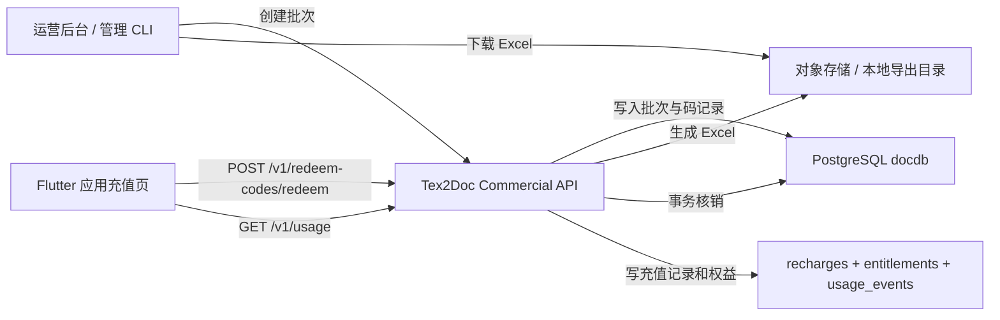
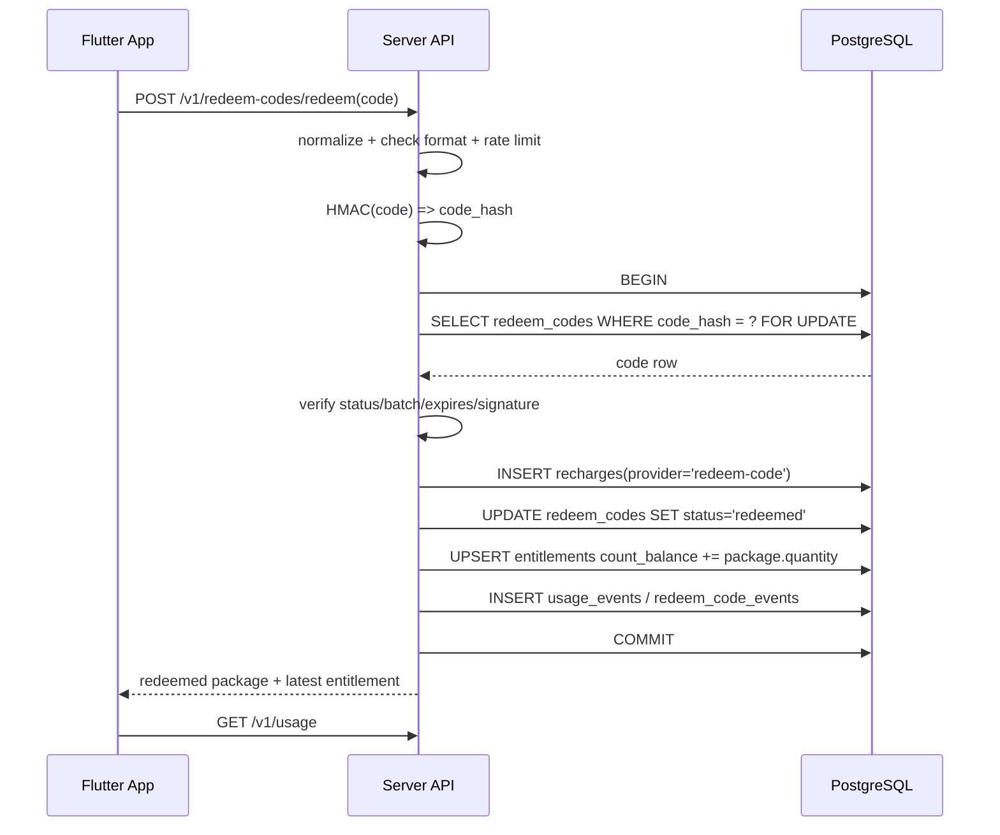

# Flutter 应用兑换码充值模块技术实现方案
> **版本 / Version**: v2.0
> **最后更新日期 / Last Updated**: 2026-06-26


生成时间：2026-06-23 23:01

## 1. 背景与目标

当前 Flutter 商业化充值链路已经具备基础能力：

- Flutter 侧 `CommercialApiClient` 已支持账号、用量、套餐、充值记录、上传、转换等 API 调用。
- Flutter 充值面板当前通过 `/v1/recharge/options` 和 `/v1/recharges` 完成按次或按日期权益的 mock 充值。
- 服务端当前以 in-memory `recharges`、`entitlements`、`usage` 维护充值权益，`create_recharge` 会直接生成 `paid_mock` 记录并立即到账。
- 现有商业化规划中已经明确 billing checkout/portal、usage ledger、PostgreSQL store 仍需从 preview mock 迁移到可持久化、可审计的生产底座。

本方案目标是在 Flutter 应用充值模块中引入“兑换码充值”模式，用服务端批量生成兑换码替代当前 mock 支付入口。兑换码可以直接兑换为指定转换套餐，例如 3 次、10 次、30 次云端转换额度；每个兑换码必须有数据库记录；兑换码必须具备加密、验签、防枚举和防伪造能力；用户在 Flutter 应用中录入兑换码后完成充值；兑换码一经兑换即作废，不允许重复使用；运营人员可批量导出兑换码 Excel 并下载。

## 2. 设计原则

1. 兑换码是权益凭证，不是订单号。
   兑换码只代表一份可核销权益，最终到账仍落到统一的 `recharges`、`entitlements`、`usage_events` 或后续 usage ledger。

2. 明文兑换码只在生成和导出时出现。
   数据库保存哈希、密文、批次与状态，避免数据库泄露后可直接批量盗用。

3. 核销必须原子化。
   服务端应在单个数据库事务中完成兑换码行锁定、状态变更、充值记录创建、权益到账和审计日志写入。

4. Flutter 只做录入和展示，不做可信校验。
   加解密、验签、防重放、核销状态判断全部由服务端完成。

5. 兼容现有按次权益消费顺序。
   兑换码到账后仍复用“按次余额优先于 preview quota”的消费策略，避免转换流程出现两套扣减逻辑。

## 3. 总体架构



核心模块建议：

| 模块 | 职责 | 建议位置 |
| --- | --- | --- |
| `commercial_redeem` | 兑换码生成、解析、验签、核销、状态查询 | `crates/server/src/commercial_redeem.rs` |
| `commercial_store` | PostgreSQL 持久化，替代 in-memory preview state | `crates/server/src/commercial_store.rs` |
| `admin_routes` | 批次创建、Excel 导出、批次列表、作废 | `crates/server/src/admin_routes.rs` |
| Flutter API | 新增兑换码核销调用和数据模型 | `flutter_app/lib/commercial_api.dart` |
| Flutter UI | 充值页从 mock 支付按钮改为兑换码录入和记录列表 | `flutter_app/lib/workspace_app.dart` |

## 4. 兑换码形态与防复制设计

### 4.1 用户可见码格式

建议格式：

```text
T2D-<batch_prefix>-<payload>-<check>
```

示例：

```text
T2D-C10A-R8K4-MQ7P-2X9D-H6
```

字段说明：

| 字段 | 说明 |
| --- | --- |
| `T2D` | 产品前缀，方便用户识别和客服排查 |
| `batch_prefix` | 批次短标识，不暴露完整批次 ID |
| `payload` | 随机码主体，建议 96 bit 以上随机熵，Base32 Crockford 编码 |
| `check` | 本地输入校验位，只用于发现输错，不作为安全依据 |

### 4.2 加密与验签

兑换码需要“可被服务端解密/验证”，同时不能被客户端伪造。推荐使用“双层保护”：

1. 随机主体：每个兑换码生成 96 至 128 bit CSPRNG 随机数。
2. 服务端签名：使用 HMAC-SHA256 对 `batch_id + random_nonce + package_id + expires_at` 签名，截取部分签名作为码内校验段。
3. 数据库存储：
   - `code_hash = HMAC-SHA256(server_pepper, normalized_code)`，用于快速唯一查找。
   - `code_ciphertext = AES-256-GCM(master_key, normalized_code)`，用于管理员在受控场景下重新导出或审计。
   - `code_preview` 仅保存前 6 后 4 位，用于客服和后台展示。
4. 密钥管理：
   - `REDEEM_CODE_PEPPER` 用于哈希，轮换时需要支持 key version。
   - `REDEEM_CODE_MASTER_KEY` 用于 AES-GCM 加密，密文记录 `key_version`。
   - 生产环境密钥放入 Secret Manager 或部署平台密钥系统，不进入代码仓库和 Excel。

说明：兑换码“一旦被别人拿到明文”仍可能被抢先兑换，任何纯软件兑换码都无法完全防止截图/复制。因此防复制的工程目标应定义为“防伪造、防枚举、防数据库泄露直接可用、防重复使用”，而不是阻止用户复制字符串。若需要更强防转赠，可增加设备绑定或手机号绑定，但会提高客服成本。

### 4.3 输入规范化

服务端核销前统一执行：

- 去除空格、短横线。
- 转大写。
- 将易混字符按规则折叠，例如 `O -> 0`、`I/L -> 1`，或直接使用不包含易混字符的 Base32 字母表。
- 长度、前缀、校验位不合法时直接返回 `invalid_code`，不泄露批次是否存在。

## 5. 数据库设计

基于现有 `docs-zh/money/001_docdb_business_schema.sql` 的商业数据库基线，新增以下表。

### 5.1 套餐定义表

如果后续希望兑换码和线上支付共用套餐，应抽象出权益包表：

```sql
CREATE TABLE redeem_packages (
    id TEXT PRIMARY KEY,
    name TEXT NOT NULL,
    package_type TEXT NOT NULL CHECK (package_type IN ('count', 'date')),
    quantity INTEGER NOT NULL CHECK (quantity > 0),
    currency TEXT NOT NULL DEFAULT 'CNY',
    suggested_amount_cents INTEGER NOT NULL DEFAULT 0,
    active BOOLEAN NOT NULL DEFAULT true,
    metadata JSONB NOT NULL DEFAULT '{}'::jsonb,
    created_at TIMESTAMPTZ NOT NULL DEFAULT now(),
    updated_at TIMESTAMPTZ NOT NULL DEFAULT now()
);
```

初始套餐：

| id | 名称 | 类型 | 数量 |
| --- | --- | --- | --- |
| `count_3` | 3 次转换包 | `count` | 3 |
| `count_10` | 10 次转换包 | `count` | 10 |
| `count_30` | 30 次转换包 | `count` | 30 |

### 5.2 兑换码批次表

```sql
CREATE TABLE redeem_code_batches (
    id UUID PRIMARY KEY DEFAULT gen_random_uuid(),
    batch_no TEXT NOT NULL UNIQUE,
    package_id TEXT NOT NULL REFERENCES redeem_packages(id),
    quantity INTEGER NOT NULL CHECK (quantity > 0),
    generated_count INTEGER NOT NULL DEFAULT 0,
    exported_count INTEGER NOT NULL DEFAULT 0,
    status TEXT NOT NULL DEFAULT 'active'
        CHECK (status IN ('active', 'paused', 'voided', 'exhausted')),
    channel TEXT,
    note TEXT,
    expires_at TIMESTAMPTZ,
    created_by UUID REFERENCES app_users(id) ON DELETE SET NULL,
    created_at TIMESTAMPTZ NOT NULL DEFAULT now(),
    updated_at TIMESTAMPTZ NOT NULL DEFAULT now()
);
```

### 5.3 兑换码明细表

```sql
CREATE TABLE redeem_codes (
    id UUID PRIMARY KEY DEFAULT gen_random_uuid(),
    batch_id UUID NOT NULL REFERENCES redeem_code_batches(id) ON DELETE CASCADE,
    package_id TEXT NOT NULL REFERENCES redeem_packages(id),
    code_hash TEXT NOT NULL UNIQUE,
    code_ciphertext BYTEA NOT NULL,
    code_nonce BYTEA NOT NULL,
    code_preview TEXT NOT NULL,
    key_version TEXT NOT NULL DEFAULT 'v1',
    status TEXT NOT NULL DEFAULT 'unused'
        CHECK (status IN ('unused', 'redeemed', 'voided', 'expired')),
    redeemed_by UUID REFERENCES app_users(id) ON DELETE SET NULL,
    redeemed_recharge_id UUID,
    redeemed_at TIMESTAMPTZ,
    expires_at TIMESTAMPTZ,
    created_at TIMESTAMPTZ NOT NULL DEFAULT now(),
    updated_at TIMESTAMPTZ NOT NULL DEFAULT now()
);

CREATE INDEX idx_redeem_codes_batch_status
    ON redeem_codes(batch_id, status);

CREATE INDEX idx_redeem_codes_redeemed_by
    ON redeem_codes(redeemed_by, redeemed_at DESC);
```

### 5.4 核销审计表

```sql
CREATE TABLE redeem_code_events (
    id UUID PRIMARY KEY DEFAULT gen_random_uuid(),
    redeem_code_id UUID REFERENCES redeem_codes(id) ON DELETE SET NULL,
    user_id UUID REFERENCES app_users(id) ON DELETE SET NULL,
    event_type TEXT NOT NULL CHECK (event_type IN (
        'generated', 'exported', 'redeem_success', 'redeem_failed',
        'voided', 'expired'
    )),
    ip_hash TEXT,
    user_agent TEXT,
    reason TEXT,
    metadata JSONB NOT NULL DEFAULT '{}'::jsonb,
    created_at TIMESTAMPTZ NOT NULL DEFAULT now()
);
```

### 5.5 与现有充值记录衔接

现有 `RechargeRecord` 建议迁移为数据库表 `recharges`：

```sql
CREATE TABLE recharges (
    id UUID PRIMARY KEY DEFAULT gen_random_uuid(),
    user_id UUID NOT NULL REFERENCES app_users(id) ON DELETE CASCADE,
    recharge_type TEXT NOT NULL CHECK (recharge_type IN ('count', 'date')),
    package_id TEXT NOT NULL,
    quantity INTEGER NOT NULL CHECK (quantity > 0),
    amount_cents INTEGER NOT NULL DEFAULT 0,
    currency TEXT NOT NULL DEFAULT 'CNY',
    status TEXT NOT NULL CHECK (status IN ('paid', 'refunded', 'voided')),
    provider TEXT NOT NULL,
    provider_trade_id TEXT NOT NULL UNIQUE,
    metadata JSONB NOT NULL DEFAULT '{}'::jsonb,
    created_at TIMESTAMPTZ NOT NULL DEFAULT now()
);
```

兑换码核销成功后写入：

- `provider = 'redeem-code'`
- `provider_trade_id = redeem_code_id`
- `amount_cents = 0`
- `metadata = {"batch_id": "...", "code_preview": "T2D-C10A-****-H6"}`

## 6. 服务端接口设计

### 6.1 用户端接口

#### 查询兑换码充值配置

```http
GET /v1/redeem-codes/options
Authorization: Bearer <access_token>
```

响应：

```json
{
  "enabled": true,
  "code_format_hint": "T2D-XXXX-XXXX-XXXX",
  "support_text": "请输入购买或活动获得的兑换码"
}
```

#### 核销兑换码

```http
POST /v1/redeem-codes/redeem
Authorization: Bearer <access_token>
Content-Type: application/json

{
  "code": "T2D-C10A-R8K4-MQ7P-2X9D-H6"
}
```

成功响应：

```json
{
  "redeem_id": "uuid",
  "recharge_id": "uuid",
  "package_id": "count_10",
  "package_name": "10 次转换包",
  "recharge_type": "count",
  "quantity": 10,
  "count_balance": 12,
  "date_valid_until": null,
  "redeemed_at": "2026-06-23T15:01:00Z"
}
```

错误码：

| HTTP | code | 场景 |
| --- | --- | --- |
| 400 | `invalid_code` | 格式错误、校验位错误 |
| 404 | `invalid_code` | 哈希未命中，仍统一返回无效 |
| 409 | `code_already_redeemed` | 已被兑换 |
| 409 | `code_voided` | 已作废 |
| 410 | `code_expired` | 已过期 |
| 429 | `redeem_rate_limited` | 频繁尝试 |

#### 查询兑换记录

```http
GET /v1/redeem-codes/records
Authorization: Bearer <access_token>
```

用于 Flutter 充值页展示最近兑换记录，可与现有 `/v1/recharges` 合并，也可单独提供更清晰的兑换码维度。

### 6.2 管理端接口

管理端必须独立鉴权，建议使用 admin JWT、内网网关或 CLI token，不复用普通用户 token。

#### 创建批次

```http
POST /admin/v1/redeem-code-batches
Authorization: Bearer <admin_token>
Content-Type: application/json

{
  "package_id": "count_10",
  "quantity": 1000,
  "channel": "offline-sales-202606",
  "expires_at": "2026-12-31T23:59:59Z",
  "note": "线下销售 10 次转换包"
}
```

响应：

```json
{
  "batch_id": "uuid",
  "batch_no": "RC202606230001",
  "package_id": "count_10",
  "quantity": 1000,
  "status": "active"
}
```

#### 导出 Excel

```http
GET /admin/v1/redeem-code-batches/{batch_id}/export.xlsx
Authorization: Bearer <admin_token>
```

Excel 列建议：

| 列名 | 说明 |
| --- | --- |
| 批次号 | `batch_no` |
| 兑换码 | 明文兑换码 |
| 套餐 ID | `package_id` |
| 套餐名称 | `10 次转换包` |
| 转换次数 | `10` |
| 过期时间 | `expires_at` |
| 状态 | 导出时默认为 `unused` |
| 备注 | 渠道、活动或销售单号 |

注意：如果安全策略禁止重复导出明文码，则应在创建批次时同步生成 Excel 文件并加密存储到对象存储；数据库只保留密文和哈希。后续下载实际读取对象存储中的原始导出文件，而不是从数据库重新解密。

#### 作废批次或单码

```http
POST /admin/v1/redeem-code-batches/{batch_id}/void
POST /admin/v1/redeem-codes/{code_id}/void
```

只能作废 `unused` 状态的码。已兑换码不得物理删除，只能保留审计状态。

## 7. 核销事务流程



事务边界内的关键 SQL 约束：

1. `code_hash` 唯一，生成时避免重复。
2. `SELECT ... FOR UPDATE` 锁住兑换码行，两个用户同时兑换同一码时只有一个成功。
3. `redeemed_recharge_id` 和 `provider_trade_id` 建立唯一关系，避免重复写充值记录。
4. 核销失败必须写 `redeem_code_events`，但不要在响应中暴露是否存在未使用码，防止枚举。

## 8. Flutter 应用改造方案

### 8.1 API Client

在 `CommercialApiClient` 新增：

```dart
Future<RedeemCodeOptions> redeemCodeOptions(String accessToken);

Future<RedeemCodeResult> redeemCode({
  required String accessToken,
  required String code,
});

Future<List<RedeemCodeRecord>> redeemCodeRecords(String accessToken);
```

新增模型：

- `RedeemCodeOptions`
- `RedeemCodeResult`
- `RedeemCodeRecord`

### 8.2 UI 改造

当前 `_RechargePanel` 中的 mock 支付按钮建议改为两块：

1. 兑换码输入区：
   - 单行输入框，支持粘贴。
   - 输入时自动转大写、分段展示，但提交原始输入即可。
   - “立即兑换”按钮。
   - 成功后展示“已到账 10 次转换额度”，并触发 `/v1/usage` 刷新。

2. 套餐说明和记录区：
   - 显示可兑换套餐说明，而不是模拟价格按钮。
   - 最近充值记录继续来自 `/v1/recharges`，其中 provider 为 `redeem-code`。
   - 可选展示最近兑换码记录，不展示完整兑换码，只展示 `code_preview`。

需移除或替换的 mock 文案：

| 当前文案 | 建议替换 |
| --- | --- |
| `当前使用 mock 支付完成到账` | `输入兑换码即可兑换转换额度` |
| `mock 支付已启用` | `兑换码充值已启用` |
| `mock 支付完成` | `兑换成功，额度已到账` |
| provider `mock-pay` | provider `redeem-code` |

### 8.3 交互状态

| 状态 | UI 行为 |
| --- | --- |
| 未登录 | 输入框禁用，提示先登录 |
| 正在兑换 | 按钮 loading，输入框只读 |
| 兑换成功 | 清空输入框，刷新 usage 和记录 |
| 兑换失败 | 展示可读错误，如“兑换码无效或已使用” |
| 网络失败 | 保留输入内容，允许重试 |

## 9. Excel 批量导出实现

服务端 Rust 可选实现路线：

1. 使用 `rust_xlsxwriter` 生成 `.xlsx`。
2. 创建批次时一次性生成所有兑换码，并将明文码写入临时 Excel。
3. Excel 文件上传对象存储或写入受控导出目录。
4. `redeem_code_batches` 记录 `export_object_key`、`export_sha256`、`exported_count`。
5. 下载接口以附件形式返回：

```http
Content-Type: application/vnd.openxmlformats-officedocument.spreadsheetml.sheet
Content-Disposition: attachment; filename="redeem-codes-RC202606230001.xlsx"
```

安全建议：

- 导出的 Excel 文件必须有下载审计。
- 管理端下载链接短期有效，例如 10 分钟。
- 可选对 Excel 加密码，密码通过独立渠道发送给运营。
- 导出文件保留期建议 7 至 30 天，到期后仅保留数据库审计和密文，不再允许明文下载。

## 10. 替换 mock 模式的落地策略

### 阶段一：兑换码最小闭环

- 新增 PostgreSQL 表：`redeem_packages`、`redeem_code_batches`、`redeem_codes`、`redeem_code_events`、`recharges`。
- 新增管理端批量生成和 Excel 导出。
- 新增用户端 `/v1/redeem-codes/redeem`。
- Flutter 充值页新增兑换码输入。
- 保留原 `/v1/recharges` 查询记录，用 provider 区分 `redeem-code`。
- 测试覆盖“一码只能成功兑换一次”。

### 阶段二：完全移除 mock 支付入口

- 下线或隐藏 Flutter 的 mock 按次/按日期购买按钮。
- `/v1/recharges` 的 POST 不再允许普通用户直接创建 `paid_mock` 订单。
- 服务端保留内部 `create_recharge_from_redeem_code`，只允许兑换码、支付 webhook 或 admin 操作调用。
- mock provider 仅在本地测试环境启用，并由配置项 `ENABLE_MOCK_RECHARGE=false` 默认关闭。

### 阶段三：统一 usage ledger

- 将 `entitlements` 从 in-memory 迁移到数据库表。
- 兑换码到账写入 `usage_events`，转换消费写入 `usage_events` 或 `entitlement_events`。
- 云转换失败时支持返还按次额度。
- 后续真实支付、活动赠送、客服补偿都共用同一套权益账本。

## 11. 测试方案

服务端测试：

| 测试 | 预期 |
| --- | --- |
| 批量生成 1000 个兑换码 | 数据库记录数、Excel 行数、唯一性一致 |
| 正确兑换未使用码 | 返回成功，充值记录生成，count_balance 增加 |
| 重复兑换同一码 | 第一次成功，第二次返回 `code_already_redeemed` |
| 两个用户并发兑换同一码 | 只有一个事务提交成功 |
| 过期码兑换 | 返回 `code_expired`，不创建充值记录 |
| 作废码兑换 | 返回 `code_voided` |
| 随机错误码暴力尝试 | 触发 rate limit，错误响应不泄露存在性 |
| 转换消费按次额度 | 优先扣兑换码余额，不增加 preview used |

Flutter 测试：

| 测试 | 预期 |
| --- | --- |
| 未登录时兑换按钮禁用 | 提示登录 |
| 输入兑换码成功 | 展示到账信息并刷新 usage |
| 已使用码 | 展示“兑换码已使用” |
| 网络错误 | 保留输入，允许重试 |
| 国际化文案 | 中文和英文均不再出现 mock 支付文案 |

安全测试：

- 码格式枚举测试。
- HMAC key version 轮换测试。
- Excel 下载鉴权测试。
- 管理端批次作废权限测试。
- 数据库泄露演练：仅凭 `code_hash` 和 `code_ciphertext` 不应可直接完成兑换。

## 12. 监控与运营指标

建议新增指标：

| 指标 | 说明 |
| --- | --- |
| `redeem_code_generated_total` | 生成码数量 |
| `redeem_code_export_total` | 导出次数 |
| `redeem_code_success_total` | 兑换成功次数 |
| `redeem_code_failed_total{reason}` | 兑换失败次数 |
| `redeem_code_redeemed_rate` | 批次核销率 |
| `redeem_code_abuse_block_total` | 风控拦截次数 |
| `entitlement_count_balance_total` | 用户按次余额聚合 |

运营后台需要支持：

- 按批次查看生成数量、已兑换数量、剩余数量、过期数量。
- 按兑换码预览查询状态。
- 按用户查询兑换记录。
- 批次暂停、恢复、作废。
- 导出下载审计。

## 13. 风险与处理

| 风险 | 处理策略 |
| --- | --- |
| 明文兑换码被转发 | 一次性核销，先兑先得；必要时引入用户绑定码 |
| 批量 Excel 泄露 | 下载鉴权、短期链接、Excel 加密、导出审计 |
| 暴力枚举兑换码 | 96 bit 以上随机熵、统一错误、IP/账号限流 |
| 数据库泄露 | 只存 HMAC hash 和 AES-GCM 密文，不存可直接使用的明文 |
| 并发重复兑换 | 数据库行锁 + 事务状态更新 |
| 兑换成功但权益未到账 | 核销和到账同事务；失败自动回滚 |
| 后续支付系统接入冲突 | 充值记录抽象 provider，兑换码作为一种 provider |

## 14. 推荐实施清单

1. 新增 PostgreSQL migration，建立兑换码和充值记录表。
2. 抽象服务端 `CommercialStore`，先让兑换码链路使用数据库。
3. 实现兑换码生成库：随机码、规范化、HMAC hash、AES-GCM 加密、校验位。
4. 实现管理端批次创建和 Excel 导出。
5. 实现用户端兑换接口，事务内写入 `recharges` 和权益。
6. Flutter `CommercialApiClient` 增加兑换码接口和模型。
7. Flutter `_RechargePanel` 替换 mock 充值按钮为兑换码输入。
8. 服务端测试覆盖重复兑换、并发兑换、过期作废、Excel 导出。
9. Flutter 测试覆盖兑换成功、失败、未登录、文案替换。
10. 配置 `ENABLE_MOCK_RECHARGE=false`，生产环境关闭 mock 充值。

## 15. 与现有代码的衔接点

| 现有位置 | 当前职责 | 改造建议 |
| --- | --- | --- |
| `crates/server/src/routes.rs` | `/v1/recharge/options`、`/v1/recharges`、mock checkout | 新增 `/v1/redeem-codes/*`，限制普通用户直接创建 mock recharge |
| `crates/server/src/state.rs` | in-memory `recharges`、`entitlements`、`usage` | 逐步迁移到 PostgreSQL store，兑换码优先落库 |
| `flutter_app/lib/commercial_api.dart` | 充值、用量、套餐 API client | 新增兑换码核销模型和方法 |
| `flutter_app/lib/workspace_app.dart` | `_RechargePanel` mock 充值 UI | 改为兑换码输入、核销、记录展示 |
| `flutter_app/lib/ui/app_i18n.dart` | mock 充值文案 | 替换为兑换码充值文案 |
| `crates/server/tests/api.rs` | 已有 `paid_mock` 按次权益测试 | 新增兑换码测试，并将 mock 测试限定为本地配置 |

## 16. 结论

兑换码模式应作为 Tex2Doc 商业化充值的第一条生产可用闭环：相比直接接入支付渠道，它更容易完成可审计、可控、可运营的充值能力；相比当前 mock 模式，它能保证每个兑换码与数据库记录对应，支持批量生成、Excel 交付、一次性核销、重复使用拦截和后续 usage ledger 统一。

推荐优先完成“按次转换包兑换码”能力，先覆盖 3 次、10 次、30 次套餐；日期卡可复用同一套批次与核销模型，在按次兑换稳定后再开放。
