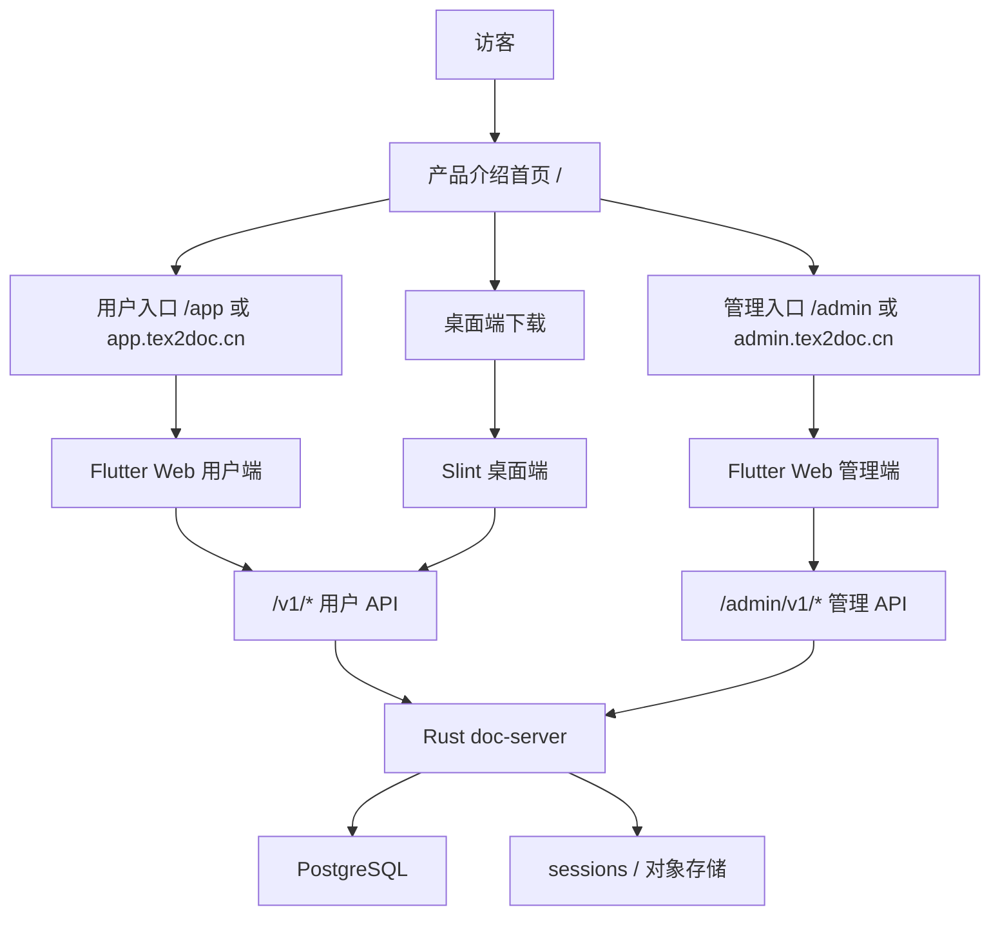

# Tex2Doc 最终发布形态与服务端 Web 双入口设计实现方案
> **版本 / Version**: v2.0
> **最后更新日期 / Last Updated**: 2026-06-26


生成日期：2026-06-24  
适用范围：Tex2Doc 商业化发布形态、Flutter Web、Slint 桌面端、Rust 服务端 API  
目标：明确最终产品构成，拆分服务端 Web 应用的产品首页、用户端、管理端入口，并保持桌面端作为独立生产力应用发布。

## 1. 总体结论

Tex2Doc 最终发布形态建议明确为两类交付物：

1. **服务端 Web 应用**
   - 技术栈：Flutter Web + Rust `doc-server` + PostgreSQL。
   - 面向对象：普通用户、运营/管理员、商业化官网访客。
   - 发布方式：部署在服务器或容器环境中，对外提供产品介绍首页、用户工作台、管理工作台和 API。

2. **桌面端应用**
   - 技术栈：Slint + Rust。
   - 面向对象：终端用户、本地转换用户、需要桌面体验和本地文件操作的用户。
   - 发布方式：Windows/macOS/Linux 安装包，连接同一套服务端商业 API。

当前项目已经具备这两条产品线的基础：`flutter_app` 承载 Web 工作台，`crates/desktop-slint` 承载桌面端，`crates/server` 提供认证、套餐、兑换码、转换、反馈、发布版本等 API。下一步应将 Flutter Web 从“单工作台混合入口”升级为“产品首页 + 用户端 + 管理端”的清晰结构。

## 2. 当前现状

### 2.1 Flutter Web

当前 Flutter Web 入口为：

- `flutter_app/lib/main.dart`
- `flutter_app/lib/workspace_app.dart`
- `flutter_app/web/index.html`

当前页面结构以 `_WorkspaceShell` 为核心，登录后通过 `_NavSection` 切换模块。现有导航已包含：

- 账号
- 充值
- 兑换码管理
- 兑换记录
- 转换
- 转换记录
- 充值记录
- 反馈

其中“兑换码管理”等模块更偏管理端能力，目前与用户端模块混在同一个工作台内。

### 2.2 服务端 API

当前服务端已经有两类 API 前缀：

- 用户端 API：`/v1/*`、`/api/v1/*`
- 管理端 API：`/admin/v1/*`

已存在的管理端 API 包括：

- `/admin/v1/redeem-code-batches`
- `/admin/v1/redeem-code-batches/:id`
- `/admin/v1/redeem-code-batches/:id/export.xlsx`
- `/admin/v1/feedback/threads`
- `/admin/v1/feedback/threads/export.xlsx`
- `/admin/v1/feedback/threads/:id`
- `/admin/v1/feedback/threads/:id/messages`

这说明后端 API 的分域方向已经存在，应在前端入口、权限和模块组织上继续补齐。

### 2.3 Slint 桌面端

桌面端位于：

- `crates/desktop-slint`

主要页面和能力包括：

- 转换
- 历史
- 账号
- 账单
- 反馈
- 设置
- 更新检测

桌面端的定位应保持为“用户生产力终端”，不建议加入管理端模块。管理员应使用 Web 管理端完成运营、客服、商业化配置和数据管理。

## 3. 目标产品构成



## 4. Web 入口设计

### 4.1 推荐入口

建议采用路径级拆分，便于单域名部署：

| 入口 | 路径 | 面向对象 | 说明 |
|---|---|---|---|
| 产品首页 | `/` | 访客、潜在客户 | 产品介绍、价值说明、下载入口、登录入口 |
| 用户端 | `/app` | 普通用户 | 当前登录入口迁移为用户入口 |
| 管理端 | `/admin` | 管理员、运营、客服 | 新增独立管理端登录和工作台 |
| API | `/v1/*` | 用户端、桌面端 | 用户业务 API |
| 管理 API | `/admin/v1/*` | 管理端 | 管理业务 API |

如后续需要更清晰的商业域名隔离，可扩展为：

- `www.tex2doc.cn`：产品首页
- `app.tex2doc.cn`：用户端
- `admin.tex2doc.cn`：管理端
- `api.tex2doc.cn`：API

### 4.2 产品介绍首页

首页应作为首屏产品信号，而不是工作台登录页。建议内容模块：

- 产品定位：TeX/LaTeX 项目到 Word 文档的转换与协作服务。
- 核心能力：本地转换、云端转换、转换历史、报告、日志、格式质量控制。
- 使用场景：论文、期刊投稿、机构文档流转、团队模板规范化。
- 桌面端下载：Windows/macOS/Linux。
- Web 用户入口：进入用户端。
- 管理入口：进入管理端，入口可弱化展示，但保持可访问。
- 套餐与权益：展示套餐摘要，详细购买在用户端完成。

首页不应承载已登录业务状态，避免和用户端工作台耦合。

## 5. Flutter Web 重构方案

### 5.1 建议目录结构

建议将 `flutter_app/lib/workspace_app.dart` 从单文件大工作台拆成应用壳、用户模块、管理模块和官网模块：

```text
flutter_app/lib/
  main.dart
  app_bootstrap.dart
  product/
    product_home_app.dart
    product_home_page.dart
  user/
    user_app.dart
    user_shell.dart
    user_routes.dart
    pages/
      account_page.dart
      convert_page.dart
      convert_records_page.dart
      recharge_page.dart
      recharge_records_page.dart
      redeem_records_page.dart
      feedback_page.dart
  admin/
    admin_app.dart
    admin_auth_page.dart
    admin_shell.dart
    admin_routes.dart
    pages/
      overview_page.dart
      users_page.dart
      plans_page.dart
      redeem_batches_page.dart
      recharges_page.dart
      conversions_page.dart
      feedback_threads_page.dart
      releases_page.dart
      audit_logs_page.dart
      system_settings_page.dart
  shared/
    api/
      commercial_api.dart
      user_api_client.dart
      admin_api_client.dart
    auth/
      auth_session.dart
      user_auth_controller.dart
      admin_auth_controller.dart
    ui/
      app_components.dart
      app_i18n.dart
      app_theme.dart
      app_tokens.dart
```

短期可以先保留现有文件，再逐步搬迁模块；不建议一次性大规模重写 UI。

### 5.2 入口判断方式

`main.dart` 建议只负责选择入口：

```text
当前 URL Path:
  /admin* -> AdminApp
  /app*   -> UserApp
  /       -> ProductHomeApp
  其他    -> ProductHomeApp 或 404
```

这样仍可保持一个 Flutter Web 构建产物，也可在后续拆成多个构建产物。

### 5.3 用户端模块

用户端仅保留与普通用户相关的模块：

- 账号与个人资料
- 用量与权益
- 套餐/充值/兑换码使用
- 转换任务创建
- 转换记录
- 下载 DOCX/ZIP/日志/报告
- 反馈提交与回复查看
- 桌面端下载与更新提示

用户端需要移除：

- 兑换码批次创建
- 兑换码批次导出
- 全量反馈管理
- 用户管理
- 套餐配置
- 发布版本管理
- 系统审计

### 5.4 管理端模块

管理端应覆盖所有运营和后台功能模块：

| 模块 | 功能 |
|---|---|
| 概览仪表盘 | 用户数、转换量、收入、失败率、反馈待处理、系统健康 |
| 用户管理 | 用户列表、角色、状态、权益、用量、登录记录 |
| 套餐管理 | 套餐 CRUD、价格、月度转换额度、启停 |
| 充值管理 | 充值订单、支付状态、补偿发放、退款标记 |
| 兑换码管理 | 批次创建、明细查看、导出、渠道、过期时间 |
| 转换任务管理 | 任务查询、状态、失败原因、日志、重新入队 |
| 反馈管理 | 列表、过滤、回复、状态流转、导出 |
| 发布管理 | release manifest、渠道、版本、下载地址、升级说明 |
| 审计日志 | 管理员操作记录、关键资源变更记录 |
| 系统设置 | 存储、限流、公告、维护模式、第三方支付配置 |

首阶段可以先把现有管理 API 已覆盖的模块做成完整页面：

1. 兑换码批次管理
2. 反馈管理
3. 发布版本查看
4. 基础概览

然后再补用户管理、套餐管理、订单管理和审计。

## 6. 登录与权限设计

### 6.1 用户登录

当前登录入口保留为用户入口：

- 路径：`/app`
- API：`/v1/auth/login`
- 登录成功后进入用户工作台。
- 普通用户 token 只能访问 `/v1/*`。

### 6.2 管理端登录

新增管理端入口：

- 路径：`/admin`
- API 可复用 `/v1/auth/login` 获取 token。
- 登录后必须调用 `/v1/me` 或新增 `/admin/v1/me` 校验 `role='admin'`。
- 非管理员访问管理端时显示无权限页面，并清理管理端 session。

建议新增：

- `/admin/v1/me`：返回管理员身份、角色、权限集合。
- `/admin/v1/dashboard`：管理端首页聚合数据。
- `/admin/v1/audit-logs`：审计日志。

### 6.3 Session 隔离

用户端和管理端应独立保存 token：

| 端 | localStorage key |
|---|---|
| 用户端 | `tex2doc.user.session` |
| 管理端 | `tex2doc.admin.session` |

二者不共用登录态，避免用户端误进入管理页面或管理 token 被普通工作台复用。

## 7. 服务端改造方案

### 7.1 静态资源服务

`doc-server` 建议负责以下静态路由：

```text
GET /                 -> 产品首页 Flutter Web
GET /app/*            -> 用户端 Flutter Web
GET /admin/*          -> 管理端 Flutter Web
GET /assets/*         -> Flutter assets
GET /flutter.js       -> Flutter runtime
GET /canvaskit/*      -> Flutter renderer assets
```

API 路由保持：

```text
/v1/*
/api/v1/*
/admin/v1/*
```

需要注意 SPA fallback：

- `/app/*` fallback 到用户端 `index.html`
- `/admin/*` fallback 到管理端 `index.html`
- `/v1/*` 和 `/admin/v1/*` 不进入静态 fallback

### 7.2 API 分层

建议在 `crates/server/src/routes.rs` 中逐步拆分：

```text
routes/
  mod.rs
  public.rs
  auth.rs
  user.rs
  admin.rs
  conversion.rs
  feedback.rs
  billing.rs
  release.rs
```

短期可先保持现有 `routes.rs`，新增 helper：

- `user_router(state)`
- `admin_router(state)`
- `public_router(state)`
- `static_router()`

### 7.3 管理端权限中间件

当前 `require_admin_session` 可继续使用，但建议升级为中间件或 extractor：

```text
AdminSession
  -> 解析 Authorization
  -> 查询 app_access_tokens
  -> 查询 app_users.role
  -> 校验 role in ('admin', 'operator', 'support')
  -> 注入 handler
```

这样可以避免每个管理接口重复调用权限函数。

## 8. 桌面端定位与优化

Slint 桌面端建议保持用户端定位：

- 本地文件选择和本地转换。
- 云端转换登录、用量、套餐、兑换码。
- 转换历史、本地日志、报告查看。
- 反馈提交。
- 自动更新检测。

不建议加入管理端功能，原因：

- 管理端需要复杂表格、筛选、导出、审计与运营数据展示，Web 更适合。
- 桌面端应保持轻量、稳定、跨平台一致。
- 管理端权限风险更高，独立 Web 入口更便于安全策略、访问控制和审计。

桌面端后续应与用户端 Web 共用同一套 `/v1/*` API 合约，不直接调用 `/admin/v1/*`。

## 9. 分阶段实施计划

### 阶段一：入口和信息架构

- 新增产品首页。
- Flutter Web 按 URL path 切换 `ProductHomeApp`、`UserApp`、`AdminApp`。
- 当前登录页面作为 `/app` 用户入口。
- 新增 `/admin` 管理端登录页面。
- 用户端导航移除管理模块。
- 管理端先接入兑换码批次和反馈管理。

### 阶段二：服务端静态路由与权限

- `doc-server` 增加静态资源服务。
- 配置 `/`、`/app/*`、`/admin/*` fallback。
- 新增 `/admin/v1/me`。
- 管理端 session 与用户端 session 独立存储。
- 管理 API 统一管理员鉴权。

### 阶段三：管理端全模块补齐

- 概览仪表盘。
- 用户管理。
- 套餐管理。
- 充值/订单管理。
- 转换任务管理。
- 发布版本管理。
- 审计日志。
- 系统设置。

### 阶段四：发布工程

- Flutter Web 构建产物按入口输出。
- Slint 桌面端安装包构建。
- 服务端 Docker 镜像或 systemd 部署脚本。
- 数据库迁移脚本和初始化数据。
- Nginx/反向代理配置。
- E2E 测试覆盖 `/`、`/app`、`/admin`。

## 10. 推荐构建与部署形态

### 10.1 单 Flutter 构建产物

优点：

- 改造成本低。
- 共享主题、组件和 API client。
- 单次构建即可覆盖首页、用户端、管理端。

缺点：

- 管理端代码会随用户端一起下发到浏览器。
- 首包体积更大。

适合当前阶段。

### 10.2 多 Flutter 构建产物

后续可拆为：

```text
flutter_app/build/web-home
flutter_app/build/web-user
flutter_app/build/web-admin
```

优点：

- 入口隔离更彻底。
- 管理端代码不会下发给普通访客。
- 可独立发版。

缺点：

- 构建、路由和资源管理更复杂。

适合商业化稳定后推进。

## 11. 验收标准

1. 访问 `/` 显示产品介绍首页，不要求登录。
2. 访问 `/app` 显示用户登录入口，登录后只展示用户相关模块。
3. 访问 `/admin` 显示管理端登录入口，普通用户登录后不能进入管理工作台。
4. 管理员登录 `/admin` 后能访问管理模块。
5. 用户端不再出现兑换码批次管理、全量反馈管理等后台能力。
6. 桌面端仍可正常登录、转换、查看账单和提交反馈。
7. `/v1/*`、`/admin/v1/*` API 不被 SPA fallback 截获。
8. 刷新 `/app/xxx`、`/admin/xxx` 时仍能回到对应 Flutter 应用。
9. E2E 测试覆盖首页、用户登录、管理登录、普通用户访问管理端被拒绝。

## 12. 风险与控制

| 风险 | 影响 | 控制方式 |
|---|---|---|
| 单 Flutter 包暴露管理端前端代码 | 中 | 后端强权限控制，后续拆多构建产物 |
| 用户端和管理端 session 混用 | 高 | localStorage key 隔离，管理端启动时强校验 role |
| SPA fallback 截获 API | 高 | 静态路由排除 `/v1`、`/api/v1`、`/admin/v1` |
| `workspace_app.dart` 文件过大 | 中 | 按模块渐进拆分，不做一次性重写 |
| 管理端模块一次性过多 | 中 | 先交付兑换码、反馈、概览，再扩展全模块 |
| 桌面端与 Web 用户端能力漂移 | 中 | 共用 `/v1/*` API 合约和商业数据模型 |

## 13. 建议下一步

建议优先进入阶段一开发：

1. 新增 `ProductHomeApp` 和产品首页。
2. 新增 `AdminApp`、`AdminAuthPage`、`AdminShell`。
3. 将现有 `_WorkspaceShell` 收口为 `UserApp`。
4. 从用户导航中移除管理模块。
5. 将兑换码批次管理和反馈管理迁移到管理端。
6. 新增 `/admin/v1/me` 并完成管理端登录校验。

完成阶段一后，Tex2Doc 的产品形态会从“一个混合工作台”升级为“官网、用户端、管理端、桌面端”四个清晰触点，为正式商业化发布打下结构基础。

## 14. 工程组织新版补充

基于最终发布形态进一步明确，Tex2Doc 工程组织建议对齐为四个发布单元：

1. Rust 服务 - 核心转换引擎。
2. Flutter 管理端。
3. Flutter 用户端。
4. Slint 用户端。

新版工程组织规划见：

- `docs-zh/home/Tex2Doc四部分工程组织对齐规划实现方案-20260624.md`
