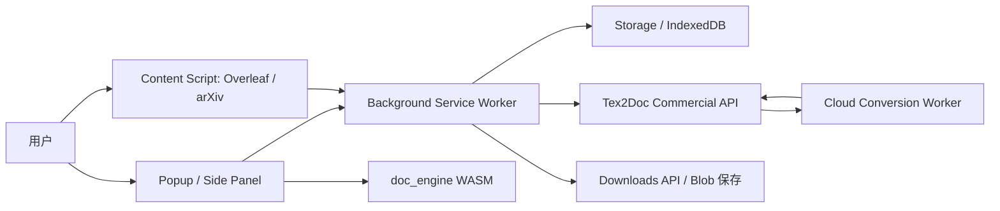
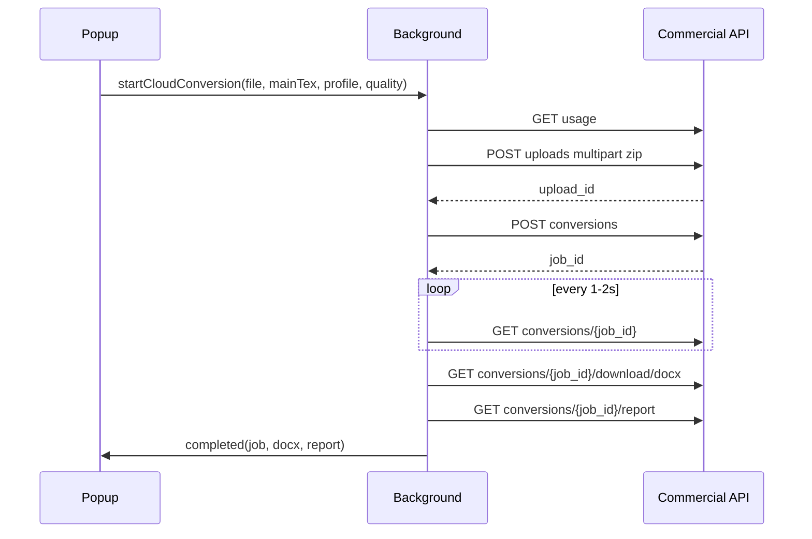

# Tex2Doc 浏览器插件商业化规划与实现方案

> **版本 / Version**: v1.0  
> **最后更新日期 / Last Updated**: 2026-06-27  
> **适用范围**: `extension/`、`crates/wasm`、`crates/commercial-api-client`、`apps/slint-user`

---

## 一、结论摘要

Tex2Doc 目前已经具备三类可复用资产：

1. `apps/slint-user` 已形成用户端商业化闭环：本地/云端转换、账号登录、用量额度、套餐/充值码、转换记录、反馈、设置、更新检查。
2. `crates/wasm` 已暴露 `convert_zip` / `convert_zip_to_docx`，可在浏览器内完成轻量本地转换。
3. `extension/` 已有 Chrome Manifest V3 原型：popup 选择 zip、加载 WASM、执行转换、下载 docx，并在 Overleaf/arXiv 注入 content script。

建议把现有 `extension/` 从“Chrome 本地转换原型”升级为“Tex2Doc 商业化浏览器插件”。第一阶段优先支持 Chrome / Edge / Chromium 系浏览器，第二阶段扩展到 Firefox，第三阶段通过 Safari Web Extension + Xcode 包装上架 Safari。核心技术路线采用 WebExtensions + Manifest V3，以 TypeScript + WXT 或等价构建层统一多浏览器产物；商业能力复用现有云端 API，不在插件内复制计费逻辑。

---

## 二、官方兼容依据

| 浏览器 | 推荐策略 | 依据 |
|------|----------|------|
| Chrome / Chromium | 主线采用 Manifest V3，继续使用 service worker、action popup、storage、downloads、contextMenus | Chrome 官方说明 Manifest V3 是当前扩展平台，Chrome Web Store 不再接受 MV2 新扩展；参考 [Chrome MV3](https://developer.chrome.com/docs/extensions/develop/migrate/what-is-mv3) 与 [manifest_version](https://developer.chrome.com/docs/extensions/reference/manifest/manifest-version) |
| Microsoft Edge | 与 Chromium MV3 同源，单独生成 Edge 商店包并保留权限说明 | Microsoft 官方说明 Edge 采用 MV3 以减少碎片化；参考 [Edge MV3](https://learn.microsoft.com/en-us/microsoft-edge/extensions/developer-guide/manifest-v3) |
| Firefox | 采用 WebExtensions API，MV3 下兼容 `background.service_worker` 与 `background.scripts` 差异 | MDN 指出 WebExtension 必须包含 manifest，并建议跨浏览器 MV3 背景脚本同时声明 `scripts` 与 `service_worker`；参考 [MDN manifest.json](https://developer.mozilla.org/en-US/docs/Mozilla/Add-ons/WebExtensions/manifest.json) 与 [background](https://developer.mozilla.org/en-US/docs/Mozilla/Add-ons/WebExtensions/manifest.json/background) |
| Safari | 通过 Safari Web Extension 封装，使用 Xcode/App Store 分发 | Apple 官方说明 Safari Web Extension 使用 HTML/CSS/JS 与常见 WebExtension 文件格式，并通过 App Store 分发；参考 [Safari Web Extensions](https://developer.apple.com/documentation/safariservices/safari-web-extensions) 与 [Safari Extensions](https://developer.apple.com/safari/extensions/) |
| 构建框架 | 推荐 WXT 作为跨浏览器构建层；Safari 发布仍需单独 Xcode 流程 | WXT 官方说明可为 Chrome、Firefox、Edge、Safari 和 Chromium 浏览器构建扩展，但 Safari 自动发布暂不支持；参考 [WXT](https://wxt.dev/) 与 [WXT Publishing](https://wxt.dev/guide/essentials/publishing) |

---

## 三、现状审计

### 3.1 `apps/slint-user` 功能模块

| 桌面端模块 | 现有职责 | 浏览器插件映射 |
|-----------|----------|----------------|
| `cloud_account.rs` | 登录、注册、刷新 token、获取用量、套餐、结账、账单门户、充值码、记录、反馈 | `src/services/auth.ts`、`billing.ts`、`usage.ts`、`feedback.ts` |
| `cloud_convert.rs` | 上传 zip、创建云转换任务、轮询任务、下载 docx/report；本地引擎额度检查与消耗 | `conversion/cloud.ts`、`conversion/local-wasm.ts`、`jobs.ts` |
| `credential_store.rs` | 桌面安全存储 refresh token | `browser.storage.local` + Web Crypto 包装；避免明文暴露到 content script |
| `app_state.rs` / `job_history.rs` | 账号状态、额度、任务历史、最近 50 条记录 | `IndexedDB` 或 `browser.storage.local` 持久化任务队列 |
| `settings.rs` | API Base URL、质量级别、默认 profile、主题、语言、上次项目 | `options` 页面 + `browser.storage.sync/local` |
| `diagnostics.rs` | 导出诊断包 | 插件内导出 JSON/zip，通过 `downloads` API 下载 |
| `desktop_update.rs` / `updater.rs` | 发布清单检查、更新提示 | 插件不能自更新代码；仅展示服务端公告/版本提示，真正更新交给各商店 |

### 3.2 当前 `extension/` 能力

当前原型已经实现：

- `manifest.json`: Manifest V3、popup、service worker、contextMenus、storage。
- `popup/popup.js`: 加载 `popup/wasm/doc_engine.js` 与 `doc_engine_bg.wasm`，选择 zip 后调用 `convert_zip_to_docx`，生成 docx 下载。
- `content/content.js`: 在 Overleaf / arXiv 页面监听选区文本并缓存。
- `scripts/e2e_extension.mjs`: 静态检查 manifest/popup/background/WASM，并做 popup DOM 冒烟。

主要缺口：

- 仅面向 Chrome，未生成 Edge/Firefox/Safari 差异化 manifest。
- 没有账号、用量、充值、云转换、转换记录、反馈等商业化模块。
- `host_permissions` 使用 `<all_urls>`，商店审核和用户信任风险较高。
- popup 承担长任务，MV3 service worker 非持久特性尚未纳入任务队列设计。
- 没有 TypeScript 类型、API 客户端、状态管理、单元测试和多浏览器打包流水线。

---

## 四、产品定位

### 4.1 目标用户

- Overleaf / arXiv / 期刊投稿场景下，需要快速把 LaTeX 项目转换为 Word 的科研作者。
- 论文润色、投稿服务、学术机构、实验室管理员。
- 已购买 Tex2Doc 额度或希望通过浏览器轻量试用的潜在付费用户。

### 4.2 核心卖点

1. **浏览器内即用**：在 Overleaf、arXiv、投稿系统页面直接唤起转换。
2. **轻量本地试用**：小项目可使用 WASM 本地转换，降低首次体验门槛。
3. **云端高质量转换**：登录后使用云端语义引擎处理大文件、复杂模板和质量报告。
4. **商业闭环完整**：额度、套餐、充值码、记录、反馈与桌面端一致。
5. **跨浏览器覆盖**：Chrome、Edge、Firefox、Safari 均可推广，适合商业化渠道分发。

---

## 五、功能规划

### 5.1 插件页面

| 页面 | 入口 | 功能 |
|------|------|------|
| Popup | 工具栏图标 | 快速转换、账号摘要、额度、最近任务、当前网页上下文 |
| Options | 扩展设置页 | API Base URL、默认 profile/quality、语言、主题、隐私设置、调试导出 |
| Side Panel / 独立 Tab | Chrome/Edge 可选，Firefox/Safari 降级为 tab 页面 | 复杂任务队列、记录、充值、反馈、质量报告 |
| Content Overlay | Overleaf/arXiv 可选注入 | “转换当前项目/选区/下载源码包”快捷入口 |

### 5.2 功能分层

| 优先级 | 功能 | 验收标准 |
|--------|------|----------|
| P0 | 多浏览器工程化骨架 | 可分别构建 Chrome、Edge、Firefox 包；Chrome 原有 WASM 转换不回退 |
| P1 | 账号与用量 | 登录/注册/刷新 token；popup 展示套餐、剩余额度、过期日期 |
| P1 | 云端转换 | 上传 zip、创建任务、轮询、下载 docx/report；任务状态可在 popup 重开后恢复 |
| P1 | 设置与安全存储 | API URL、profile、quality、语言主题持久化；token 不暴露给 content script |
| P2 | 套餐/充值码 | 拉取套餐、打开 checkout/portal、兑换充值码、刷新用量 |
| P2 | 转换记录 | 查询云端记录，合并本地 WASM 历史，支持下载 report/docx |
| P2 | 反馈 | 针对转换任务提交 issue/feature，查询反馈线程 |
| P3 | Overleaf/arXiv 集成 | 捕获上下文，提供“从当前页面转换/打开插件”入口 |
| P3 | 诊断导出 | 导出插件版本、浏览器、任务状态、错误日志，排除用户文件内容 |
| P3 | Safari 上架 | Xcode 包装、App Store 元数据、手动 QA 清单通过 |

---

## 六、推荐技术架构

### 6.1 总体架构



### 6.2 目录结构建议

保留根目录 `extension/` 作为浏览器插件发布单元，内部升级为 TypeScript 工程：

```text
extension/
├── package.json
├── wxt.config.ts
├── public/
│   ├── icons/
│   └── wasm/
│       ├── doc_engine.js
│       └── doc_engine_bg.wasm
├── src/
│   ├── entrypoints/
│   │   ├── background.ts
│   │   ├── content.overleaf.ts
│   │   ├── content.arxiv.ts
│   │   ├── popup/
│   │   │   ├── App.tsx
│   │   │   └── main.tsx
│   │   └── options/
│   │       ├── App.tsx
│   │       └── main.tsx
│   ├── services/
│   │   ├── api-client.ts
│   │   ├── auth.ts
│   │   ├── usage.ts
│   │   ├── billing.ts
│   │   ├── feedback.ts
│   │   └── releases.ts
│   ├── conversion/
│   │   ├── cloud.ts
│   │   ├── local-wasm.ts
│   │   ├── zip.ts
│   │   └── reports.ts
│   ├── state/
│   │   ├── settings-store.ts
│   │   ├── session-store.ts
│   │   ├── job-store.ts
│   │   └── event-log.ts
│   ├── browser/
│   │   ├── compat.ts
│   │   ├── permissions.ts
│   │   ├── downloads.ts
│   │   └── messaging.ts
│   └── ui/
│       ├── tokens.ts
│       ├── i18n.ts
│       └── components/
├── tests/
│   ├── unit/
│   └── e2e/
└── README.md
```

如暂不引入 React，也可用 Lit/Svelte/vanilla TS；关键是要有构建层统一 manifest、类型和多浏览器产物。

### 6.3 浏览器适配层

所有插件 API 通过 `browser/compat.ts` 访问，禁止业务模块直接写 `chrome.*`：

```ts
import browser from "webextension-polyfill";

export const ext = {
  storage: browser.storage,
  runtime: browser.runtime,
  downloads: browser.downloads,
  tabs: browser.tabs,
  permissions: browser.permissions,
};
```

设计原则：

- `background` 负责账号刷新、任务队列、云端轮询、下载保存。
- `popup` 只展示状态和触发命令，关闭后任务仍可恢复。
- `content script` 不接触 token，不直接请求商业 API。
- 所有跨上下文消息使用明确的 `type` 和 schema 校验。

---

## 七、核心流程设计

### 7.1 登录与会话

1. Popup / Options 输入邮箱密码。
2. `background` 调用 `POST auth/login` 或 `POST auth/register`。
3. access token 存内存，refresh token 写入 `browser.storage.local`。
4. 插件启动时用 refresh token 调用 `POST auth/refresh`，随后请求 `GET me` 与 `GET usage`。
5. 任何 401 都触发一次刷新；刷新失败则回到未登录态。

安全要求：

- refresh token 不传给 content script。
- popup 页面禁止内联远程脚本。
- 错误日志不得包含密码、token、用户上传文件内容。

### 7.2 云端转换



实现要点：

- 轮询状态写入 `job-store`，popup 关闭后可恢复。
- 上传大文件和云端转换默认要求登录。
- `completed && docx_ready && report_ready` 后才展示下载。
- `failed/expired` 记录错误码、错误信息和可反馈入口。
- report 以 `.report.json` 保存，并在 UI 中抽取质量分、profile、backend、warnings。

### 7.3 本地 WASM 转换

本地 WASM 用于试用、隐私优先和小文件场景：

- 默认上限建议 5-10 MB，具体以内存测试为准。
- 成功后生成本地历史记录，不消耗云端额度。
- 若用户已登录且产品策略要求“本地转换也计次”，则调用 `local-conversions/check` / `consume`；否则保持免费体验漏斗。
- WASM 转换失败时提供“一键改用云端转换”，并保留主 tex、profile、quality。

### 7.4 充值与商业转化

- 插件内展示套餐和额度，但支付页通过 `billing/checkout` 返回的 URL 在新 tab 打开。
- 充值码兑换复用 `redeem-codes/redeem`。
- 兑换成功后立即刷新 `usage`，并展示“剩余额度/有效期”。
- 未登录用户在第一次云转换、大文件转换、查看记录时弹出轻量登录引导。

### 7.5 记录与反馈

- 云端记录来自 `GET conversions`。
- 本地 WASM 记录来自 `job-store`。
- 反馈提交使用 `POST feedback/threads`，可绑定 `conversion_job_id`。
- 反馈列表使用 `GET feedback/threads`，在 Side Panel 或 Options 页展示。

---

## 八、权限与隐私策略

### 8.1 Manifest 权限

首发建议：

```json
{
  "permissions": [
    "storage",
    "downloads",
    "contextMenus",
    "notifications"
  ],
  "host_permissions": [
    "https://api.tex2doc.cn/*"
  ],
  "optional_host_permissions": [
    "https://www.overleaf.com/*",
    "https://*.overleaf.com/*",
    "https://arxiv.org/*",
    "https://*.arxiv.org/*"
  ]
}
```

不建议继续使用 `<all_urls>` 作为默认 host 权限。Overleaf/arXiv 集成应使用可选权限或明确白名单，降低商店审核风险和用户安装警告。

### 8.2 数据收集边界

| 数据 | 是否上传 | 说明 |
|------|----------|------|
| 用户邮箱、账号 token | 是 | 仅用于登录和鉴权 |
| 上传 zip | 云转换时上传 | 本地 WASM 转换不上传 |
| 转换日志/质量报告 | 云转换时由服务端生成；本地转换仅本地保存 | 用户主动反馈时可选择附带 |
| 页面选区文本 | 默认不上传 | 仅用于本地填充输入；上传前必须二次确认 |
| 诊断信息 | 用户主动导出或提交反馈时上传 | 不包含源文件内容 |
| 匿名产品事件 | 可选 | 默认关闭或在隐私政策中明确说明 |

---

## 九、跨浏览器发布策略

### 9.1 构建产物

| 目标 | 产物 | 发布渠道 |
|------|------|----------|
| Chrome | `.output/chrome-mv3.zip` | Chrome Web Store |
| Edge | `.output/edge-mv3.zip` | Microsoft Edge Add-ons |
| Firefox | `.output/firefox-mv3.zip` | addons.mozilla.org |
| Safari | Xcode Safari Web Extension wrapper | Mac App Store / App Store |
| 企业客户 | 签名 CRX / 私有 AMO / MDM 配置 | 企业分发 |

### 9.2 Safari 单独事项

Safari 需要单独排期，因为它通常需要：

- macOS + Xcode 构建环境。
- Safari Web Extension App 包装。
- App Store 元数据、隐私标签和审核。
- iOS/iPadOS 适配验证。

因此 Safari 不应阻塞 Chrome/Edge 首发，但必须在产品对外宣发中列入 GA 支持目标。

---

## 十、实施里程碑

| 阶段 | 时间 | 目标 | 主要交付 |
|------|------|------|----------|
| M0 审计与工程骨架 | 1 周 | 建立跨浏览器插件工程 | WXT/TS 骨架、多 manifest 模板、WASM 拷贝脚本、原 Chrome 功能迁移 |
| M1 账号与用量 | 1-2 周 | 打通商业账号 | auth/usage/settings/session-store、登录态 UI、token 刷新 |
| M2 云转换闭环 | 2 周 | 插件商业核心可用 | upload/create/poll/download/report、任务队列、错误恢复 |
| M3 本地 WASM 与漏斗 | 1 周 | 本地试用体验可用 | WASM 转换模块、大小分流、云端 fallback、历史记录 |
| M4 充值/记录/反馈 | 1-2 周 | 对齐 Slint 用户端商业模块 | plans/checkout/portal/redeem、云端记录、反馈线程 |
| M5 内容脚本集成 | 1 周 | Overleaf/arXiv 场景化推广 | optional permissions、页面快捷入口、上下文捕获 |
| M6 多浏览器 QA 与上架 | 2 周 | 商业发布 | Chrome/Edge/Firefox 商店包、Safari 包装方案、隐私政策、截图、审核材料 |

首个可商用 Beta 建议范围：Chrome + Edge，支持登录、云转换、用量、充值码、本地 WASM、小文件下载和基础记录。Firefox/Safari 在 Beta 后 2-4 周内进入正式兼容。

---

## 十一、验收标准

### 11.1 功能验收

- [ ] Chrome/Edge 安装后 popup 可正常打开，显示版本、账号、额度。
- [ ] 未登录用户可完成一次本地 WASM 小文件转换。
- [ ] 登录用户可完成云端转换：上传 zip、轮询、下载 docx/report。
- [ ] 大文件自动走云端或提示登录/升级。
- [ ] 充值码兑换成功后额度立即刷新。
- [ ] 转换记录可展示云端与本地来源。
- [ ] 失败任务可一键提交反馈。
- [ ] Options 可配置 API Base URL、profile、quality、语言、主题。
- [ ] Overleaf/arXiv 可选权限授权后才注入增强入口。

### 11.2 技术验收

- [ ] `npm run build:wasm` 后自动同步 WASM 到插件公共资源目录。
- [ ] Chrome/Edge/Firefox 构建产物均通过 manifest 校验。
- [ ] Playwright 至少覆盖 Chrome popup、云端 mock 转换、本地 WASM 转换。
- [ ] Firefox 完成手动安装、登录、转换、下载测试。
- [ ] Safari 完成 Xcode 包装构建和手动转换测试。
- [ ] 扩展包不包含远程执行脚本。
- [ ] 默认权限不包含 `<all_urls>`。
- [ ] token 不出现在 content script、日志、反馈包中。

---

## 十二、测试方案

### 12.1 自动化测试

建议新增脚本：

```json
{
  "scripts": {
    "extension:dev": "wxt",
    "extension:build": "wxt build",
    "extension:build:chrome": "wxt build -b chrome",
    "extension:build:edge": "wxt build -b edge",
    "extension:build:firefox": "wxt build -b firefox",
    "extension:zip": "wxt zip",
    "e2e:extension:chrome": "playwright test extension/tests/e2e/chrome.spec.ts",
    "test:extension": "vitest run extension/tests/unit"
  }
}
```

测试覆盖：

- API 客户端：auth、usage、upload、conversion、billing、feedback。
- Store：settings/session/job/event-log 的迁移和容错。
- WASM：小 zip 转换、错误主 tex、超限文件。
- UI：未登录、登录中、额度不足、转换中、失败、完成。
- 权限：未授权 Overleaf 时不注入；授权后注入。

### 12.2 手动 QA

| 浏览器 | 必测项 |
|--------|--------|
| Chrome stable | 全流程、商店包、权限提示、下载 |
| Edge stable | 全流程、Edge Add-ons 包、企业策略兼容 |
| Firefox stable/ESR | background 差异、下载、storage、content script |
| Safari macOS | Xcode 包装、启用扩展、popup、下载 |
| Safari iOS/iPadOS | 页面尺寸、权限、登录、基础转换 |

---

## 十三、主要风险与缓解

| 风险 | 等级 | 缓解 |
|------|------|------|
| MV3 service worker 被浏览器回收，长任务中断 | 高 | 任务状态持久化；轮询放 background；使用 alarms/消息恢复 |
| 多浏览器 API 差异导致同包不可用 | 高 | `browser/compat.ts` 统一适配；为每个浏览器生成独立 manifest |
| Safari 包装和审核周期拖慢发布 | 中 | Chrome/Edge 先发；Safari 作为独立里程碑 |
| 商店拒绝过宽权限或远程代码 | 高 | 默认最小权限；所有 JS/WASM 打入包内；隐私政策明确 |
| WASM 大文件内存溢出 | 中 | 文件大小阈值、云端 fallback、转换前估算 |
| token 泄漏 | 高 | content script 隔离；日志脱敏；refresh token 单独存储 |
| 云 API CORS/下载头不兼容扩展 | 中 | API 增加扩展 origin 白名单；下载接口返回正确 MIME 与 disposition |
| 当前 GitNexus 索引落后 | 低 | 实施前重新 `node .gitnexus/run.cjs analyze`，修改符号前跑 impact |

---

## 十四、落地建议

短期不建议直接大改 `apps/slint-user`。浏览器插件应复用它的产品能力和 API 语义，但实现上采用 WebExtension 原生形态：

1. **保留现有 `extension/` 为发布单元**，先迁移为 TypeScript/WXT 工程。
2. **云端商业能力优先**，确保账号、额度、转换、充值、记录可形成付费闭环。
3. **WASM 作为体验入口**，强调隐私和试用，不承担所有复杂论文转换。
4. **Chrome/Edge 先商业 Beta**，Firefox/Safari 分阶段补齐。
5. **权限最小化和隐私政策前置**，这是商店审核和商业推广的关键。

按上述路径，浏览器插件可以成为桌面端之外的低摩擦获客入口：用户在写作、检索、投稿页面遇到转换需求时直接触发 Tex2Doc，完成体验后自然进入登录、充值和云端高质量转换闭环。
