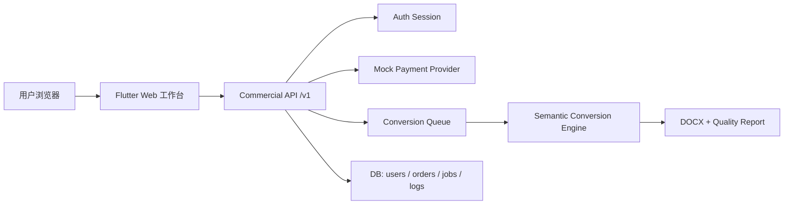

# Tex2Doc Web 商业化工作台设计方案
> **版本 / Version**: v2.0
> **最后更新日期 / Last Updated**: 2026-06-26

日期：2026-06-23

## 目标

Web 端进入商业化推广前，需要形成“登录注册 -> 充值到账 -> 上传转换 -> 查询记录 -> 账号核对”的闭环。当前阶段支付与账号体系采用 mock 实现，但接口、数据字段和页面结构按正式集成预留。

## 数据库设计

### users

| 字段 | 类型 | 说明 |
| --- | --- | --- |
| id | varchar | 用户 ID |
| email | varchar | 登录邮箱，唯一 |
| password_hash | varchar | 密码哈希，当前 mock 阶段可为空 |
| display_name | varchar | 显示名 |
| status | varchar | active / disabled |
| created_at | timestamp | 注册时间 |
| updated_at | timestamp | 更新时间 |

### account_entitlements

| 字段 | 类型 | 说明 |
| --- | --- | --- |
| id | varchar | 权益记录 ID |
| user_id | varchar | 用户 ID |
| plan_id | varchar | preview / count / date |
| count_balance | int | 按次余额 |
| valid_from | timestamp | 日期权益开始时间 |
| valid_until | timestamp | 日期权益结束时间 |
| source_order_id | varchar | 来源充值订单 |
| updated_at | timestamp | 更新时间 |

### recharge_orders

| 字段 | 类型 | 说明 |
| --- | --- | --- |
| id | varchar | 充值订单 ID |
| user_id | varchar | 用户 ID |
| recharge_type | varchar | count / date |
| package_id | varchar | count_3 / count_10 / day / week / month / year |
| quantity | int | 次数或天数 |
| amount_cents | int | 金额，单位分 |
| currency | varchar | CNY |
| provider | varchar | mock-pay / wechat / alipay |
| provider_trade_id | varchar | 三方交易号 |
| status | varchar | pending / paid / failed / refunded |
| created_at | timestamp | 创建时间 |
| paid_at | timestamp | 到账时间 |

### conversion_jobs

| 字段 | 类型 | 说明 |
| --- | --- | --- |
| id | varchar | 转换任务 ID |
| user_id | varchar | 用户 ID |
| upload_id | varchar | 上传文件 ID |
| main_tex | varchar | ZIP 内主 TeX 路径 |
| profile | varchar | 期刊或转换 profile |
| quality | varchar | 转换质量级别 |
| engine | varchar | semantic-engine |
| status | varchar | queued / processing / completed / failed |
| docx_uri | varchar | 产物地址 |
| report_json | json | 质量报告 |
| error_code | varchar | 错误码 |
| error_message | text | 错误详情 |
| created_at | timestamp | 创建时间 |
| updated_at | timestamp | 更新时间 |

### conversion_logs

| 字段 | 类型 | 说明 |
| --- | --- | --- |
| id | varchar | 日志 ID |
| job_id | varchar | 转换任务 ID |
| level | varchar | info / warn / error |
| stage | varchar | upload / normalize / convert / verify / download |
| message | text | 日志内容 |
| created_at | timestamp | 记录时间 |

## 系统架构

当前实现仍使用内存态 `ServerState`，用于开发和集成测试；正式部署时替换为 PostgreSQL 或 MySQL，接口字段保持兼容。

## 功能设计

1. 登录注册
   - 未登录时，账号以外的充值、转换、记录查询按钮全部禁用。
   - 注册成功后直接返回 access token，并进入可操作状态。

2. 充值模块
   - 按次充值：1 元/次，最低 3 次，页面默认展示 3、10、30 次。
   - 日期充值：日卡 5 元、周卡 14 元、月卡 30 元、年卡 120 元。
   - 当前使用 `mock-pay` 即时返回 `paid_mock`，后续接入三方时保留 provider 与 provider_trade_id。

3. 转换模块
   - 上传 ZIP、填写主 TeX 路径、启动云端语义引擎、下载 DOCX。
   - 页面提供 ZIP 打包提示：主 tex、bib、图片、cls/sty 等依赖需要在同一个项目 ZIP 内。
   - 输出上传、任务创建、轮询、完成、失败等日志。
   - 可查询当前登录账号的转换记录。

4. 账号模块
   - 展示登录账号、套餐、云端额度。
   - 可查询充值记录和转换记录。
   - 作为客服排障入口，后续可扩展订单号、任务号复制与退款状态查询。

## UI 设计

- 左侧导航：工作台、账号、充值、转换四个主模块。
- 工作台：聚合账号登录、充值入口、转换入口，适合首次使用。
- 账号页：上方登录/注册，下方账号总览与记录查询。
- 充值页：按次与按日期分组展示套餐，按钮文案直接显示数量和价格。
- 转换页：先展示操作步骤与 ZIP 打包规则，再提供上传、转换、记录查询和日志输出。
- 响应式：桌面端使用左侧导航，窄屏使用顶部 SegmentedButton。

## 后续接入计划

1. 将内存态用户、订单、任务迁移到数据库。
2. 接入微信/支付宝支付，使用 webhook 更新 `recharge_orders.status`。
3. 将充值到账写入 `account_entitlements`，并在转换前扣减权益。
4. 将转换日志由前端临时日志升级为服务端 `conversion_logs` 可追溯日志。
5. 增加管理员订单查询、任务重试、失败原因归类与客服导出能力。
