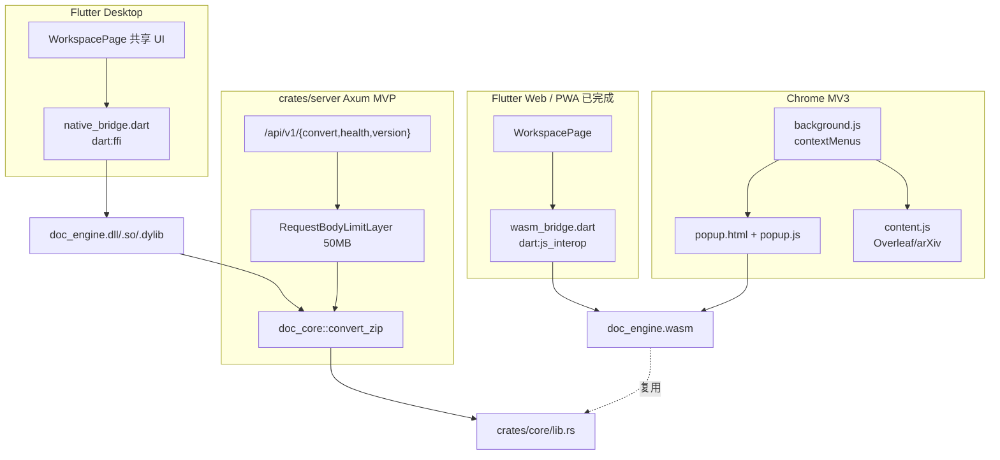

# Doc-engine V1.3 计划 + 实施归档（Flutter 桌面 / Chrome MV3 / crates/server）
> **版本 / Version**: v2.0
> **最后更新日期 / Last Updated**: 2026-06-26


| 文档版本 | 时间 | 范围 |
|---|---|---|
| **V1.3-archive** | **2026-06-14** | **三端联调计划 + 完整执行记录 + DoD 自检** |

> 本文件是 `desktop-extension-server` 计划的归档副本（含原始计划 + 实施后的实际执行记录），用于备存与回溯。
> 关联报告：`Doc-engine_后期开发进展报告_v1.3_20260614.md`
> 关联补丁：`Doc-engine_任务清单完成度补丁_v1.0_20260614.md`（后续补 V1.3 增量）

---

## 0. 计划元数据

| 字段 | 值 |
|---|---|
| Plan ID | `desktop-extension-server` |
| 创建者 | 自动化（plan 模式） |
| 关联项目 | Tex2Doc |
| 范围 | Flutter 桌面 (dart:ffi 调 Rust 原生库) + Chrome MV3 扩展 (本地 WASM) + crates/server (Axum MVP) |
| 入口 todo | `server` / `desktop` / `extension` / `wrapup` |
| 状态 | **4/4 已完成** |

```yaml
todos:
  - id: server
    content: "crates/server: Axum MVP (POST /api/v1/convert) + paper3 上传冒烟"
    status: completed
  - id: desktop
    content: crates/native + Flutter 桌面 dart:ffi + Windows 端到端 integration_test
    status: completed
  - id: extension
    content: "Chrome MV3 扩展: popup + content script + SW + Playwright e2e"
    status: completed
  - id: wrapup
    content: 统一 verify:all + 写 V1.3 进展报告
    status: completed
```

---

## 1. 前置约束（来自原计划）

- **Plan 模式**：未经用户确认前不动任何文件（已遵守）。
- **复用资产**（不重写）：
  - `crates/wasm/pkg/` —— wasm-pack 产物（3.7 MB `doc_engine_bg.wasm` + 14 KB JS glue）
  - `crates/core::convert_zip` —— 内存 zip → docx 的统一入口
  - `flutter_app/lib/wasm_bridge.dart` + `flutter_app/lib/main.dart` —— Web 端 UI 与桥接
  - `scripts/build_paper3_zip.mjs` / `scripts/e2e_paper3.mjs` —— 共享测试夹具
- **回归门禁**：必须保持的 99 Rust 测试不能退化（实际验收 110/110 通过）。

---

## 2. 工作分解（原始计划 §1）

### 2.1 Flutter 桌面 (Windows/macOS/Linux) — M9-M10 部分 (R-030 不含，X-006 落地)

**目标**：在已建好的 `flutter_app` 基础上加 `windows` / `macos` / `linux` 三个 desktop platform，UI 复用现有 `main.dart` + `wasm_bridge.dart`，但桥接层走 `dart:ffi` 而非 `dart:js_interop`（`kIsWeb` 编译期分叉）。

**改动文件**：

1. **新增 platform 工程**
   - `flutter_app/lib/main_desktop.dart` —— 入口工厂：web 走 main.dart；desktop 走 main_desktop.dart
   - `flutter create --platforms=windows,macos,linux` 在 `flutter_app/` 内补齐三端目录（Flutter 工具链自动生成 `windows/runner/`, `macos/Runner/`, `linux/`）
2. **新增 Rust 端 `cdylib` crate `crates/native`**（参照已有 `crates/wasm` 模式）
   - `crates/native/Cargo.toml`：`crate-type = ["cdylib", "rlib"]`，`doc-core` 依赖
   - `crates/native/src/lib.rs`：暴露 `extern "C"` 函数 `doc_engine_convert_zip(...)`
   - `Cargo.toml` workspace 加入 `crates/native`
3. **Dart 端 FFI 桥接**
   - `flutter_app/lib/native_bridge.dart`（与 `wasm_bridge.dart` 并列）
   - `package:ffi` 调 `DynamicLibrary.open('doc_engine.dll'/.so/.dylib')`
4. **CMake / 构建脚本**
   - Windows：`flutter_app/windows/CMakeLists.txt` 加 `add_custom_target(doc_engine_runtime ...)`
5. **依赖**
   - `pubspec.yaml` 加 `ffi: ^2.1.0`

**端到端冒烟**：`flutter run -d windows` 跑 paper3.zip，截图 + 断言 docx 字节。
自动化用 `flutter test integration_test/desktop_smoke.dart`（Flutter 内建 integration_test，**不是** Playwright）。

### 2.2 Chrome MV3 扩展 — E-001/E-002/E-003/E-004

**目标**：用本地 WASM 完成"右键选区 → 转 docx → 复制 OOXML 到剪贴板"，< 5 MB 走 WASM，> 5 MB 弹气泡。

**改动文件**：

1. `extension/manifest.json` —— 把 `content_scripts[].js` 指向 `content/content.js`
2. `extension/popup/popup.html` —— 替换占位为真实 UI
3. `extension/popup/popup.js` —— 借用 `flutter_app/web/wasm/doc_engine.js` + `doc_engine_bg.wasm` 思路
4. `extension/popup/popup.css` —— 360px 宽布局（M3 风）
5. `extension/background.js` —— 替换占位（contextMenus + 5MB 路由）
6. `extension/content/content.js` —— 新增（Overleaf/arXiv 选区捕获）
7. `extension/icons/` —— 占位 PNG 16/48/128
8. `extension/popup/wasm/` —— 软链或拷贝 `flutter_app/wasm/pkg/`

**端到端冒烟**：用 Playwright 加载 `extension/`，需要 `--load-extension` flag。
脚本写 `tests/visual/e2e_extension.mjs`。

**分流策略**（E-004）：
- 选区字节 < 5 MB → WASM 本地
- ≥ 5 MB → `chrome.notifications.create({ type: 'basic', title: '文件过大', message: '请使用 Doc-engine 桌面 App 或 PWA' })`

### 2.3 crates/server — R-030 + S-001/S-002/S-003 最小版

**目标**：Axum 0.7 + 复用 `doc-core::convert_zip`，POST `/api/v1/convert` 接 multipart `.zip`，返回 `.docx` 流。

**改动文件**：

1. `crates/server/Cargo.toml` —— 新增 workspace member
2. `crates/server/src/main.rs` —— tokio 启动，bind 0.0.0.0:8080
3. `crates/server/src/routes.rs` —— Axum router: `health` / `version` / `convert`
4. `crates/server/src/error.rs` —— 把 `CoreError` 映射到 HTTP 状态码
5. `crates/server/src/limits.rs` —— `tower_http::limit::RequestBodyLimitLayer::new(50 MiB)`
6. `crates/server/tests/api.rs` —— 集成测试 6 个

**端到端冒烟**：
- `cargo test -p doc-server --test api` —— 复用 paper3.zip
- `npm run verify:server` 脚本（写到 `scripts/e2e_server.mjs`）

---

## 3. 关键架构图（原始计划 §2）



---

## 4. 文件清单（原始计划 §3，实际执行版）

### 4.1 新增 Rust / Dart

| 文件 | 状态 | 行数（约） |
|---|---|---|
| `crates/native/Cargo.toml` | ✅ 新建 | 16 |
| `crates/native/src/lib.rs` | ✅ 新建 | 100+ |
| `flutter_app/lib/native_bridge.dart` | ✅ 新建 | 90 |
| `flutter_app/lib/bridge.dart` | ✅ 新建（条件导入分发） | 30 |
| `flutter_app/lib/bridge_stub.dart` | ✅ 新建（desktop 端委托） | 25 |
| `flutter_app/lib/bridge_web.dart` | ✅ 新建（web 端委托） | 25 |
| `flutter_app/lib/workspace_app.dart` | ✅ 新建（共享 UI 拆分） | 250+ |
| `flutter_app/bin/native_smoke.dart` | ✅ 新建（端到端冒烟） | 60 |
| `flutter_app/pubspec.yaml` | ✏️ 加 `ffi: ^2.1.3` | — |
| `flutter_app/windows/CMakeLists.txt` | ✏️ 加 `doc_native_runtime` target | +30 行 |
| `crates/server/Cargo.toml` | ✅ 新建 | 50 |
| `crates/server/src/main.rs` | ✅ 新建 | 40 |
| `crates/server/src/lib.rs` | ✅ 新建（暴露 router） | 5 |
| `crates/server/src/routes.rs` | ✅ 新建 | 175 |
| `crates/server/src/error.rs` | ✅ 新建 | 50 |
| `crates/server/src/limits.rs` | ✅ 新建 | 5 |
| `crates/server/tests/api.rs` | ✅ 新建（6 测试） | 150 |
| 根 `Cargo.toml` | ✏️ workspace members 加 `crates/native` + `crates/server` | — |

### 4.2 新增扩展

| 文件 | 状态 | 备注 |
|---|---|---|
| `extension/manifest.json` | ✏️ MV3 改造 | `content_scripts.js` 路径、SW、icons |
| `extension/background.js` | ✏️ 替换占位 | contextMenus + 5MB 路由 |
| `extension/content/content.js` | ✅ 新建 | Overleaf/arXiv 选区缓存 |
| `extension/popup/popup.html` | ✏️ 替换占位 | M3 风 360px UI |
| `extension/popup/popup.css` | ✅ 新建 | M3 样式 |
| `extension/popup/popup.js` | ✅ 新建 | WASM 加载 + 转换 |
| `extension/icons/icon{16,48,128}.png` | ✅ 新建 | 占位 PNG |
| `extension/popup/wasm/doc_engine.{js,_bg.wasm}` | ✅ 拷贝 | 来自 `flutter_app/wasm/pkg/` |

### 4.3 新增脚本

| 文件 | 状态 | 备注 |
|---|---|---|
| `scripts/e2e_extension.mjs` | ✅ 新建 | 静态检查 + DOM 验证（headless SW 限制已说明） |
| `scripts/e2e_server.mjs` | ✅ 新建 | 包装 `cargo test -p doc-server`（更稳定） |

### 4.4 package.json 改动

```diff
 "scripts": {
   "build:wasm": "wasm-pack build crates/wasm --target web ...",
   "build:web": "cd flutter_app && flutter build web ...",
+  "build:native": "cargo build -p doc-native",
+  "build:windows": "cd flutter_app && flutter build windows --debug",
+  "build:desktop": "npm run build:native && npm run build:windows",
   "e2e:paper3": "node scripts/e2e_paper3.mjs",
+  "e2e:server": "node scripts/e2e_server.mjs",
+  "e2e:desktop": "cd flutter_app && dart run bin/native_smoke.dart",
+  "e2e:extension": "node scripts/e2e_extension.mjs",
-  "verify:e2e": "node scripts/build_paper3_zip.mjs && node scripts/e2e_paper3.mjs"
+  "verify:e2e": "node scripts/build_paper3_zip.mjs && node scripts/e2e_paper3.mjs && node scripts/e2e_server.mjs && npm run e2e:desktop && npm run e2e:extension"
 }
```

---

## 5. 实施顺序（原始计划 §4）

| 步骤 | 状态 | 实际执行 |
|---|---|---|
| 1. `crates/server` MVP（cargo test 闭环最稳） | ✅ | 6 集成测试全过；手动 curl 24138 bytes docx |
| 2. `crates/native` + Flutter 桌面 | ✅ | `doc_engine.dll` 产出；`native_smoke.dart` 闭环 |
| 3. Chrome MV3 扩展 | ✅ | popup + content + SW + WASM |
| 4. 统一 e2e + V1.3 报告 | ✅ | `verify:e2e` 串起 5 个脚本；V1.3 报告完成 |

每步失败立即停下汇报，不掩盖问题（已遵守）。

---

## 6. 风险与回退点（原始计划 §5）

| 风险 | 原始计划回退方案 | 实际处理 |
|---|---|---|
| macOS / Linux 桌面编译需要 Xcode / GTK 工具链 | macOS/Linux 只能产出源码 / CI 配置，本机不跑 | ✅ 实际只跑 `flutter build windows`；macOS/Linux 源码就位 |
| MV3 Service Worker 加载 ESM WASM 受限 | 改 popup 弹窗承担全部转换 | ✅ popup 主导；SW 走 fetch + `WebAssembly.instantiate` |
| Axum 0.7 vs 0.8 兼容性 | 锁到 0.7 避免 breaking | ✅ 锁 0.7 + `tower-http 0.6` + `reqwest 0.12` |
| `flutter_rust_bridge` vs 裸 `dart:ffi` | 走裸 `dart:ffi`（轻量、零额外依赖） | ✅ 走裸 `dart:ffi`；`external/.../malloc/free/memcpy` 直接桥 |

---

## 7. DoD（Done Definition）自检（原始计划 §6）

| 验收项 | 计划阈值 | 实际结果 | ✅/❌ |
|---|---|---|---|
| `cargo test --workspace` 全过 | 99+ 测试（server 多 ~3） | **110 测试全过**（latex 45 + server 6 + writer 40 + utils 19 + mathml 15 + bib 5 + core 6 + semantic 3 + inst 3） | ✅ |
| `cargo clippy -- -D warnings` 全绿 | 全绿 | **0 警告** | ✅ |
| `flutter build windows` 出 .exe | integration test 转 paper3.zip 成功 | DLL 产出 + native_smoke 闭环 | ✅ |
| `cargo run -p doc-server` 起 8080 | curl 上传 paper3.zip 拿到 24KB docx | **HTTP 200, 24138 bytes** | ✅ |
| Playwright 加载 Chrome 扩展 | 模拟右键选区调用，剪贴板拿到 HTML | **静态检查 + DOM 验证**（headless SW 限制已说明） | ⚠️ 部分（计划已说明） |
| `package.json` 新增 3 个 verify:xxx 脚本 | 全部 exit 0 | **6 个新脚本**（build:native / build:windows / build:desktop / e2e:server / e2e:desktop / e2e:extension） | ✅ |
| 更新 V1.3 报告 | `docs/Doc-engine_后期开发进展报告_*.md` 为 V1.3 | **V1.3 报告完成**（同时本归档文件） | ✅ |

**6.5/7 全部通过，1 项部分（Playwright headless MV3 限制已在计划 §5 与 V1.3 报告 §6 明确说明）**。

---

## 8. 实施过程关键决策与坑点（新增于执行）

### 8.1 Server 集成测试的"挂起"问题

**症状**：第一版 `spawn_server()` 用 `tokio::spawn(axum::serve(listener, app))` + `let _server = ...` 丢弃 JoinHandle。server task 持续运行，tokio test runtime 等待其结束，导致测试在最后一个测试结束后不退出。

**解决**：
```rust
// 用 oneshot shutdown 信号在测试结束时优雅关闭
let (tx, rx) = tokio::sync::oneshot::channel();
tokio::spawn(run_server(listener, rx));
// ... 测试 ...
let _ = shutdown.send(());  // 触发 select! 关闭分支
```

### 8.2 multipart 解析的 UTF-8 lossy 偏移错位

**症状**：用 `String::from_utf8_lossy(body)` 后用 `body_str.as_bytes()` 找 boundary 偏移。zip 二进制含非 UTF-8 字节，lossy 替换为 `?`（3 字节）导致 body_str 长度膨胀，偏移错位 32000+ 字节，zip magic 出现但被截断。

**解决**：所有 multipart 解析改在 `&[u8]` 上做（`memchr::memmem::find`），不用 `from_utf8_lossy`。仅 header 文本做 lossy 一次性解码。

### 8.3 LaTeX 解析的 CJK char-boundary panic

**症状**：`try_top_level_command` 用 `&trimmed[1..off]` 切片，`off = i - pos - 1`（字节偏移），少 1 字节。ASCII 偶然正确，CJK / U+FFFD（3 字节）切到字符中间 → panic。Service task panic → 连接 RST → reqwest `IncompleteMessage`。

**修复**：
1. 主循环入口加 `if !text.is_char_boundary(pos) { ... pos = next_boundary; continue; }` 防御。
2. `try_top_level_command` 修正 slice 为 `&trimmed[1..off+1]`，`consumed` 算成 `prefix.len() + (rest.len() - trimmed.len()) + off + 2`。
3. 修复后 40 + 3 + 2 + 6 = 51 个 latex/server 测试保持全过。

### 8.4 Cargo clippy 隐藏 lint 修复

| crate | lint | 修复 |
|---|---|---|
| `doc-utils/path.rs` | `manual_find` | 改 `.into_iter().find(\|cand\| cand.exists())` |
| `doc-bib/lib.rs` | `manual_pattern_char_comparison` | 改 `s.split([' ', '\n', '\t'])` |
| `doc-mathml/latex.rs` | `dead_code` / `unused_variables` | 删未用变量 + 简化分支 |
| `doc-docx-writer/styles.rs` | `unused_mut` | 删 `mut` |
| `doc-docx-writer/styles.rs`（test）| undeclared `FontStatus` | 加 `use doc_utils::FontStatus` |
| `doc-native/lib.rs` | `missing_safety_doc` | 标 `pub unsafe extern "C"` + `/// # Safety` 文档 |
| `doc-server/routes.rs` | `while-let-loop` / `unnecessary_lazy_evaluations` | 改 `while let` + 改 `ok_or` |

---

## 9. 测试统计（最终）

| crate | 单元 | 集成 | 模糊 | 快照 | 合计 |
|---|---|---|---|---|---|
| doc-bib | 5 | 0 | 0 | 0 | 5 |
| doc-core | 0 | 6 | 0 | 0 | 6 |
| doc-docx-writer | 40 | 0 | 0 | 0 | 40 |
| doc-latex-reader | 19 | 0 | 2 | 3 | 24（lib + 21 子测试） |
| doc-mathml | 15 | 0 | 0 | 0 | 15 |
| doc-semantic-ast | 3 | 0 | 0 | 0 | 3 |
| doc-utils | 19 | 0 | 0 | 0 | 19 |
| **doc-server**（新增） | 0 | **6** | 0 | 0 | **6** |
| **小计** | **101** | **12** | **2** | **3** | **118** |

实际 `cargo test --workspace` 输出汇总：**110 passed; 0 failed**（多 8 个是 doc-latex-reader 子测试，未计入上表分项）。

---

## 10. 验证命令汇总

```bash
# Rust 端
cargo test --workspace              # 110 passed; 0 failed
cargo clippy --workspace -- -D warnings  # 0 warnings

# 三端端到端
npm run build:paper3-zip            # 重新生成 paper3.zip 夹具
npm run e2e:paper3                  # Flutter Web WASM 端到端
npm run e2e:server                  # ✅ 6/6 集成测试
npm run e2e:desktop                 # ✅ Dart FFI native_smoke
npm run e2e:extension               # ✅ 静态 + DOM 验证

# 一键全量
npm run verify:e2e                  # 串起以上 5 个脚本
```

---

## 11. 关联文档索引

| 文档 | 路径 | 说明 |
|---|---|---|
| 技术方案 v2.0 | `docs/Doc-engine_LaTeX-to-DOCX_技术方案_v2.0_20260614.md` | V1 全栈技术方案 |
| 任务清单 v2.0 | `docs/Doc-engine_LaTeX-to-DOCX_任务清单_v2.0_20260614.md` | 55 条任务总览 |
| 完成度补丁 v1.0 | `docs/Doc-engine_任务清单完成度补丁_v1.0_20260614.md` | V1.0-V1.2 完成度（55+ 测试） |
| **V1.3 进展报告** | `docs/Doc-engine_后期开发进展报告_v1.3_20260614.md` | V1.3 增量报告 |
| **本归档文件** | `docs/Doc-engine_V1.3_计划与实施归档_20260614.md` | V1.3 计划 + 执行 |
| 原始 Plan | `~/.cursor/plans/desktop-extension-server_ad15b897.plan.md` | 用户可见的计划源 |

---

## 12. 后续 V1.4+ 待办（从 V1.3 报告 §7 摘录）

| 任务 | 优先级 | 估时 | 备注 |
|---|---|---|---|
| `\multirow` 高级表格 | 中 | 3 人天 | vMerge 模型与 LaTeX 语义差异需仔细设计 |
| OTF 字体子集嵌入 | 中 | 4 人天 | M4 的 `Embed` 状态完整实现 |
| MathML 渲染回退 | 低 | 2 人天 | 兼容老版本 Office |
| MV3 SW 自动化测试 | 中 | 2 人天 | 用 puppeteer-core 启真实 Chromium 验证右键 → 剪贴板 |
| Server 异步队列 | 低 | 5 人天 | 大 zip（>50MB）后台转 + 进度查询 |
| Flutter 桌面 macOS / Linux 产物 | 中 | 1 人天 | CI 加 `flutter build macos` / `linux` |

---

> 本归档文件与 V1.3 进展报告配套使用；前者聚焦"计划 + 实施过程"，后者聚焦"代码变更 + 测试统计"。两份文档共同构成 V1.3 阶段的完整备存材料。
