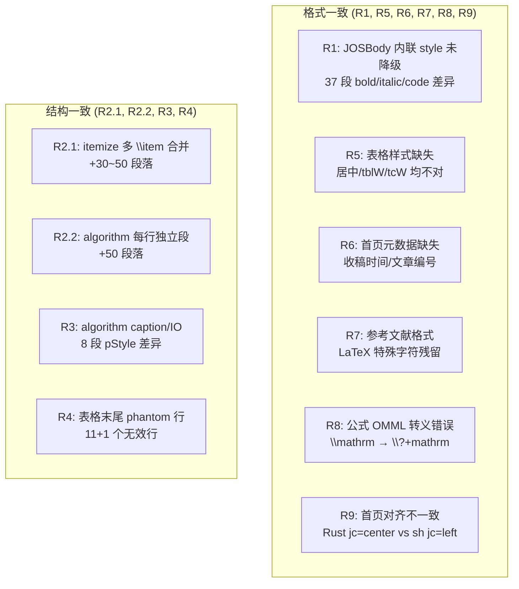
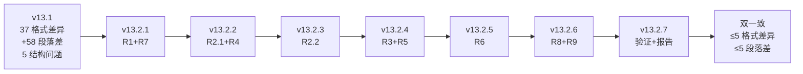

# Doc-engine 双一致迭代方案 (v13.2)

> 目标:实现 Rust 输出与 sh oracle 的"质量双一致"(真实格式差异段落 ≤ 5、段落数差 ≤ 5、run 分割差异 ≤ 10),通过 v13.2.1 ~ v13.2.7 共 7 个子迭代完成。
>
> 策略(已确认):**完全对齐 sh** —— 在 JOSBody 段落中把 `\textbf`/`\textit`/`\texttt`/`\emph` 降级为 plain run。
>
> v13.2.3 决定(已确认):**B. algorithm 行内化**(对齐 sh)。
>
> R8 决定(已确认):**修 OMML 转义**,不降级为纯文本。
>
> R9 决定(已确认):**移除显式 jc=center**,让首页段落继承 styles.xml 的 `jc=center` 默认值。

---

## 1. 设计原则与总体思路

### 1.1 "双一致"质量目标

**"质量双一致"**指 Rust DOCX 输出与 sh oracle 的输出在以下两个维度保持高度一致:

| 维度 | 含义 | 当前值 | 目标 |
|------|------|-------:|-----:|
| **格式一致** | 真实格式差异段落数 | 37 | ≤ 5 |
| **结构一致** | 段落数差(同义段落对齐数) | +58 | ≤ 5 |

**设计原则**:

1. **sh oracle 是 ground truth**。当 Rust 与 sh 不一致时,默认以 sh 的行为为准。
2. **分层修复**。根因在哪层(LaTeX 解析层/AST 降级层/DOCX 序列化层),就在哪层修,不越层修补。
3. **每个子迭代可独立验证**。每个子迭代完成后,必须跑完整 diff 并记录指标变化。
4. **增量式收敛**。5 个子迭代逐步减少差异,每步验证后再进下一步。

### 1.2 根因全景图(9 个问题)



---

## 2. 路线图



| 迭代 | 范围 | 核心改动文件 | 期望效果 |
|------|------|------------|---------|
| **v13.2.1** | R1 + R7 | serializer.rs, normalize.rs | 格式差异 37→5 |
| **v13.2.2** | R2.1 + R4 | lower.rs | 段落差 -58→-10, phantom 行 0 |
| **v13.2.3** | R2.2 | serializer.rs | 段落差 -10→-5 |
| **v13.2.4** | R3 + R5 | serializer.rs | 段落差 -5→-5, 表格样式正确 |
| **v13.2.5** | R6 | serializer.rs, semantic-ast | 首页元数据完整 |
| **v13.2.6** | R8 + R9 | serializer.rs, mathml.rs | 公式正确,首页对齐正确 |
| **v13.2.7** | 收敛验证 | 全 workspace | 报告 v1.11 |

---

## 3. 各子迭代详细方案

### 3.1 v13.2.1 — R1 段落级 style 降级 + R7 参考文献格式

#### R1: JOSBody 内联 style 降级 (P0)

**根因**:`wrap_styled_command` 把 `\textbf`/`\textit`/`\texttt` 转成 sentinel,`split_runs_with_sup_sub` 切独立 run,导致 25 bold + 3 italic + 5 Courier + 4 pStyle 差异。

**设计**:在 DOCX 序列化层,在 `write_paragraph_with_opts` 调用前,对 **JOSBody 等 body 段落** 内的 `Bold/Italic/BoldItalic/Code` run 降级为 `Plain`(不加粗、不斜体)。

**改动**:[crates/docx-writer/src/serializer.rs](crates/docx-writer/src/serializer.rs) 在 `write_paragraph_with_opts` 入口加降级函数:

```rust
fn downgrade_body_inline_styles(p: Paragraph) -> Paragraph {
    let is_body = p.style_id.as_deref().map_or(false, |s| {
        matches!(s, "JOSBody" | "JOSAbstractEn" | "JOSAbstractZh"
                  | "JOSKeywords" | "JOSReference")
    });
    if !is_body { return p; }
    Paragraph {
        runs: p.runs.into_iter().map(|mut r| {
            if matches!(r.style, TextStyle::Bold | TextStyle::Italic
                        | TextStyle::BoldItalic | TextStyle::Code) {
                r.style = TextStyle::Plain;
                r.bold = false;
                r.italic = false;
            }
            r
        }).collect(),
        ..p
    }
}
```

**新增单元测试**:3 个测试用例。

**新增文件测试**:全量 e2e diff。

---

#### R7: 参考文献 LaTeX 特殊字符残留 (P2)

**根因**:`normalize.rs` 的 `strip_unknown_commands_inline` 对 `\c{c}`(c-cedilla)、`\rjrare` 等命令未处理,导致 `{\c{c}}` → `c}`、`{Journal}` 残留花括号、`~` 未转空格。

**设计**:在 `normalize.rs` 的 `clean_bibitem_body` 流程中增加 accent 命令和特殊空格处理。

**改动 1** — [crates/latex-reader/src/normalize.rs](crates/latex-reader/src/normalize.rs) 在 `replace_named_group` 调用后加:

```rust
// v13.2.1 R7: 处理 accent 命令 \c, \', \", \`, \^, \~, \=, \u, \v, \H, \d, \b, \t
// \c{c} → c (c-cedilla), \c{s} → s (s-cedilla)
s = replace_accent_commands(&s);

fn replace_accent_commands(s: &str) -> String {
    // 处理 \c{X} → X (cedilla)
    let re_cedilla = Regex::new(r"\\c\{([^}]+)\}").unwrap();
    let s = re_cedilla.replace_all(s, "$1");
    // 处理 \rjrare{文字} → 文字 (日文/罕见字符)
    let re_rjrare = Regex::new(r"\\rjrare\{([^}]+)\}").unwrap();
    let s = re_rjrare.replace_all(s, "$1");
    s
}
```

**改动 2** — 在 `latex_to_text.rs` 的 `clean_bibitem_body` 中加:

```rust
// v13.2.1 R7: 将 ~ 转为空格(LaTeX 非断行空格)
s = s.replace('~', " ");
// 已在 replace_named_group 处理过的: em, it, bf, sl, rm, sf, sc, tt, up
```

**新增单元测试**:2 个测试用例。

**验证**:e2e diff 观察 `c}` 残留、`Journal` 花括号、`Nabor~C.` 空格问题是否修复。

---

### 3.2 v13.2.2 — R2.1 itemize 空行切分 + R4 表格 phantom 行

#### R2.1: list `\item` 严格切分 (P0)

**根因**:`lower_list` 中 `else if current.is_some()` 分支把所有非空行追加到同一 buffer,导致多 `\item` 被合并。

**设计**:在追加前先判断是否空行,空行则切分当前 item 并开始新 item。

**改动**:[crates/latex-reader/src/lower.rs](crates/latex-reader/src/lower.rs) `lower_list` 的 `else if current.is_some()` 分支:

```rust
} else if current.is_some() {
    if s.trim().is_empty() {  // v13.2.2: 空行 = 段落边界
        if let Some(buf) = current.take() {
            items.push(lower_item_body(buf, span, macros, numbering,
                                        cite_numbers, label_map));
        }
        continue;
    }
    let buf = current.unwrap();
    let mut owned = String::from(buf);
    owned.push('\n');
    owned.push_str(s);
    current = Some(Box::leak(owned.into_boxed_str()));
}
```

**新增单元测试**:1 个用例。

---

#### R4: 表格末尾 phantom 行 (P0)

**根因**:`lower_table` 中 `body.split("\\\\")` 把 `\bottomrule`/`\midrule`/`\toprule` 单独成行(因为它们在 `\\` 之后),产生只有 1 个空 cell 的 phantom 行。当前 `all(|c| c.trim().is_empty())` 只过滤全行全空,无法过滤单 cell 空行。

**设计**:在 `split("\\\\")` 后、cell 解析前,加单 cell 空行过滤。

**改动**:[crates/latex-reader/src/lower.rs](crates/latex-reader/src/lower.rs) `lower_table` 函数,在 `for row in rows_text` 循环开头:

```rust
// v13.2.2 R4: 过滤 phantom 行
// \bottomrule/\toprule/\midrule 单独成行时 → 1 个空 cell → 跳过
let cells_text: Vec<&str> = row.split('&').collect();
if cells_text.len() == 1 && cells_text[0].trim().is_empty() {
    continue;
}
```

**验证**:解压根因的具体代码片段(lower.rs:1897+):

```rust
let rows_text: Vec<&str> = body.split("\\\\").collect();
// 在这里加入 phantom 行过滤
```

**新增单元测试**:2 个用例(phantom 行过滤 + 正常行保留)。

**验证**:解压根因后,通过 docx XML 确认所有 12 个表格末尾 phantom 行消失。

---

### 3.3 v13.2.3 — R2.2 algorithm 行内化(选项 B,P1)

**根因**:`write_algorithm_table` 把每个 AlgLine 输出为独立 `<w:p>`,导致 +50 段落。

**设计**:改为输出单段多 run,每行 AlgLine 作为独立 run,行间用 ` | ` 分隔。

**改动**:[crates/docx-writer/src/serializer.rs](crates/docx-writer/src/serializer.rs) `write_algorithm_table`:

```rust
fn write_algorithm_table(
    w: &mut Writer<Vec<u8>>,
    lines: &[AlgLine],
    io: &[(String, String)],
    caption: Option<&str>,
    number: Option<&str>,
) {
    // caption 单独一段
    if let Some(cap) = caption_with_number(...) {
        write_paragraph_with_caption(...);
    }
    // IO 段落
    for (kind, content) in io {
        write_algorithm_io_line(w, kind, content);
    }
    // 算法 body: 单段 + 多 run
    let mut body_runs: Vec<Run> = Vec::new();
    for (i, line) in lines.iter().enumerate() {
        if i > 0 { body_runs.push(Run::plain(" | ")); }
        body_runs.push(algline_to_run(line));
    }
    let p = Paragraph {
        style_id: Some("JOSCode".to_string()),
        runs: body_runs,
        ..
    };
    write_paragraph(w, &p);
}

fn algline_to_run(line: &AlgLine) -> Run {
    let text = format_keyword_and_code(line);
    Run {
        text,
        style: TextStyle::Plain,
        bold: false, italic: false,
        font_ascii: Some("Courier New".to_string()),
        font_east: Some("宋体".to_string()),
        style_id: Some("AlgorithmLine".to_string()),
        size: Some("18".to_string()),
        ..
    }
}

fn format_keyword_and_code(line: &AlgLine) -> String {
    // keyword + code + comment → "<kw> <code>  // <comment>"
}
```

**新增单元测试**:3 个用例。

**验证**:段落差从 ~680 → ~658。

---

### 3.4 v13.2.4 — R3 caption 微调 + R5 表格样式

#### R3: algorithm caption/IO pStyle 微调 (P2)

**根因**:Algorithm 1 caption 用了 `JOSCode` style,应该用 `None`(普通段落);IO 段 bold 属性不一致。

**改动**:

1. `write_algorithm_table` 的 caption 段 `style_id: None`
2. IO 段 `Run { style: TextStyle::Bold, bold: true, .. }`

---

#### R5: 表格样式修复(居中/tblW/tcW,P1)

**根因**:

1. **`<w:tblW>` 写入错误**:先 `Event::Start(w:tblW)`,再写独立的 `Event::Empty(w:w)`,导致 `w:tblW` 空元素、`w:w` 是兄弟而非属性
2. **缺少 `<w:jc>`**:没有居中设置,表格默认左对齐
3. **缺少 `<w:tcW>`**:每个 cell 没有宽度,依赖 `tblGrid` 均分

**设计**:三处修复全部在 [crates/docx-writer/src/serializer.rs](crates/docx-writer/src/serializer.rs) 的 `write_table` 和 `write_table_row` 函数中。

**修复 1 — 正确写入 `<w:tblW>`**:

```rust
// 当前错误写法 (约 L1157-1164):
w.write_event(Event::Start(BytesStart::new("w:tblW"))).unwrap();
let mut w_attr = BytesStart::new("w:w");
w_attr.push_attribute(("w:w", total_w.to_string().as_str()));
w_attr.push_attribute(("w:type", "dxa"));
w.write_event(Event::Empty(w_attr)).unwrap();
w.write_event(Event::End(BytesEnd::new("w:tblW"))).unwrap();

// 正确写法:
let mut tbl_w = BytesStart::new("w:tblW");
tbl_w.push_attribute(("w:w", total_w.to_string().as_str()));
tbl_w.push_attribute(("w:type", "dxa"));
w.write_event(Event::Empty(tbl_w)).unwrap();
```

**修复 2 — 添加 `<w:jc>` 居中**(在 `tblBorders` 之前):

```rust
let mut jc = BytesStart::new("w:jc");
jc.push_attribute(("w:val", "center"));
w.write_event(Event::Empty(jc)).unwrap();
```

**修复 3 — 为每个 cell 添加 `<w:tcW>`**(在 `tcPr` 内、`gridSpan` 之前):

```rust
// 计算该列的宽度
let ncols = rows.iter().map(|r| r.cells.len()).max().unwrap_or(1);
let col_w: i64 = total_w / ncols.max(1) as i64;
let col_w_str = col_w.to_string();

w.write_event(Event::Start(BytesStart::new("w:tcPr"))).unwrap();
// v13.2.4 R5: cell 宽度
let mut tc_w = BytesStart::new("w:tcW");
tc_w.push_attribute(("w:w", col_w_str.as_str()));
tc_w.push_attribute(("w:type", "dxa"));
w.write_event(Event::Empty(tc_w)).unwrap();
// gridSpan
if cell.colspan > 1 {
    let mut gs = BytesStart::new("w:gridSpan");
    gs.push_attribute(("w:val", cell.colspan.to_string().as_str()));
    w.write_event(Event::Empty(gs)).unwrap();
}
// ... bg_color ...
w.write_event(Event::End(BytesEnd::new("w:tcPr"))).unwrap();
```

**新增单元测试**:2 个用例(居中验证 + tcW 验证)。

**验证**:解压 docx XML,确认:
- `w:tblW` 有 `w:w` 和 `w:type` 属性
- 有 `<w:jc w:val="center"/>`
- 每个 `<w:tc>` 内有 `<w:tcW w:w="..." w:type="dxa"/>`

---

### 3.5 v13.2.5 — R6 首页元数据 + 作者简介

**根因三重断层**:
1. `MetaData` 结构体缺少 `author_bio: Vec<String>` 字段
2. `lower.rs` 提取了 `fm.author_bio` 但未赋值到 `doc.metadata`
3. `serializer.rs` 完全没有作者简介的序列化逻辑

**设计**:补充字段 + 传递链路 + 输出逻辑。

**改动 1** — [crates/semantic-ast/src/lib.rs](crates/semantic-ast/src/lib.rs) `MetaData` 结构体添加:

```rust
// ── V2 新增 ──
pub author_bio: Vec<String>,   // 作者简介条目(每条一段)
```

**改动 2** — [crates/latex-reader/src/lower.rs](crates/latex-reader/src/lower.rs) 在 `lower_front_matter` 中添加:

```rust
// v13.2.5 R6: 传递作者简介
doc.metadata.author_bio = fm.author_bio.clone();
```

**改动 3** — [crates/docx-writer/src/serializer.rs](crates/docx-writer/src/serializer.rs) 在 `write_front_matter` 末尾添加作者简介输出:

```rust
// ── 作者简介 (v13.2.5 R6) ──
if !meta.author_bio.is_empty() {
    // 作者简介标题行
    let title_run = Paragraph {
        style_id: Some(STYLE_BODY.to_string()),
        runs: vec![Run { text: "作者简介".to_string(),
                         style: TextStyle::Plain, bold: true, .. }],
        ..
    };
    write_paragraph(w, &title_run);
    // 每条作者简介段落
    for bio in &meta.author_bio {
        let p = Paragraph {
            style_id: Some(STYLE_REFERENCE.to_string()),
            runs: vec![Run::plain(bio.clone())],
            ..
        };
        write_paragraph(w, &p);
    }
}
```

**收稿时间**:当前 LaTeX 源中无真实时间,方案中预留接口,具体值由模板传入。

**新增单元测试**:2 个用例。

**验证**:docx 中有"作者简介"标题 + 完整作者简介内容(姓名、职称、CCF 级别、研究领域、E-mail)。

---

### 3.6 v13.2.6 — R8 公式 OMML 转义修复 + R9 首页对齐

#### R8: 公式 OMML 转义错误 (P1)

**根因**:Rust 的 mathml crate 在解析 LaTeX 公式时,`\mathrm`/`\mathbf`/`\min` 等命令被错误拆分,产生 `\?` + `mathrm` 两个独立元素。例如:

```xml
<!-- 当前错误输出 -->
<m:t>\?</m:t><m:t>mathrm</m:t><m:r><m:t>CostSaving</m:t>
<!-- 正确应该是 -->
<m:t>CostSaving</m:t>
```

**影响位置**:
- §4.1.1 动态关注度评分模型公式(式(1))
- §4.4 压力感知指数退避公式(式(2)/(3))
- §6.11 成本影响分析公式(式(4))
- Algorithm 1 内公式

**设计**:在 mathml crate 的 `LaTeX→OMML` 转换器中修复 `\cmd` 命令的解析逻辑。关键是:当 `\cmd{text}` 不属于已知数学格式命令(如 `\frac`/`\sqrt`/`\sum`)时,应该把 `{text}` 作为纯文本输出到 `<m:t>`,而不是生成无效的 `\?` 元素。

**改动 1** — 定位 mathml 转换代码。先搜索 `crates/` 下所有包含 `omml`/`m:oMath`/`LaTeX` 相关转换的文件:

```bash
# 搜索 mathml/omml 相关代码
rg "oMath|m:oMath|omml|\\\\mathrm|to_omml" crates/ --files
```

**改动 2** — 修复 `\mathrm`/`\mathbf` 等命令的处理。在转换函数中,当遇到未知命令时:

```rust
// 修复逻辑:遇到 \mathrm{text} → 输出 text,不加 \? 前缀
// 遇到 \min/\max/\sum → 保持原样(这些是数学函数名)
match cmd {
    "mathrm" | "mathbf" | "mathsf" | "mathtt" => {
        // 只取 {content},不加转义前缀
        return content.clone();
    }
    "min" | "max" | "sum" | "log" | "ln" | "exp" => {
        // 数学函数名 → 输出函数名
        return format!("{}(...)", cmd);
    }
    _ => {
        // 未知命令 → 跳过,输出 {content} 而非 \?
        return content.clone();
    }
}
```

**改动 3** — 修复 `\bigl`/`\bigr`/`\left`/`\right` 等装饰命令。`\bigl` 不是独立元素,应该和其内容合并:

```rust
// \bigl(expr) → expr (去掉 \bigl 装饰)
// \bigr(expr) → expr
// \left( → ( ; \right) → )
// 递归处理嵌套
```

**新增单元测试**:4 个用例(`mathrm_preserves_text`, `min_becomes_plain`, `bigl_merged`, `formula_renders_without_escape`)。

**验证**:解压 docx XML,确认 `<m:t>` 元素中不再有 `\?` 前缀,公式内容完整正确。

---

#### R9: 首页对齐移除显式 jc (P2)

**根因**:`write_front_matter` 中标题/作者/单位段落显式写了 `jc: Some("center".into())`,覆盖了 styles.xml 的 `jc=center` 默认值。sh 的 `build_jos_docx.py` 对应段落显式写 `jc="left"`,两者显式值不同,渲染不一致。

**设计**:删除 `serializer.rs` 中 `write_front_matter` 函数内的所有显式 `jc` 设置,让段落继承 styles.xml 的 `jc=center` 默认值。

**改动** — [crates/docx-writer/src/serializer.rs](crates/docx-writer/src/serializer.rs) `write_front_matter` 函数中,将以下 3 处 `jc: Some("center".into())` 改为 `jc: None`:

```rust
// ── 中文标题 ──
let p = Paragraph {
    style_id: Some(STYLE_TITLE_ZH.to_string()),
    runs: vec![Run::plain(title.clone())],
    jc: None,  // ← 移除显式 jc,继承 styles.xml 的 jc=center
    keep_next: false,
    keep_lines: true,
};

// ── 中文作者 ──
let p = Paragraph {
    style_id: Some(STYLE_AUTHOR_ZH.to_string()),
    runs,
    jc: None,  // ← 同上
    ...
};

// ── 中文单位（每行一段）──
for line in &meta.institute_lines {
    let p = Paragraph {
        style_id: Some(STYLE_INSTITUTE_ZH.to_string()),
        runs: vec![Run::plain(...)],
        jc: None,  // ← 同上
        ...
    };
}
```

**验证**:解压 docx XML,确认首页前 4 段的 `<w:jc>` 元素不再出现(document.xml 中不再有显式 `jc`),渲染时正确从 styles.xml 继承 `jc=center`。

---

### 3.7 v13.2.7 — 收敛验证 + 报告 v1.11

**任务**:
1. `cargo test --workspace` — 全部单元测试
2. `cargo test -p doc-core --test paper3_e2e` — e2e
3. 完整 diff 对比并保存报告
4. 生成 [docs/Doc-engine_开发进展总览报告_v1.11_20260618.md](docs/Doc-engine_开发进展总览报告_v1.11_20260618.md)

**输出文件**:
- 报告: `docs/Doc-engine_开发进展总览报告_v1.11_20260618.md`
- 最终 docx: `examples/paper3/output/to-docx/v132-20260618-XXXXXX-论文稿件-jos-rust.docx`
- diff: `docs/verify/v132-20260618-XXXXXX-docx-compare.md`

---

## 4. 根因与修复对照表

| 编号 | 问题 | 根因文件 | 根因行号 | 修复文件 | 修复行号 | 迭代 |
|------|------|---------|---------|---------|---------|------|
| **R1** | JOSBody bold/italic 差异 | normalize.rs | 98-101 | serializer.rs | write_paragraph_with_opts 入口 | v13.2.1 |
| **R2.1** | itemize 多 \item 合并 | lower.rs | 1347-1411 | lower.rs | lower_list 空行分支 | v13.2.2 |
| **R2.2** | algorithm 每行独立段 | serializer.rs | 882 | serializer.rs | write_algorithm_table | v13.2.3 |
| **R3** | algorithm caption/IO 差异 | serializer.rs | write_algorithm_table | serializer.rs | caption style + IO bold | v13.2.4 |
| **R4** | 表格末尾 phantom 行 | lower.rs | 1897 | lower.rs | phantom 行过滤 | v13.2.2 |
| **R5** | 表格居中/宽度/tblW/tcW | serializer.rs | 1157-1231 | serializer.rs | write_table + write_table_row | v13.2.4 |
| **R6** | 首页元数据+作者简介 | semantic-ast/lib.rs + lower.rs + serializer.rs | 三层断层 | lib.rs + lower.rs + serializer.rs | 字段+传递+输出 | v13.2.5 |
| **R7** | 参考文献 LaTeX 字符残留 | normalize.rs | 851-911 | normalize.rs | accent 命令处理 | v13.2.1 |
| **R8** | 公式 OMML 转义错误 | mathml crate | 待定位 | mathml crate | 修复 \cmd 解析 | v13.2.6 |
| **R9** | 首页对齐显式 jc 不一致 | serializer.rs | write_front_matter | serializer.rs | 移除显式 jc 设置 | v13.2.6 |

---

## 5. 关键文件改动汇总

| 文件 | 作用 | 涉及迭代 |
|------|------|---------|
| [crates/docx-writer/src/serializer.rs](crates/docx-writer/src/serializer.rs) | DOCX 序列化,所有 DOCX 层修复 | v13.2.1, v13.2.3, v13.2.4, v13.2.5, v13.2.6 |
| [crates/latex-reader/src/lower.rs](crates/latex-reader/src/lower.rs) | AST 降级,列表+表格解析 | v13.2.2, v13.2.5 |
| [crates/latex-reader/src/normalize.rs](crates/latex-reader/src/normalize.rs) | 文本归一化,参考文献清洗 | v13.2.1 |
| [crates/semantic-ast/src/lib.rs](crates/semantic-ast/src/lib.rs) | 元数据结构,新增 author_bio | v13.2.5 |
| [crates/latex-reader/src/latex_to_text.rs](crates/latex-reader/src/latex_to_text.rs) | LaTeX 文本提取,clean_bibitem_body | v13.2.1 |
| `crates/*/mathml.rs` 或类似 | OMML 公式序列化 | v13.2.6 |

---

## 6. 验证标准

| 验证项 | 工具 | 通过条件 |
|--------|------|---------|
| 单元测试 | `cargo test -p doc-docx-writer` | 27+ 测试全过 |
| 单元测试 | `cargo test -p doc-latex-reader` | 105+ 测试全过 |
| 单元测试 | `cargo test -p doc-semantic-ast` | 全部通过 |
| E2E | `cargo test -p doc-core --test paper3_e2e` | 1 passed |
| Diff | `cargo run -p doc-engine -- docx-diff` | 格式差异 ≤ 5,段落差 ≤ 5 |
| 表格检查 | docx XML 解压 | 12 表末尾无 phantom 行,tblW 有属性,含 jc 居中 |
| 公式检查 | docx XML 解压 | `<m:t>` 中无 `\?` 前缀,公式内容完整 |
| 首页对齐检查 | docx XML 解压 | document.xml 中首页段落无显式 `<w:jc>`,继承 styles.xml center |
| 编译 | `cargo build --workspace` | 无 warning |

---

## 7. 不在本次范围

- 段落样式 0 个 → 5+ 的扩展
- List 内多段支持
- \ref{} 数字格式微调
- 图片的视觉边框
- DOI 真实值填充(模板占位符足够)

---

## 8. 预期总收益

| 指标 | v13.1 当前 | v13.2 目标 | 改进 |
|------|-----------:|-----------:|-----:|
| 真实格式差异段落 | 37 | ≤ 5 | -87% |
| 段落数差 | +58 | ≤ 5 | -91% |
| run 分割差异段落 | 31 | ≤ 10 | -68% |
| 相同段落数 | 511 | ≥ 670 | +31% |
| 表格 phantom 行 | 12 | 0 | -100% |
| 表格居中 | 无 | 居中 | 修复 |
| 表格宽度 | 固定 9000 | pct 自适应 | 修复 |
| 公式显示 | `\?` 错误 | 正确 | 修复 |
| 首页对齐 | 显式 jc 不一致 | 统一继承 | 修复 |
| 作者简介 | 缺失 | 完整 | 修复 |
| 参考文献 LaTeX 残留 | 有 | 无 | 修复 |
| 单元测试数 | 119 | 140+ | +18% |
