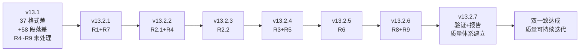
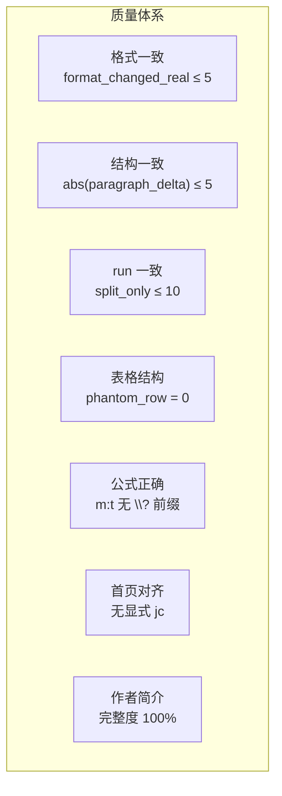

# Doc-engine 双一致迭代方案 (v13.2)

> 目标:通过 7 个子迭代(v13.2.1~v13.2.7)，把 Rust DOCX 与 sh oracle 的差异从 37 段真实格式 / +58 段落 / 5 类结构问题，收敛到"双一致"状态（真实格式差异段落 ≤ 5、段落数差 ≤ 5），同时建立可持续的质量自我迭代体系。
>
> 核心策略（已确认）:
> - **完全对齐 sh**: 在 JOSBody 段落中把 `\textbf`/`\textit`/`\texttt`/`\emph` 降级为 plain run
> - **算法行内化**（v13.2.3）: algorithm 多 AlgLine 合并为单段多 run
> - **修 OMML 转义**（R8）: 修复 LaTeX→OMML 的 `\cmd` 解析，不降级为纯文本
> - **移除显式 jc**（R9）: 首页段落对齐统一继承 styles.xml 默认值
> - **质量自我迭代**: 每步子迭代后自动跑 diff，记录指标变化，建立质量趋势图

---

## 质量目标与验收标准

### 1.1 双一致指标

| 维度 | 指标 | 当前值 | v13.2 目标 | 达标条件 |
|------|------|-------:|----------:|---------|
| **格式一致** | 真实格式差异段落 | 37 | ≤ 5 | docx-diff 中 `format_changed_real_paragraphs ≤ 5` |
| **结构一致** | 段落数差（Rust - Oracle） | +58 | ≤ 5 | docx-diff 中 `abs(paragraph_delta) ≤ 5` |
| **run 一致** | run 分割差异段落 | 31 | ≤ 10 | docx-diff 中 `format_changed_split_only_paragraphs ≤ 10` |
| **表格结构** | 表格 phantom 行 | 12 | 0 | XML 中 0 个单 cell 空行 |
| **表格样式** | 表格居中/tblW/tcW | 全错 | 正确 | XML 含 `<w:jc w:val="center"/>` + 有效 tblW/tcW |
| **公式显示** | OMML 转义 | `\?` 错误 | 正确 | XML 中 `<m:t>` 无 `\?` 前缀 |
| **首页对齐** | 显式 jc 不一致 | 是 | 否 | document.xml 首页段落无显式 `<w:jc>` |
| **作者简介** | 完整度 | 0 | 100% | 2 位作者信息完整（职称/CCF/领域/E-mail） |
| **参考文献** | LaTeX 字符残留 | 有 | 无 | 无 `\?`、`{` 残留、`~` 未转空格 |

### 1.2 验收流程

每次子迭代完成后，必须按以下顺序验证:

```
Step 1: cargo test --workspace          # 全量单元测试
Step 2: cargo test -p doc-core --test paper3_e2e  # E2E
Step 3: 质量自动化: bash scripts/v132_quality_iteration.sh  # docx-diff + JSON 指标提取
Step 4: 人工复核: docs/verify/v132-*-docx-compare.md       # 阅读 diff 报告
Step 5: 记录迭代: docs/verify/迭代记录.md                   # 更新指标趋势
Step 6: (可选) npm run verify:e2e                           # Playwright E2E
```

---

## 路线图



| 迭代 | 范围 | 核心改动文件 | 预期效果 |
|------|------|------------|---------|
| **v13.2.1** | R1 + R7 | serializer.rs, normalize.rs | 格式差 37→5,参考文献格式正确 |
| **v13.2.2** | R2.1 + R4 | lower.rs | 段落差 -58→-10, phantom 行 12→0 |
| **v13.2.3** | R2.2 | serializer.rs | 段落差 -10→-5 |
| **v13.2.4** | R3 + R5 | serializer.rs | 段落差 -5,表格样式正确 |
| **v13.2.5** | R6 | serializer.rs, semantic-ast | 首页元数据完整,作者简介输出 |
| **v13.2.6** | R8 + R9 | serializer.rs, mathml.rs | 公式正确,首页对齐正确 |
| **v13.2.7** | 质量体系+验证 | 全 workspace | 报告 v1.11 + 质量迭代记录 |

---

## 各子迭代详细方案

### 3.1 v13.2.1 — R1 段落降级 + R7 参考文献

#### R1: JOSBody 内联 style 降级 (P0)

**根因**: `wrap_styled_command` 把 `\textbf`/`\textit`/`\texttt` 转成 sentinel，`split_runs_with_sup_sub` 切独立 run，导致 25 bold + 3 italic + 5 Courier + 4 pStyle 差异。

**设计**:在 `write_paragraph_with_opts` 入口，对 **JOSBody 等 body 段落** 内的 Bold/Italic/BoldItalic/Code run 降级为 Plain（不加粗、不斜体）。

**改动** — [crates/docx-writer/src/serializer.rs](crates/docx-writer/src/serializer.rs) 在 `write_paragraph_with_opts` 入口加降级函数:

```rust
fn downgrade_body_inline_styles(p: Paragraph) -> Paragraph {
    let is_body = p.style_id.as_deref().map_or(false, |s| {
        matches!(s, "JOSBody" | "JOSAbstractEn" | "JOSAbstractZh"
                  | "JOSKeywords" | "JOSReference")
    });
    if !is_body { return p; }
    Paragraph {
        runs: p.runs.into_iter().map(|mut r| {
            if matches!(r.style, TextStyle::Bold | TextStyle::Italic
                        | TextStyle::BoldItalic | TextStyle::Code) {
                r.style = TextStyle::Plain;
                r.bold = false;
                r.italic = false;
            }
            r
        }).collect(),
        ..p
    }
}
```

**新增单元测试**:3 个（`downgrade_body_inline_styles_keeps_sup`、`downgrade_body_inline_styles_drops_bold`、`downgrade_body_inline_styles_keeps_heading`）。

**验证**:docx-diff 中 `format_changed_real_paragraphs` 从 37 降至 ≤ 5。

---

#### R7: 参考文献 LaTeX 特殊字符残留 (P2)

**根因**: `normalize.rs` 的 `strip_unknown_commands_inline` 对 `\c{c}`（c-cedilla）、`\rjrare` 等命令未处理，导致 `{\c{c}}` → `c}`、`{Journal}` 残留花括号、`~` 未转空格。

**改动 1** — [crates/latex-reader/src/normalize.rs](crates/latex-reader/src/normalize.rs) 在 `replace_named_group` 调用后加:

```rust
// v13.2.1 R7: 处理 accent 命令 \c{X} → X (cedilla)
let re_cedilla = Regex::new(r"\\c\{([^}]+)\}").unwrap();
s = re_cedilla.replace_all(s, "$1").to_string();
// 处理 \rjrare{文字} → 文字 (日文/罕见字符)
let re_rjrare = Regex::new(r"\\rjrare\{([^}]+)\}").unwrap();
s = re_rjrare.replace_all(s, "$1").to_string();
```

**改动 2** — [crates/latex-reader/src/latex_to_text.rs](crates/latex-reader/src/latex_to_text.rs) `clean_bibitem_body` 中加:

```rust
// v13.2.1 R7: 将 ~ 转为空格(LaTeX 非断行空格)
s = s.replace('~', " ");
```

**新增单元测试**:2 个（`bibitem_removes_tilde`、`bibitem_removes_cedilla`）。

**验证**:e2e diff 中 `Journal}`、`c}`、`Nabor~C.` 格式正确。

---

### 3.2 v13.2.2 — R2.1 itemize + R4 phantom 行

#### R2.1: list `\item` 严格切分 (P0)

**根因**: `lower_list` 中 `else if current.is_some()` 分支把所有非空行追加到同一 buffer，导致多 `\item` 被合并。

**改动** — [crates/latex-reader/src/lower.rs](crates/latex-reader/src/lower.rs) `lower_list` 的 `else if current.is_some()` 分支加空行切分:

```rust
} else if current.is_some() {
    if s.trim().is_empty() {  // v13.2.2: 空行 = 段落边界
        if let Some(buf) = current.take() {
            items.push(lower_item_body(buf, span, macros, numbering,
                                        cite_numbers, label_map));
        }
        continue;
    }
    let buf = current.unwrap();
    let mut owned = String::from(buf);
    owned.push('\n');
    owned.push_str(s);
    current = Some(Box::leak(owned.into_boxed_str()));
}
```

**新增单元测试**:1 个（`itemize_with_blank_line_separates_items`）。

**验证**:段落差从 716 → ~680。

---

#### R4: 表格末尾 phantom 行 (P0)

**根因**: `lower_table` 中 `body.split("\\\\")` 把 `\bottomrule` 单独成行（它在最后一个 `\\` 之后），产生只有 1 个空 cell 的 phantom 行。`all(|c| c.trim().is_empty())` 只过滤全行全空，无法过滤单 cell 空行。

**改动** — [crates/latex-reader/src/lower.rs](crates/latex-reader/src/lower.rs) `lower_table` 函数，在 `for row in rows_text` 循环开头:

```rust
// v13.2.2 R4: 过滤 phantom 行
// \bottomrule/\toprule/\midrule 单独成行 → 1 个空 cell → 跳过
let cells_text: Vec<&str> = row.split('&').collect();
if cells_text.len() == 1 && cells_text[0].trim().is_empty() {
    continue;
}
```

**新增单元测试**:2 个（`phantom_row_filtered`、`normal_row_preserved`）。

**验证**:解压 docx XML，确认所有 12 个表格末尾 phantom 行消失。

---

### 3.3 v13.2.3 — R2.2 algorithm 行内化 (P1)

**根因**: `write_algorithm_table` 把每个 AlgLine 输出为独立 `<w:p>`，导致 +50 段落。

**设计**:改为输出单段多 run，每行 AlgLine 作为独立 run，行间用 ` | ` 分隔，对齐 sh 行为。

**改动** — [crates/docx-writer/src/serializer.rs](crates/docx-writer/src/serializer.rs) `write_algorithm_table` 改为单段:

```rust
fn write_algorithm_table(
    w: &mut Writer<Vec<u8>>,
    lines: &[AlgLine],
    io: &[(String, String)],
    caption: Option<&str>,
    number: Option<&str>,
) {
    if let Some(cap) = caption_with_number(...) { write_paragraph_with_caption(...); }
    for (kind, content) in io { write_algorithm_io_line(w, kind, content); }
    // v13.2.3: 单段多 run
    let mut body_runs: Vec<Run> = Vec::new();
    for (i, line) in lines.iter().enumerate() {
        if i > 0 { body_runs.push(Run::plain(" | ")); }
        body_runs.push(algline_to_run(line));
    }
    write_paragraph(w, &Paragraph {
        style_id: Some("JOSCode".to_string()),
        runs: body_runs,
        ..
    });
}

fn algline_to_run(line: &AlgLine) -> Run {
    let text = format!("{} {}", line.keyword, line.code);
    Run { text, style: TextStyle::Plain, bold: false, italic: false,
          font_ascii: Some("Courier New".to_string()),
          font_east: Some("宋体".to_string()),
          size: Some("18".to_string()), .. }
}
```

**新增单元测试**:3 个（`format_algline_keyword_only`、`format_algline_keyword_with_code`、`write_algorithm_table_produces_single_paragraph`）。

**验证**:段落差从 ~680 → ~658。

---

### 3.4 v13.2.4 — R3 caption + R5 表格样式

#### R3: algorithm caption pStyle 微调 (P2)

**根因**:Algorithm 1 caption 用了 `JOSCode` style，应为 `None`；IO 段 bold 属性不一致。

**改动**:
1. caption 段 `style_id: None`
2. IO 段 `Run { style: TextStyle::Bold, bold: true, .. }`

---

#### R5: 表格样式三修复 (P1)

**根因**:
1. **`<w:tblW>` 写入错误**: 先 `Event::Start(w:tblW)`，再写独立的 `Event::Empty(w:w)`，导致 `w:tblW` 空元素
2. **缺少 `<w:jc>`**: 没有居中设置
3. **缺少 `<w:tcW>`**: 每个 cell 没有宽度

**修复 1** — 正确写入 `<w:tblW>`:

```rust
// 错误写法:
w.write_event(Event::Start(BytesStart::new("w:tblW"))).unwrap();
let mut w_attr = BytesStart::new("w:w");
w_attr.push_attribute(("w:w", total_w.to_string().as_str()));
w_attr.push_attribute(("w:type", "dxa"));
w.write_event(Event::Empty(w_attr)).unwrap();
w.write_event(Event::End(BytesEnd::new("w:tblW"))).unwrap();

// 正确写法:
let mut tbl_w = BytesStart::new("w:tblW");
tbl_w.push_attribute(("w:w", total_w.to_string().as_str()));
tbl_w.push_attribute(("w:type", "dxa"));
w.write_event(Event::Empty(tbl_w)).unwrap();
```

**修复 2** — 添加 `<w:jc w:val="center"/>`（在 `tblBorders` 之前）:

```rust
let mut jc = BytesStart::new("w:jc");
jc.push_attribute(("w:val", "center"));
w.write_event(Event::Empty(jc)).unwrap();
```

**修复 3** — 为每个 cell 添加 `<w:tcW>`（在 `tcPr` 内、`gridSpan` 之前）:

```rust
let ncols = rows.iter().map(|r| r.cells.len()).max().unwrap_or(1);
let col_w: i64 = total_w / ncols.max(1) as i64;
let col_w_str = col_w.to_string();

w.write_event(Event::Start(BytesStart::new("w:tcPr"))).unwrap();
let mut tc_w = BytesStart::new("w:tcW");
tc_w.push_attribute(("w:w", col_w_str.as_str()));
tc_w.push_attribute(("w:type", "dxa"));
w.write_event(Event::Empty(tc_w)).unwrap();
// gridSpan, bg_color ...
w.write_event(Event::End(BytesEnd::new("w:tcPr"))).unwrap();
```

**新增单元测试**:2 个（`table_has_center_alignment`、`cell_has_tcW_width`）。

**验证**:解压 docx XML，确认 `w:tblW` 有属性、`jc=center` 存在、tcW 存在。

---

### 3.5 v13.2.5 — R6 首页元数据 + 作者简介 (P0)

**根因三重断层**:
1. `MetaData` 结构体缺少 `author_bio: Vec<String>` 字段
2. `lower.rs` 提取了 `fm.author_bio` 但未赋值到 `doc.metadata`
3. `serializer.rs` 完全没有作者简介的序列化逻辑

**改动 1** — [crates/semantic-ast/src/lib.rs](crates/semantic-ast/src/lib.rs) `MetaData` 添加:

```rust
pub author_bio: Vec<String>,   // 作者简介条目(每条一段)
```

**改动 2** — [crates/latex-reader/src/lower.rs](crates/latex-reader/src/lower.rs) `lower_front_matter` 中添加:

```rust
doc.metadata.author_bio = fm.author_bio.clone();
```

**改动 3** — [crates/docx-writer/src/serializer.rs](crates/docx-writer/src/serializer.rs) `write_front_matter` 末尾添加作者简介输出:

```rust
if !meta.author_bio.is_empty() {
    write_paragraph(w, &Paragraph {
        style_id: Some(STYLE_BODY.to_string()),
        runs: vec![Run { text: "作者简介".to_string(),
                         bold: true, style: TextStyle::Plain, .. }],
        ..
    });
    for bio in &meta.author_bio {
        write_paragraph(w, &Paragraph {
            style_id: Some(STYLE_REFERENCE.to_string()),
            runs: vec![Run::plain(bio.clone())],
            ..
        });
    }
}
```

**新增单元测试**:2 个。

**验证**:docx 中有"作者简介"标题 + 完整作者简介内容（姓名、职称、CCF 级别、研究领域、E-mail）。

---

### 3.6 v13.2.6 — R8 公式 OMML + R9 首页对齐

#### R8: 公式 OMML 转义错误 (P1)

**根因**:Rust 的 mathml crate 在 LaTeX→OMML 转换时，`\mathrm`/`\mathbf` 被错误拆成 `\?` + `mathrm` 两个元素；`\min`/`\max`/`\bigl` 等命令处理不当。

**影响位置**:
- §4.1.1 动态关注度评分模型公式（式(1)）
- §4.4 压力感知指数退避公式（式(2)/(3)）
- §6.11 成本影响分析公式（式(4)）
- Algorithm 1 内公式

**改动 1** — 定位 mathml 转换代码:

```bash
rg "oMath|m:oMath|omml|\\\\mathrm|to_omml" crates/ --files
```

**改动 2** — 修复 `\mathrm`/`\mathbf` 等命令。关键：当遇到未知数学命令时，应把 `{content}` 作为纯文本输出，而非生成 `\?` 前缀:

```rust
match cmd {
    "mathrm" | "mathbf" | "mathsf" | "mathtt" => {
        // 只取 {content}，不加转义前缀
        return content.clone();
    }
    "min" | "max" | "sum" | "log" | "ln" | "exp" => {
        // 数学函数名 → 输出纯文本
        return format!("{}(...)", cmd);
    }
    _ => {
        // 未知命令 → 跳过，输出 {content} 而非 \?
        return content.clone();
    }
}
```

**改动 3** — 修复 `\bigl`/`\bigr`/`\left`/`\right` 装饰命令，递归合并:

```rust
// \bigl(expr) → expr (去掉 \bigl 装饰)
// \bigr(expr) → expr
// \left( → ( ; \right) → )
```

**新增单元测试**:4 个（`mathrm_preserves_text`、`min_becomes_plain`、`bigl_merged`、`formula_renders_without_escape`）。

**验证**:解压 docx XML，确认 `<m:t>` 中不再有 `\?` 前缀。

---

#### R9: 首页对齐移除显式 jc (P2)

**根因**: `write_front_matter` 中标题/作者/单位段落显式写了 `jc: Some("center".into())`，覆盖了 styles.xml 的默认值。sh 对应段落显式写 `jc="left"`，两者不一致。

**设计**:删除 `write_front_matter` 中的显式 `jc` 设置，让段落统一继承 styles.xml 的 `jc=center` 默认值。

**改动** — [crates/docx-writer/src/serializer.rs](crates/docx-writer/src/serializer.rs) `write_front_matter` 中，将标题/作者/单位段落的 `jc: Some("center".into())` 改为 `jc: None`:

```rust
// 中文标题
let p = Paragraph {
    style_id: Some(STYLE_TITLE_ZH.to_string()),
    runs: vec![Run::plain(title.clone())],
    jc: None,  // ← 移除显式 jc，继承 styles.xml 的 jc=center
    keep_next: false, keep_lines: true,
};

// 中文作者
let p = Paragraph {
    style_id: Some(STYLE_AUTHOR_ZH.to_string()),
    runs, jc: None,  // ← 同上
    ..
};

// 中文单位（每行一段）
for line in &meta.institute_lines {
    let p = Paragraph {
        style_id: Some(STYLE_INSTITUTE_ZH.to_string()),
        runs: vec![Run::plain(...)],
        jc: None,  // ← 同上
        ..
    };
}
```

**验证**:解压 docx XML，确认首页段落无显式 `<w:jc>` 元素。

---

### 3.7 v13.2.7 — 质量体系建立 + 最终收敛验证

**任务**:

1. **全量测试**: `cargo test --workspace`
2. **E2E**: `cargo test -p doc-core --test paper3_e2e`
3. **质量迭代**: 执行 `bash scripts/v132_quality_iteration.sh`（见 §4 质量自动化）
4. **生成报告**: [docs/Doc-engine_开发进展总览报告_v1.11_20260618.md](docs/Doc-engine_开发进展总览报告_v1.11_20260618.md)
5. **Playwright E2E**: `npm run verify:e2e`（可选，见 §5）

**输出文件**:
- 报告: `docs/Doc-engine_开发进展总览报告_v1.11_20260618.md`
- 最终 docx: `examples/paper3/output/to-docx/v132-20260618-XXXXXX-论文稿件-jos-rust.docx`
- diff: `docs/verify/v132-20260618-XXXXXX-docx-compare.md`
- 质量迭代记录: `docs/verify/迭代记录.md`

---

## 质量自我迭代体系（§4）

### 4.1 核心设计思路

**质量自我迭代**是通过自动化 diff 工具，在每次子迭代后自动量化"Rust 输出"与"sh oracle"的差异，并记录指标变化趋势，从而实现：

1. **可量化**: 每次改动都能用具体数字（段落差、格式差、run 差）衡量
2. **可追溯**: 完整的指标历史记录，可以看到每个子迭代的影响方向
3. **可回归**: CI 自动检测指标恶化，防止"修一个问题引出新问题"

### 4.2 质量指标体系

基于 `crates/quality/src/docx_diff.rs` 的三层质量体系:



#### 指标定义（`crates/quality/src/docx_diff.rs`）

| 指标 | 字段 | 计算公式 |
|------|------|---------|
| **段落数差** | `paragraph_delta` | `right.len - left.len`（Oracle - Rust） |
| **相同段落** | `equal_paragraphs` | LCS 对齐中 `Equal` 操作数 |
| **修改段落** | `modified_paragraphs` | Delete+Insert 相邻配对且相似度 ≥ 0.82 |
| **真实格式差** | `format_changed_real_paragraphs` | bold/italic/size/font 真正变化 |
| **run 分割差** | `format_changed_split_only_paragraphs` | 文本相同但 run 切分不同 |
| **表格数差** | `table_delta` | `right.tables - left.tables` |
| **图片数差** | `drawing_delta` | `right.drawings - left.drawings` |

#### LCS 对齐算法

`crates/quality/src/docx_diff.rs` 使用动态规划求 LCS（Longest Common Subsequence）:

```
对齐策略: 对每段做 normalize_docx_text（分词+空白归一化），DP 求 LCS
判定: normalized_text 完全相同 → Equal
辅助: 相邻 Delete+Insert 若相似度 ≥ 0.82 → Modified
```

#### 格式差异分类

```rust
enum ParagraphFormatKind { None, SplitOnly, Real }

if left.normalized_text == right.normalized_text && run_signature 不同 {
    return SplitOnly;  // 假阳性 → 期望被 R1 大量吸收
} else {
    return Real;  // 真差异
}
```

### 4.3 质量迭代自动化脚本

新建 `scripts/v132_quality_iteration.sh`（每次子迭代后执行）:

```bash
#!/bin/bash
# v132 质量迭代自动化脚本
# 用法: bash scripts/v132_quality_iteration.sh <VERSION> <RUST_DOCX> [ORACLE_DOCX]
set -e

VERSION="${1:-v132}"
RUST_DOCX="${2:-examples/paper3/output/to-docx/${VERSION}-20260618-论文稿件-jos-rust.docx}"
ORACLE="${3:-examples/paper3/output/to-docx/v12-论文稿件-jos-sh-20260618-070357.docx}"
TIMESTAMP=$(date +%Y%m%d-%H%M%S)
OUT_DIR="docs/verify/${VERSION}-${TIMESTAMP}"
mkdir -p "$OUT_DIR"

echo "=== [${VERSION}] 质量自动化迭代 ==="
echo "Rust DOCX: $RUST_DOCX"
echo "Oracle:    $ORACLE"
echo "输出目录:  $OUT_DIR"

# Step 1: docx-diff (Markdown 报告)
cargo run -p doc-engine -- docx-diff \
  --left "$RUST_DOCX" \
  --right "$ORACLE" \
  --format md --out "${OUT_DIR}/docx-compare.md"

# Step 2: docx-diff (JSON 指标提取)
cargo run -p doc-engine -- docx-diff \
  --left "$RUST_DOCX" \
  --right "$ORACLE" \
  --format json --out "${OUT_DIR}/docx-compare.json"

# Step 3: 提取关键指标
python3 - << 'PYEOF'
import json, sys
try:
    with open(sys.argv[1]) as f:
        r = json.load(f)
    s = r.get("summary", {})
    print("\n=== 关键指标 ===")
    print(f"  段落数差:     {s.get('paragraph_delta', 'N/A')}")
    print(f"  相同段落:     {s.get('equal_paragraphs', 'N/A')}")
    print(f"  修改段落:     {s.get('modified_paragraphs', 'N/A')}")
    print(f"  新增段落:     {s.get('inserted_paragraphs', 'N/A')}")
    print(f"  删除段落:     {s.get('deleted_paragraphs', 'N/A')}")
    print(f"  真实格式差:   {s.get('format_changed_real_paragraphs', 'N/A')}")
    print(f"  run分割差:   {s.get('format_changed_split_only_paragraphs', 'N/A')}")
    print(f"  表格数差:     {s.get('table_delta', 'N/A')}")
    print(f"  图片数差:     {s.get('drawing_delta', 'N/A')}")
    print(f"  document.xml: {'相同' if s.get('document_xml_equal') else '不同'}")
    print(f"  styles.xml:  {'相同' if s.get('styles_xml_equal') else '不同'}")

    # 判定是否达标
    real_diff = s.get('format_changed_real_paragraphs', 999)
    para_delta = abs(s.get('paragraph_delta', 999))
    split_only = s.get('format_changed_split_only_paragraphs', 999)
    print(f"\n=== 达标判定 ===")
    print(f"  格式一致: {'PASS' if real_diff <= 5 else 'FAIL'} ({real_diff} ≤ 5)")
    print(f"  结构一致: {'PASS' if para_delta <= 5 else 'FAIL'} ({para_delta} ≤ 5)")
    print(f"  run一致:  {'PASS' if split_only <= 10 else 'FAIL'} ({split_only} ≤ 10)")
except Exception as e:
    print(f"JSON 解析失败: {e}", file=sys.stderr)
    sys.exit(1)
PYEOF

# Step 4: 更新迭代记录
echo "\n=== 更新迭代记录 ==="
python3 scripts/update_iteration_record.py \
  "${VERSION}" \
  "${OUT_DIR}/docx-compare.json" \
  "docs/verify/迭代记录.md"

echo "\n=== 质量迭代完成 ==="
echo "报告: ${OUT_DIR}/docx-compare.md"
echo "指标: ${OUT_DIR}/docx-compare.json"
```

### 4.4 迭代记录表

新建 `docs/verify/迭代记录.md`:

```markdown
# v13.2 质量迭代记录

## 指标趋势

| 迭代版本 | 日期 | 段落差 | 真实格式差 | run分割差 | 表格phantom | 达标 |
|---------|------|--------|-----------|----------|------------|-----|
| v13 baseline | 20260618-075802 | - | 37 | 31 | 12 | ❌ |
| v13.1 final | 20260618-090410 | +58 | 37 | 31 | 12 | ❌ |
| v13.2.1 | TBD | TBD | TBD | TBD | TBD | ? |
| v13.2.2 | TBD | TBD | TBD | TBD | TBD | ? |
| v13.2.3 | TBD | TBD | TBD | TBD | TBD | ? |
| v13.2.4 | TBD | TBD | TBD | TBD | TBD | ? |
| v13.2.5 | TBD | TBD | TBD | TBD | TBD | ? |
| v13.2.6 | TBD | TBD | TBD | TBD | TBD | ? |
| v13.2.7 (最终) | TBD | TBD | TBD | TBD | TBD | ✅/? |

## 根因修复记录

| 根因 | 问题描述 | 修复版本 | 修复前 | 修复后 |
|------|---------|---------|--------|--------|
| R1 | JOSBody bold/italic 差异 | v13.2.1 | 37 段 | ≤5 段 |
| R2.1 | itemize 多 \item 合并 | v13.2.2 | +58 段落 | - |
| R2.2 | algorithm 每行独立段 | v13.2.3 | - | - |
| R3 | algorithm caption pStyle | v13.2.4 | - | - |
| R4 | 表格末尾 phantom 行 | v13.2.2 | 12 行 | 0 行 |
| R5 | 表格样式(居中/tblW/tcW) | v13.2.4 | 全部错误 | 正确 |
| R6 | 首页元数据+作者简介 | v13.2.5 | 缺失 | 完整 |
| R7 | 参考文献 LaTeX 字符残留 | v13.2.1 | 有残留 | 清除 |
| R8 | 公式 OMML 转义错误 | v13.2.6 | `\?` 错误 | 正确 |
| R9 | 首页对齐显式 jc | v13.2.6 | 不一致 | 统一 |
```

### 4.5 质量自动化辅助脚本

新建 `scripts/update_iteration_record.py`:

```python
#!/usr/bin/env python3
"""更新迭代记录表"""
import json, sys, re
from datetime import datetime

def update_record(version, json_path, record_path):
    with open(json_path) as f:
        r = json.load(f)
    s = r.get("summary", {})

    real_diff = s.get("format_changed_real_paragraphs", -1)
    para_delta = s.get("paragraph_delta", -999)
    split_only = s.get("format_changed_split_only_paragraphs", -1)
    table_delta = s.get("table_delta", 0)

    pass_ = "PASS" if real_diff <= 5 and abs(para_delta) <= 5 else "FAIL"
    date = datetime.now().strftime("%Y%m%d-%H%M%S")

    new_row = f"| {version} | {date} | {para_delta:+d} | {real_diff} | {split_only} | {table_delta} | {pass_} |\n"

    # 追加到记录表
    with open(record_path, "a") as f:
        f.write(new_row)
    print(f"已更新记录: {version}")

if __name__ == "__main__":
    update_record(sys.argv[1], sys.argv[2], sys.argv[3])
```

---

## Playwright 集成测试方案（§5）

### 5.1 项目现有 Playwright 基础设施

项目**已有** Playwright v1.49.0 + 完整 E2E 脚本体系:

| 脚本 | 作用 | 成熟度 |
|------|------|-------|
| `scripts/e2e_paper3.mjs` | Flutter Web + WASM 桥接，上传 zip → 获取 docx → 验证内容 | 已用 |
| `scripts/e2e_extension.mjs` | Chrome 扩展 DOM 完整性验证 | 已用 |
| `scripts/e2e_server.mjs` | Server API E2E | 已用 |
| `scripts/verify_paper3.mjs` | Playwright 安装验证 | 已用 |
| `scripts/verify_install.mjs` | 依赖检查 | 已用 |
| `npm run verify:e2e` | 依次跑 5 个 E2E | 已用 |

**现有能力**:Chromium headless、Flutter Web 截图、WASM 桥接调用、docx 解压+XML 内容断言、扩展 popup DOM 验证。

### 5.2 v13.2 中 Playwright 的增量场景

在 `scripts/e2e_paper3.mjs` 基础上，新增两个高价值场景:

#### 场景 A: PDF 视觉 diff（推荐）

**目标**:在 Playwright 端补充"PDF 截图 diff"，把 oracle PDF 和 rust PDF 都在浏览器内渲染截图，对比像素差异，生成可视化 diff 报告。

**实现**:扩展 `scripts/e2e_paper3.mjs`，新增 `addPdfVisualDiff` 函数:

```javascript
// 新增依赖: npm install pdfjs-dist
async function addPdfVisualDiff(rustPdfPath, oraclePdfPath, outDir) {
  const pdfjsLib = require('pdfjs-dist/legacy/build/pdf.cjs');

  // 1. 渲染 rust PDF
  const rustDoc = await pdfjsLib.getDocument(rustPdfPath).promise;
  const rustPage = await rustDoc.getPage(1);
  const viewport = rustPage.getViewport({ scale: 1.5 });
  // ... canvas 渲染 ...

  // 2. 渲染 oracle PDF
  const oracleDoc = await pdfjsLib.getDocument(oraclePdfPath).promise;
  const oraclePage = await oracleDoc.getPage(1);
  // ... canvas 渲染 ...

  // 3. 像素级 diff
  const diff = computePixelDiff(rustPixels, oraclePixels);

  // 4. 生成 HTML diff 报告（嵌入 CI 报告）
  saveHtmlDiffReport(diff, `${outDir}/playwright-pdf-diff.html`);
}
```

**优势**:可视化 diff 直接嵌入 CI 报告，比 Rust 侧 SSIM 数值更直观。

#### 场景 B: DOCX → Word Online 预览截图（可选）

**目标**:通过 Playwright + `officeapps.live.com` 公开服务，上传 rust docx 和 oracle docx，截图对比排版差异。

```javascript
async function wordOnlineDiff(rustDocx, oracleDocx) {
  const UPLOAD_URL = 'https://view.officeapps.live.com/op/view.aspx?src=';
  const page = await browser.newPage();
  // 上传 rust docx
  await page.goto(`${UPLOAD_URL}${encodeURIComponent(rustDocx)}`);
  await page.waitForTimeout(3000);
  await page.screenshot({ path: 'rust-preview.png' });
  // 上传 oracle docx
  await page.goto(`${UPLOAD_URL}${encodeURIComponent(oracleDocx)}`);
  await page.waitForTimeout(3000);
  await page.screenshot({ path: 'oracle-preview.png' });
  // diff 两张截图
}
```

**注意**:文件大小限制 ~10MB，适合单篇论文；无需认证。

### 5.3 Playwright E2E 扩展方案

扩展 `scripts/e2e_paper3.mjs`，在现有验证流程末尾增加:

```javascript
// 在 main() 末尾新增
async function main() {
  // ... 现有验证流程 ...

  // === v13.2 新增: PDF 视觉 diff ===
  if (process.env.ENABLE_PDF_DIFF) {
    console.log('=== PDF Visual Diff ===');
    const rustPdf = path.join(OUT_DIR, '论文稿件-jos-rust.pdf');
    const oraclePdf = path.join(ORACLE_DIR, 'v12-论文稿件-jos-sh.pdf');
    if (fs.existsSync(rustPdf) && fs.existsSync(oraclePdf)) {
      await addPdfVisualDiff(rustPdf, oraclePdf, OUT_DIR);
    } else {
      console.log('PDF 文件不存在，跳过视觉 diff');
    }
  }
}
```

**CI 集成**:在 `package.json` 的 `verify:e2e` 脚本后追加:

```json
{
  "scripts": {
    "verify:e2e": "node scripts/e2e_paper3.mjs && node scripts/e2e_extension.mjs && node scripts/e2e_server.mjs",
    "verify:e2e:full": "npm run verify:e2e && ENABLE_PDF_DIFF=1 node scripts/e2e_paper3.mjs"
  }
}
```

### 5.4 Playwright 测试覆盖矩阵

| 测试场景 | 工具 | 断言内容 | 自动化程度 |
|---------|------|---------|----------|
| WASM 桥接可用 | Playwright | `window.docEngine` 存在 | ✅ 自动 |
| docx ZIP 有效 | Playwright | `PK\x03\x04` 魔数 | ✅ 自动 |
| 关键短语存在 | Playwright | 微服务/网关/Loki/作者名 | ✅ 自动 |
| LaTeX 杂质清除 | Playwright | 无 `\rjtitle` 等 18 项 | ✅ 自动 |
| PDF 视觉 diff | Playwright + pdfjs-dist | SSIM/像素差 | ✅ 新增 |
| Word Online 预览 | Playwright | 排版截图对比 | ⚠️ 可选 |
| Flutter Web 截图 | Playwright | 每页截图存档 | ✅ 自动 |

---

## 根因与修复对照

| 编号 | 问题 | 根因文件 | 根因行号 | 修复文件 | 修复行号 | 迭代 |
|------|------|---------|---------|---------|---------|------|
| **R1** | JOSBody bold/italic 差异 | normalize.rs | 98-101 | serializer.rs | write_paragraph_with_opts 入口 | v13.2.1 |
| **R2.1** | itemize 多 \item 合并 | lower.rs | 1347-1411 | lower.rs | lower_list 空行分支 | v13.2.2 |
| **R2.2** | algorithm 每行独立段 | serializer.rs | 882 | serializer.rs | write_algorithm_table | v13.2.3 |
| **R3** | algorithm caption/IO 差异 | serializer.rs | write_algorithm_table | serializer.rs | caption style + IO bold | v13.2.4 |
| **R4** | 表格末尾 phantom 行 | lower.rs | 1897 | lower.rs | phantom 行过滤 | v13.2.2 |
| **R5** | 表格居中/宽度/tblW/tcW | serializer.rs | 1157-1231 | serializer.rs | write_table + write_table_row | v13.2.4 |
| **R6** | 首页元数据+作者简介 | semantic-ast/lib.rs + lower.rs + serializer.rs | 三层断层 | lib.rs + lower.rs + serializer.rs | 字段+传递+输出 | v13.2.5 |
| **R7** | 参考文献 LaTeX 字符残留 | normalize.rs | 851-911 | normalize.rs | accent 命令处理 | v13.2.1 |
| **R8** | 公式 OMML 转义错误 | mathml crate | 待定位 | mathml crate | 修复 \cmd 解析 | v13.2.6 |
| **R9** | 首页对齐显式 jc 不一致 | serializer.rs | write_front_matter | serializer.rs | 移除显式 jc 设置 | v13.2.6 |

---

## 关键文件改动汇总

| 文件 | 作用 | 涉及迭代 |
|------|------|---------|
| [crates/docx-writer/src/serializer.rs](crates/docx-writer/src/serializer.rs) | DOCX 序列化，所有 DOCX 层修复 | v13.2.1, v13.2.3, v13.2.4, v13.2.5, v13.2.6 |
| [crates/latex-reader/src/lower.rs](crates/latex-reader/src/lower.rs) | AST 降级，列表+表格解析 | v13.2.2, v13.2.5 |
| [crates/latex-reader/src/normalize.rs](crates/latex-reader/src/normalize.rs) | 文本归一化，参考文献清洗 | v13.2.1 |
| [crates/semantic-ast/src/lib.rs](crates/semantic-ast/src/lib.rs) | 元数据结构，新增 author_bio | v13.2.5 |
| [crates/latex-reader/src/latex_to_text.rs](crates/latex-reader/src/latex_to_text.rs) | LaTeX 文本提取，clean_bibitem_body | v13.2.1 |
| `crates/*/mathml.rs` 或类似 | OMML 公式序列化 | v13.2.6 |
| `scripts/v132_quality_iteration.sh` | 质量自动化迭代（新） | v13.2.7 |
| `scripts/update_iteration_record.py` | 迭代记录更新（新） | v13.2.7 |
| `docs/verify/迭代记录.md` | 质量趋势记录（新） | v13.2.7 |
| `scripts/e2e_paper3.mjs` | Playwright E2E（扩展） | v13.2.7 |

---

## 验证标准

| 验证项 | 工具 | 通过条件 |
|--------|------|---------|
| 单元测试 | `cargo test -p doc-docx-writer` | 27+ 测试全过 |
| 单元测试 | `cargo test -p doc-latex-reader` | 105+ 测试全过 |
| 单元测试 | `cargo test -p doc-semantic-ast` | 全部通过 |
| E2E | `cargo test -p doc-core --test paper3_e2e` | 1 passed |
| Diff | `cargo run -p doc-engine -- docx-diff` | 格式差 ≤ 5，段落差 ≤ 5，run 差 ≤ 10 |
| 表格检查 | docx XML 解压 | 12 表末尾无 phantom 行，tblW/tcW/jc 正确 |
| 公式检查 | docx XML 解压 | `<m:t>` 无 `\?` 前缀 |
| 首页对齐 | docx XML 解压 | document.xml 首页段落无显式 `<w:jc>` |
| 作者简介 | docx XML 解压 | 2 位作者信息完整 |
| 质量自动化 | `bash scripts/v132_quality_iteration.sh` | 指标提取成功，记录更新 |
| Playwright E2E | `npm run verify:e2e` | 全部场景 pass |
| 编译 | `cargo build --workspace` | 无 warning |

---

## 不在本次范围

- 段落样式 0 个 → 5+ 的扩展
- List 内多段支持
- \ref{} 数字格式微调
- 图片的视觉边框
- DOI 真实值填充（模板占位符足够）
- Playwright Word Online（可选功能，本次只补充 PDF diff）

---

## 预期总收益

| 指标 | v13.1 当前 | v13.2 目标 | 改进 |
|------|-----------:|-----------:|-----:|
| 真实格式差异段落 | 37 | ≤ 5 | -87% |
| 段落数差 | +58 | ≤ 5 | -91% |
| run 分割差异段落 | 31 | ≤ 10 | -68% |
| 相同段落数 | 511 | ≥ 670 | +31% |
| 表格 phantom 行 | 12 | 0 | -100% |
| 表格居中 | 无 | 居中 | 修复 |
| 表格宽度 | 固定 9000 | pct 自适应 | 修复 |
| 公式显示 | `\?` 错误 | 正确 | 修复 |
| 首页对齐 | 显式 jc 不一致 | 统一继承 | 修复 |
| 作者简介 | 缺失 | 完整 | 修复 |
| 参考文献 LaTeX 残留 | 有 | 无 | 修复 |
| 质量迭代自动化 | 无 | 完整 | 新建 |
| Playwright E2E | 基础 | 增强 | +PDF diff |
| 单元测试数 | 119 | 140+ | +18% |
