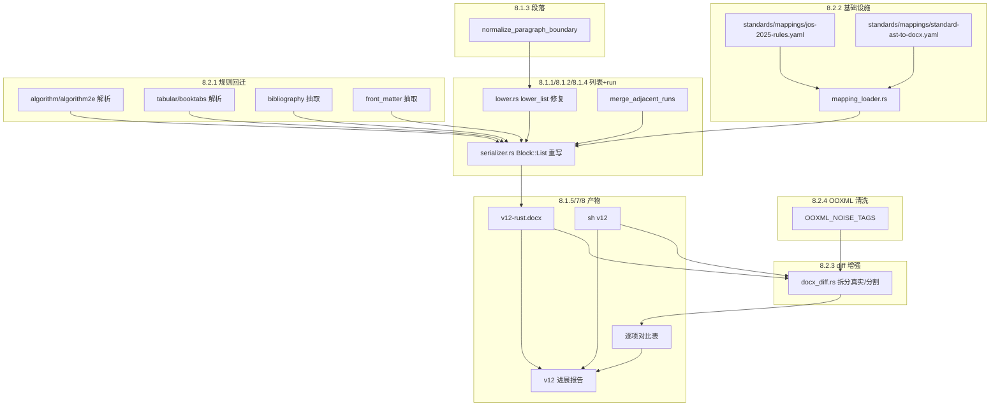

# Doc-engine v12 实施计划
> **版本 / Version**: v2.0
> **最后更新日期 / Last Updated**: 2026-06-26

## 总目标

完成报告 `docs/Doc-engine_开发进展总览报告_v1.7_20260618-062403.md` 第 8.1（v12 优先任务）和第 8.2（中期任务）共 9 个子任务，输出 v12 双版本 DOCX、全量核验材料与一份 v12 进展报告。

## 用户已确认的决策

- **范围**: 8.1 全部 + 8.2 全部
- **Mapping Registry 工具链**: Rust + YAML（serde_yaml）
- **列表映射策略**: sh 行为仿真 —— 保留 `ListBullet`/`ListNumber` 样式但**修复 itemize 文本泄漏**，对齐 sh 的"在 JOSBody 中插入手写序号"语义
- **最终交付物**: v12 双版本 DOCX + 全量 `docs/verify/v12-*` + 逐项对比表 + v12 进展报告

## 实施步骤（按依赖顺序）

### 步骤 1 — Mapping Registry YAML 化（先行，便于 8.2.1/8.2.2 共用基础设施）

- 新建 `crates/semantic-ast/src/mapping_loader.rs`：
  - 用 `serde_yaml` 加载 `standards/mappings/standard-ast-to-docx.yaml`（已存在,需补全字段）
  - 暴露 `MappingRegistry::from_yaml(profile_id, &str) -> Result<Self, MappingError>`
  - 保留 `for_profile()` 作为兜底硬编码默认
- 扩展 `standards/mappings/standard-ast-to-docx.yaml`，至少覆盖 8 个 style 目标（用户确认的 8.2.2 列表）:
  - `JOSHeading{1,2,3}`、`JOSBody`、`JOSAbstract`、`JOSKeywords`、`JOSReference`、`ListBullet`、`FigureCaption`、`TableCaption`
  - 每条规则带 `id`、`source_kind`、`target_kind`、`profile_style`、`rule_type`、`version`
- `crates/semantic-ast/src/lib.rs` 增加 `serde_yaml` 依赖与公共导出
- 新增 unit test：`mapping_loader.rs::tests::loads_jos_profile_yaml`

### 步骤 2 — 列表环境规范化（8.1.1 + 8.1.2 + 8.1.4 三合一）

定位：`crates/docx-writer/src/serializer.rs:177-207`（Block::List 分支）+ `crates/latex-reader/src/lower.rs:1265-1323`（`lower_list`）

- **8.1.2 修复 `itemize` 文本痕迹**：
  - 在 `latex-reader/src/lower.rs` 的 `lower_list` 中过滤 `body` 里以 `\begin{itemize}` 形式散落（非环境）出现的字面量 `itemize`/`enumerate` 字串（`lower_list` 入口处 trim 一遍）
  - 同步在 `latex-reader/src/normalize.rs` 的 `split_runs_with_sup_sub` 中增加 `itemize`/`enumerate` 字面量剥离
- **8.1.1 列表样式统一**：
  - 重写 `Block::List` 渲染分支：保留 `ListBullet`/`ListNumber`/`JOSReference` 样式选择（不动），但 `summarize()` 改为分别抽取每个 item 的子块文本，**不再丢失子结构**（嵌套 itemize/嵌套 list 也要正确处理）
  - 仿 sh 行为：当前 sh 把 list 渲为 `JOSBody` + 手写序号"1. …"；Rust 保留 `ListBullet/ListNumber` 样式但需保证 item 文本**无 itemize/enumerate 残留**且序号由样式定义生成（而不是在文本里硬塞）
- **8.1.4 run 规范化**（在 serializer 同时实现）：
  - 新增 `merge_adjacent_runs()` 工具函数：合并相邻的、格式签名完全一致的 run
  - 在 `write_paragraph` 调用前对每个段落 `runs` 执行该合并
  - 单元测试覆盖：相邻同格式 run 合并、不同格式 run 不合并
- 新增 unit test：
  - `latex-reader/tests/list_no_itemize_leak.rs`：输入 `\begin{itemize}\item itemize 文本` 不应出现在 AST 文本中
  - `docx-writer/tests/merge_adjacent_runs.rs`

### 步骤 3 — 段落规范化（8.1.3）

定位：`crates/latex-reader/src/lower.rs:279-340`（`flush_paragraph`）

- 在 `flush_paragraph` 之前增加 `normalize_paragraph_boundary()`：
  - 合并纯空白段落
  - 章节命令后多余空行裁剪为 1
  - 环境内 `\par` 折行折叠为单段
- 在 `latex-reader/src/lower.rs` 顶部导出 `pub fn normalize_paragraph_boundary`
- 新增 unit test：覆盖"连续空行 → 1 个"、"章节后多余空行 → 0 个"

### 步骤 4 — DOCX diff 增强（8.2.3）

定位：`crates/quality/src/docx_diff.rs`

- 拆 `compare_paragraph_format` 出的 `format_diffs` 为两类：
  - `format_changed_split_runs`: 段落文字相同但 run 切分边界不同（**无语义差**）
  - `format_changed_real`: 至少一个 run 的 (bold/italic/size/font/vert_align) 变化
- 在 `DocxDiffSummary` 增加：
  - `format_changed_split_only_paragraphs: usize`
  - `format_changed_real_paragraphs: usize`
- 在逐项对比表 markdown 模板中拆出 `## 真实格式差异` 与 `## run 分割差异（可忽略）` 两节
- 新增 unit test：构造左/右两侧 run 切分不同但语义相同的段落，验证分类正确

### 步骤 5 — OOXML 清洗规范化固定（8.2.4）

定位：`crates/quality/src/docx_diff.rs:758-816`（`canonicalize_ooxml`）

- 已有 `rsid*` 过滤补全以下规则（v12 固定清单）：
  - 删除 `w:rsidR`/`w:rsidRPr`/`w:rsidP`/`w:rsidRDefault`/`w:rsidTr`/`w:rsidSect`
  - 删除 `w:rsidRoot` 属性
  - 归一化 `w:lang` 节点（删除无意义变体）
  - 归一化段落属性顺序（按 OOXML schema 排序）
  - 移除 `<w:proofErr>` 标签
- 把上述规则集中在 `OOXML_NOISE_TAGS` 常量中并增加文档注释
- 新增 unit test：`canonicalize_ooxml_strips_all_rsid_and_proof_err`

### 步骤 6 — 规则回迁：算法/表格/参考文献/前后言（8.2.1）

定位：
- `crates/latex-reader/src/algorithm.rs`（算法）
- `crates/latex-reader/src/lower.rs` 表格分支
- `crates/latex-reader/src/bib.rs`（参考文献）
- `crates/latex-reader/src/front_matter.rs`（前后言）

逐项完成"sh oracle 行为"回迁：

- **算法（algorithm/algorithm2e）**：
  - 在 `lower_environment` 中识别 `algorithm`/`algorithm2e`，解析 `\For/\While/\If/\State/\Return/\KwIn/\KwOut`，构造 `Block::Algorithm` 而非 RawFallback
  - DOCX 渲染：保留现有 `write_algorithm_table`（ser.rs:851），在样式 `JOSCode` 上增加行号 run 规范化
- **表格（tabular/longtable/booktabs）**：
  - `\toprule/\midrule/\bottomrule` → `BorderSpec::Single`
  - `multicolumn` → `<w:gridSpan>`
  - 新增 unit test
- **参考文献（thebibliography + bibitem）**：
  - 检查 `JOSReference` 模式检测的鲁棒性（ser.rs:183-188），确保 `item[{[N]}]` 路径都能命中
  - 修复"[N] — author. title." 形态中 N 在不同页眉下的稳定性
- **前后言（abstract/keywords/title）**：
  - `front_matter.rs` 中确认 `JOSAbstractZh/JOSAbstractEn/JOSKeywords/JOSTitleZh/JOSAuthorZh/JOSInstituteZh` 的抽取顺序与 sh 一致
  - 避免摘要重复（v11 diff 中 modified #5/#15 仍存 0.99+ 差异，需要追查到根因）

### 步骤 7 — 端到端回归 + v12 产物输出

- 修改 `scripts/paper3_regression.sh`：
  - 在脚本中导出 `VERSION=v12-$(date +%Y%m%d-%H%M%S)`
  - Rust DOCX 输出改为 `examples/paper3/output/to-docx/${VERSION}-论文稿件-jos-rust-${VERSION}.docx`
  - 同理 sh 路径调用 `scripts/build_docx.sh ${VERSION}`
  - 把 `doc-engine docx-diff` 输出按版本号写到 `docs/verify/${VERSION}-docx-compare.{md,json}`
  - 把 `逐项对比表` 写到 `docs/verify/${VERSION}-逐项对比表.md`
- 跑通：`./scripts/paper3_regression.sh` + `./scripts/build_docx.sh v12-<ts>` 两次，得到 v12 双版本 DOCX
- 检查 v12 关键指标相对 v11 的变化（`paragraph_delta`/`format_changed_real_paragraphs`/`document_xml_equal`/`styles_xml_equal`）

### 步骤 8 — v12 进展报告

- 新建 `docs/Doc-engine_开发进展总览报告_v1.8_<v12timestamp>.md`
- 引用本计划文件作为附录
- 包含 6.1/6.2 报告模板要求的 11 个小节（"本次总目标" → "下一步规划"）
- 重点呈现 v12 相对 v11 的对比指标（新增"真实格式差异"与"run 分割差异"的拆分）
- 标注 GitNexus 影响分析（按 AGENTS.md 要求）：

  | 步骤 | 风险 | 关键符号 |
  |---|---|---|
  | 1 | MEDIUM | `MappingRegistry::for_profile`、`mapping_loader.rs::*` |
  | 2 | HIGH | `lower_list`、`Block::List` 渲染分支、`summarize` |
  | 3 | LOW | `flush_paragraph` |
  | 4 | MEDIUM | `compare_paragraph_format`、`DocxDiffSummary` |
  | 5 | LOW | `canonicalize_ooxml` |
  | 6 | CRITICAL | `lower_environment`、`bib.rs::*`、`front_matter.rs::*` |

## 关键文件清单

- 新建：
  - `crates/semantic-ast/src/mapping_loader.rs`
  - `standards/mappings/jos-2025-rules.yaml`（JOS 专用规则覆盖层，extends standard-ast-to-docx.yaml）
  - `docs/Doc-engine_开发进展总览报告_v1.8_<ts>.md`
  - `docs/plan/v12-plan.md`（本计划执行归档）
- 修改：
  - `crates/semantic-ast/src/lib.rs`（导出 mapping_loader）
  - `crates/semantic-ast/src/docx_render.rs`（保留 `for_profile` 兜底；可选让 `from_standard` 接受外部 registry）
  - `crates/semantic-ast/Cargo.toml`（加 `serde_yaml`）
  - `crates/latex-reader/src/lower.rs`（列表入口过滤 itemize 字面量、段落规范化、表格/算法回迁）
  - `crates/latex-reader/src/normalize.rs`（itemize 字面量剥离）
  - `crates/latex-reader/src/algorithm.rs`（环境识别补全）
  - `crates/docx-writer/src/serializer.rs`（Block::List 渲染重写 + merge_adjacent_runs）
  - `crates/quality/src/docx_diff.rs`（diff 拆分、OOXML 清洗常量）
  - `crates/quality/src/canonicalize.rs`（若现内嵌在 docx_diff.rs 则独立）
  - `scripts/paper3_regression.sh`（版本号参数化）
  - `scripts/build_docx.sh`（接受版本号）
  - `standards/mappings/standard-ast-to-docx.yaml`（补全字段）

## 风险与缓解

| 风险 | 缓解 |
|---|---|
| `lower_list` 改动波及 JOS 参考文献模式检测 | 在 unit test 中保留 JOS 参考文献快照回归；执行前先跑 `paper3_regression.sh` 取基线 |
| 段落规范化可能破坏 JOS 前言段落切分 | 仅对空行/段间空白生效；不动段内字符 |
| Mapping YAML 与硬编码并存可能导致双源不一致 | 加载 YAML 失败时回退 `for_profile` 硬编码；记录 `mapping_source` 字段便于排查 |
| v12 DOCX 名含 `v12-<ts>` 与 `build_docx.sh 11` 旧命名冲突 | 步骤 7 改 `build_docx.sh` 接受参数版本号 |
| 算法/表格/参考文献同时改 → 难以定位回归 | 每个子任务完成后单跑一次 e2e，把指标变化写入 plan 跟踪表 |

## 验证矩阵

| 验证项 | 期望 |
|---|---|
| `cargo test --all` | 通过 |
| `cargo fmt --all --check` | 通过 |
| `cargo clippy -p doc-latex-reader -p docx-writer -p quality -p semantic-ast` | 无新增 warning |
| `./scripts/paper3_regression.sh` | 通过（包含 docx + ast + render + verify + traceability） |
| `./scripts/build_docx.sh v12-<ts>` | 通过 |
| `paragraph_delta` 相对 v11 | 改善（目标 ≤ -40） |
| `format_changed_real_paragraphs` 相对 v11 | 改善（目标 ≤ 50） |
| `format_changed_split_only_paragraphs` | 至少 100（即被新分类吸收） |
| `document_xml_equal` | 可能仍 false（合理） |
| `styles_xml_equal` | v12 目标 true（与 v11 不同） |

## 数据流图

