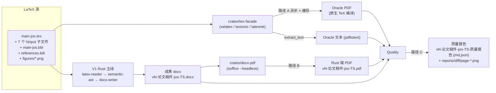

# 01 · V2 端到端流水线总览

> 本章最初站在 V2 草案的"高空"上，回答三个问题；当前实现状态请同时参考 [07-progress-2026-06-20.md](./07-progress-2026-06-20.md)：
> 1. V2 比 V1 多出哪几条数据流？
> 2. 新增的产物怎么命名、放在哪？
> 3. CI 与本地开发时一次完整跑动是哪些步骤、哪些会失败、退出码怎么定？

---

## 1.1 V1 vs V2 流水线对比

V1（参考 [../04-architecture/01-end-to-end-pipeline.md](../04-architecture/01-end-to-end-pipeline.md)）只跑一条线：`.tex` → Rust 主线 → `.docx`。

V2 在 V1 之外**叠加**三条新路径：

| 路径 | 触发时机 | 工具 | 产物 | 是否阻塞 V1 主线 |
|------|---------|------|------|----------------|
| **A. TeX oracle 编译** | 校验阶段 | `crates/tex-facade` → xelatex / tectonic / latexmk | `*.oracle.pdf` | 否（失败仅 warning） |
| **B. docx → pdf 转换** | 校验阶段 | `crates/docx-pdf` → LibreOffice headless | `*.pdf` | **是**（失败 exit 1） |
| **C. 三层质量对比** | 校验阶段 | `crates/quality` | `*-质量报告.{md,json}` + `reports/diff/*.png` | **是**（按层定退出码） |

> **关键不变量**：兼容主线（[crates/latex-reader/](../../../crates/latex-reader/) → [crates/docx-writer/](../../../crates/docx-writer/) → `doc-core`）继续保留。V2 路径默认只读既有 DOCX/PDF 产物；新语义编译入口由 `doc-compiler-engine` 另行承载。

---

## 1.2 V2 端到端数据流



| 阶段 | V1 是否涉及 | V2 增量 | 主要 crate |
|------|----------|----------|----------|
| 1. 源读取 | 是 | — | V1 不变 |
| 2. TeX 编译 oracle | 否 | 新增 A | `tex-facade` |
| 3. V1 主流水线 | 是 | — | V1 不变 |
| 4. docx 产物命名 / 写盘 | 是 | — | V1 不变 |
| 5. docx → pdf | 否 | 新增 B | `docx-pdf` |
| 6. 三层质量对比 | 否 | 新增 C | `quality` |
| 7. 报告合并 + 退出码 | 是（[to-docx/08-verification.md](../../to-docx/08-verification.md) 33 项） | 扩展到 3 层 | `quality` |

---

## 1.3 产物清单与命名

### 1.3.1 文件命名（与 [../../to-docx/01-pipeline-overview.md §1.4](../../to-docx/01-pipeline-overview.md) 对齐）

| 产物 | 路径 | 命名规则 | 来源 |
|------|------|---------|------|
| Rust 端 docx | `docs/to-docx/` | `vN-论文稿件-jos-{TS}.docx` | V1 主线 |
| Rust 端 pdf | `docs/to-docx/` | `vN-论文稿件-jos-{TS}.pdf` | V2 路径 B |
| Oracle pdf | `docs/to-docx/` | `vN-论文稿件-jos-{TS}.oracle.pdf` | V2 路径 A |
| 三层质量报告（md） | `docs/to-docx/` | `vN-论文稿件-jos-{TS}-质量报告.md` | V2 路径 C |
| 三层质量报告（json） | `docs/to-docx/` | `vN-论文稿件-jos-{TS}-质量报告.json` | V2 路径 C |
| 视觉层 diff 留痕 | `docs/to-docx/reports/vN-TS/diff/` | `page-{NN}.png` | V2 路径 C 视觉层 |

> `TS = date +%Y%m%d-%H%M%S`；`vN` 沿用 V1 策略（扫 `docs/` 下 `v*-论文稿件-*` 取 max + 1），由 [tex-facade shell 入口](../../to-docx/01-pipeline-overview.md#14-产物命名) 复刻。

### 1.3.2 报告 JSON 顶层结构

```jsonc
{
  "docx": "vN-论文稿件-jos-TS.docx",
  "rust_pdf": "vN-论文稿件-jos-TS.pdf",
  "oracle_pdf": "vN-论文稿件-jos-TS.oracle.pdf",
  "passed": true,                    // 三层全通过
  "exit_code": 0,
  "layer_results": {
    "structural": { "passed": true,  "checks": 37, "failed": [] },
    "textual":    { "passed": true,  "checks": 25, "failed": [] },
    "visual":     { "passed": true,  "checks":  4, "failed": [] }
  },
  "structural_checks": [ /* 33 项 V1 + 4 项 PDF 端 */ ],
  "textual_checks":    [ /* 字符覆盖、marker 覆盖、章节覆盖 */ ],
  "visual_checks":     [ /* SSIM / 像素差 / OCR 文本 / diff 文件清单 */ ],
  "marker_coverage":   [ /* 22 marker 在 docx / oracle / rust_pdf 三处命中 */ ],
  "page_setup":        { /* 沿用 V1 页面尺寸/边距/分栏 */ },
  "rust_pdf_meta":     { "page_count": 12, "file_size": 487213, "embedded_fonts": ["SimSun","SimHei"], "has_tounicode": true },
  "oracle_pdf_meta":   { "page_count": 12, "file_size": 491203, "embedded_fonts": ["SimSun","SimHei"], "has_tounicode": true },
  "docx_chars": 12345,
  "rust_pdf_chars":  12100,
  "oracle_pdf_chars": 12301,
  "char_ratio": 0.987
}
```

---

## 1.4 shell 入口

早期设计中的 `build_docx_and_pdf.sh` 已由当前 `doc-engine build` 与 paper3 专用脚本替代。推荐入口：

```bash
cargo run -p doc-engine -- build ...
bash scripts/build_paper3_compiler_engine_docx.sh
bash scripts/build_paper3_dual_docx.sh
```

历史草案如下：

```bash
#!/usr/bin/env bash
set -euo pipefail

# 1. 解析 ROOT
ROOT="$(cd "$(dirname "${BASH_SOURCE[0]}")/.." && pwd)"

# 2. 检查依赖（V1 依赖 + V2 新增）
check_deps() {
  local missing=()
  for dep in "$@"; do
    command -v "$dep" >/dev/null 2>&1 || missing+=("$dep")
  done
  if (( ${#missing[@]} > 0 )); then
    echo "✗ 缺失依赖: ${missing[*]}" >&2
    exit 1
  fi
}
check_deps cargo xelatex soffice pdftotext

# 3. 版本号 + 时间戳（沿用 V1 策略）
MAX_V="$(find "${ROOT}/docs" -type f -name 'v*-论文稿件-*' -printf '%f\n' \
  | sed -n 's/^v\([0-9]\+\)-论文稿件-.*/\1/p' | sort -n | tail -1 || true)"
VERSION=$(( ${MAX_V:-0} + 1 ))
TS="$(date +%Y%m%d-%H%M%S)"

# 4. V1 主线：编译 docx
cargo run --release --quiet --bin doc-engine -- build --root "$ROOT" \
  --output "docs/to-docx/v${VERSION}-论文稿件-jos-${TS}.docx"

DOCX="docs/to-docx/v${VERSION}-论文稿件-jos-${TS}.docx"
ORACLE_PDF="docs/to-docx/v${VERSION}-论文稿件-jos-${TS}.oracle.pdf"
RUST_PDF="docs/to-docx/v${VERSION}-论文稿件-jos-${TS}.pdf"
REPORT_MD="docs/to-docx/v${VERSION}-论文稿件-jos-${TS}-质量报告.md"
REPORT_JSON="docs/to-docx/v${VERSION}-论文稿件-jos-${TS}-质量报告.json"

# 5. V2 路径 A：TeX oracle（失败仅 warning）
if cargo run --release --quiet --bin doc-engine -- tex-compile \
     --project "${ROOT}/examples/paper3" --output "$ORACLE_PDF"; then
  echo "✓ Oracle PDF: $ORACLE_PDF"
else
  echo "⚠ Oracle 编译失败，继续（warning 写入报告）"
fi

# 6. V2 路径 B：docx → pdf（失败 exit 1）
cargo run --release --quiet --bin doc-engine -- docx-to-pdf \
  --input "$DOCX" --output "$RUST_PDF"

# 7. V2 路径 C：三层质量对比
cargo run --release --quiet --bin doc-engine -- verify \
  --docx "$DOCX" --rust-pdf "$RUST_PDF" --oracle-pdf "$ORACLE_PDF" \
  --format "${ROOT}/docs/format/jos_2025_docx_format_definitions.json" \
  --report "$REPORT_MD" --json-report "$REPORT_JSON" \
  --layer all

echo "完成: $DOCX / $RUST_PDF / $REPORT_MD"
```

Windows 入口等价脚本为 [scripts/build_docx_and_pdf.ps1](../../../scripts/build_docx_and_pdf.ps1)（M5 阶段交付）。

---

## 1.5 失败策略与退出码

| 失败位置 | 退出码 | docx 产物 | 报告产物 | 用户可感知 |
|---------|------|----------|---------|----------|
| V1 docx 编译失败 | 1 | ❌ 未生成 | ❌ | 主线失败 |
| 路径 A oracle 编译失败 | 0（warning） | ✅ 已存在 | ✅ 标记 `oracle: "skipped"` | warning，不阻断 |
| 路径 B docx→pdf 失败 | 1 | ✅ 已存在 | ✅（仅结构层） | 主线失败 |
| 路径 C 结构层失败 | 1 | ✅ | ✅ | 主线失败 |
| 路径 C 文本层失败 | 1 | ✅ | ✅ | 主线失败 |
| 路径 C 视觉层失败 | 2 | ✅ | ✅（含 diff PNG） | **视觉降级**——CI 用不同状态卡 |
| 路径 C 全部通过 | 0 | ✅ | ✅ | 通过 |

> **CI 区分视觉降级（exit 2）与主失败（exit 1）** 的目的：
> 视觉层可能因 LibreOffice 字体子集差异抖动，CI 上用 0/2 视为"软失败"——发 PR comment 而非强制失败；
> 文本/结构层一旦失败（LaTeX 残留、章节丢失、字符比例 < 0.75）则是真问题，必须阻断。

---

## 1.6 CI 集成

### 1.6.1 GitHub Actions 矩阵（增量）

V1 现有矩阵（参考 [../07-deployment/06-ci-and-hooks.md](../07-deployment/06-ci-and-hooks.md)）保持不动。V2 在其上**新增** [`.github/workflows/v2-pdf-pipeline.yml`](../../../.github/workflows/v2-pdf-pipeline.yml)：

```yaml
name: v2-pdf-pipeline

on:
  pull_request:
    paths:
      - 'crates/tex-facade/**'
      - 'crates/docx-pdf/**'
      - 'crates/quality/**'
      - 'examples/paper3/**'
  workflow_dispatch:
    inputs:
      run_visual:
        description: '运行视觉层（CI 默认跳过）'
        type: boolean
        default: false

jobs:
  build-pdf:
    strategy:
      fail-fast: false
      matrix:
        os: [ubuntu-latest, windows-latest, macos-latest]
    runs-on: ${{ matrix.os }}
    steps:
      - uses: actions/checkout@v4

      # 1. Rust 工具链
      - uses: dtolnay/rust-toolchain@stable
        with:
          components: rustfmt, clippy

      # 2. 平台依赖
      - name: 安装 LibreOffice（中文字体）
        if: runner.os == 'Linux'
        run: |
          sudo apt-get update
          sudo apt-get install -y libreoffice fonts-noto-cjk
      - name: 安装 LibreOffice（macOS）
        if: runner.os == 'macOS'
        run: brew install --cask libreoffice
      - name: 安装 LibreOffice（Windows）
        if: runner.os == 'Windows'
        run: choco install libreoffice -y

      # 3. TeX 引擎
      - name: 安装 TeX Live
        uses: xu-cheng/texlive-action@v2
        with:
          scheme: basic
          packages: xetex latexmk

      # 4. 缓存
      - uses: Swatinem/rust-cache@v2
      - uses: actions/cache@v4
        with:
          path: docs/to-docx/v*-论文稿件-jos-*.oracle.pdf
          key: oracle-pdf-${{ hashFiles('examples/paper3/latex/**') }}

      # 5. 跑 V2 流水线
      - name: 跑 V2 流水线
        shell: bash
        run: bash scripts/build_docx_and_pdf.sh
        env:
          RUN_VISUAL: ${{ github.event.inputs.run_visual || 'false' }}

      # 6. 上传报告
      - name: 上传报告
        if: always()
        uses: actions/upload-artifact@v4
        with:
          name: v2-pdf-report-${{ matrix.os }}
          path: |
            docs/to-docx/v*-论文稿件-jos-*-质量报告.md
            docs/to-docx/v*-论文稿件-jos-*-质量报告.json
            docs/to-docx/v*-论文稿件-jos-*.pdf
            docs/to-docx/reports/v*/
```

### 1.6.2 视觉层条件触发

视觉层（`pdfium-render` + 像素 diff）在 3 平台 × 2 PDF 上各跑一次，单次 ~3 分钟；
CI 默认**只在带 `visual-check` label 的 PR** 上跑视觉层：

```yaml
- name: 跑视觉层
  if: contains(github.event.pull_request.labels.*.name, 'visual-check') || env.RUN_VISUAL == 'true'
  run: cargo run --release --quiet --bin doc-engine -- verify --layer visual ...
```

---

## 1.7 与 V1 端到端架构文档的关系

V1 的 [../04-architecture/01-end-to-end-pipeline.md](../04-architecture/01-end-to-end-pipeline.md) 描述的是**纯 Rust 主线**（5 段流水线），仍是 V2 的主干。V2 的端到端图是 V1 图的**超集**——叠加路径 A/B/C 三个旁路。

> 建议阅读顺序：先 V1 [04-architecture/01](../04-architecture/01-end-to-end-pipeline.md) → 再 [../04-architecture/02-layered-architecture.md](../04-architecture/02-layered-architecture.md) → 再回到本 V2 章节。

---

## 1.8 行为不变性（V2 必须保留）

1. V1 主线行为**字节级不变**——同源 `.tex` 输入产生**同字节** docx 产物（V2 不修改 [crates/docx-writer/](../../../crates/docx-writer/)）。
2. 路径 A/B 失败**不修改**已写盘的 docx。
3. 路径 C **只读** docx / pdf，**不写回**。
4. oracle PDF 命名带 `.oracle.pdf` 后缀，**绝不与 Rust PDF 同名**（避免覆盖）。
5. 任何路径失败**保留**已生成的所有中间产物，留痕用。

---

## 1.9 本章未尽事项

- 5 篇之间的接口契约（`TexFacade::compile_to_pdf` 的输入/输出签名、缓存格式）：见 [02-tex-facade.md](./02-tex-facade.md)。
- docx→pdf 的进程管理与超时细节：见 [03-docx-to-pdf.md](./03-docx-to-pdf.md)。
- 三层质量对比的"通过/降级/未通过"判定门槛：见 [04-quality-comparison.md](./04-quality-comparison.md)。
- 实施排期与风险：见 [05-implementation-roadmap.md](./05-implementation-roadmap.md)。
