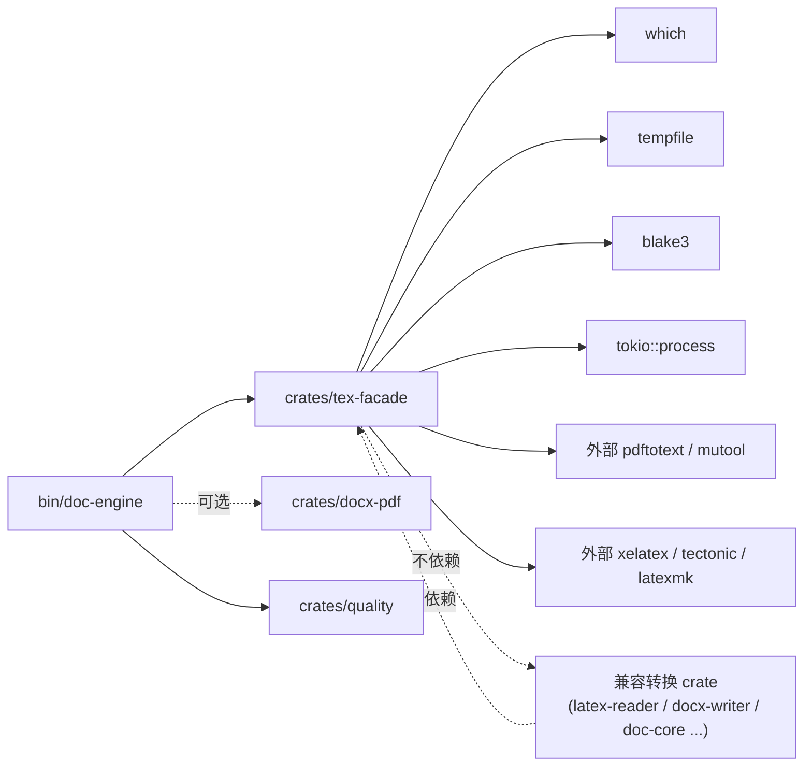

# 02 · `crates/tex-facade` 设计

> 本章回答：在 V1「不调用 TeX」的边界下，如何用 Rust 端**可插拔地**封装外部 TeX 进程，
> 生成 oracle PDF、抽取 oracle 文本，并提供缓存与并发控制。
>
> 这是 V2 路径 A 的核心 crate（见 [01-pipeline-overview.md §1.2](./01-pipeline-overview.md)）。

---

## 2.1 设计目标

1. **可插拔**：同一 Rust API 后面能跑 `xelatex` / `tectonic` / `latexmk` 任一引擎；上层无需关心。
2. **失败安全**：引擎不存在 / 编译失败 / 输出 PDF 不存在时返回 `Result`，**不 panic**。
3. **可缓存**：以源文件拓扑哈希为键，避免 CI 重复编译 800ms+ 的项目。
4. **可并发**：用信号量限制同时编译数（默认 2），避免 `tectonic` 网络风暴或 LibreOffice OOM。
5. **零侵入**：V1 crate **不依赖** `tex-facade`；`tex-facade` 只在 V2 校验子命令的 `bin/doc-engine` 入口被引用。

---

## 2.2 仓库位置

```
crates/tex-facade/
├── Cargo.toml
├── src/
│   ├── lib.rs          # 顶层导出
│   ├── backend.rs      # trait TexBackend + TexRun + TexProject
│   ├── xelatex.rs      # XelatexBackend
│   ├── tectonic.rs     # TectonicBackend
│   ├── latexmk.rs      # LatexmkBackend
│   ├── facade.rs       # struct TexFacade
│   ├── cache.rs        # 缓存键（blake3）+ 缓存目录管理
│   ├── extract.rs      # pdftotext / mutool 文本抽取
│   └── error.rs        # thiserror 错误类型
└── tests/
    ├── xelatex.rs      # 集成测试（需要本机有 xelatex）
    ├── tectonic.rs
    └── latexmk.rs
```

> 集成测试默认 `#[ignore]` 标记，CI 上用 `--features integration` 显式开启；单元测试不依赖外部进程。

---

## 2.3 Cargo.toml

```toml
[package]
name        = "doc-tex-facade"
version     = "0.1.0"
edition.workspace     = true
rust-version.workspace = true
license.workspace     = true
publish      = false

[dependencies]
# 已有 workspace deps
anyhow       = { workspace = true }
thiserror    = { workspace = true }
tokio        = { workspace = true, features = ["process", "fs", "sync", "io-util", "rt-multi-thread", "macros"] }

# 新增
which        = "6"           # 探测 xelatex / tectonic / latexmk 是否在 PATH
tempfile     = "3"           # 隔离编译工作目录
blake3       = "1"           # 缓存键
async-trait  = "0.1"
serde        = { workspace = true, features = ["derive"] }
serde_json   = { workspace = true }
walkdir      = "2"           # 扫描 \input / \include 拓扑
tracing      = "0.1"
chrono       = { workspace = true }

[dev-dependencies]
tempfile     = "3"
pretty_assertions = "1"
```

并把 `doc-tex-facade` 加入根 [Cargo.toml](../../../Cargo.toml) `workspace.members`。

---

## 2.4 核心类型

### 2.4.1 `TexProject`（输入）

```rust
//! crates/tex-facade/src/backend.rs

use std::path::{Path, PathBuf};

#[derive(Debug, Clone)]
pub struct TexProject {
    /// 主入口 .tex 绝对路径，例如 examples/paper3/latex/main-jos.tex
    pub main_file: PathBuf,
    /// 工作目录（含 main_file、figures/、references.bib、.bbl 等所有依赖）
    pub workdir: PathBuf,
    /// 编译引擎偏好（None = 自动探测）
    pub preferred: Option<EngineKind>,
    /// 期望最终 PDF 文件名（默认同 main_file 主名 + .pdf）
    pub output_name: Option<String>,
    /// 编译最大尝试次数（含 bibtex 跑两轮），默认 2
    pub max_passes: u32,
}

#[derive(Debug, Clone, Copy, PartialEq, Eq)]
pub enum EngineKind { Xelatex, Tectonic, Latexmk }
```

### 2.4.2 `TexBackend` trait

```rust
use anyhow::Result;
use async_trait::async_trait;
use std::path::Path;

#[derive(Debug, Clone)]
pub struct TexRun {
    pub engine: EngineKind,
    pub main_file: std::path::PathBuf,
    pub pdf_path: std::path::PathBuf,
    pub log: String,           // 主 .log 末尾 4KB，便于排错
    pub aux_modified: bool,    // 第二次跑是否动了 .aux（false = 收敛）
    pub elapsed_ms: u64,
}

#[async_trait]
pub trait TexBackend: Send + Sync {
    fn kind(&self) -> EngineKind;
    fn name(&self) -> &'static str { self.kind().as_str() }
    /// 返回 true 表示本机已安装且能用
    async fn is_available(&self) -> bool;
    /// 跑一次完整编译（含 bibtex 跑两轮），返回最终 PDF 路径
    async fn compile(&self, project: &TexProject) -> Result<TexRun>;
}
```

### 2.4.3 `TexFacade` 顶层门面

```rust
//! crates/tex-facade/src/facade.rs

use std::path::{Path, PathBuf};
use std::sync::Arc;
use anyhow::{Context, Result};
use tokio::sync::Semaphore;

pub struct TexFacade {
    backends: Vec<Arc<dyn TexBackend>>,
    cache: Cache,                       // 见 §2.6
    sem: Semaphore,                     // 并发限流
    pdftotext: Option<PathBuf>,         // None = 不抽文本
}

impl TexFacade {
    /// 默认构造：探测 xelatex → tectonic → latexmk
    pub async fn probe() -> Result<Self> { ... }

    /// 显式指定引擎
    pub fn with_backend(b: Arc<dyn TexBackend>) -> Self { ... }

    /// 设置并发上限（默认 2）
    pub fn with_concurrency(mut self, n: usize) -> Self { ... }

    /// 编译并返回 PDF 路径（命中缓存则秒返）
    pub async fn compile_to_pdf(&self, project: &TexProject) -> Result<PathBuf> { ... }

    /// 抽取 PDF 文本（自动选择 pdftotext / mutool convert）
    pub async fn extract_text(&self, pdf: &Path) -> Result<String> { ... }

    /// 探测本机可用引擎
    pub async fn available_engines(&self) -> Vec<EngineKind> { ... }
}
```

---

## 2.5 三个后端实现

### 2.5.1 `XelatexBackend`

```rust
//! crates/tex-facade/src/xelatex.rs

pub struct XelatexBackend {
    bin: PathBuf,       // 来自 which::which("xelatex")
}

#[async_trait]
impl TexBackend for XelatexBackend {
    fn kind(&self) -> EngineKind { EngineKind::Xelatex }

    async fn is_available(&self) -> bool {
        tokio::fs::metadata(&self.bin).await.is_ok()
    }

    async fn compile(&self, project: &TexProject) -> Result<TexRun> {
        // 工作目录是 project.workdir 本身（不复制），避免大图复制浪费 IO
        // 命令序列（max_passes=2）：
        //   xelatex -interaction=nonstopmode -halt-on-error -output-directory=<workdir> <main>
        //   bibtex <mainstem>      （如果 main.aux 含 \bibdata 且 .bbl 未生成）
        //   xelatex ... <main>     x2
        // 收敛条件：第二轮 .aux 哈希与第一轮一致 OR aux_modified=false
        ...
    }
}
```

关键点：

- **`-interaction=nonstopmode -halt-on-error`**：避免阻塞在 `\input` 找不到时手工交互。
- **`-output-directory=<workdir>`**：让 `.aux`/`.log`/`.pdf` 全部落工作目录，方便 `walkdir` 收尾清理。
- **bibtex 步**：仅当检测到 `.bbl` 缺失而 `.bib` 存在时跑；已存在 `.bbl`（如 `examples/paper3/latex/main-jos.bbl`）则**跳过 bibtex**——这是 V2 的关键加速点（`paper3` 已有 .bbl）。
- **收敛判定**：第二轮 xelatex 跑完，对比两次 `.aux` 字节级 hash；一致则 `aux_modified=false` 提前返回。

### 2.5.2 `TectonicBackend`

```rust
pub struct TectonicBackend {
    bin: PathBuf,                        // which::which("tectonic")
    /// 网络是否可达 tectonic 资源 CDN；不可达时退化为 xelatex
    allow_network: bool,
}

#[async_trait]
impl TexBackend for TectonicBackend {
    fn kind(&self) -> EngineKind { EngineKind::Tectonic }

    async fn is_available(&self) -> bool { ... }

    async fn compile(&self, project: &TexProject) -> Result<TexRun> {
        // tectonic --outdir <workdir> --keep-logs --print <main>
        // tectonic 自动跑 bibtex 链，无需手动多 pass
        ...
    }
}
```

Tectonic 优势：自动重试、自动跑 bibtex、产物确定；劣势：首次会下载包（CI 上需预热镜像，详见 [05-implementation-roadmap.md §关键风险](./05-implementation-roadmap.md)）。

### 2.5.3 `LatexmkBackend`

```rust
pub struct LatexmkBackend { bin: PathBuf }

#[async_trait]
impl TexBackend for LatexmkBackend {
    fn kind(&self) -> EngineKind { EngineKind::Latexmk }

    async fn compile(&self, project: &TexProject) -> Result<TexRun> {
        // latexmk -xelatex -interaction=nonstopmode -halt-on-error -pdf <main>
        // 由 latexmk 决定 pass 数，自动 bibtex/biber
        ...
    }
}
```

Latexmk 是兼容性最广的入口——如果用户机器上 `latexmk` 已装（macOS TeX Live、Linux texlive-latex-extra），通常走它最稳。

---

## 2.6 缓存策略

### 2.6.1 缓存键

```rust
//! crates/tex-facade/src/cache.rs

use blake3::Hasher;

pub struct CacheKey(pub [u8; 32]);

pub fn compute_key(project: &TexProject) -> Result<CacheKey> {
    // 1. 找 main_file 同目录下所有被 \input/\include/\subfile 引用的 .tex
    //    （仅做单层；V2 不解析递归 input——paper3 顶层 main 已覆盖所有章）
    // 2. 收集 main + 所有被引 .tex + 所有图片（figures/ 下 png/jpg/pdf）字节哈希
    // 3. 加 prefix "v2-tex-facade:v1:" 防跨版本
    let mut hasher = Hasher::new();
    hasher.update(b"v2-tex-facade:v1:");
    hasher.update(blake3::hash(&std::fs::read(&project.main_file)?).as_bytes());
    for include in referenced_tex_files(&project.main_file)? {
        hasher.update(blake3::hash(&std::fs::read(include)?).as_bytes());
    }
    for media in walkdir::WalkDir::new(project.workdir.join("figures"))
        .into_iter()
        .filter_map(|e| e.ok())
        .filter(|e| e.path().extension().is_some_and(|x| x == "png" || x == "jpg" || x == "pdf")) {
        hasher.update(blake3::hash(&std::fs::read(media.path())?).as_bytes());
    }
    Ok(CacheKey(*hasher.finalize().as_bytes()))
}
```

### 2.6.2 缓存目录结构

```
<cache_root>/v2-tex-facade/<engine>/<blake3-hash>/
├── input.snapshot.json     // 记录参与哈希的所有文件 + size + mtime
├── output.pdf
└── build.log               // 末尾 4KB
```

- 缓存根目录默认 `<workdir>/.cache/tex-facade/`，可通过环境变量 `DOC_TEX_CACHE` 覆盖。
- **失败不缓存**：`compile()` 返回 `Err` 时不写 `output.pdf`；下次同 key 重新编译（避免把一次失败的 PDF 当缓存）。
- **过期策略**：当前 V2 **不实现 LRU**——CI 每次以仓库 hash 重新生成 cache key；本地开发可手动 `rm -rf .cache/tex-facade/`。

### 2.6.3 缓存命中路径

```rust
pub async fn compile_to_pdf(&self, project: &TexProject) -> Result<PathBuf> {
    let key = cache::compute_key(project)?;
    let cache_pdf = self.cache.dir(key).join("output.pdf");
    if cache_pdf.exists() {
        tracing::info!(?key, "tex-facade cache hit");
        return Ok(cache_pdf);
    }
    let _permit = self.sem.acquire().await?;
    let backend = self.pick_backend(project).await?;
    let run = backend.compile(project).await?;
    self.cache.store(key, &run).await?;
    Ok(run.pdf_path)
}
```

---

## 2.7 错误处理

```rust
//! crates/tex-facade/src/error.rs

use thiserror::Error;

#[derive(Debug, Error)]
pub enum TexError {
    #[error("未找到任何 TeX 引擎（xelatex / tectonic / latexmk 均不在 PATH）")]
    NoEngine,

    #[error("指定引擎 {0:?} 不可用（which 失败或执行返回非 0）")]
    EngineUnavailable(EngineKind),

    #[error("编译失败：{engine} 跑 {passes} 轮仍未生成 {output:?}，\n--- log tail ---\n{log}")]
    CompileFailed { engine: EngineKind, passes: u32, output: std::path::PathBuf, log: String },

    #[error("缓存目录不可写：{0}")]
    CacheUnwritable(std::path::PathBuf),

    #[error("pdftotext / mutool 均不可用，无法抽取文本")]
    NoTextExtractor,

    #[error("I/O 错误：{0}")]
    Io(#[from] std::io::Error),
}

pub type TexResult<T> = Result<T, TexError>;
```

错误不写 panic 路径（与 V1 边界保持一致——[../01-overview/01-features.md §1.3.1](../01-overview/01-features.md) "绝不 panic"）。

---

## 2.8 并发与资源控制

```rust
impl TexFacade {
    pub fn with_concurrency(mut self, n: usize) -> Self {
        self.sem = Semaphore::new(n.max(1));
        self
    }

    /// 默认 2：CI 跑 3 平台矩阵时单平台并发 2 个 .tex 编译
    pub fn default_concurrency() -> usize { 2 }
}
```

为什么默认 2？

- `xelatex` 单进程占 ~150 MB；3 平台 runner 共 7 GB 可用内存时，2 不会 OOM。
- `tectonic` 首次跑会下载包，并发 2 已能触发 race；降到 1 又太慢。

---

## 2.9 文本抽取

```rust
//! crates/tex-facade/src/extract.rs

pub async fn extract_text(pdf: &Path) -> Result<String> {
    if let Some(pdftotext) = which::which("pdftotext").ok() {
        // pdftotext <pdf> -   → stdout
        let out = tokio::process::Command::new(pdftotext)
            .arg(pdf).arg("-")
            .output().await?;
        if out.status.success() { return Ok(String::from_utf8_lossy(&out.stdout).into_owned()); }
    }
    if let Some(mutool) = which::which("mutool").ok() {
        // mutool convert -F text -o - <pdf>
        let out = tokio::process::Command::new(mutool)
            .args(["convert", "-F", "text", "-o", "-"])
            .arg(pdf)
            .output().await?;
        if out.status.success() { return Ok(String::from_utf8_lossy(&out.stdout).into_owned()); }
    }
    Err(TexError::NoTextExtractor.into())
}
```

> **优先级 pdftotext > mutool**：pdftotext 对 CTeX CJK 字体支持比 mutool 略好；二者皆无时返回 `NoTextExtractor`，路径 A 自动降级为"无 oracle 文本"（仅结构/视觉可对比）。

---

## 2.10 单元测试策略

| 函数 | 测试 | 覆盖点 |
|------|------|-------|
| `compute_key` | 给定两份**不同** .tex 应得不同 key | 哈希正确性 |
| `compute_key` | 同 .tex 改一个空格 key 应变 | 内容敏感 |
| `referenced_tex_files` | `\input{01_intro}` + `\input{02_related}` 应列出 2 个文件 | include 解析 |
| `XelatexBackend::is_available` | 探测本机；CI 用 `#[ignore]` | 平台探测 |
| `extract_text` | 给固定 1 页 PDF 应抽到非空文本 | 工具链探测 |
| `TexFacade::compile_to_pdf` | 集成测试（`#[ignore]`）：跑 `examples/paper3/latex/main-jos.tex` | 端到端编译 |

参考 [../../to-docx/09-rust-port.md §9.6](../../to-docx/09-rust-port.md) 的对照表风格。

---

## 2.11 与 V1 crate 的依赖关系



- `doc-tex-facade` 不依赖 `doc-core` / `doc-latex-reader` / `doc-docx-writer`。
- 兼容转换 crate 不依赖 `doc-tex-facade`。
- 主要调用点是 `doc-engine` CLI 的 `tex-compile` / `build` / 质量验证路径。

---

## 2.12 已知坑（先记下，M2 阶段处理）

1. **xelatex 路径含中文** → Windows 下 `output-directory` 含中文路径会失败；解决：在 workdir 内部建 `build/` 子目录并 chdir 进去再调 xelatex。
2. **CJK 字体缓存缺失** → 首次 tectonic 跑会下 Noto CJK；CI 必须预热或挂本地字体。
3. **`which::which` 在 Windows 上找 `.cmd` 失败** → 用 `which::which_in_global` 或 `where` 兜底。
4. **bibtex 反复跑不收敛**（如 tikz-cd 等需要 3 轮） → `max_passes` 改 3，aux_modified 判据保留。
5. **缓存目录跨平台路径分隔** → 缓存 key 用 `blake3` 字节序列，不掺路径，路径分隔符不影响。

---

## 2.13 小结

`tex-facade` 解决 V2 路径 A 的全部需求：

- **可插拔**（3 个后端 + 探测）
- **失败安全**（Result + thiserror）
- **可缓存**（blake3 内容寻址）
- **可并发**（Semaphore）
- **零侵入**（V1 不依赖）

下一步：路径 B（docx→pdf）见 [03-docx-to-pdf.md](./03-docx-to-pdf.md)。
