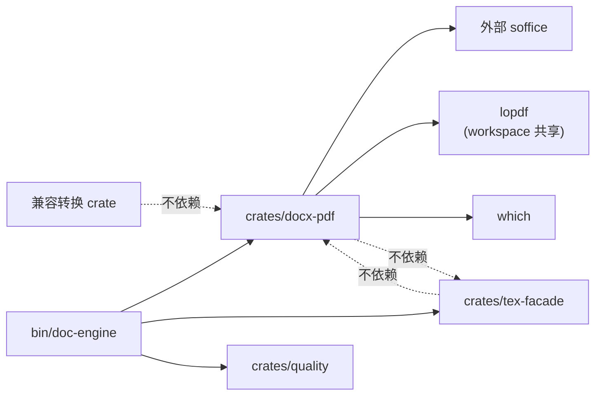

# 03 · `crates/docx-pdf` 设计
> **版本 / Version**: v2.0
> **最后更新日期 / Last Updated**: 2026-06-26


> 本章回答：在 V1 端产出的 docx 之上，**用 LibreOffice headless 做二次转换**得到 PDF。
> 不重新发明排版引擎——直接复用 LibreOffice 的 docx→pdf 能力，并把它封装成可替换的 Rust trait。
>
> 这是 V2 路径 B 的核心 crate（见 [01-pipeline-overview.md §1.2](./01-pipeline-overview.md)）。

---

## 3.1 设计目标

1. **可插拔后端**：默认 `LibreOfficeBackend`，预留 `PdfConverterApiBackend`（远程 HTTP）/ `WordComBackend`（Windows only）两个备选，trait 接口稳定。
2. **进程安全**：LibreOffice 是单实例锁敏感的——必须每次独立 `--user-profile` 目录，否则并发跑 2 个就会死锁。
3. **超时与重试**：soffice 在大文档（>200 页）冷启动可达 30s+；默认超时 120s，3 次指数退避。
4. **临时目录清理**：转换完成后**必须**清理 user-profile 与 outdir；CI 上泄漏会撑爆 runner 磁盘。
5. **中文字体保真**：检测输出 PDF 是否含 `ToUnicode` CMap（决定能否复制粘贴中文）；缺失时报告 warning。
6. **零侵入**：V1 crate **不依赖** `docx-pdf`；`docx-pdf` 只在 V2 校验子命令被引用。

---

## 3.2 仓库位置

```
crates/docx-pdf/
├── Cargo.toml
├── src/
│   ├── lib.rs              # 顶层导出
│   ├── backend.rs          # trait DocxToPdfBackend + DocxToPdfRun
│   ├── libreoffice.rs      # LibreOfficeBackend
│   ├── api.rs              # PdfConverterApiBackend (M3 末)
│   ├── word_com.rs         # WordComBackend (M3 末，仅 Windows feature gate)
│   ├── profile.rs          # user-profile 目录管理
│   ├── timeout.rs          # 超时 + 指数退避封装
│   ├── meta.rs             # 解析 PDF 元数据（页数 / 嵌入字体 / ToUnicode）
│   └── error.rs            # thiserror
└── tests/
    ├── libreoffice.rs      # 集成测试（#[ignore]）
    └── fixtures/
        └── tiny.docx       # 1 段 1 图的最小 docx，用于 CI
```

---

## 3.3 Cargo.toml

```toml
[package]
name        = "doc-docx-pdf"
version     = "0.1.0"
edition.workspace     = true
rust-version.workspace = true
license.workspace     = true
publish      = false

[features]
default = ["libreoffice"]
libreoffice = []
word-com   = []   # 暂不实现，仅 feature gate 占位

[dependencies]
# 已有 workspace deps
anyhow       = { workspace = true }
thiserror    = { workspace = true }
tokio        = { workspace = true, features = ["process", "fs", "sync", "io-util", "rt-multi-thread", "macros", "time"] }
tracing      = "0.1"

# 新增
which        = "6"
async-trait  = "0.1"
tempfile     = "3"
lopdf        = { workspace = true }   # 复用 V1 的 lopdf 读 PDF 元数据
chrono       = { workspace = true }
tokio-util   = { version = "0.7", features = ["rt"] }

[dev-dependencies]
pretty_assertions = "1"
```

> `lopdf` 已在 workspace 锁版本中（[../../../Cargo.toml](../../../Cargo.toml)），`docx-pdf` 直接 workspace 引用。

---

## 3.4 核心类型

### 3.4.1 `DocxToPdfBackend` trait

```rust
//! crates/docx-pdf/src/backend.rs

use anyhow::Result;
use async_trait::async_trait;
use std::path::{Path, PathBuf};

#[derive(Debug, Clone, Copy, PartialEq, Eq)]
pub enum BackendKind { LibreOffice, Api, WordCom }

#[derive(Debug, Clone)]
pub struct DocxToPdfRun {
    pub backend: BackendKind,
    pub docx: PathBuf,
    pub pdf: PathBuf,
    pub elapsed_ms: u64,
    pub page_count: u32,
    pub file_size: u64,
    pub embedded_fonts: Vec<String>,
    pub has_tounicode: bool,
}

#[async_trait]
pub trait DocxToPdfBackend: Send + Sync {
    fn kind(&self) -> BackendKind;
    fn name(&self) -> &'static str { self.kind().as_str() }
    async fn is_available(&self) -> bool;
    async fn convert(&self, docx: &Path, outdir: &Path) -> Result<DocxToPdfRun>;
}
```

### 3.4.2 顶层门面

```rust
//! crates/docx-pdf/src/lib.rs

pub struct DocxToPdf {
    backends: Vec<std::sync::Arc<dyn DocxToPdfBackend>>,
    config: Config,
}

#[derive(Debug, Clone)]
pub struct Config {
    pub timeout: std::time::Duration,        // 默认 120s
    pub max_retries: u32,                    // 默认 3
    pub keep_temp: bool,                     // 默认 false
}

impl Default for Config {
    fn default() -> Self {
        Self { timeout: std::time::Duration::from_secs(120), max_retries: 3, keep_temp: false }
    }
}

impl DocxToPdf {
    pub async fn probe() -> Result<Self> { ... }   // 默认探测 LibreOffice
    pub fn with_backend(b: std::sync::Arc<dyn DocxToPdfBackend>) -> Self { ... }
    pub fn with_config(mut self, c: Config) -> Self { ... }

    /// docx → pdf（成功时返回 Run；失败时返回 PdfError）
    pub async fn convert(&self, docx: &Path, outdir: &Path) -> Result<DocxToPdfRun> { ... }
}
```

---

## 3.5 LibreOfficeBackend 实现

### 3.5.1 命令与参数

```rust
//! crates/docx-pdf/src/libreoffice.rs

use which::which;

pub struct LibreOfficeBackend {
    soffice: std::path::PathBuf,
    /// soffice 默认 60s 内不响应就杀
    spawn_timeout: std::time::Duration,
}

impl LibreOfficeBackend {
    pub fn probe() -> Option<Self> {
        // 1. 先 which("soffice")
        // 2. Windows 上回退 which("soffice.exe")
        // 3. macOS: /Applications/LibreOffice.app/Contents/MacOS/soffice
        let soffice = which("soffice").ok()
            .or_else(|| which("soffice.exe").ok())
            .or_else(|| {
                #[cfg(target_os = "macos")]
                { std::path::PathBuf::from("/Applications/LibreOffice.app/Contents/MacOS/soffice")
                    .exists().then_some(...) }
                #[cfg(not(target_os = "macos"))]
                { None }
            })?;
        Some(Self { soffice, spawn_timeout: std::time::Duration::from_secs(10) })
    }
}

#[async_trait]
impl DocxToPdfBackend for LibreOfficeBackend {
    fn kind(&self) -> BackendKind { BackendKind::LibreOffice }

    async fn is_available(&self) -> bool {
        // 跑 --version，3s 超时
        tokio::time::timeout(
            self.spawn_timeout,
            tokio::process::Command::new(&self.soffice).arg("--version").output()
        ).await.is_ok_and(|r| r.is_ok())
    }

    async fn convert(&self, docx: &Path, outdir: &Path) -> Result<DocxToPdfRun> {
        // 0. 校验 docx 存在、扩展名是 .docx/.docm
        // 1. 建独立 user-profile 目录
        let profile = profile::temp_user_profile()?;
        // 2. 调 soffice --headless --convert-to pdf --outdir <outdir> \
        //             -env:UserInstallation=file://<profile> <docx>
        let start = std::time::Instant::now();
        let status = tokio::time::timeout(
            self.spawn_timeout * 12,    // 120s
            tokio::process::Command::new(&self.soffice)
                .arg("--headless")
                .arg("--convert-to").arg("pdf")
                .arg("--outdir").arg(outdir)
                .arg(format!("-env:UserInstallation=file://{}", profile.display()))
                .arg(docx)
                .kill_on_drop(true)
                .output()
        ).await??;
        if !status.status.success() {
            return Err(PdfError::LibreOfficeFailed {
                code: status.status.code(),
                stderr: String::from_utf8_lossy(&status.stderr).into_owned(),
            }.into());
        }
        // 3. 找 outdir 下同名 .pdf
        let pdf = outdir.join(docx.file_stem().unwrap()).with_extension("pdf");
        if !pdf.exists() { return Err(PdfError::OutputMissing(pdf).into()); }
        // 4. 解析元数据
        let meta = meta::inspect(&pdf).await?;
        Ok(DocxToPdfRun {
            backend: BackendKind::LibreOffice,
            docx: docx.to_path_buf(),
            pdf,
            elapsed_ms: start.elapsed().as_millis() as u64,
            page_count: meta.page_count,
            file_size: meta.file_size,
            embedded_fonts: meta.embedded_fonts,
            has_tounicode: meta.has_tounicode,
        })
    }
}
```

### 3.5.2 user-profile 隔离

```rust
//! crates/docx-pdf/src/profile.rs

use anyhow::Result;
use std::path::PathBuf;

pub fn temp_user_profile() -> Result<PathBuf> {
    let base = std::env::temp_dir().join("doc-docx-pdf");
    let _ = std::fs::create_dir_all(&base);
    let pid = std::process::id();
    let nanos = std::time::SystemTime::now()
        .duration_since(std::time::UNIX_EPOCH)
        .map(|d| d.as_nanos())
        .unwrap_or(0);
    let dir = base.join(format!("lo-profile-{}-{}", pid, nanos));
    std::fs::create_dir_all(&dir)?;
    Ok(dir)
}
```

并配合 `Config::keep_temp` 与 `Drop` 实现：成功路径返回后异步删除；`keep_temp=true` 时留痕。

### 3.5.3 超时与重试

```rust
//! crates/docx-pdf/src/timeout.rs

use std::time::Duration;
use tokio::time::sleep;

pub async fn retry_with_backoff<T, E, F, Fut>(
    max_retries: u32,
    base_delay: Duration,
    mut op: F,
) -> Result<T, E>
where
    F: FnMut() -> Fut,
    Fut: std::future::Future<Output = Result<T, E>>,
    E: std::fmt::Display,
{
    let mut attempt = 0u32;
    loop {
        match op().await {
            Ok(v) => return Ok(v),
            Err(e) if attempt < max_retries => {
                tracing::warn!(attempt, error = %e, "docx-pdf retry");
                let delay = base_delay * 2u32.pow(attempt);
                sleep(delay).await;
                attempt += 1;
            }
            Err(e) => return Err(e),
        }
    }
}
```

---

## 3.6 备选后端（接口稳定 + 实现延后）

### 3.6.1 `PdfConverterApiBackend`（M3 末占位）

```rust
pub struct PdfConverterApiBackend {
    endpoint: String,    // 例如 http://internal-pdf-svc/convert
    api_key: String,
    client: reqwest::Client,
}

#[async_trait]
impl DocxToPdfBackend for PdfConverterApiBackend {
    fn kind(&self) -> BackendKind { BackendKind::Api }
    async fn is_available(&self) -> bool { ... }
    async fn convert(&self, docx: &Path, outdir: &Path) -> Result<DocxToPdfRun> {
        // POST multipart: file=<docx>
        // → 返回 PDF 字节流，写到 outdir/<stem>.pdf
        ...
    }
}
```

**当前不实现**——M3 阶段交付 trait + 占位 `unimplemented!()`，等内部基础设施就绪再补。

### 3.6.2 `WordComBackend`（仅 Windows，M3 末占位）

```rust
#[cfg(feature = "word-com")]
pub struct WordComBackend { ... }

#[cfg(feature = "word-com")]
#[async_trait]
impl DocxToPdfBackend for WordComBackend {
    fn kind(&self) -> BackendKind { BackendKind::WordCom }
    async fn is_available(&self) -> bool {
        // powershell.exe -NoProfile -Command "Get-ItemProperty 'HKLM:\SOFTWARE\Microsoft\Office\**\Word\InstallRoot' 2>$null"
        ...
    }
    async fn convert(&self, docx: &Path, outdir: &Path) -> Result<DocxToPdfRun> {
        // 通过 COM 调 Word.Documents.Open → SaveAs PDF
        ...
    }
}
```

**当前不实现**——`feature = "word-com"` 默认关；M3 末决定是否真做。优点是真 Word 渲染保真度最高；缺点是 Windows only + Office 必须装。

---

## 3.7 PDF 元数据解析

```rust
//! crates/docx-pdf/src/meta.rs

use anyhow::Result;
use lopdf::Document;
use std::path::Path;

#[derive(Debug, Clone)]
pub struct PdfMeta {
    pub page_count: u32,
    pub file_size: u64,
    pub embedded_fonts: Vec<String>,    // 去重
    pub has_tounicode: bool,            // 至少一个 CMap ToUnicode
}

pub async fn inspect(pdf: &Path) -> Result<PdfMeta> {
    let doc = Document::load(pdf)?;
    let page_count = doc.get_pages().len() as u32;
    let file_size = tokio::fs::metadata(pdf).await?.len();

    // 嵌入字体：遍历所有对象，提取 /FontDescriptor /FontName
    let mut fonts = std::collections::BTreeSet::new();
    let mut tounicode = false;
    for (_id, obj) in &doc.objects {
        if let Ok(dict) = obj.as_dict() {
            if let Ok(name) = dict.get(b"BaseFont") {
                if let Ok(name) = name.as_name() {
                    fonts.insert(String::from_utf8_lossy(name).into_owned());
                }
            }
            if let Ok(to_unicode) = dict.get(b"ToUnicode") {
                if to_unicode.as_stream().is_ok() || to_unicode.as_ref().is_ok() {
                    tounicode = true;
                }
            }
        }
    }
    Ok(PdfMeta {
        page_count,
        file_size,
        embedded_fonts: fonts.into_iter().collect(),
        has_tounicode: tounicode,
    })
}
```

> `has_tounicode=false` 时报告 layer 中给 warning（"PDF 复制粘贴中文可能乱码"），但不阻断。

---

## 3.8 错误处理

```rust
//! crates/docx-pdf/src/error.rs

use thiserror::Error;

#[derive(Debug, Error)]
pub enum PdfError {
    #[error("soffice 不在 PATH（且未在 /Applications/LibreOffice.app 找到）")]
    NoBackend,

    #[error("soffice 执行失败：code={code:?} stderr={stderr}")]
    LibreOfficeFailed { code: Option<i32>, stderr: String },

    #[error("soffice 跑 {timeout_secs}s 仍未结束（kill）")]
    Timeout { timeout_secs: u64 },

    #[error("期望输出 {0:?} 不存在")]
    OutputMissing(std::path::PathBuf),

    #[error("user-profile 目录创建失败：{0}")]
    ProfileCreateFailed(std::path::PathBuf),

    #[error("docx 不可读：{0}")]
    DocxUnreadable(std::path::PathBuf),

    #[error("PDF 元数据解析失败：{0}")]
    MetaParse(String),
}
```

---

## 3.9 集成测试

```rust
// tests/libreoffice.rs
#![cfg(feature = "libreoffice")]

#[tokio::test]
#[ignore = "需要本机装 LibreOffice；CI 上 enabled"]
async fn convert_tiny_docx_to_pdf() {
    let backend = libreoffice::LibreOfficeBackend::probe()
        .expect("soffice not found");
    let docx = std::path::PathBuf::from("tests/fixtures/tiny.docx");
    let outdir = tempfile::tempdir().unwrap();
    let run = backend.convert(&docx, outdir.path()).await.unwrap();
    assert!(run.pdf.exists());
    assert!(run.page_count >= 1);
    assert!(run.elapsed_ms < 30_000);
}
```

CI 在三平台都跑（详见 [05-implementation-roadmap.md §M3](./05-implementation-roadmap.md)）。

---

## 3.10 与 V1 / tex-facade 的依赖关系



- 兼容转换 crate（`doc-core` / `doc-latex-reader` / `doc-docx-writer` 等）**不依赖** `doc-docx-pdf`。
- `doc-tex-facade` 与 `doc-docx-pdf` **互不依赖**（路径 A 与路径 B 是平行的）。
- `lopdf` 是 workspace 共享（已在 V1 用），不引入新依赖。

---

## 3.11 已知坑（M3 阶段处理）

1. **soffice 单实例锁**：必须每次独立 `UserInstallation`；否则并发 2 个调用全卡死。
2. **macOS 沙盒路径**：直接给 `/tmp/...` 路径 soffice 可能报"无权限写"；用 `std::env::temp_dir()` 拿到 macOS 沙盒外的目录。
3. **CJK 字符子集化**：LibreOffice 默认会对嵌入字体做子集化（SubSet），导致跨文档粘贴时部分字符缺失；提示而非阻断。
4. **soffice 退出码不反映错误**：有时 `exit 0` 但 outdir 无 PDF；必须 `meta::inspect` 二次校验。
5. **Windows 反斜杠转义**：命令行参数含中文路径时需用 `to_string_lossy` 防止 mojibake。
6. **大文档内存峰值**：200 页 docx 转 PDF 时 soffice 峰值 ~800 MB；runner 至少给 2 GB。

---

## 3.12 小结

`docx-pdf` 解决 V2 路径 B 的全部需求：

- **可插拔**（LibreOffice 默认 + Api/WordCom 占位）
- **进程安全**（独立 user-profile）
- **可重试**（指数退避）
- **可观测**（page_count / embedded_fonts / ToUnicode）
- **零侵入**（V1 不依赖）

下一步：路径 C（三层质量对比）见 [04-quality-comparison.md](./04-quality-comparison.md)。
