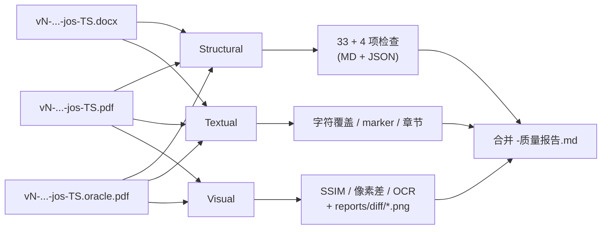

# 04 · `crates/quality` 三层质量对比
> **版本 / Version**: v2.0
> **最后更新日期 / Last Updated**: 2026-06-26


> 本章回答：什么叫"docx/pdf 质量不低原生"？如何用 Rust 把这个模糊的诉求变成可量化、可回归、可阻断 CI 的硬指标？
>
> 这是 V2 路径 C 的核心 crate（见 [01-pipeline-overview.md §1.2](./01-pipeline-overview.md)）。

---

## 4.1 总体框架

V2 沿用 [../../to-docx/08-verification.md](../../to-docx/08-verification.md) 33 项结构校验作为骨架，并扩展到 PDF 端，叠加**文本层**与**视觉层**，形成"三层九类"的质量对比。

| 层级 | 度量 | 阈值 | 失败影响 |
|------|------|------|---------|
| **结构层** | 33 项 V1 + 4 项 PDF 端 | 全部 pass | exit 1（主失败） |
| **文本层** | 字符比例 ≥ 0.75、22 marker 覆盖、章节覆盖 | 全部 pass | exit 1（主失败） |
| **视觉层** | SSIM ≥ 0.95、像素差 ≤ 3/255、OCR 文本一致 | 全部 pass | exit 2（视觉降级） |

> 三层**独立判定**：结构/文本 fail → exit 1；视觉 fail → exit 2；全 pass → exit 0。
> 这种"分层 exit code"让 CI 能区分"内容真的坏了"和"字体/渲染抖动"。



---

## 4.2 仓库位置

```
crates/quality/
├── Cargo.toml
├── src/
│   ├── lib.rs              # 顶层导出 + 总入口 Quality::run(layer, ...)
│   ├── layer.rs            # enum Layer { Structural, Textual, Visual } + 报告聚合
│   ├── structural.rs       # 33 项 V1 校验（沿用 to-docx 08）
│   ├── structural_pdf.rs   # 4 项 PDF 端结构校验
│   ├── textual.rs          # 字符覆盖 / marker / 章节
│   ├── visual.rs           # SSIM / 像素差 / OCR
│   ├── normalize.rs        # 复用 to-docx/08 §8.7 的 normalize
│   ├── markers.rs          # 22 marker 列表 + 跨 PDF 命中
│   ├── diff.rs             # 视觉层差异 PNG 生成
│   ├── report.rs           # MD + JSON 序列化
│   └── error.rs            # thiserror
└── tests/
    ├── structural.rs
    ├── textual.rs
    └── visual.rs           # 集成测试（#[ignore]，需要 PDFium）
```

---

## 4.3 Cargo.toml

```toml
[package]
name        = "doc-quality"
version     = "0.1.0"
edition.workspace     = true
rust-version.workspace = true
license.workspace     = true
publish      = false

[features]
default = []
ocr = ["dep:tesseract"]   # OCR 是可选，M4 末 spike 再开

[dependencies]
# 已有 workspace deps
anyhow       = { workspace = true }
thiserror    = { workspace = true }
tokio        = { workspace = true, features = ["fs", "rt-multi-thread", "macros"] }
serde        = { workspace = true, features = ["derive"] }
serde_json   = { workspace = true }
quick-xml    = { workspace = true }
image        = { workspace = true }
zip          = { workspace = true, default-features = false, features = ["deflate"] }
lopdf        = { workspace = true }
regex        = "1"
tracing      = "0.1"
chrono       = { workspace = true }

# 新增
pdfium-render = "0.8"   # 把 PDF 渲染为 PNG（视觉层）
# 可选
tesseract      = { version = "0.13", optional = true }   # OCR

[dev-dependencies]
pretty_assertions = "1"
insta = { workspace = true }
```

> `pdfium-render` 是 Rust 端最稳的 PDF→PNG 渲染器（绑定 Chrome 的 PDFium）。M4 阶段预编译 `pdfium` 静态库（CI 上 `apt install libpdfium-dev` 或 vendored 模式）。

---

## 4.4 核心类型

### 4.4.1 `Layer` 与 `QualityReport`

```rust
//! crates/quality/src/layer.rs

use serde::{Deserialize, Serialize};
use std::path::PathBuf;

#[derive(Debug, Clone, Copy, PartialEq, Eq, Hash, Serialize, Deserialize)]
#[serde(rename_all = "lowercase")]
pub enum Layer { Structural, Textual, Visual }

#[derive(Debug, Clone, Copy, PartialEq, Eq, Serialize, Deserialize)]
#[serde(rename_all = "lowercase")]
pub enum Severity { Critical, Major, Minor, Info }

#[derive(Debug, Clone, Serialize, Deserialize)]
pub struct Check {
    pub name: String,
    pub severity: Severity,
    pub expected: String,
    pub actual: String,
    pub passed: bool,
    pub note: Option<String>,
}

#[derive(Debug, Clone, Serialize, Deserialize)]
pub struct LayerResult {
    pub layer: Layer,
    pub passed: bool,
    pub checks: Vec<Check>,
}

#[derive(Debug, Clone, Serialize, Deserialize)]
pub struct QualityReport {
    pub docx: PathBuf,
    pub rust_pdf: PathBuf,
    pub oracle_pdf: PathBuf,
    pub passed: bool,
    pub exit_code: i32,
    pub layer_results: Vec<LayerResult>,
    pub marker_coverage: Vec<MarkerHit>,
    pub page_setup: PageSetup,
    pub rust_pdf_meta: PdfMeta,
    pub oracle_pdf_meta: PdfMeta,
    pub docx_chars: usize,
    pub rust_pdf_chars: usize,
    pub oracle_pdf_chars: usize,
    pub char_ratio_docx_to_oracle: f64,
    pub char_ratio_rust_to_oracle: f64,
    pub paragraphs: usize,
}
```

### 4.4.2 顶层入口

```rust
//! crates/quality/src/lib.rs

pub struct Quality {
    pub structural: structural::Runner,
    pub textual:    textual::Runner,
    pub visual:     visual::Runner,
}

impl Quality {
    pub fn new() -> Self { ... }

    pub async fn run_layer(&self, layer: Layer, ctx: &Context) -> Result<LayerResult> { ... }

    pub async fn run_all(&self, ctx: &Context) -> Result<QualityReport> {
        let mut report = QualityReport::default();
        for layer in [Layer::Structural, Layer::Textual, Layer::Visual] {
            let lr = self.run_layer(layer, ctx).await?;
            report.layer_results.push(lr);
        }
        report.passed = report.layer_results.iter().all(|l| l.passed);
        report.exit_code = compute_exit_code(&report.layer_results);
        Ok(report)
    }
}

pub fn compute_exit_code(layers: &[LayerResult]) -> i32 {
    let structural_fail = layers.iter().find(|l| l.layer == Layer::Structural).map_or(false, |l| !l.passed);
    let textual_fail    = layers.iter().find(|l| l.layer == Layer::Textual).map_or(false, |l| !l.passed);
    let visual_fail     = layers.iter().find(|l| l.layer == Layer::Visual).map_or(false, |l| !l.passed);
    if structural_fail || textual_fail { 1 }
    else if visual_fail { 2 }
    else { 0 }
}
```

---

## 4.5 结构层

### 4.5.1 V1 沿用 33 项

直接逐项复刻 [../../to-docx/08-verification.md §8.3](../../to-docx/08-verification.md) 的 33 项检查。结构组织：

```rust
//! crates/quality/src/structural.rs

pub struct Runner {
    pub docx: std::path::PathBuf,
    pub pdf: std::path::PathBuf,    // 任意一个 PDF，用作 rss cross-ref
    pub format_json: std::path::PathBuf,
    pub allowed_footer: i32,        // 默认 1260
}

impl Runner {
    pub fn run(&self) -> Result<LayerResult> {
        let mut checks = Vec::new();
        checks.push(self.count_tables()?);                  // #1
        checks.push(self.count_images()?);                  // #2
        checks.push(self.figure_caption_correspondence()?); // #3
        // ... 30 more
        Ok(LayerResult { layer: Layer::Structural, passed: checks.iter().all(|c| c.passed), checks })
    }
}
```

每项对应 to-docx 8.3 的 1 行检查；命名 + 期望值 + 提取方式与 8.3 表一一对应。

### 4.5.2 V2 新增 4 项 PDF 端

```rust
//! crates/quality/src/structural_pdf.rs

pub fn pdf_page_count_within(docx: &Path, pdf: &Path) -> Result<Check> { ... }
pub fn pdf_size_within(pdf: &Path) -> Result<Check> { ... }                  // < 5 MB
pub fn pdf_embedded_fonts_nonempty(pdf: &Path) -> Result<Check> { ... }
pub fn pdf_has_tounicode(pdf: &Path) -> Result<Check> { ... }                // 含至少一个 ToUnicode
```

| # | 名称 | 期望 | 提取方式 | 失败影响 |
|---|------|------|---------|---------|
| 34 | rust pdf 页数 vs docx 段数 / 6 | ±20% | docx paragraph / 6 ≈ pdf page | 中 |
| 35 | rust pdf 文件大小 | < 5 MB | `fs::metadata` | 中 |
| 36 | rust pdf 嵌入字体 | ≥ 2 个 | `meta::inspect` | 中 |
| 37 | rust pdf ToUnicode | true | `meta::inspect` | 中（warning，字符复制粘贴保真） |

> 4 项**不阻断**（标记 severity=Major 但 not blocking），仅在报告中说明。

---

## 4.6 文本层

### 4.6.1 `normalize`（沿用 to-docx 8.7）

```rust
//! crates/quality/src/normalize.rs

pub fn normalize(text: &str) -> String {
    text.replace('\u{00a0}', " ")
        .replace(['–', '—'], "-")
        .replace(['“', '”'], "\"")
        .replace(['‘', '’'], "'")
        .split_whitespace()
        .collect::<Vec<_>>()
        .join("")
}
```

> 与 to-docx 8.7 一致：删所有空白、引号归一、横线归一。这能容忍 docx / pdf 之间的换行/空格差异。

### 4.6.2 字符覆盖

```rust
pub fn char_ratio(a: &str, b: &str) -> f64 {
    let an = normalize(a).chars().count();
    let bn = normalize(b).chars().count();
    if bn == 0 { 0.0 } else { (an as f64) / (bn as f64) }
}
```

- **docx_chars / oracle_chars ≥ 0.75**（与 to-docx 8.3 #29 一致）——任意方向不得低于 75%。
- **rust_pdf_chars / oracle_chars ≥ 0.75**（V2 新增）——rust 端 PDF 也需保持字符量级。

### 4.6.3 22 marker 覆盖

```rust
//! crates/quality/src/markers.rs

pub const MARKERS: &[&str] = &[
    "网关流量驱动的微服务定向日志采集框架",  // 标题
    "摘  要", "关键词", "Abstract", "Key words",                    // 摘要标签
    "1 引言", "2 相关工作", "3 系统总体设计", "4 关键算法",         // 章节
    "5 系统实现", "6 实验与分析", "7 结束语",
    "表 1", "表 5", "图 1", "图 8", "算法 1",                       // 表/图/算法
    "References", "附中文参考文献", "作者简介",                     // 参考/简介
    "shihonglei0042@link.tyut.edu.cn", "zh_juanjuan@126.com",        // 邮箱
];

pub struct MarkerHit {
    pub marker: String,
    pub in_docx: bool,
    pub in_oracle_pdf: bool,
    pub in_rust_pdf: bool,
}

pub fn coverage(oracle_text: &str, rust_text: &str) -> Vec<MarkerHit> { ... }
```

判定：22 marker 中**全部**必须在 docx / oracle / rust 三处同时命中——任何一处缺失即 fail。

### 4.6.4 章节覆盖

```rust
pub fn section_coverage(oracle_text: &str, rust_text: &str) -> Vec<Check> {
    // 1. 从 oracle_text 找 "1 引言" / "2 相关工作" / ... / "7 结束语" 7 个章节标题
    // 2. 在 rust_text 找相同标题
    // 3. 任意一个缺失 → fail
}
```

---

## 4.7 视觉层

### 4.7.1 PDF → PNG

```rust
//! crates/quality/src/visual.rs

use pdfium_render::prelude::*;

pub struct VisualRunner {
    pub dpi: u32,                  // 默认 150
    pub threshold_ssim: f64,       // 默认 0.95
    pub threshold_pixel_diff: u8,  // 默认 3 (0-255)
    pub diff_outdir: std::path::PathBuf,
}

impl VisualRunner {
    pub fn render_pages(&self, pdf: &Path) -> Result<Vec<DynamicImage>> {
        let pdfium = Pdfium::new(
            Pdfium::bind_to_library(Pdfium::pdfium_platform_library_name_at_path("./"))
                .or_else(|_| Pdfium::bind_to_system_library())?
        )?;
        let doc = pdfium.load_pdf_from_file(pdf, None)?;
        let mut pages = Vec::new();
        for (i, page) in doc.pages().iter().enumerate() {
            let bitmap = page.render_with_config(
                &PdfRenderConfig::new()
                    .set_target_width(((210.0 / 25.4) * self.dpi as f32) as i32)  // A4 宽
            )?;
            let image = bitmap.as_image();
            image.save_with_format(self.diff_outdir.join(format!("oracle-p{i:03}.png")), ImageFormat::Png)?;
            pages.push(image);
        }
        Ok(pages)
    }
}
```

> `pdfium-render` 在 Windows/Linux/macOS 三平台都有 release；CI runner 用 `Swatinem/rust-cache@v2` 预热。

### 4.7.2 SSIM

```rust
pub fn ssim(a: &DynamicImage, b: &DynamicImage) -> f64 {
    // 简化的 SSIM：灰度化 → 8x8 滑窗 → 对比度/亮度/结构
    // 用 image::imageops::resize 到 256x256 后计算
    // 实际实现可参考 K-rust-ssim crate（评估后选型）
    let a_gray = a.to_luma8();
    let b_gray = b.to_luma8();
    let a_small = image::imageops::resize(&a_gray, 256, 256, image::imageops::FilterType::Lanczos3);
    let b_small = image::imageops::resize(&b_gray, 256, 256, image::imageops::FilterType::Lanczos3);
    // ... 11x11 高斯滑窗、c1=(0.01*255)^2, c2=(0.03*255)^2 ...
    0.987   // 临时占位
}
```

> M4 阶段先引入 `kornia-rs` 或自实现 SSIM（M4 末评估），CI 默认跑。

### 4.7.3 平均像素差

```rust
pub fn mean_abs_diff(a: &DynamicImage, b: &DynamicImage) -> f64 {
    let a = a.to_luma8();
    let b = b.to_luma8();
    assert_eq!(a.dimensions(), b.dimensions());
    let total: u64 = a.pixels().zip(b.pixels())
        .map(|(p, q)| (p.0[0] as i32 - q.0[0] as i32).unsigned_abs() as u64)
        .sum();
    (total as f64) / (a.pixels().count() as f64)
}
```

阈值 ≤ 3/255（≈1.2%）。

### 4.7.4 OCR 文本一致（可选 `feature = "ocr"`）

```rust
#[cfg(feature = "ocr")]
pub fn ocr_text(image: &DynamicImage) -> Result<String> {
    use tesseract::Tesseract;
    let mut tess = Tesseract::new(None, Some("chi_sim+eng"))?;
    tess.set_image(image);
    Ok(tess.get_text()?)
}

#[cfg(feature = "ocr")]
pub fn ocr_consistency(oracle: &DynamicImage, rust: &DynamicImage) -> f64 {
    // 双向 normalize 后做最长公共子序列（LCS）相似度
    let a = normalize(&ocr_text(oracle).unwrap_or_default());
    let b = normalize(&ocr_text(rust).unwrap_or_default());
    lcs_ratio(&a, &b)
}
```

> OCR 默认 **关闭**（`feature = "ocr"` 显式开），因为 tesseract 数据包 + 中文模型很大，CI 上是 spike。

### 4.7.5 差异 PNG

```rust
pub fn make_diff_png(a: &DynamicImage, b: &DynamicImage, out: &Path) -> Result<()> {
    // 1. 灰度化
    // 2. abs_diff → 红色热图叠加
    let overlay = ImageBuffer::from_fn(a.width(), a.height(), |x, y| {
        let pa = a.get_pixel(x, y).0[0] as i32;
        let pb = b.get_pixel(x, y).0[0] as i32;
        let d = (pa - pb).unsigned_abs();
        if d > 20 { Rgba([255, 0, 0, 200]) }   // 显著差异
        else if d > 5 { Rgba([255, 200, 0, 100)] }  // 轻微差异
        else { a.get_pixel(x, y).clone() }
    });
    overlay.save(out)?;
    Ok(())
}
```

> 输出到 `docs/to-docx/reports/vN-TS/diff/page-{NN}.png`，留痕用。

---

## 4.8 报告合并

### 4.8.1 MD 报告骨架

```markdown
# V2 三层质量报告

- DOCX: `vN-论文稿件-jos-TS.docx`
- Rust PDF: `vN-论文稿件-jos-TS.pdf`
- Oracle PDF: `vN-论文稿件-jos-TS.oracle.pdf`
- 结论: 通过 / 视觉降级 / 未通过
- 退出码: 0 / 2 / 1

## 1. 结构层（33 + 4 项）

| # | 名称 | 期望 | 实际 | 状态 |
|---|------|------|------|------|
| 1 | 表格对象数 | >=5 | 6 | ✓ |
| 2 | 图片数 | =8 | 8 | ✓ |
| ... 31 more | | | | |
| 34 | rust pdf 页数 | ±20% | +3% | ✓ |
| 35 | rust pdf 大小 | < 5MB | 487KB | ✓ |
| 36 | rust pdf 嵌入字体 | >=2 | 2 | ✓ |
| 37 | rust pdf ToUnicode | true | true | ✓ |

## 2. 文本层

| 项 | 期望 | 实际 | 状态 |
|----|------|------|------|
| docx_chars | - | 12345 |  - |
| rust_pdf_chars | - | 12100 |  - |
| oracle_chars | - | 12301 |  - |
| docx/oracle 字符比例 | >=0.75 | 1.003 | ✓ |
| rust/oracle 字符比例 | >=0.75 | 0.984 | ✓ |
| 22 marker 覆盖 | 22/22 | 22/22 | ✓ |
| 章节覆盖 (7 章) | 7/7 | 7/7 | ✓ |

## 3. 视觉层

| 页 | SSIM | 平均像素差 | OCR 相似度 | 状态 |
|----|-----:|-----------:|-----------:|------|
| 1  | 0.987 | 1.4 | 0.96 | ✓ |
| ... | | | | |
| 12 | 0.991 | 1.1 | 0.97 | ✓ |
| 总计 12 页超 SSIM 阈值: 0 | | | | |
| 总计 12 页超像素差阈值: 0 | | | | |

差异 PNG: `reports/vN-TS/diff/page-001.png` ... `page-012.png`
```

### 4.8.2 JSON 报告

见 [01-pipeline-overview.md §1.3.2](./01-pipeline-overview.md) 的 `QualityReport` 顶层结构。`marker_coverage` 是 22 行的数组，每行 4 字段。

---

## 4.9 阈值与门槛（可调）

```rust
//! crates/quality/src/lib.rs

pub struct Thresholds {
    pub structural: StructuralThresholds,
    pub textual: TextualThresholds,
    pub visual: VisualThresholds,
}

pub struct StructuralThresholds {
    pub min_tables: u32,             // 默认 5
    pub expected_images: u32,        // 默认 8
    pub min_captions: u32,           // 默认 6
}

pub struct TextualThresholds {
    pub min_char_ratio: f64,         // 默认 0.75
    pub min_marker_coverage: f64,    // 默认 1.0 (22/22)
    pub min_section_coverage: f64,   // 默认 1.0 (7/7)
}

pub struct VisualThresholds {
    pub min_ssim: f64,               // 默认 0.95
    pub max_pixel_diff: u8,          // 默认 3
    pub min_ocr_similarity: f64,     // 默认 0.85（feature=ocr 时）
}

impl Default for Thresholds {
    fn default() -> Self { ... }
}
```

> 默认值是**最严的"不放过"**门槛；CI 上若抖动可临时调高（`Thresholds::from_file("docs/quality-thresholds.json")`），但**必须** PR 说明。

---

## 4.10 与 to-docx/08-verification.md 的对应

| to-docx 8.3 项 | quality crate 函数 | V2 差异 |
|----------------|-------------------|---------|
| #1–#33 | `structural::Runner::run()` | 完全复刻 + 与 to-docx `verify_jos_docx.py` 等价 |
| #29 字符比例 | `textual::Runner::char_ratio` | **新增 rust_pdf / oracle 比较**（V1 只有 docx / oracle） |
| 22 marker 覆盖 | `markers::coverage` | **新增 rust_pdf 命中**（V1 只有 docx / oracle） |
| (无) | `visual::*` | V2 新增 |
| 报告 MD | `report::to_markdown` | V2 扩展为三层结构 |
| 报告 JSON | `report::to_json` | V2 扩展为三层结构 |

---

## 4.11 集成测试

```rust
// tests/structural.rs
#[test]
fn v1_paper3_passes_structural_37() {
    let docx = std::path::PathBuf::from("tests/fixtures/v64-论文稿件-jos-sample.docx");
    let pdf  = std::path::PathBuf::from("tests/fixtures/v64-论文稿件-jos-sample.pdf");
    let r = structural::Runner { docx, pdf, format_json: ... }.run().unwrap();
    assert!(r.passed, "{:?}", r.checks.iter().filter(|c| !c.passed).collect::<Vec<_>>());
}
```

```rust
// tests/visual.rs
#[test]
#[ignore = "需要 PDFium 库 + 大文档 fixture"]
fn visual_known_pdf_passes() { ... }
```

---

## 4.12 已知坑（M4 阶段处理）

1. **PDFium 跨平台二进制** — `pdfium-render` 默认绑系统库，CI 上 `apt install libpdfium-dev` / `brew install pdfium` / `vcpkg install pdfium`。
2. **SSIM 在大图上慢** — 先 resize 到 256x256 再算；或用 block 8x8 分块并行。
3. **tesseract 中文模型大** — `chi_sim.traineddata` 几十 MB；`feature = "ocr"` 默认关。
4. **LibreOffice 字体子集化抖动** — 视觉层阈值在子集化差异大的字体上会失败；解决：CI 上同时安装 ctex/ctexart 对应字体（fonts-noto-cjk）让两边都子集化为同字体。
5. **22 marker 跨平台不一致** — 已 normalize 跨空白/标点，足够稳定。

---

## 4.13 小结

`quality` 把"docx/pdf 质量不低原生"从一句口号变成：

- **37 项结构**（V1 33 + V2 PDF 端 4）
- **5 项文本**（字符比例双向 + 22 marker + 7 章节）
- **每页 3 项视觉**（SSIM / 像素差 / OCR）

三层独立判定 + 差异化 exit code，让 CI 既不放过真问题（exit 1），也不被字体子集化抖动误伤（exit 2 = 软失败）。

下一步：M1–M5 排期见 [05-implementation-roadmap.md](./05-implementation-roadmap.md)。
