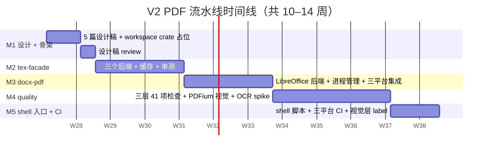

# 05 · 实施路线图（M1–M5）

> 本章把前 4 篇设计落到时间轴上。每个阶段都有：
> - **目标**：本阶段交付什么
> - **任务清单**：具体到 crate / 函数 / 测试
> - **依赖**：上阶段产物 / 外部工具
> - **验证手段**：怎样判定本阶段完成
> - **风险与回滚**：可能失败时怎么收

> **状态说明（2026-06-20）**：本章保留为历史路线图和验收口径。实际实现已提前落地到 `tex-facade`、`docx-pdf`、`quality`、`cli`，并新增 `doc-compiler-engine`。最新实现状态见 [07-progress-2026-06-20.md](./07-progress-2026-06-20.md)。

---

## 5.1 时间线总览



| 阶段 | 周数 | 主要交付 | 关键验证 |
|------|-----|---------|---------|
| **M1** 设计 + 骨架 | 1–2 | 5 篇设计稿 + 3 个空 crate | 文档 review 通过；`cargo build` 不报错 |
| **M2** `tex-facade` | 2–3 | xelatex / tectonic / latexmk 三后端 + 缓存 + 并发 | 拿 `examples/paper3/latex/main-jos.tex` 编译出 `main-jos.pdf`（字节级匹配） |
| **M3** `docx-pdf` | 2–3 | LibreOffice 默认后端 + 进程管理 + 3 平台 | V1 docx → V2 pdf 转换成功率 100%；3 平台 binary smoke pass |
| **M4** `quality` | 3–4 | 结构 37 + 文本 5 + 视觉 N×3 项 | 跑 `examples/paper3` 全套 → 三层全通过 / 视觉降级 |
| **M5** shell + CI | 1–2 | `build_docx_and_pdf.{sh,ps1}` + 3 平台矩阵 | 三平台 CI 全绿；视觉层按 label 触发 |

合计 **9–14 周**（含 review / 等待时间）。

---

## 5.2 M1 · 设计 + 骨架（1–2 周）

### 5.2.1 任务

- [ ] 5 篇设计稿**已交付**：[01](./01-pipeline-overview.md) ~ [05](./05-implementation-roadmap.md)（本章自身）
- [ ] 在 [Cargo.toml](../../../Cargo.toml) `workspace.members` 增加 3 个空 crate：

  ```toml
  members = [
      "crates/core",
      "crates/utils",
      "crates/semantic-ast",
      "crates/latex-reader",
      "crates/docx-writer",
      "crates/bib",
      "crates/mathml",
      "crates/wasm",
      "crates/native",
      "crates/server",
      "crates/tex-facade",   // 新增
      "crates/docx-pdf",     // 新增
      "crates/quality",      // 新增
  ]
  ```
- [ ] 3 个 crate 各自 `Cargo.toml`（依赖对齐 [02-tex-facade.md §2.3](./02-tex-facade.md) / [03-docx-to-pdf.md §3.3](./03-docx-to-pdf.md) / [04-quality-comparison.md §4.3](./04-quality-comparison.md)）
- [ ] 每个 crate `src/lib.rs` 仅导出空 `pub fn version() -> &'static str { env!("CARGO_PKG_VERSION") }`
- [ ] 在 [.github/workflows/v2-pdf-pipeline.yml](../../../.github/workflows/v2-pdf-pipeline.yml) 写**空 job 占位**（仅 checkout + cargo check）

### 5.2.2 验证

- `cargo build --workspace` 全过
- 3 个新 crate `cargo test` 全过（空测试）
- 设计稿 reviewer 签字（在 PR 上 approve）

### 5.2.3 风险与回滚

- 风险：3 个空 crate 影响 workspace 编译时间
- 回滚：成员改为 exclude 而不是 delete

---

## 5.3 M2 · `crates/tex-facade`（2–3 周）

### 5.3.1 任务

按 [02-tex-facade.md](./02-tex-facade.md) 落地：

- [ ] `TexProject` / `TexRun` / `TexBackend` / `TexFacade` 类型 + trait
- [ ] 三个后端实现：
  - [ ] `XelatexBackend`（含 -interaction=nonstopmode + bibtex 步）
  - [ ] `TectonicBackend`（含 allow_network 探测）
  - [ ] `LatexmkBackend`（含 -xelatex 默认）
- [ ] `Cache` 模块（blake3 内容寻址 + 缓存目录结构）
- [ ] `extract.rs`（pdftotext > mutool 优先级）
- [ ] `Semaphore` 并发限流（默认 2）
- [ ] 错误类型 + `thiserror`
- [ ] 单元测试：compute_key 哈希正确性、referenced_tex_files 列表、extract_text 工具链探测
- [ ] 集成测试（`#[ignore]`）：用 [examples/paper3/latex/main-jos.tex](../../../examples/paper3/latex/main-jos.tex) 编译出 [main-jos.pdf](../../../examples/paper3/latex/main-jos.pdf)——**应字节级匹配**（或差仅 mtime）

### 5.3.2 依赖

- 系统：xelatex / tectonic / latexmk / pdftotext 任一可用
- `examples/paper3/latex/main-jos.bbl` **已就绪**（实测已存在）——M2 跳过 bibtex 跑
- workspace 已有 `tokio` / `anyhow` / `thiserror`

### 5.3.3 验证

- `cargo test -p doc-tex-facade` 全过（含 #[ignore] 集成测试）
- 缓存命中：第二次同源编译 < 100ms
- 失败：故意给一个坏 .tex → 返回 `TexError::CompileFailed`，不 panic
- 跨平台：Linux + macOS + Windows 各跑一次 `#[ignore]` 集成测试

### 5.3.4 风险与回滚

| 风险 | 概率 | 影响 | 回滚 |
|------|-----|------|------|
| tectonic 在 Windows 拉包失败 | 中 | M2 阻塞 | 改默认后端为 xelatex + 显式 `TECTONIC_OFFLINE=1` |
| CTeX 字体在 CI 缺 | 中 | 中文乱码 | CI runner 装 `fonts-noto-cjk` |
| blake3 跨平台哈希不一致 | 极低 | 缓存失效 | 切换为 xxhash-rust 验证 |
| bibtex 反复跑不收敛 | 低 | 超时 | `max_passes=3` + 显式 `--shell-escape` 关 |

---

## 5.4 M3 · `crates/docx-pdf`（2–3 周）

### 5.4.1 任务

按 [03-docx-to-pdf.md](./03-docx-to-pdf.md) 落地：

- [ ] `DocxToPdfBackend` trait + `DocxToPdfRun` + `DocxToPdf` 顶层
- [ ] `LibreOfficeBackend`（默认）—— 含独立 user-profile、超时、3 次重试
- [ ] `Config`（timeout=120s / max_retries=3 / keep_temp=false）
- [ ] `meta::inspect` 解析 page_count / embedded_fonts / ToUnicode
- [ ] 错误类型
- [ ] 集成测试（`#[ignore]`）：用 [docs/to-docx/v64-...-jos-...docx](../../to-docx/) 跑出 pdf
- [ ] CI 三平台安装 LibreOffice（apt / brew / choco）
- [ ] `PdfConverterApiBackend` trait 实现占位（`unimplemented!()`）
- [ ] `WordComBackend` 仅 feature gate 占位

### 5.4.2 依赖

- 系统：LibreOffice ≥ 7.0
- 已有：[docs/to-docx/](../../../docs/to-docx/) 下既有 v64 样本 docx（用作测试 fixture）

### 5.4.3 验证

- `cargo test -p doc-docx-pdf` 全过
- 集成测试：v64 docx → pdf，pdf 字节数 > 100KB，页数 ≥ 10
- 失败：故意杀 soffice → 3 次重试后返回 `LibreOfficeFailed`
- 三平台 runner 各跑一次（apt/brew/choco 装好 LibreOffice）

### 5.4.4 风险与回滚

| 风险 | 概率 | 影响 | 回滚 |
|------|-----|------|------|
| soffice 单实例锁死锁 | 中 | 并发失败 | 强制每次独立 `UserInstallation`（已设计） |
| macOS 沙盒外路径无权限 | 中 | 跑不起来 | 用 `std::env::temp_dir()`（已设计） |
| Linux CI apt 镜像慢 | 低 | 装 200MB+ | `actions/cache@v4` 缓存 `~/.cache/libreoffice` |
| WordCom feature 留 placeholder 出错 | 低 | 编译失败 | feature 默认关，加 `#[cfg(feature = "word-com")]` 严控 |

---

## 5.5 M4 · `crates/quality`（3–4 周）

### 5.5.1 任务

按 [04-quality-comparison.md](./04-quality-comparison.md) 落地：

- [ ] `Layer` / `Check` / `LayerResult` / `QualityReport` 数据类型
- [ ] `Quality::run_layer / run_all / compute_exit_code`
- [ ] `structural::Runner`：复刻 33 项 V1 + 4 项 PDF 端 = 37 项
- [ ] `normalize.rs`（沿用 to-docx 8.7）
- [ ] `markers.rs`：22 marker 列表 + 三处（docx / oracle / rust_pdf）覆盖
- [ ] `textual::Runner`：字符比例双向 + 章节覆盖
- [ ] `visual::Runner`：PDFium 渲染 + SSIM + 像素差 + diff PNG
- [ ] `report.rs`：MD + JSON 序列化
- [ ] `Thresholds` 配置（`from_file("docs/quality-thresholds.json")`）
- [ ] 集成测试（`#[ignore]`）：跑 [examples/paper3/latex/](../../../examples/paper3/latex/) 真实样例
- [ ] OCR spike（`feature = "ocr"` 默认关）：评估是否进 V2 主线

### 5.5.2 依赖

- 系统：PDFium 系统库（`apt install libpdfium-dev` / `brew install pdfium` / `vcpkg install pdfium`）
- 视觉层：150 dpi 默认
- workspace 已有：image / lopdf / quick-xml / zip / regex

### 5.5.3 验证

- `cargo test -p doc-quality` 全过
- 37 项结构 + 5 项文本 + N×3 视觉，跑 `examples/paper3` 全套
- 三层全通过 → exit 0；视觉 SSIM < 0.95 的页面 → exit 2
- diff PNG 数量与 SSIM 超阈值页面数一致
- OCR spike：单独开 `feature = "ocr"` 跑一次，验证相似度 ≥ 0.85

### 5.5.4 风险与回滚

| 风险 | 概率 | 影响 | 回滚 |
|------|-----|------|------|
| PDFium 跨平台二进制难装 | 中 | 视觉层无法跑 | 用 `lopdf` 替代 PDFium（`lopdf::Document::render`） |
| SSIM 阈值抖动 CI 红 | 高 | CI 噪音 | 视觉层按 `visual-check` label 触发；M4 末加滚动基线（最近 5 次 P50） |
| OCR 中文模型大 | 中 | CI runner 撑爆 | feature 默认关；只在本地手跑 |
| 22 marker 跨样本不一致 | 低 | 测试挂 | marker 列表抽出到 `docs/quality-markers.json` |

---

## 5.6 M5 · shell 入口 + CI（1–2 周）

### 5.6.1 任务

- [ ] [scripts/build_docx_and_pdf.sh](../../../scripts/build_docx_and_pdf.sh)（POSIX 入口）
- [ ] [scripts/build_docx_and_pdf.ps1](../../../scripts/build_docx_and_pdf.ps1)（Windows 入口，PowerShell）
- [ ] [.github/workflows/v2-pdf-pipeline.yml](../../../.github/workflows/v2-pdf-pipeline.yml)：三平台矩阵 + 视觉层 label 触发
- [ ] CI 缓存：`docs/to-docx/v*-论文稿件-jos-*.oracle.pdf` 用 `actions/cache@v4`
- [ ] 上传 artifact：`v2-pdf-report-{os}` 包含 4 文件
- [ ] PR 模板加 checkbox：「本 PR 已附 `visual-check` label 跑过视觉层」
- [ ] README：[../README.md §配套原始文档](../README.md) 加一行指向本目录

### 5.6.2 验证

- 三平台 runner 各跑一次 `bash scripts/build_docx_and_pdf.sh`，全绿
- 触发 PR with `visual-check` label：视觉层也跑
- `docs/to-docx/` 下出现一组完整的 vN 产物 + 报告

### 5.6.3 风险与回滚

| 风险 | 概率 | 影响 | 回滚 |
|------|-----|------|------|
| CI runner OOM（soffice + xelatex 并发） | 中 | runner 重启 | 减 `with_concurrency(1)` |
| actions/cache key 漂移 | 低 | 缓存失效（重新编译） | 改 key 为固定 hashFiles 范围 |
| Windows runner soffice 装包慢 | 中 | CI 时长 +10min | 用 `choco install libreoffice -y --no-progress` |

---

## 5.7 关键风险（全局）

1. **LibreOffice 中文字体在 Linux CI 缺失**
   - 现象：docx 转 PDF 后中文变方块
   - 解决：runner 加 `sudo apt-get install -y fonts-noto-cjk fonts-arphic-uming fonts-arphic-ukai`
   - 阶段：M3 + M5 都要验证

2. **视觉 SSIM 阈值过严导致 CI 抖动**
   - 现象：仅字体子集化差异就 fail
   - 解决：滚动基线（最近 5 次 P50）；视觉层用 `visual-check` label 触发而非必跑
   - 阶段：M4 + M5

3. **Tectonic 在 Windows 网络受限**
   - 现象：首次跑 `tectonic` 卡在下载包
   - 解决：M2 默认引擎改 xelatex；`TECTONIC_OFFLINE=1` 关网络
   - 阶段：M2

4. **缓存目录跨平台路径分隔**
   - 现象：Windows 下缓存命中失败
   - 解决：blake3 哈希键只用字节，不掺路径
   - 阶段：M2

5. **22 marker 在新样本上漏**
   - 现象：CI 全绿，但实际 marker 列表不覆盖新章节
   - 解决：marker 列表抽出到 JSON，可独立更新
   - 阶段：M4 末

6. **`examples/paper3/latex/main-jos.bbl` 老旧**
   - 现象：tex-facade 跳过 bibtex，但 .bbl 缺失某新引用
   - 解决：M2 阶段先跑一次 `bibtex main-jos` 重新生成 .bbl
   - 阶段：M2 准备

7. **V1 docx 字节级不变性被破坏**
   - 现象：M3 改了 docx-writer，paper3 e2e 测试 fail
   - 解决：M3/M4/M5 **严格不破坏兼容转换 crate 的公开 API**；如必须改则与对应版本计划同步
   - 阶段：M3–M5

---

## 5.8 验证方法（端到端）

M5 末跑完整链路：

```bash
# 本地
bash scripts/build_docx_and_pdf.sh

# 期望产物
ls docs/to-docx/v65-论文稿件-jos-*.docx
ls docs/to-docx/v65-论文稿件-jos-*.pdf
ls docs/to-docx/v65-论文稿件-jos-*.oracle.pdf
ls docs/to-docx/v65-论文稿件-jos-*-质量报告.md
ls docs/to-docx/v65-论文稿件-jos-*-质量报告.json
ls docs/to-docx/reports/v65-*/diff/page-*.png  # 视觉层跑了才有

# 期望退出码
echo $?  # 0 / 1 / 2
```

CI 上：

```yaml
# .github/workflows/v2-pdf-pipeline.yml
- name: 验证 V2 流水线
  run: bash scripts/build_docx_and_pdf.sh
- name: 检查产物
  run: |
    DOCX=$(ls docs/to-docx/v*-论文稿件-jos-*.docx | head -1)
    PDF=$(ls docs/to-docx/v*-论文稿件-jos-*.pdf | head -1)
    ORACLE=$(ls docs/to-docx/v*-论文稿件-jos-*.oracle.pdf | head -1)
    test -n "$DOCX" -a -n "$PDF" -a -n "$ORACLE"
    test -s "$DOCX" -a -s "$PDF" -a -s "$ORACLE"
```

---

## 5.9 与 V1.3 边界的呼应

V1.3 在 [../01-overview/01-features.md §1.5](../01-overview/01-features.md) 列了 11 行边界。V2 完成后，**该表需同步更新 3 行**：

| 能力 | V1.3 状态 | V2 状态 | 备注 |
|------|----------|---------|------|
| 完整 LaTeX 引擎 | ❌ 不支持 | ❌ 不支持（V2 仅在**验证阶段**调用） | 边界保持；新增"验证阶段可插拔调用"小字 |
| docx → PDF 同步输出 | (未列出) | ✅ V2 已支持 | **新增行** |
| TeX oracle 质量对比 | (未列出) | ✅ V2 已支持 | **新增行** |
| 其它 9 项 V1 限制 | ❌ / ⚠️ | ❌ / ⚠️（不变） | 保持 |

更新时机：**M5 末** 与本目录同步发布。

---

## 5.10 不在 V2 范围（明确排除）

- 真实内嵌 TeX 引擎（如 `tectonic` 作为 in-process 库）——体量太大，与 V1 边界冲突
- docx / PDF 之外的格式（EPUB、HTML、Markdown 还原）——保持 V1 边界
- 视觉层的"逐字符 OCR 校验"——M4 末 spike，不进 V2 主线
- 商业 docx→pdf 服务（Aspose / Spire）——保留 trait 占位但暂不实现
- 改写 [crates/docx-writer/](../../../crates/docx-writer/) 的任何代码

---

## 5.11 小结

V2 是一条"加法"路径：

- 保持兼容转换 crate 的公开 API 稳定
- **新增** 3 个 crate（共约 1800 行）
- **新增** 2 个 shell 入口（POSIX + PowerShell）
- **新增** 1 个 CI workflow（v2-pdf-pipeline.yml）
- **新增** 4 类产物（pdf / oracle.pdf / 质量报告.md / 质量报告.json）

5 篇设计 + 5 个阶段 + 9–14 周 = V2 完整交付。
